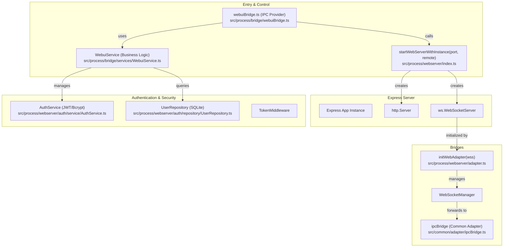
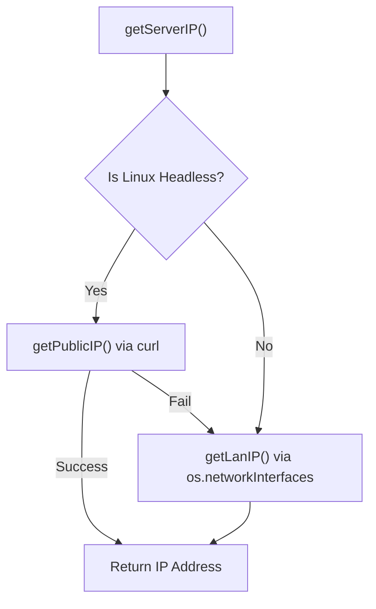
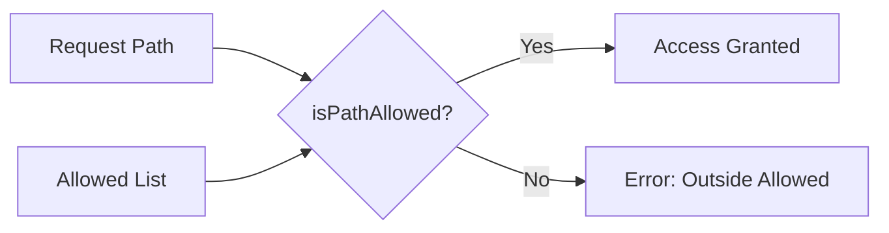

# WebUI Server Architecture

Relevant source files

The following files were used as context for generating this wiki page:

- [src/process/bridge/__tests__/webuiQR.test.ts](src/process/bridge/__tests__/webuiQR.test.ts)
- [src/process/bridge/services/WebuiService.ts](src/process/bridge/services/WebuiService.ts)
- [src/process/bridge/webuiQR.ts](src/process/bridge/webuiQR.ts)
- [src/process/webserver/auth/repository/UserRepository.ts](src/process/webserver/auth/repository/UserRepository.ts)
- [src/process/webserver/auth/service/AuthService.ts](src/process/webserver/auth/service/AuthService.ts)
- [src/process/webserver/index.ts](src/process/webserver/index.ts)
- [tests/unit/AuthServiceJwtSecret.test.ts](tests/unit/AuthServiceJwtSecret.test.ts)
- [tests/unit/common/appEnv.test.ts](tests/unit/common/appEnv.test.ts)
- [tests/unit/directoryApi.test.ts](tests/unit/directoryApi.test.ts)
- [tests/unit/extensions/extensionLoader.test.ts](tests/unit/extensions/extensionLoader.test.ts)
- [tests/unit/webserver/index.test.ts](tests/unit/webserver/index.test.ts)
- [tests/unit/webuiChangeUsername.test.ts](tests/unit/webuiChangeUsername.test.ts)
- [tests/unit/webuiQR.test.ts](tests/unit/webuiQR.test.ts)

## Purpose and Scope

The WebUI server provides HTTP-based remote access to AionUi's functionality, enabling browser clients and mobile applications to utilize the same backend infrastructure as the desktop application. This document covers the Express server implementation, authentication system (including QR login), routing architecture, and the WebSocket integration that bridges HTTP clients to the internal Inter-Process Communication (IPC) layer.

For information about the IPC bridge that the WebUI server connects to, see [Inter-Process Communication (3.3)](). For storage and persistence patterns used by authentication, see [Storage System (3.4)](). For the overall application modes, see [Application Modes (3.1)]().

---

## Server Architecture Overview

The WebUI server is built on Express with integrated WebSocket support. It acts as a gateway to the `ipcBridge`, allowing remote clients to trigger the same agent backends and tools as the local Electron renderer.

### Core Components

The following diagram maps the major code entities and their relationships:

**Diagram: WebUI Server Component Map**

Sources: [src/process/webserver/index.ts:7-19](), [src/process/bridge/services/WebuiService.ts:17-20](), [src/process/webserver/index.ts:138-181]()

---

## Configuration and Resolution

The WebUI server resolves its configuration through a hierarchy of sources: CLI arguments, environment variables, and stored application settings.

### Server Constants

Configuration is centralized in `SERVER_CONFIG` and `AUTH_CONFIG` within the webserver module.

| Constant | Value | Description |
|----------|-------|-------------|
| `DEFAULT_PORT` | `25808` | Default listening port [src/process/bridge/services/WebuiService.ts:121]() |
| `DEFAULT_USER` | `admin` | Default administrator username [src/process/webserver/index.ts:25]() |
| `TOKEN_EXPIRY` | `7 days` | Default session duration [src/process/webserver/auth/service/AuthService.ts:63]() |

Sources: [src/process/webserver/config/constants.ts:1-20](), [src/process/webserver/index.ts:25-28]()

### Environment Awareness

The server identifies its network environment to provide accurate access URLs. On Linux systems without a display (headless), it attempts to fetch a public IP via `curl` to facilitate cloud deployment.

**Diagram: Server IP Detection Logic**

Sources: [src/process/webserver/index.ts:64-130](), [src/process/bridge/services/WebuiService.ts:55-71]()

---

## Authentication Architecture

AionUi employs a multi-layered authentication system to secure the WebUI. It supports traditional credentials, JWT session management, and a specialized QR code login flow.

### Initial Admin Setup

On the first launch, `initializeDefaultAdmin` ensures a primary user exists. If no password is set, a random one is generated using `AuthService.generateRandomPassword()` and stored in the database via `UserRepository`.

Sources: [src/process/webserver/index.ts:138-181](), [src/process/bridge/services/WebuiService.ts:192-208]()

### JWT Token Flow

Authentication is managed by `AuthService`.
- **Secret Management**: `getJwtSecret()` retrieves the secret from the database or environment [src/process/webserver/auth/service/AuthService.ts:155-193]().
- **Blacklisting**: Logged-out tokens are stored in an in-memory `tokenBlacklist` with an automated cleanup timer [src/process/webserver/auth/service/AuthService.ts:70-115]().
- **Invalidation**: `invalidateAllTokens()` rotates the JWT secret, effectively logging out all active sessions [src/process/webserver/auth/service/AuthService.ts:199-213]().

Sources: [src/process/webserver/auth/service/AuthService.ts:60-235]()

### QR Code Authentication

This flow allows a mobile device to gain access by scanning a terminal-generated QR code.

1. **Token Generation**: `generateQRLoginUrlDirect` creates a 32-byte random token with a 5-minute expiry [src/process/bridge/webuiQR.ts:67-85]().
2. **Security Fix**: `verifyQRTokenDirect` enforces `allowLocalOnly` checks, rejecting non-local IPs if remote access is disabled [src/process/bridge/webuiQR.ts:131-137]().
3. **Session Issuance**: Upon verification, a standard JWT is issued via `AuthService.generateToken` [src/process/bridge/webuiQR.ts:152]().

Sources: [src/process/bridge/webuiQR.ts:15-174]()

---

## WebUI Service Layer

The `WebuiService` class encapsulates business logic for managing the server state and user credentials, acting as the bridge between the IPC layer and the Web server internals.

### Key Methods

| Method | Role |
|--------|------|
| `getStatus()` | Aggregates server state, network URLs, and initial credentials [src/process/bridge/services/WebuiService.ts:109-138]() |
| `changePassword()` | Validates strength, hashes new password, and invalidates tokens [src/process/bridge/services/WebuiService.ts:144-162]() |
| `changeUsername()` | Normalizes input, checks for duplicates, and updates the DB [src/process/bridge/services/WebuiService.ts:164-186]() |
| `resetPassword()` | Generates a new random password for emergency recovery [src/process/bridge/services/WebuiService.ts:192-209]() |

Sources: [src/process/bridge/services/WebuiService.ts:17-210]()

---

## Directory API and Path Security

To prevent arbitrary file access via the WebUI, the server implements a restricted `directoryApi`.

### Path Validation

The `isPathAllowed` function checks requested paths against a set of `DEFAULT_ALLOWED_DIRECTORIES`. On macOS and Linux, this includes the root `/` and the user's home directory.

**Diagram: Directory Access Control**

Sources: [tests/unit/directoryApi.test.ts:11-12](), [tests/unit/directoryApi.test.ts:118-153]()

### Windows Drive Detection

On Windows, the WebUI specifically detects available drives (A-Z) using `fs.existsSync` to populate the root directory listing (`__ROOT__`).

Sources: [tests/unit/directoryApi.test.ts:22-54](), [tests/unit/directoryApi.test.ts:72-88]()