# WebUI Server Architecture

<details>
<summary>Relevant source files</summary>

The following files were used as context for generating this wiki page:

- [.github/workflows/\_build-reusable.yml](.github/workflows/_build-reusable.yml)
- [.github/workflows/build-manual.yml](.github/workflows/build-manual.yml)
- [bun.lock](bun.lock)
- [src/index.ts](src/index.ts)
- [src/utils/configureChromium.ts](src/utils/configureChromium.ts)
- [tests/integration/autoUpdate.integration.test.ts](tests/integration/autoUpdate.integration.test.ts)
- [tests/unit/autoUpdaterService.test.ts](tests/unit/autoUpdaterService.test.ts)
- [tests/unit/test_acp_connection_disconnect.ts](tests/unit/test_acp_connection_disconnect.ts)
- [vitest.config.ts](vitest.config.ts)

</details>

## Purpose and Scope

The WebUI server provides HTTP-based remote access to AionUi's functionality, enabling browser clients and remote connections to use the same backend infrastructure as the desktop application. This document covers the Express server setup, authentication system, routing architecture, configuration resolution, and WebSocket integration that bridges HTTP clients to the IPC communication layer.

For information about the IPC bridge that the WebUI server connects to, see [Inter-Process Communication](#3.3). For storage and persistence patterns used by authentication, see [Storage System](#3.4). For the overall application modes including WebUI mode, see [Application Modes](#3.1).

---

## Server Architecture Overview

The WebUI server is built on Express with integrated WebSocket support. It routes to the same IPC bridge used by the Electron desktop application, so browser clients and the desktop share the same agent backends.

### Core Components

The following diagram maps the major code components and their relationships:

```mermaid
graph TB
    subgraph "Startup"
        startWebServerWithInstance["startWebServerWithInstance(port, allowRemote)<br/>src/webserver/index.ts"]
        initializeDefaultAdmin["initializeDefaultAdmin()"]
        SERVER_CONFIG["SERVER_CONFIG.setServerConfig(port, allowRemote)<br/>src/webserver/config/constants.ts"]
    end

    subgraph "HTTP Server"
        ExpressApp["express()"]
        HTTPServer["createServer(app)"]
        WSSServer["new WebSocketServer({server})"]
    end

    subgraph "Middleware (setupBasicMiddleware, setupCors)"
        BodyParser["body-parser / cookieParser"]
        CSRF["tiny-csrf (csrf())"]
        CORSMiddleware["cors() with origin allowlist"]
        SecurityHeaders["AuthMiddleware.securityHeadersMiddleware"]
    end

    subgraph "Routes"
        registerAuthRoutes["registerAuthRoutes()<br/>/login, /logout, /api/auth/*"]
        registerApiRoutes["registerApiRoutes()<br/>/api/directory/*, /api"]
        registerStaticRoutes["registerStaticRoutes()<br/>SPA + static assets"]
    end

    subgraph "Auth"
        AuthService["AuthService<br/>bcrypt + JWT"]
        UserRepository["UserRepository<br/>SQLite"]
        TokenMiddleware["TokenMiddleware / createAuthMiddleware()"]
        webuiBridge["webuiBridge.ts<br/>generateQRLoginUrlDirect()"]
    end

    subgraph "WebSocket Bridge"
        initWebAdapter["initWebAdapter(wss)<br/>src/webserver/adapter.ts"]
        WebSocketManager["WebSocketManager"]
        registerWebSocketBroadcaster["registerWebSocketBroadcaster()<br/>src/adapter/main.ts"]
        getBridgeEmitter["getBridgeEmitter()"]
    end

    startWebServerWithInstance --> SERVER_CONFIG
    startWebServerWithInstance --> ExpressApp
    startWebServerWithInstance --> HTTPServer
    startWebServerWithInstance --> WSSServer
    startWebServerWithInstance --> initializeDefaultAdmin

    ExpressApp --> BodyParser
    ExpressApp --> CSRF
    ExpressApp --> CORSMiddleware
    ExpressApp --> SecurityHeaders

    ExpressApp --> registerAuthRoutes
    ExpressApp --> registerApiRoutes
    ExpressApp --> registerStaticRoutes

    registerAuthRoutes --> AuthService
    registerAuthRoutes --> UserRepository
    registerAuthRoutes --> TokenMiddleware
    registerAuthRoutes --> webuiBridge

    WSSServer --> initWebAdapter
    initWebAdapter --> WebSocketManager
    initWebAdapter --> registerWebSocketBroadcaster
    initWebAdapter --> getBridgeEmitter
```

**Diagram: `startWebServerWithInstance` Component Map**

Sources: [src/webserver/index.ts:245-311](), [src/webserver/setup.ts](), [src/webserver/routes/authRoutes.ts](), [src/webserver/routes/apiRoutes.ts](), [src/webserver/adapter.ts](), [src/adapter/main.ts]()

---

## Server Initialization and Lifecycle

The WebUI server starts when the application is launched with the `--webui` flag. The initialization process resolves configuration from multiple sources, creates the server instance, and displays access credentials.

### Startup Flow

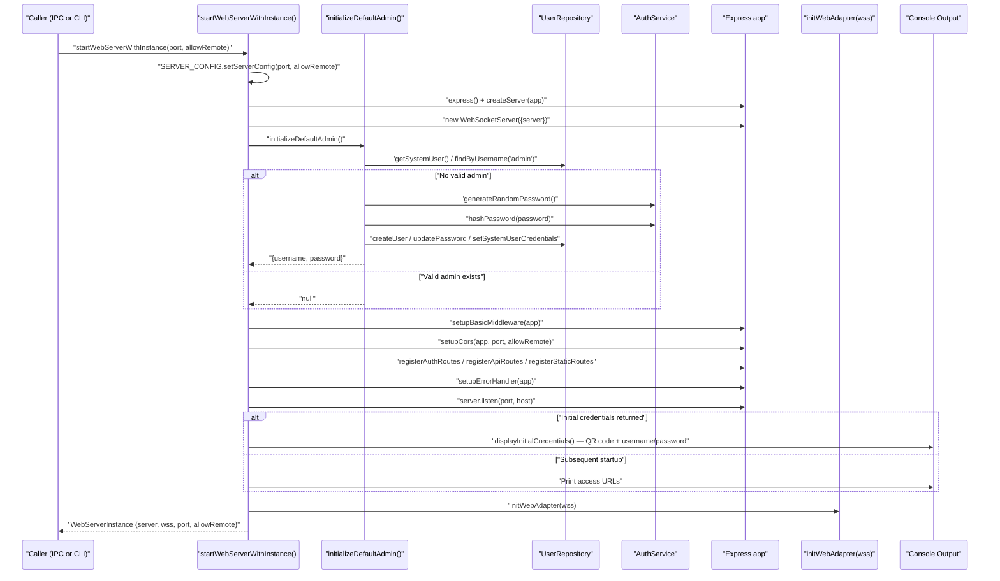

**Diagram: `startWebServerWithInstance` Startup Sequence**

Sources: [src/webserver/index.ts:245-311](), [src/webserver/index.ts:138-185](), [src/webserver/index.ts:191-224]()

### Server Instance Type

The server returns a `WebServerInstance` object containing all necessary references:

```typescript
export interface WebServerInstance {
  server: import('http').Server
  wss: import('ws').WebSocketServer
  port: number
  allowRemote: boolean
}
```

This type is defined in the WebUI module and returned by `startWebServerWithInstance()`.

Sources: [src/webserver/index.ts:230-235]()

---

## Server Configuration

Server configuration is encapsulated in `SERVER_CONFIG` defined in `src/webserver/config/constants.ts`. Key defaults:

| Constant                              | Value       | Description                         |
| ------------------------------------- | ----------- | ----------------------------------- |
| `SERVER_CONFIG.DEFAULT_PORT`          | `25808`     | Default HTTP port                   |
| `SERVER_CONFIG.DEFAULT_HOST`          | `127.0.0.1` | Localhost-only binding              |
| `SERVER_CONFIG.REMOTE_HOST`           | `0.0.0.0`   | All-interface binding (remote mode) |
| `WEBSOCKET_CONFIG.HEARTBEAT_INTERVAL` | `30000` ms  | Server-side ping interval           |
| `WEBSOCKET_CONFIG.HEARTBEAT_TIMEOUT`  | `60000` ms  | Inactivity disconnect threshold     |

`SERVER_CONFIG.setServerConfig(port, allowRemote)` is called at startup to store the active configuration for use by other modules (e.g., cookie options, CORS).

When `allowRemote` is `true`, the server binds to `0.0.0.0`. When `false`, it binds to `127.0.0.1`.

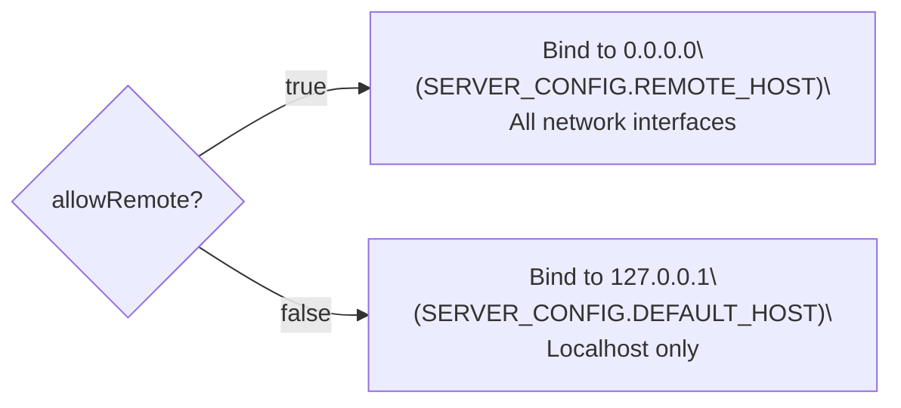

**Diagram: Host Binding Based on `allowRemote`**

The `SERVER_CONFIG.BASE_URL` getter resolves the base URL for internal use, preferring the `SERVER_BASE_URL` environment variable if set.

Sources: [src/webserver/config/constants.ts:77-130](), [src/webserver/index.ts:270-274]()

---

## Authentication Architecture

The WebUI server implements a multi-layered authentication system supporting traditional username/password login, QR code authentication, and JWT token management.

### Authentication Components

| Component         | File                                               | Responsibility                                                                   |
| ----------------- | -------------------------------------------------- | -------------------------------------------------------------------------------- |
| `AuthService`     | `src/webserver/auth/service/AuthService.ts`        | Password hashing (bcrypt), JWT generation/validation, random password generation |
| `UserRepository`  | `src/webserver/auth/repository/UserRepository.ts`  | SQLite CRUD operations for users, system user management                         |
| `TokenMiddleware` | `src/webserver/auth/middleware/TokenMiddleware.ts` | Token extraction from cookies, token validation, request authentication          |
| `QR Code Login`   | `src/process/bridge/webuiBridge.ts`                | Temporary token generation for QR code authentication                            |

### Initial Admin Setup

On first startup, the server creates a default admin account with a randomly generated password:

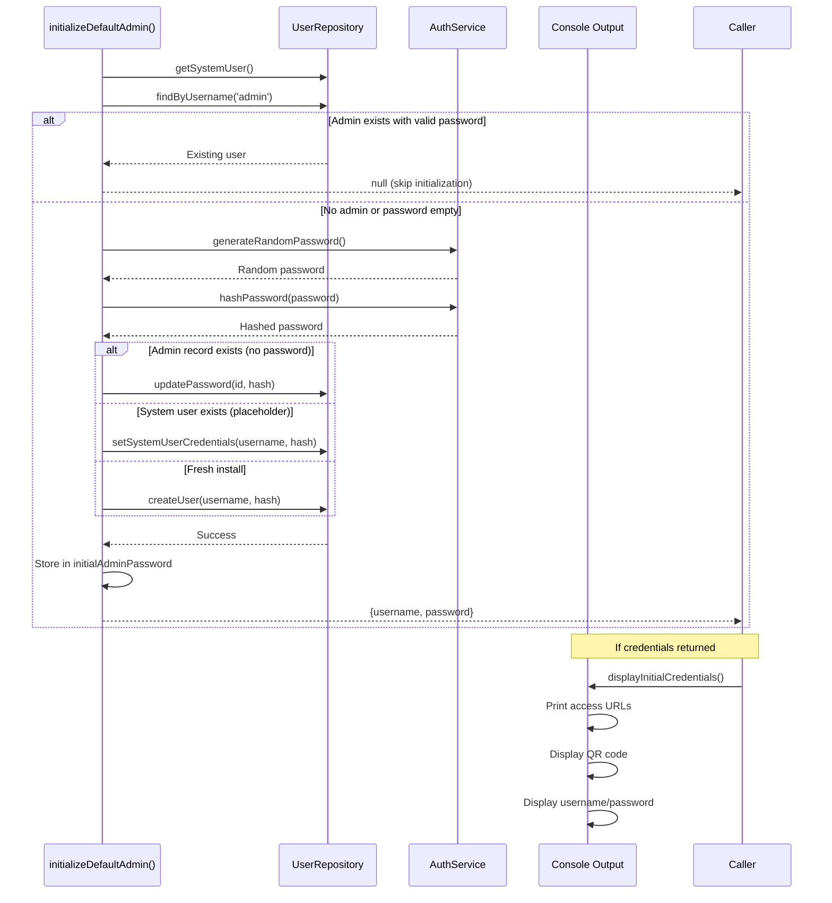

**Diagram: Initial Admin Account Creation**

Sources: [src/webserver/index.ts:138-185](), [src/webserver/index.ts:191-224]()

### JWT Token Flow

The authentication system uses HttpOnly cookies to store JWT tokens, preventing JavaScript access and mitigating XSS attacks.

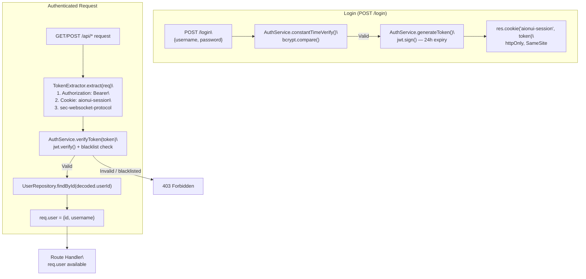

**Diagram: JWT Authentication Flow**

JWT token payload:

```
{ userId: string, username: string, iat: number, exp: number }
issuer: "aionui", audience: "aionui-webui"
```

Token expiry is `24h` (`AUTH_CONFIG.TOKEN.SESSION_EXPIRY`). Cookie max-age is 30 days (`AUTH_CONFIG.TOKEN.COOKIE_MAX_AGE`). The `AuthService.blacklistToken()` method SHA-256 hashes logged-out tokens and stores them in memory for the remainder of their validity period.

Sources: [src/webserver/auth/service/AuthService.ts:57-285](), [src/webserver/auth/middleware/TokenMiddleware.ts](), [src/webserver/config/constants.ts:17-61]()

### QR Code Authentication

The server supports passwordless login via QR code scanning, useful for first-time setup or mobile access.

1. `generateQRLoginUrlDirect(port, allowRemote)` generates a cryptographically random 64-hex token with a 5-minute expiry, stored in the in-memory `qrTokenStore` map.
2. Token is embedded in the URL: `http://{ip}:{port}/qr-login?token={tempToken}`
3. Visiting the URL triggers the static QR login page (`GET /qr-login`), which calls `POST /api/auth/qr-login`.
4. `verifyQRTokenDirect(qrToken, clientIP)` validates the token: checks existence, expiry, single-use, and (in local mode) that the client IP is a local/LAN address.
5. On success, a full JWT session cookie is issued.

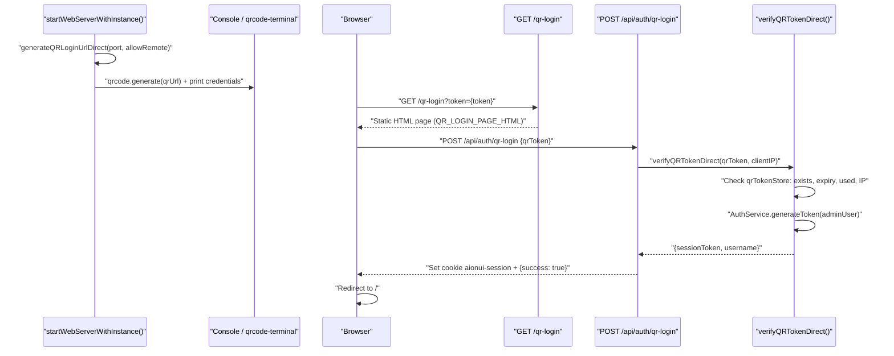

**Diagram: QR Code Login Flow**

In local (non-remote) mode, `allowLocalOnly = true` is stored with the token. `verifyQRTokenDirect` rejects requests from non-LAN IPs in this case.

Sources: [src/process/bridge/webuiBridge.ts:38-165](), [src/webserver/routes/authRoutes.ts:22-413](), [src/webserver/index.ts:191-224]()

---

## Routing Architecture

The WebUI server implements three distinct routing layers, each with specific security and functionality requirements.

### Route Structure

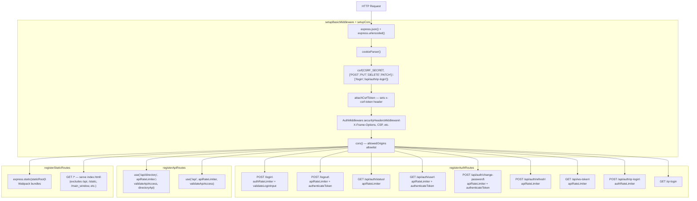

**Diagram: Middleware Pipeline and Route Registration**

Sources: [src/webserver/setup.ts](), [src/webserver/routes/authRoutes.ts](), [src/webserver/routes/apiRoutes.ts](), [src/webserver/middleware/security.ts]()

### Auth Routes (registered by `registerAuthRoutes`)

Most auth routes are public (no JWT required). CSRF protection via `tiny-csrf` is applied globally but explicitly excluded for `/login` and `/api/auth/qr-login`.

| Route                       | Method | Rate Limiter      | Auth Required | Purpose                                               |
| --------------------------- | ------ | ----------------- | ------------- | ----------------------------------------------------- |
| `/login`                    | POST   | `authRateLimiter` | No            | Username/password login, sets `aionui-session` cookie |
| `/logout`                   | POST   | `apiRateLimiter`  | Yes           | Blacklists current token, clears cookie               |
| `/api/auth/status`          | GET    | `apiRateLimiter`  | No            | Check if users exist / setup needed                   |
| `/api/auth/user`            | GET    | `apiRateLimiter`  | Yes           | Return current user info                              |
| `/api/auth/change-password` | POST   | `apiRateLimiter`  | Yes           | Change password, rotates JWT secret                   |
| `/api/auth/refresh`         | POST   | `apiRateLimiter`  | No            | Refresh a valid JWT token                             |
| `/api/ws-token`             | GET    | `apiRateLimiter`  | No            | Returns the main session token (for WS compat)        |
| `/api/auth/qr-login`        | POST   | `authRateLimiter` | No            | Verify QR token, issue session cookie                 |
| `/qr-login`                 | GET    | —                 | No            | Serves static QR login HTML page                      |

Sources: [src/webserver/routes/authRoutes.ts:93-416]()

### API Routes (registered by `registerApiRoutes`)

Protected routes. `TokenMiddleware.validateToken({responseType: 'json'})` is applied before all handlers.

| Route                      | Method | Purpose                                         |
| -------------------------- | ------ | ----------------------------------------------- |
| `/api/directory/browse`    | GET    | Browse directories (within `cwd` and `homedir`) |
| `/api/directory/validate`  | POST   | Validate a file path                            |
| `/api/directory/shortcuts` | GET    | Get common directory shortcuts                  |
| `/api`                     | GET    | Generic API health check                        |

All directory routes also apply `fileOperationLimiter` (30 req/min) via `directoryApi` router.

Sources: [src/webserver/routes/apiRoutes.ts](), [src/webserver/directoryApi.ts]()

### Static Routes (`/*`)

Serves the React SPA and static assets. The server implements SPA routing by serving `index.html` for all routes that don't match API endpoints or static files.

#### Renderer Asset Resolution

The `resolveRendererPath()` function locates webpack-compiled assets:

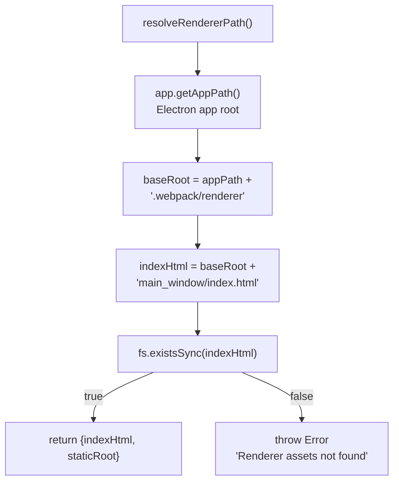

**Diagram: Renderer Asset Resolution Logic**

This function works in both development (unpacked) and production (ASAR) environments because `app.getAppPath()` returns the correct base path in both cases.

Sources: [src/webserver/routes/staticRoutes.ts:20-32]()

#### Route Registration Pattern

```javascript
// Exclude: api, static, main_window, and webpack chunk directories
// Also exclude files with extensions (.js, .css, .map, etc.)
app.get(
  /^\/(?!api|static|main_window|react|arco|vendors|markdown|codemirror)(?!.*\.[a-zA-Z0-9]+$).*/,
  pageRateLimiter,
  serveApplication
)
```

This regex ensures that:

1. API routes (`/api/*`) are not caught
2. Static asset directories are not caught
3. Files with extensions (`.js`, `.css`, etc.) are served as static files
4. Everything else serves `index.html` for client-side routing

#### Static Asset Middleware

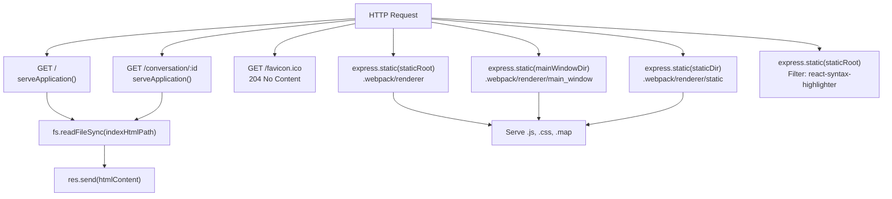

**Diagram: Static Route and Asset Serving**

The `serveApplication` function reads `index.html` and injects cache-control headers:

```typescript
const serveApplication = (req: Request, res: Response) => {
  res.setHeader('Cache-Control', 'no-cache, no-store, must-revalidate')
  res.setHeader('Pragma', 'no-cache')
  res.setHeader('Expires', '0')

  const token = TokenMiddleware.extractToken(req)
  if (token && !TokenMiddleware.isTokenValid(token)) {
    res.clearCookie(AUTH_CONFIG.COOKIE.NAME)
  }

  const htmlContent = fs.readFileSync(indexHtmlPath, 'utf8')
  res.setHeader('Content-Type', 'text/html')
  res.send(htmlContent)
}
```

This approach ensures:

- No browser caching of the HTML shell
- Expired tokens are cleared on page load
- Same HTML is served for all SPA routes

Sources: [src/webserver/routes/staticRoutes.ts:34-123]()

---

## Network Management

The WebUI server includes intelligent network detection to display the most useful access URLs based on the deployment environment.

### IP Detection Strategy

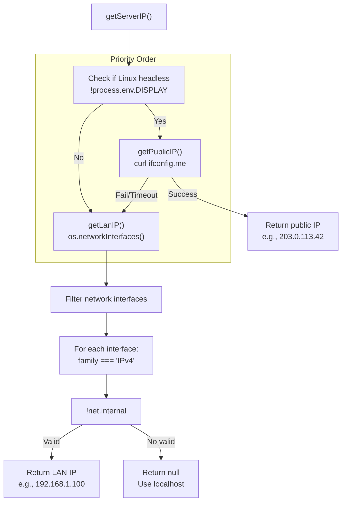

**Diagram: Network IP Detection Flow**

Sources: [src/webserver/index.ts:64-130]()

### Network Detection Implementation

`getServerIP()` in `src/webserver/index.ts` implements platform-specific IP detection for display in the console:

| Platform                                | Strategy                                             | Implementation                | Use Case              |
| --------------------------------------- | ---------------------------------------------------- | ----------------------------- | --------------------- |
| Linux headless (`!process.env.DISPLAY`) | Public IP via `curl`                                 | `getPublicIP()` — 2 s timeout | VPS/Cloud deployments |
| All platforms                           | First non-internal IPv4 via `os.networkInterfaces()` | `getLanIP()`                  | Home/office LAN       |
| Fallback                                | `null`                                               | Display `localhost` URL only  | Local development     |

#### Code Entity Mapping

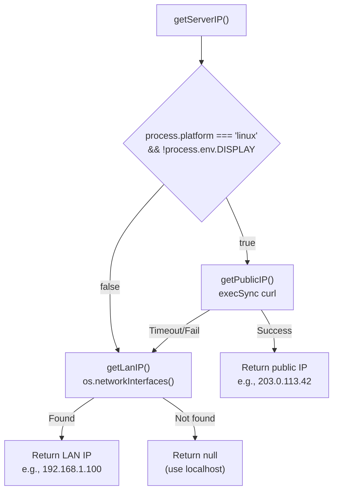

**Diagram: getServerIP() Function Flow**

**Public IP Detection** (`getPublicIP()`):

```bash
curl -s --max-time 2 ifconfig.me || curl -s --max-time 2 api.ipify.org
```

This only runs on Linux systems without `DISPLAY` environment variable (headless servers), with a 2-second timeout to avoid blocking startup.

Sources: [src/webserver/index.ts:87-113]()

**LAN IP Detection** (`getLanIP()`):

Iterates through `os.networkInterfaces()` to find the first non-internal IPv4 address:

```typescript
function getLanIP(): string | null {
  const nets = networkInterfaces()
  for (const name of Object.keys(nets)) {
    for (const net of nets[name]) {
      if (net.family === 'IPv4' && !net.internal) {
        return net.address
      }
    }
  }
  return null
}
```

This function filters out:

- Loopback addresses (`127.0.0.1`)
- IPv6 addresses
- Internal/virtual interfaces

Sources: [src/webserver/index.ts:64-81]()

### Console Output

The `displayInitialCredentials()` and `displayAccessInfo()` functions handle console output:

#### Code Entity: `displayInitialCredentials()`

Invoked on first-time startup when initial admin credentials are generated:

```typescript
function displayInitialCredentials(
  username: string,
  password: string,
  port: number,
  serverIP: string | null,
  allowRemote: boolean
): void
```

Output format:

```
======================================================================
🎉 AionUI Web Server Started Successfully! / AionUI Web 服务器启动成功！
======================================================================

📍 Local URL / 本地地址:    http://localhost:3000
📍 Network URL / 网络地址:  http://192.168.1.100:3000

📱 Scan QR Code to Login (expires in 5 mins)
[QR Code displayed here]
   QR URL: http://192.168.1.100:3000/auth/qr?token=...

🔐 Or Use Initial Admin Credentials:
   Username / 用户名: admin
   Password / 密码:   [random-password]

⚠️  Please change the password after first login!
======================================================================
```

The function uses `qrcode-terminal` to render a scannable QR code in the terminal, with the URL containing a temporary authentication token generated by `generateQRLoginUrlDirect()`.

Sources: [src/webserver/index.ts:191-224]()

#### Code Entity: `displayAccessInfo()`

Invoked on subsequent startups when admin account already exists:

```typescript
function displayAccessInfo(
  port: number,
  serverIP: string | null,
  allowRemote: boolean
): void
```

Output format:

```
🚀 Local access / 本地访问: http://localhost:3000
🚀 Network access / 网络访问: http://192.168.1.100:3000
```

If `allowRemote` is false, only the local URL is displayed.

Sources: [src/webserver/index.ts:273-289]()

---

## WebSocket Integration

The WebUI server uses WebSockets for real-time, bidirectional communication with browser clients. The WebSocket layer bridges to the same IPC emitter used by the Electron desktop application.

### Server-Side WebSocket Adapter (`initWebAdapter`)

`initWebAdapter(wss)` in `src/webserver/adapter.ts` wires up the WebSocket server to the main IPC bridge:

1. Creates a `WebSocketManager` instance that wraps the `ws.WebSocketServer`.
2. Calls `registerWebSocketBroadcaster()` from `src/adapter/main.ts`, which adds a broadcast function to the list of registered broadcasters. The main adapter's `bridge.adapter().emit()` calls every registered broadcaster, so events emitted from the IPC layer are forwarded to all connected WebSocket clients.
3. Calls `wsManager.setupConnectionHandler()` with a handler that forwards inbound WebSocket messages to `getBridgeEmitter().emit()`, injecting them into the IPC bridge as if they were IPC calls.

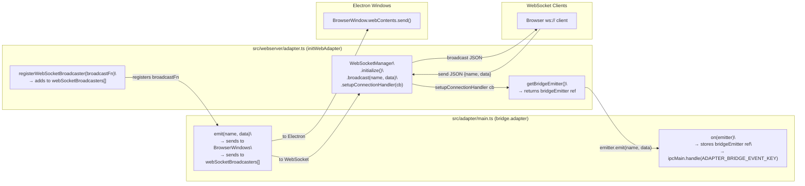

**Diagram: `initWebAdapter` — WebSocket ↔ IPC Bridge Wiring**

Sources: [src/webserver/adapter.ts](), [src/adapter/main.ts](), [src/webserver/index.ts:291-294]()

### Browser-Side WebSocket Adapter (`src/adapter/browser.ts`)

When running as a web browser client (no `window.electronAPI`), `src/adapter/browser.ts` replaces the Electron IPC adapter with a WebSocket-based adapter. It implements the same `bridge.adapter({emit, on})` interface.

**Key behaviors:**

| Feature                | Implementation                                                                                                                              |
| ---------------------- | ------------------------------------------------------------------------------------------------------------------------------------------- |
| Default connection URL | `ws://${window.location.host}` or `${hostname}:25808`                                                                                       |
| Reconnection           | Exponential backoff: 500 ms base, doubles each attempt, capped at 8000 ms                                                                   |
| Message queue          | Outbound messages buffered in `messageQueue[]` when socket is not `OPEN`; flushed on reconnect via `flushQueue()`                           |
| Heartbeat              | Responds to server `ping` payloads with `{name: "pong", data: {timestamp}}`                                                                 |
| Auth expiry            | On `auth-expired` message: stops reconnection (`shouldReconnect = false`), closes socket, redirects to `/login` after 1 s                   |
| Post-login reconnect   | `win.__websocketReconnect` is exposed; `AuthContext` calls it after successful login to re-establish the socket with the new session cookie |

```mermaid
sequenceDiagram
    participant App as "bridge.adapter (browser.ts)"
    participant Socket as "WebSocket (socketUrl)"
    participant Server as "WebUI Server"

    App->>Socket: "connect() — new WebSocket(socketUrl)"
    Socket-->>App: "open event"
    App->>App: "reconnectDelay = 500ms; flushQueue()"

    loop "Active session"
        Server->>Socket: "{name: 'ping', data: ...}"
        Socket->>Server: "{name: 'pong', data: {timestamp}}"

        App->>Socket: "socket.send({name, data})"
        Server->>Socket: "{name: 'someEvent', data: ...}"
        Socket->>App: "emitterRef.emit(name, data)"
    end

    Server->>Socket: "{name: 'auth-expired'}"
    App->>App: "shouldReconnect = false; socket.close()"
    App->>App: "setTimeout → window.location.href = '/login'"

    Note over App,Server: "After login, AuthContext calls win.__websocketReconnect()"
    App->>App: "shouldReconnect = true; reconnectDelay = 500ms; connect()"
    App->>Socket: "new WebSocket(socketUrl) — now includes session cookie"
```

**Diagram: Browser WebSocket Adapter Lifecycle**

Sources: [src/adapter/browser.ts](), [src/renderer/context/AuthContext.tsx:148-150]()

### Connection Lifecycle (Server Side)

1. **Connection**: Client connects; `WebSocketManager` validates the JWT token from the `aionui-session` cookie or `Authorization` header (via `TokenMiddleware.extractWebSocketToken`). Unauthenticated connections are closed with code `1008` (`WEBSOCKET_CONFIG.CLOSE_CODES.POLICY_VIOLATION`).
2. **Heartbeat**: Server sends `{name: "ping"}` every 30 s (`WEBSOCKET_CONFIG.HEARTBEAT_INTERVAL`). Clients not responding within 60 s are disconnected.
3. **Inbound messages**: JSON `{name, data}` payloads forwarded to `getBridgeEmitter().emit(name, data)`.
4. **Outbound events**: All IPC events forwarded to all authenticated WebSocket clients via `wsManager.broadcast(name, data)`.
5. **Cleanup**: On server stop, `wss.clients.forEach(client => client.close(1000, ...))` then `cleanupWebAdapter()` removes the broadcaster registration.

Sources: [src/webserver/config/constants.ts:63-75](), [src/webserver/adapter.ts](), [src/process/bridge/webuiBridge.ts:261-303]()

---

## Security Features

The WebUI server implements multiple security layers to protect against common web vulnerabilities.

### Security Components

| Component            | Implementation                                                                                                           | Protection Against                 |
| -------------------- | ------------------------------------------------------------------------------------------------------------------------ | ---------------------------------- |
| **HttpOnly Cookies** | `AUTH_CONFIG.COOKIE.NAME = 'aionui-session'`, `httpOnly: true`                                                           | XSS token theft                    |
| **CSRF Protection**  | `tiny-csrf` with `CSRF_SECRET`; token in `req.body._csrf` or `x-csrf-token` header                                       | CSRF                               |
| **CORS**             | `setupCors()` — allowlist includes `localhost:{port}`, LAN IP (remote mode), `SERVER_BASE_URL`, `AIONUI_ALLOWED_ORIGINS` | Unauthorized cross-origin requests |
| **Rate Limiting**    | `express-rate-limit` via `authRateLimiter`, `apiRateLimiter`, etc.                                                       | Brute force, API abuse             |
| **JWT Expiry**       | 24 h session token (`AUTH_CONFIG.TOKEN.SESSION_EXPIRY`)                                                                  | Session hijacking                  |
| **SameSite Cookie**  | `strict` (local) or `lax` (remote HTTP mode)                                                                             | CSRF via third-party sites         |
| **Token Blacklist**  | SHA-256 hashed tokens in `AuthService.tokenBlacklist` Map                                                                | Post-logout token reuse            |
| **Security Headers** | `X-Frame-Options: DENY`, `X-Content-Type-Options: nosniff`, `Content-Security-Policy`                                    | Clickjacking, MIME sniffing, XSS   |

### CSRF Protection Flow

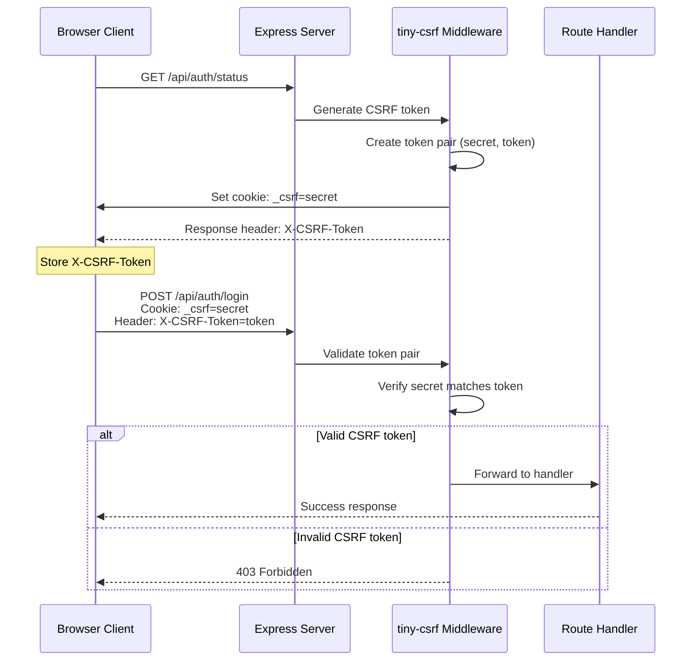

**Diagram: CSRF Protection Mechanism**

Sources: [src/webserver/setup.ts](), [src/webserver/middleware/security.ts]()

### Rate Limiting Configuration

Rate limiters are defined in `src/webserver/middleware/security.ts` using `express-rate-limit`:

| Limiter                      | Window | Max | Applied To                                                  |
| ---------------------------- | ------ | --- | ----------------------------------------------------------- |
| `authRateLimiter`            | 15 min | 5   | `POST /login`, `POST /api/auth/qr-login`                    |
| `apiRateLimiter`             | 1 min  | 60  | Most `/api/*` endpoints                                     |
| `fileOperationLimiter`       | 1 min  | 30  | `/api/directory/*` routes                                   |
| `authenticatedActionLimiter` | 1 min  | 20  | Sensitive endpoints; keyed by `user:{id}` or `ip:{address}` |

`authRateLimiter` sets `skipSuccessfulRequests: true`, so only failed login attempts count toward the limit.

Sources: [src/webserver/middleware/security.ts]()

### Token Security

JWT tokens are issued by `AuthService.generateToken()`:

1. **Algorithm**: HS256 (HMAC-SHA256)
2. **Secret**: Random 64-byte hex string, stored per admin user in the `jwt_secret` column of SQLite; rotated on password change via `AuthService.invalidateAllTokens()`
3. **Expiry**: 24 h (`AUTH_CONFIG.TOKEN.SESSION_EXPIRY = '24h'`)
4. **Cookie max-age**: 30 days (`AUTH_CONFIG.TOKEN.COOKIE_MAX_AGE`)
5. **`httpOnly: true`**: Prevents JavaScript access
6. **`secure`**: Only set when `AIONUI_HTTPS=true` or `NODE_ENV=production && HTTPS=true`
7. **`sameSite`**: `strict` in local mode; `lax` in remote HTTP mode (to support cross-origin LAN access)

Token structure:

```
{ userId: string, username: string, iat: number, exp: number }
issuer: "aionui", audience: "aionui-webui"
```

Sources: [src/webserver/auth/service/AuthService.ts:57-285](), [src/webserver/config/constants.ts:144-163]()

---

## Multi-Client Support

The WebUI server architecture enables simultaneous access from multiple client types, all sharing the same backend state and agent instances.

### Client Types

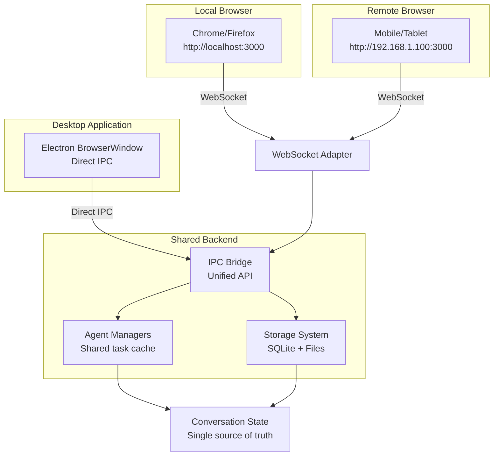

**Diagram: Multi-Client Architecture**

Sources: [src/webserver/adapter.ts](), [src/adapter/main.ts](), [src/process/WorkerManage.ts]()

### State Synchronization

All clients access the same backend state through the IPC bridge:

1. **Conversation State**: Managed by `WorkerManage.getTaskByIdRollbackBuild()`, ensuring only one agent instance per conversation
2. **Message History**: Stored in SQLite database, accessible to all clients
3. **Real-time Updates**: Stream events broadcasted to all connected clients via WebSocket

This architecture ensures that:

- Starting a conversation in the desktop app and continuing it in a browser works seamlessly
- Multiple browser tabs show synchronized state
- Agent responses stream to all connected clients simultaneously

Sources: [src/process/WorkerManage.ts](), [src/webserver/adapter.ts]()

---

## CLI Integration

The WebUI server can be launched via multiple CLI commands, each with different configurations.

### IPC Bridge Integration (Electron Mode)

When the server is started from within the Electron process via `webuiBridge.ts`, the `webui.*` IPC providers handle lifecycle control from the renderer:

| IPC Provider                     | Action                                                                                              |
| -------------------------------- | --------------------------------------------------------------------------------------------------- |
| `webui.start.provider`           | Calls `startWebServerWithInstance(port, allowRemote)`, stores instance, emits `webui.statusChanged` |
| `webui.stop.provider`            | Closes all WebSocket connections, calls `server.close()`, calls `cleanupWebAdapter()`               |
| `webui.getStatus.provider`       | Returns `IWebUIStatus` via `WebuiService.getStatus()`                                               |
| `webui.changePassword.provider`  | Delegates to `WebuiService.changePassword()`                                                        |
| `webui.resetPassword.provider`   | Generates new password via `WebuiService.resetPassword()`, emits `webui.resetPasswordResult`        |
| `webui.generateQRToken.provider` | Generates QR token, returns URL                                                                     |
| `webui.verifyQRToken.provider`   | Validates QR token in `qrTokenStore`                                                                |

There are also direct `ipcMain.handle` variants (prefixed `webui-direct-*`) used by `preload.ts` for calls that bypass the `@office-ai/platform` bridge library:

- `webui-direct-reset-password`
- `webui-direct-get-status`
- `webui-direct-change-password`
- `webui-direct-generate-qr-token`

These are exposed to the renderer via `contextBridge.exposeInMainWorld('electronAPI', {...})` in `src/preload.ts`.

Sources: [src/process/bridge/webuiBridge.ts:200-524](), [src/preload.ts:40-46]()

### Environment Variables

| Variable                 | Purpose                                                              |
| ------------------------ | -------------------------------------------------------------------- |
| `JWT_SECRET`             | Override the JWT secret (bypasses database-stored secret)            |
| `CSRF_SECRET`            | 32-character AES-256-CBC CSRF secret (random per session if not set) |
| `SERVER_BASE_URL`        | Override the base URL used for internal URL construction             |
| `AIONUI_ALLOWED_ORIGINS` | Comma-separated additional CORS origins                              |
| `AIONUI_HTTPS`           | Set to `true` to enable `secure` cookie flag                         |

Sources: [src/webserver/config/constants.ts](), [src/webserver/auth/service/AuthService.ts:155-161](), [src/webserver/setup.ts:51-60]()

---

## Password Reset Utility

The WebUI server includes a CLI utility for resetting user passwords without requiring server access.

### Usage

```bash
npm run resetpass [username]
# If username is omitted, defaults to 'admin'
```

### Reset Flow

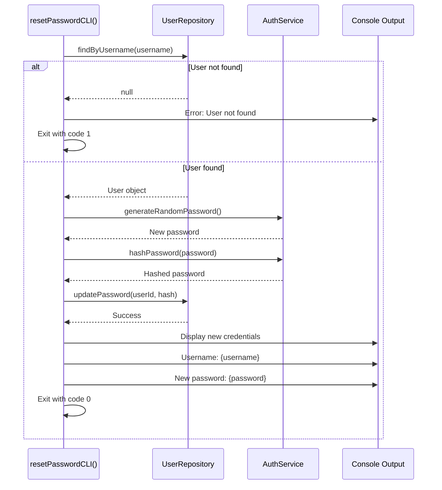

**Diagram: Password Reset Utility Flow**

Sources: [src/utils/resetPasswordCLI.ts](), [src/index.ts:237-253]()

### Implementation

The password reset utility:

1. Loads user database without starting the server
2. Verifies user exists
3. Generates a new random password
4. Updates the password hash in the database
5. Displays the new password in the console
6. Exits without starting any services

This enables password recovery even when the server cannot be accessed (e.g., forgotten admin password).

Sources: [src/utils/resetPasswordCLI.ts]()

---

## Deployment Considerations

### Docker Deployment

For containerized deployments, use environment variables:

```dockerfile
ENV AIONUI_PORT=3000
ENV AIONUI_ALLOW_REMOTE=true
ENV AIONUI_HOST=0.0.0.0
```

### Systemd Service

For Linux servers, create a systemd service:

```ini
[Unit]
Description=AionUi WebUI Server

[Service]
Type=simple
ExecStart=/usr/local/bin/aionui --webui --remote
Environment="AIONUI_PORT=3000"
Environment="AIONUI_ALLOW_REMOTE=true"
Restart=on-failure

[Install]
WantedBy=multi-user.target
```

### Reverse Proxy

For production deployments, use a reverse proxy (nginx, Caddy) for SSL termination:

```nginx
server {
    listen 443 ssl;
    server_name aionui.example.com;

    location / {
        proxy_pass http://localhost:3000;
        proxy_http_version 1.1;
        proxy_set_header Upgrade $http_upgrade;
        proxy_set_header Connection "upgrade";
        proxy_set_header Host $host;
    }
}
```

The WebSocket connection will be automatically upgraded through the reverse proxy.

---

## Summary

The WebUI server provides a production-ready HTTP/WebSocket interface to AionUi's functionality with the following characteristics:

- **Multi-source Configuration**: CLI flags → env vars → config file → defaults
- **Flexible Authentication**: Traditional login, QR code, JWT tokens with HttpOnly cookies
- **Security Hardened**: CSRF protection, rate limiting, CORS validation, token expiry
- **Network Aware**: Automatic LAN/public IP detection for multi-environment deployments
- **Real-time Communication**: WebSocket bridge to IPC system for streaming responses
- **Multi-client Support**: Desktop, browser, and remote clients share the same backend state
- **Production Ready**: Suitable for Docker, systemd, reverse proxy deployments

Sources: [src/webserver/index.ts:1-328](), [src/index.ts:79-311](), [src/webserver/setup.ts](), [src/webserver/routes/authRoutes.ts](), [src/webserver/routes/apiRoutes.ts](), [src/webserver/routes/staticRoutes.ts](), [src/webserver/adapter.ts]()
