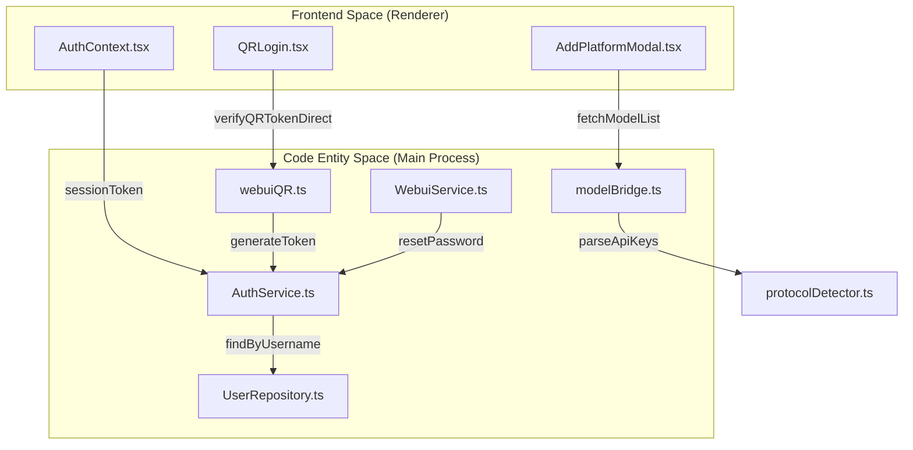
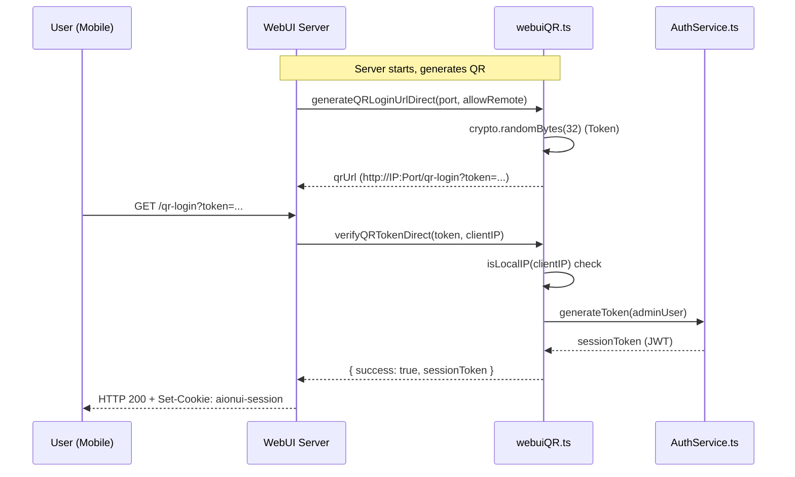

# Authentication

Relevant source files

The following files were used as context for generating this wiki page:

- [src/common/utils/protocolDetector.ts](src/common/utils/protocolDetector.ts)
- [src/process/bridge/__tests__/webuiQR.test.ts](src/process/bridge/__tests__/webuiQR.test.ts)
- [src/process/bridge/modelBridge.ts](src/process/bridge/modelBridge.ts)
- [src/process/bridge/services/WebuiService.ts](src/process/bridge/services/WebuiService.ts)
- [src/process/bridge/webuiQR.ts](src/process/bridge/webuiQR.ts)
- [src/process/webserver/auth/repository/UserRepository.ts](src/process/webserver/auth/repository/UserRepository.ts)
- [src/process/webserver/auth/service/AuthService.ts](src/process/webserver/auth/service/AuthService.ts)
- [src/process/webserver/index.ts](src/process/webserver/index.ts)
- [src/renderer/pages/settings/components/AddModelModal.tsx](src/renderer/pages/settings/components/AddModelModal.tsx)
- [src/renderer/pages/settings/components/AddPlatformModal.tsx](src/renderer/pages/settings/components/AddPlatformModal.tsx)
- [src/renderer/pages/settings/components/EditModeModal.tsx](src/renderer/pages/settings/components/EditModeModal.tsx)
- [tests/unit/AuthServiceJwtSecret.test.ts](tests/unit/AuthServiceJwtSecret.test.ts)
- [tests/unit/bridge/modelBridge.test.ts](tests/unit/bridge/modelBridge.test.ts)
- [tests/unit/common/appEnv.test.ts](tests/unit/common/appEnv.test.ts)
- [tests/unit/directoryApi.test.ts](tests/unit/directoryApi.test.ts)
- [tests/unit/extensions/extensionLoader.test.ts](tests/unit/extensions/extensionLoader.test.ts)
- [tests/unit/webserver/index.test.ts](tests/unit/webserver/index.test.ts)
- [tests/unit/webuiChangeUsername.test.ts](tests/unit/webuiChangeUsername.test.ts)
- [tests/unit/webuiQR.test.ts](tests/unit/webuiQR.test.ts)

This page documents the authentication mechanisms in AionUi, covering the JWT-based session management for the WebUI server, multi-key management for AI providers via `ApiKeyManager` and protocol detection, and specialized authentication flows for Google OAuth and AWS Bedrock.

---

## WebUI Server Authentication

AionUi's embedded Express server (used in WebUI mode) uses a JWT-based authentication layer. In Desktop mode, the renderer process bypasses these checks by detecting the presence of the Electron API and setting the authentication status to `authenticated` immediately.

### Core Components & Data Flow

The authentication system manages user identity through `AuthService`, which handles password hashing (via `bcryptjs`), token issuance, and secret rotation.

**WebUI Auth System Map:**

Sources: [src/process/webserver/auth/service/AuthService.ts:60-235](), [src/process/bridge/webuiQR.ts:94-174](), [src/process/bridge/services/WebuiService.ts:17-210](), [src/process/bridge/modelBridge.ts:76-93]()

### Security Mechanisms

| Mechanism | Implementation Detail | Source |
|:---|:---|:---|
| **JWT Secret Storage** | Stored in the `users` table for the primary admin user; rotated to invalidate all tokens. | [src/process/webserver/auth/service/AuthService.ts:155-193]() |
| **Password Hashing** | Uses `bcryptjs` with 12 salt rounds for secure storage. | [src/process/webserver/auth/service/AuthService.ts:61-61](), [src/process/webserver/auth/service/AuthService.ts:219-221]() |
| **Token Blacklist** | In-memory SHA-256 hash map of logged-out tokens, cleared on restart or expiry. | [src/process/webserver/auth/service/AuthService.ts:78-115]() |
| **QR Login Security** | Restricts tokens to local network IPs if `allowRemote` is disabled (`allowLocalOnly`). | [src/process/bridge/webuiQR.ts:130-137]() |
| **Initial Credentials** | Randomly generated on first run and stored in memory until the first password change. | [src/process/webserver/index.ts:133-181]() |

---

## Provider Authentication & Protocol Detection

AionUi supports 20+ AI platforms. The `modelBridge` and `protocolDetector` work together to identify the correct authentication protocol (OpenAI, Gemini, or Anthropic) based on the provided Base URL and API Key.

### Protocol Detection Logic
The `protocolDetector.ts` defines `PROTOCOL_SIGNATURES` which include `keyPattern` (regex for key format) and `urlPatterns`.

- **Gemini**: Keys starting with `AIza` followed by 35 characters [src/common/utils/protocolDetector.ts:162-171]().
- **OpenAI**: Keys starting with `sk-` followed by 20+ characters [src/common/utils/protocolDetector.ts:195-201]().
- **Anthropic**: Keys starting with `sk-ant-` [src/common/utils/protocolDetector.ts:249-251]().

### Multi-Key Management
AionUi supports multi-key rotation to handle rate limits and quotas.
- **Parsing**: `parseApiKeys` (invoked in `fetchModelList`) splits input by commas or newlines [src/process/bridge/modelBridge.ts:88-93]().
- **Testing**: The `ProtocolDetectionStatus` component in the UI displays the validity of multiple keys, showing how many are valid vs. invalid [src/renderer/pages/settings/components/AddPlatformModal.tsx:144-158]().

Sources: [src/common/utils/protocolDetector.ts:1-260](), [src/process/bridge/modelBridge.ts:76-101](), [src/renderer/pages/settings/components/AddPlatformModal.tsx:63-176]()

---

## AWS Bedrock Credentials

AWS Bedrock integration in `EditModeModal` and `modelBridge` supports two primary authentication methods via `bedrockConfig`.

### Credential Handling
1. **Access Keys**: Requires `accessKeyId` and `secretAccessKey` along with a specific `region` [src/renderer/pages/settings/components/EditModeModal.tsx:132-135]().
2. **AWS Profile**: Uses the local AWS credential file (e.g., `~/.aws/credentials`) by specifying a `profile` name [src/renderer/pages/settings/components/EditModeModal.tsx:136-136]().

The `modelBridge` uses the `@aws-sdk/client-bedrock` to validate these credentials and fetch available inference profiles or models [src/process/bridge/modelBridge.ts:28-28](), [src/process/bridge/modelBridge.ts:76-82]().

Sources: [src/renderer/pages/settings/components/EditModeModal.tsx:115-139](), [src/process/bridge/modelBridge.ts:49-75]()

---

## Shell & Directory Access Security

Authentication extends to local resource access when running in WebUI mode to prevent unauthorized file system operations.

### Directory API Security
- **Path Validation**: `isPathAllowed` ensures that file operations are restricted to allowed directories (e.g., User Home, AppData) [tests/unit/directoryApi.test.ts:11-154]().
- **Symlink Protection**: The system skips symlinks that resolve to paths outside the allowed directory scope to prevent directory traversal attacks [tests/unit/directoryApi.test.ts:156-197]().
- **Platform Specifics**: On Windows, the system handles drive root detection (`C:\`, `D:\`) and maps them to a virtual `__ROOT__` for UI navigation [tests/unit/directoryApi.test.ts:59-88]().

### WebUI QR Login Flow
The QR login mechanism allows mobile devices to authenticate with a desktop/server instance without typing passwords.

**QR Authentication Sequence:**

Sources: [src/process/bridge/webuiQR.ts:67-85](), [src/process/bridge/webuiQR.ts:94-174](), [src/process/webserver/index.ts:187-215]()