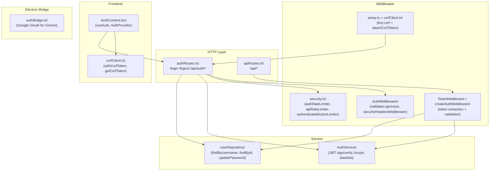

# Authentication

<details>
<summary>Relevant source files</summary>

The following files were used as context for generating this wiki page:

- [src/agent/gemini/cli/atCommandProcessor.ts](src/agent/gemini/cli/atCommandProcessor.ts)
- [src/agent/gemini/cli/config.ts](src/agent/gemini/cli/config.ts)
- [src/agent/gemini/cli/errorParsing.ts](src/agent/gemini/cli/errorParsing.ts)
- [src/agent/gemini/cli/tools/web-fetch.ts](src/agent/gemini/cli/tools/web-fetch.ts)
- [src/agent/gemini/cli/tools/web-search.ts](src/agent/gemini/cli/tools/web-search.ts)
- [src/agent/gemini/cli/types.ts](src/agent/gemini/cli/types.ts)
- [src/agent/gemini/cli/useReactToolScheduler.ts](src/agent/gemini/cli/useReactToolScheduler.ts)
- [src/agent/gemini/index.ts](src/agent/gemini/index.ts)
- [src/agent/gemini/utils.ts](src/agent/gemini/utils.ts)
- [src/common/utils/protocolDetector.ts](src/common/utils/protocolDetector.ts)
- [src/process/WorkerManage.ts](src/process/WorkerManage.ts)
- [src/process/bridge/modelBridge.ts](src/process/bridge/modelBridge.ts)
- [src/process/initBridge.ts](src/process/initBridge.ts)
- [src/process/services/mcpServices/McpOAuthService.ts](src/process/services/mcpServices/McpOAuthService.ts)
- [src/renderer/assets/logos/minimax.png](src/renderer/assets/logos/minimax.png)
- [src/renderer/config/modelPlatforms.ts](src/renderer/config/modelPlatforms.ts)
- [src/renderer/pages/settings/components/AddModelModal.tsx](src/renderer/pages/settings/components/AddModelModal.tsx)
- [src/renderer/pages/settings/components/AddPlatformModal.tsx](src/renderer/pages/settings/components/AddPlatformModal.tsx)
- [src/renderer/pages/settings/components/EditModeModal.tsx](src/renderer/pages/settings/components/EditModeModal.tsx)

</details>

This page documents the authentication systems used in AionUi's WebUI server: JWT session tokens, CSRF protection, rate limiting, password management, QR code login, and the Google OAuth bridge used for Gemini agent access.

> For the Gemini-specific Google OAuth login UI in Settings, see [Settings Interface](#5.7). For the WebUI server architecture itself, see [WebUI Server Architecture](#3.5). For how the Electron desktop app bypasses WebUI auth entirely, see [Application Modes](#3.1).

---

## Overview

AionUi runs an embedded Express HTTP server when operating in WebUI mode. This server requires its own authentication layer, separate from the Electron desktop runtime. The auth system is JWT-based and includes:

- Session cookies with `httpOnly`, configurable `secure`, and `SameSite` flags
- CSRF protection for all state-mutating requests
- Per-endpoint rate limiting to block brute-force attacks
- Token blacklisting on logout
- JWT secret rotation on password change
- A QR code login flow for mobile or remote users

The desktop runtime (`window.electronAPI` present) bypasses all WebUI auth — `AuthContext` in [src/renderer/context/AuthContext.tsx:38]() sets status to `authenticated` immediately without any server call.

---

## Core Components

**Auth component map:**



Sources: [src/webserver/routes/authRoutes.ts:1-417](), [src/webserver/auth/service/AuthService.ts:1-487](), [src/webserver/auth/middleware/AuthMiddleware.ts:1-177](), [src/webserver/auth/middleware/TokenMiddleware.ts:1-252](), [src/renderer/context/AuthContext.tsx:1-210]()

---

## Configuration

All auth parameters are centralized in `AUTH_CONFIG` in [src/webserver/config/constants.ts:17-61]().

| Parameter                       | Value              | Description            |
| ------------------------------- | ------------------ | ---------------------- |
| `TOKEN.SESSION_EXPIRY`          | `'24h'`            | JWT lifetime           |
| `TOKEN.COOKIE_MAX_AGE`          | 30 days (ms)       | Cookie `max-age`       |
| `COOKIE.NAME`                   | `'aionui-session'` | Session cookie name    |
| `COOKIE.OPTIONS.httpOnly`       | `true`             | JS cannot read cookie  |
| `COOKIE.OPTIONS.sameSite`       | `'strict'`         | CSRF mitigation        |
| `RATE_LIMIT.LOGIN_MAX_ATTEMPTS` | `5`                | Max logins per window  |
| `RATE_LIMIT.WINDOW_MS`          | 15 min             | Rate limit window      |
| `DEFAULT_USER.USERNAME`         | `'admin'`          | Default admin username |

The `secure` flag on cookies is `false` by default and is enabled only when `AIONUI_HTTPS=true` or `NODE_ENV=production` with `HTTPS=true` is set. In remote HTTP mode, `sameSite` is downgraded to `'lax'` to allow cross-origin cookie delivery. See [src/webserver/config/constants.ts:144-163]().

CSRF cookie name: `aionui-csrf-token`  
CSRF header name: `x-csrf-token`

Sources: [src/webserver/config/constants.ts:1-193]()

---

## Authentication Flows

### Standard Login

**Login flow diagram:**

```mermaid
sequenceDiagram
  participant "Browser / AuthContext" as Browser
  participant "POST /login" as Login
  participant "authRateLimiter" as RL
  participant "AuthMiddleware.validateLoginInput" as VI
  participant "UserRepository.findByUsername" as UR
  participant "AuthService.constantTimeVerify" as CTV
  participant "AuthService.generateToken" as GT
  participant "Cookie: aionui-session" as Cookie

  Browser->>Login: POST /login {username, password, _csrf}
  Login->>RL: check rate limit (5/15min)
  RL-->>Login: ok
  Login->>VI: validate input length/type
  VI-->>Login: ok
  Login->>UR: findByUsername(username)
  UR-->>Login: user or null
  alt user not found
    Login->>CTV: dummy constant-time delay
    Login-->>Browser: 401 Invalid credentials
  else user found
    Login->>CTV: bcrypt.compare(password, hash)
    CTV-->>Login: bool
    alt invalid password
      Login-->>Browser: 401 Invalid credentials
    else valid
      Login->>GT: generateToken(user)
      GT-->>Login: JWT
      Login->>Cookie: Set-Cookie aionui-session=JWT
      Login-->>Browser: 200 {success, user, token}
    end
  end
```

Sources: [src/webserver/routes/authRoutes.ts:100-152](), [src/webserver/auth/service/AuthService.ts:464-484]()

The constant-time dummy verification when no user is found prevents timing-based username enumeration.

---

### Logout

`POST /logout` requires a valid session token (`AuthMiddleware.authenticateToken`). It:

1. Extracts the current token via `TokenUtils.extractFromRequest`
2. Calls `AuthService.blacklistToken(token)` — stores the SHA-256 hash of the token with its expiry
3. Clears the `aionui-session` cookie

The blacklist is in-memory (a `Map<string, number>` keyed by token hash) and is cleared on server restart. An hourly cleanup timer removes expired entries.

Sources: [src/webserver/routes/authRoutes.ts:160-169](), [src/webserver/auth/service/AuthService.ts:75-134]()

---

### Token Refresh

`POST /api/auth/refresh` accepts a token in the request body and issues a new one if valid. It does **not** bypass expiry — `verifyToken` must succeed. This means the client must refresh before expiry.

Sources: [src/webserver/routes/authRoutes.ts:281-313]()

---

### QR Code Login

The QR login flow is designed for mobile or remote clients that scan a QR code displayed in the desktop UI.

**QR login flow diagram:**

```mermaid
sequenceDiagram
  participant "Desktop UI" as Desktop
  participant "GET /qr-login" as QRPage
  participant "Browser (mobile)" as Mobile
  participant "POST /api/auth/qr-login" as QREndpoint
  participant "verifyQRTokenDirect" as VQR
  participant "Cookie: aionui-session" as Cookie

  Desktop->>Desktop: generate QR code with one-time token
  Mobile->>QRPage: GET /qr-login?token=<qrToken>
  QRPage-->>Mobile: static HTML page
  Mobile->>QREndpoint: POST /api/auth/qr-login {qrToken}
  QREndpoint->>VQR: verifyQRTokenDirect(qrToken, clientIP)
  VQR-->>QREndpoint: {success, data: {sessionToken, username}}
  alt success
    QREndpoint->>Cookie: Set-Cookie aionui-session=sessionToken
    QREndpoint-->>Mobile: 200 {success, user, token}
    Mobile->>Mobile: redirect to /
  else failure
    QREndpoint-->>Mobile: 401 {error}
  end
```

The `/api/auth/qr-login` route is explicitly excluded from CSRF protection because it has its own one-time token protection mechanism via `verifyQRTokenDirect` (from [src/process/bridge/webuiBridge.ts]()).

The `/qr-login` page is a fully static HTML string defined in [src/webserver/routes/authRoutes.ts:23-87](). The QR token is read from URL parameters via `URLSearchParams` on the client side to avoid server-side injection.

Sources: [src/webserver/routes/authRoutes.ts:357-413]()

---

### WebSocket Token

`GET /api/ws-token` returns the main session token as the `wsToken` field. WebSocket connections reuse the web login token rather than a separate short-lived token. See [src/webserver/routes/authRoutes.ts:324-351]().

---

## Token Extraction

`TokenMiddleware` (in [src/webserver/auth/middleware/TokenMiddleware.ts]()) extracts tokens from requests in priority order:

| Source                          | HTTP Requests           | WebSocket Requests                                     |
| ------------------------------- | ----------------------- | ------------------------------------------------------ |
| `Authorization: Bearer <token>` | ✓ (first)               | ✓ (first)                                              |
| Cookie `aionui-session`         | ✓ (second)              | ✓ (second)                                             |
| `sec-websocket-protocol` header | —                       | ✓ (third, fallback for clients without cookie support) |
| URL query parameter             | ✗ (explicitly disabled) | ✗ (explicitly disabled)                                |

URL query parameters are **not** supported as a token source to prevent token leakage through server logs and Referrer headers. See [src/webserver/auth/middleware/TokenMiddleware.ts:57-61]().

Sources: [src/webserver/auth/middleware/TokenMiddleware.ts:42-62](), [src/webserver/auth/middleware/TokenMiddleware.ts:209-246]()

---

## JWT Secret Management

`AuthService.getJwtSecret()` in [src/webserver/auth/service/AuthService.ts:152-190]() resolves the JWT secret in this priority order:

1. Environment variable `JWT_SECRET` (if set)
2. `jwt_secret` column on the `admin` user row in the database
3. Newly generated 64-byte hex secret (saved to the database)

On password change, `AuthService.invalidateAllTokens()` rotates the secret by generating a new one and writing it to the database, immediately invalidating all existing sessions.

Sources: [src/webserver/auth/service/AuthService.ts:152-210]()

---

## CSRF Protection

**CSRF protection diagram:**

```mermaid
sequenceDiagram
  participant "Client" as C
  participant "setup.ts: csrf()" as CSRFMw
  participant "attachCsrfToken" as AT
  participant "POST /login" as L
  participant "csrfClient.ts: withCsrfToken()" as CT

  C->>CSRFMw: any request
  CSRFMw->>AT: next()
  AT->>AT: req.csrfToken() from tiny-csrf
  AT->>C: x-csrf-token header in response + aionui-csrf-token cookie

  C->>CT: attach token to body as _csrf
  CT-->>C: body with _csrf field

  C->>L: POST /login {username, password, _csrf}
  L->>CSRFMw: verify _csrf from body
  CSRFMw-->>L: ok or 403 ForbiddenError
```

The `tiny-csrf` library validates the `_csrf` field in the request body (not a header). The `withCsrfToken()` function in [src/webserver/middleware/csrfClient.ts:71-89]() merges `_csrf` into any request body object.

**Protected methods:** `POST`, `PUT`, `DELETE`, `PATCH`  
**Excluded routes:** `/login` (handled separately with `_csrf`), `/api/auth/qr-login` (one-time QR token protection)

The CSRF secret is either the `CSRF_SECRET` environment variable (must be exactly 32 characters) or a randomly generated 32-character hex string created at server startup.

Sources: [src/webserver/setup.ts:50-94](), [src/webserver/middleware/csrfClient.ts:1-89](), [src/webserver/middleware/security.ts:79-87]()

---

## Rate Limiting

All rate limiters use `express-rate-limit`. They are defined in [src/webserver/middleware/security.ts:14-70]().

| Limiter                      | Applied To                               | Window | Max                           |
| ---------------------------- | ---------------------------------------- | ------ | ----------------------------- |
| `authRateLimiter`            | `POST /login`, `POST /api/auth/qr-login` | 15 min | 5 (skips successful requests) |
| `apiRateLimiter`             | All `/api/*` routes, `/logout`           | 1 min  | 60                            |
| `fileOperationLimiter`       | `/api/directory/*`                       | 1 min  | 30                            |
| `authenticatedActionLimiter` | Sensitive actions behind auth            | 1 min  | 20 (keyed by `user.id` or IP) |

`authenticatedActionLimiter` keys by `user:${req.user.id}` when a user is authenticated, otherwise by `ip:${req.ip}`. This prevents a single authenticated user from flooding sensitive endpoints.

Sources: [src/webserver/middleware/security.ts:14-70]()

---

## Password Management

### Hashing

`AuthService.hashPassword()` uses bcrypt with 12 salt rounds. See [src/webserver/auth/service/AuthService.ts:216-218]().

### Password Change

`POST /api/auth/change-password` (requires valid session) [src/webserver/routes/authRoutes.ts:214-275]():

1. Validates `currentPassword` and `newPassword` are present
2. Validates `newPassword` strength via `AuthService.validatePasswordStrength()`
3. Looks up the user from `req.user.id`
4. Verifies `currentPassword` against stored hash
5. Hashes and saves the new password via `UserRepository.updatePassword()`
6. Calls `AuthService.invalidateAllTokens()` to rotate the JWT secret

**Password strength rules** ([src/webserver/auth/service/AuthService.ts:393-418]()):

- Minimum 8 characters
- Maximum 128 characters
- Must not match common weak passwords list (`'password'`, `'12345678'`, etc.)

### Reset via CLI

A separate CLI tool (`resetPasswordCLI`) exists for recovering access when logged out. See [CLI Utilities](#13) for details.

Sources: [src/webserver/routes/authRoutes.ts:214-275](), [src/webserver/auth/service/AuthService.ts:393-418]()

---

## Auth Status Endpoint

`GET /api/auth/status` returns whether any users exist (`needsSetup: true` if none) and the total user count. It does **not** validate any token — it is informational only, used by the frontend to decide whether to show a setup wizard or a login form.

Sources: [src/webserver/routes/authRoutes.ts:177-195]()

---

## Frontend Auth Context

`AuthProvider` in [src/renderer/context/AuthContext.tsx:66-202]() manages auth state for the renderer process:

- **State:** `status: 'checking' | 'authenticated' | 'unauthenticated'`, `user: AuthUser | null`, `ready: boolean`
- **`refresh()`**: calls `GET /api/auth/user` with `credentials: 'include'`; in desktop runtime, sets `authenticated` immediately without a server call
- **`login()`**: calls `POST /login` with `withCsrfToken({ username, password, remember })` in the body
- **`logout()`**: calls `POST /logout` with `withCsrfToken({})` in the body
- On successful login, calls `window.__websocketReconnect()` if present (WebUI WebSocket reconnect hook)

Error codes returned from `login()`:

| Code                 | HTTP Status     |
| -------------------- | --------------- |
| `invalidCredentials` | 401             |
| `tooManyAttempts`    | 429             |
| `serverError`        | 5xx             |
| `networkError`       | fetch exception |
| `unknown`            | other           |

Sources: [src/renderer/context/AuthContext.tsx:1-210]()

---

## Google OAuth (Gemini Agent)

`authBridge.ts` in [src/process/bridge/authBridge.ts:1-121]() is **separate** from the WebUI session auth. It provides Google OAuth for the Gemini CLI agent via three IPC bridge handlers:

| Handler             | IPC Channel                   | Description                                      |
| ------------------- | ----------------------------- | ------------------------------------------------ |
| `googleAuth.status` | `ipcBridge.googleAuth.status` | Check if OAuth credentials exist/are valid       |
| `googleAuth.login`  | `ipcBridge.googleAuth.login`  | Trigger browser-based OAuth flow (2 min timeout) |
| `googleAuth.logout` | `ipcBridge.googleAuth.logout` | Clear cached credential file                     |

These use `getOauthInfoWithCache`, `loginWithOauth`, and `clearCachedCredentialFile` from `@office-ai/aioncli-core`. This auth is for Gemini API access only and has no effect on WebUI session tokens.

Sources: [src/process/bridge/authBridge.ts:1-121]()

---

## Security Headers

`AuthMiddleware.securityHeadersMiddleware` in [src/webserver/auth/middleware/AuthMiddleware.ts:51-76]() applies to every response:

| Header                    | Value                                          |
| ------------------------- | ---------------------------------------------- |
| `X-Frame-Options`         | `DENY`                                         |
| `X-Content-Type-Options`  | `nosniff`                                      |
| `X-XSS-Protection`        | `1; mode=block`                                |
| `Referrer-Policy`         | `strict-origin-when-cross-origin`              |
| `Content-Security-Policy` | Stricter in production, relaxed in development |

Sources: [src/webserver/auth/middleware/AuthMiddleware.ts:51-76](), [src/webserver/config/constants.ts:166-191]()
