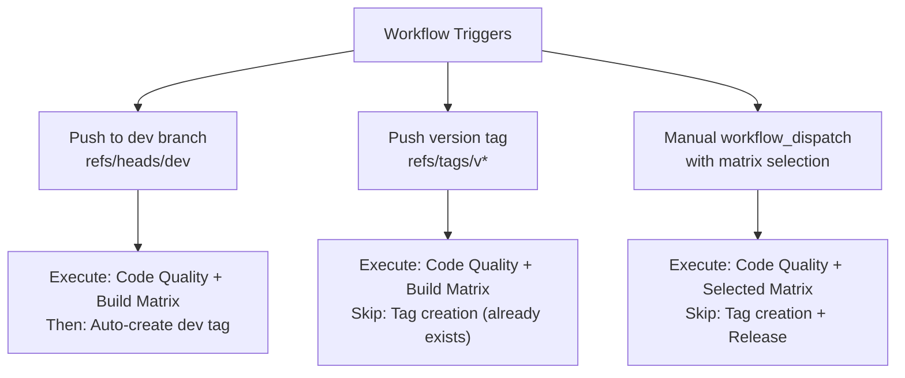
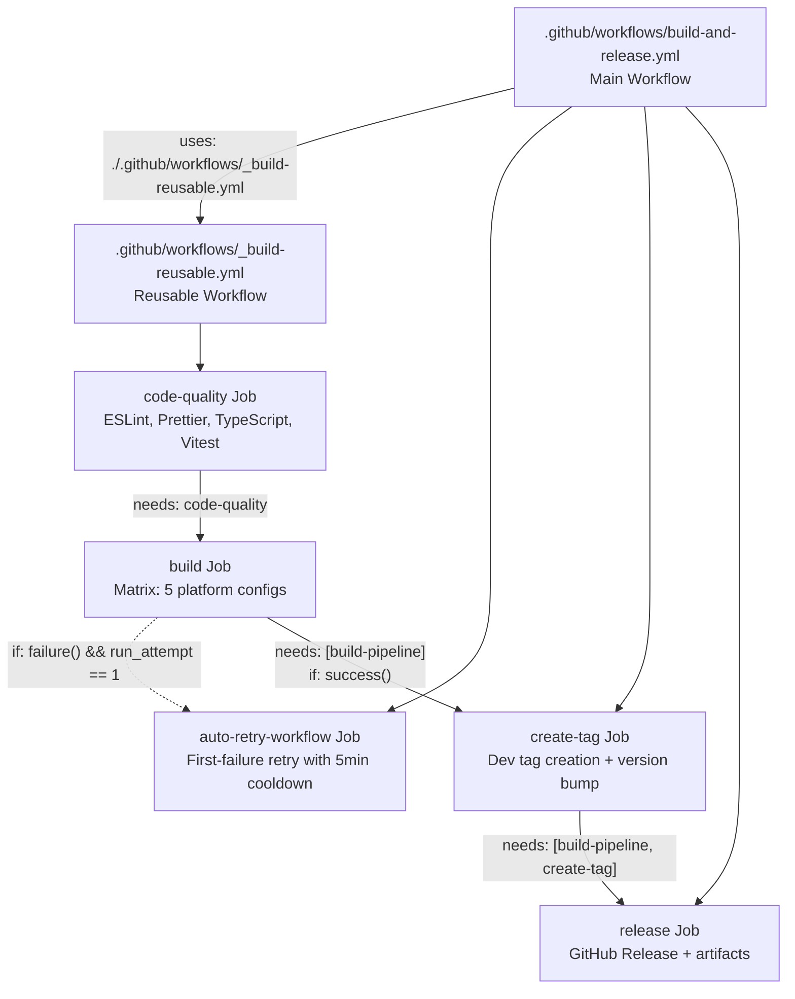
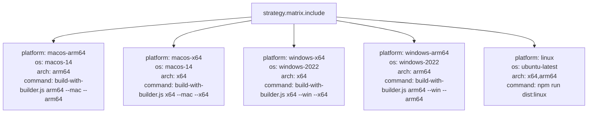
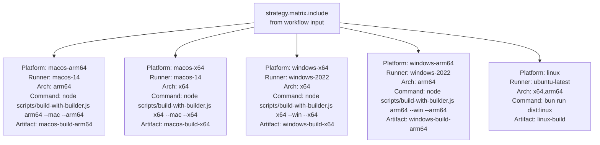
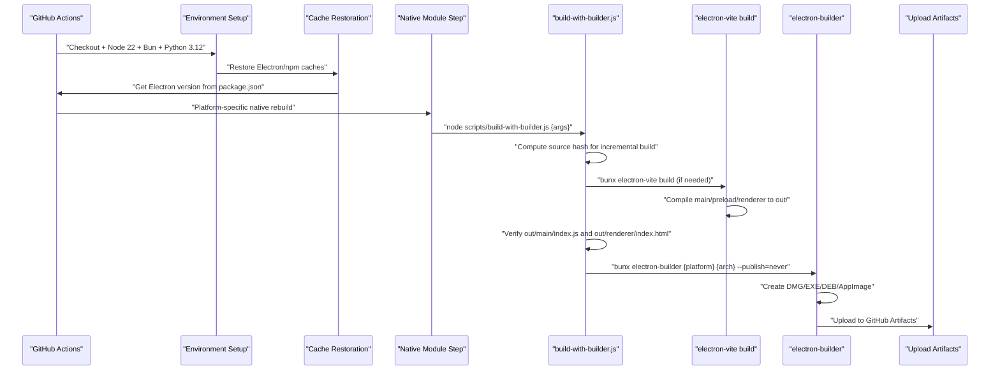
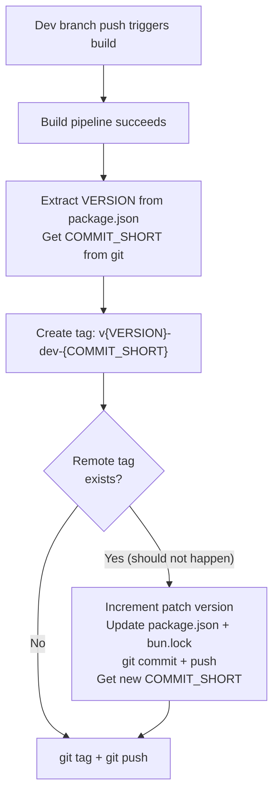
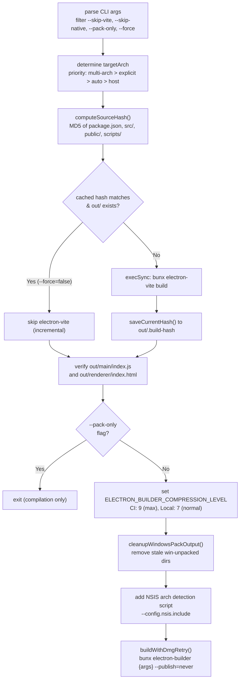

# Build Pipeline

<details>
<summary>Relevant source files</summary>

The following files were used as context for generating this wiki page:

- [.github/workflows/build-and-release.yml](.github/workflows/build-and-release.yml)
- [electron-builder.yml](electron-builder.yml)
- [package.json](package.json)
- [resources/windows-installer-arm64.nsh](resources/windows-installer-arm64.nsh)
- [resources/windows-installer-x64.nsh](resources/windows-installer-x64.nsh)
- [scripts/build-with-builder.js](scripts/build-with-builder.js)

</details>

## Overview

The build pipeline is implemented in `.github/workflows/build-and-release.yml` and orchestrates multi-platform builds through GitHub Actions. The pipeline coordinates electron-vite (TypeScript/React compilation), electron-builder (packaging), and release management across five platform-architecture combinations.

The system uses a sophisticated reusable workflow pattern that separates quality gates from matrix builds, enabling parallel execution and automatic retry logic.

## Workflow Trigger Events

The pipeline triggers on three distinct scenarios:

**Trigger Event Mapping**



**Dev Branch Push** [.github/workflows/build-and-release.yml:10-11]()

Triggers full pipeline including automatic dev tag creation. Dev tags follow the pattern `v{VERSION}-dev-{COMMIT_SHORT}` (e.g., `v1.8.23-dev-a3b2c1d`).

**Version Tag Push** [.github/workflows/build-and-release.yml:12-13]()

Triggers production release workflow. The condition `!contains(github.ref, '-dev-')` prevents duplicate builds when dev tags are pushed.

**Manual Dispatch** (via `workflow_dispatch`)

Allows selective platform builds for testing without creating releases.

Sources: [.github/workflows/build-and-release.yml:9-13]()
</thinking>

## Reusable Build Workflow Architecture

The build system uses a modular architecture with a reusable workflow:

**Workflow Composition**



The reusable workflow (`_build-reusable.yml`) encapsulates quality gates and matrix builds, while the main workflow handles tag creation and release management.

Sources: [.github/workflows/build-and-release.yml:19-34]()

## Code Quality Job

The `code-quality` job runs TypeScript compilation, ESLint, and Prettier checks. Only TypeScript failures block the build.

| Check      | Command                                    | Exit on Failure |
| ---------- | ------------------------------------------ | --------------- |
| TypeScript | `npx tsc --noEmit`                         | Yes             |
| ESLint     | `npm run lint \|\| echo "warning"`         | No              |
| Prettier   | `npm run format:check \|\| echo "warning"` | No              |

The job runs on `ubuntu-latest` with Node.js 22 and NPM cache enabled.

Sources: [.github/workflows/build-and-release.yml:16-41]()

## Build Matrix Configuration

The `build` job uses a matrix strategy to build five platform-architecture combinations in parallel:

**Matrix Strategy Mapping to Code**



Each matrix entry invokes `scripts/build-with-builder.js` which coordinates Electron Forge packaging and electron-builder distribution.

Sources: [.github/workflows/build-and-release.yml:49-78]()

## Build Matrix Configuration

The build matrix defines five platform-architecture combinations that execute in parallel:

**Matrix Strategy Mapping**



**Matrix Entry Structure** [.github/workflows/build-and-release.yml:25-32]()

```json
{
  "platform": "macos-arm64",
  "os": "macos-14",
  "command": "node scripts/build-with-builder.js arm64 --mac --arm64",
  "artifact-name": "macos-build-arm64",
  "arch": "arm64"
}
```

The script `scripts/build-with-builder.js` coordinates electron-vite (compilation) and electron-builder (packaging).

Sources: [.github/workflows/build-and-release.yml:24-32]()

## Build Step Sequence

Each platform build follows a common sequence with platform-specific variations:

**Common Build Pipeline**



**Incremental Build Optimization** [scripts/build-with-builder.js:27-131]()

The script computes an MD5 hash of source files and caches it in `out/.build-hash`. If the hash matches and output exists, electron-vite compilation is skipped:

```javascript
function computeSourceHash() {
  const hash = crypto.createHash('md5')
  // Hash package.json, tsconfig.json, src/, public/, scripts/
  return hash.digest('hex')
}

if (cachedHash && currentHash === cachedHash && viteBuildExists()) {
  console.log(
    '📦 Incremental build: Vite output unchanged, skipping compilation'
  )
  return true
}
```

Sources: [.github/workflows/\_build-reusable.yml:60-241](), [scripts/build-with-builder.js:44-131]()

## Platform-Specific Build Steps

### macOS Build Steps

macOS builds require Xcode Command Line Tools, code signing certificate installation, and notarization with timeout tolerance.

**Environment Setup** [.github/workflows/\_build-reusable.yml:100-113]()

```yaml
- name: Install Python
  uses: actions/setup-python@v5
  with:
    python-version: '3.12'

- name: Install Xcode Command Line Tools
  run: xcode-select --install || true
```

**Code Signing Certificate Installation** [.github/workflows/\_build-reusable.yml:115-145]()

```bash
# Decode certificate from base64 secret
echo "$BUILD_CERTIFICATE_BASE64" | base64 --decode > certificate.p12

# Create temporary keychain
security create-keychain -p "$KEYCHAIN_PASSWORD" build.keychain

# Import certificate
security import certificate.p12 -k build.keychain -P "$P12_PASSWORD" -T /usr/bin/codesign

# Set partition list for codesign access
security set-key-partition-list -S apple-tool:,apple:,codesign: -s -k "$KEYCHAIN_PASSWORD" build.keychain
```

**DMG Retry Logic** [scripts/build-with-builder.js:19-251]()

macOS builds implement a 3-attempt retry mechanism for DMG creation failures:

```javascript
const DMG_RETRY_MAX = 3
const DMG_RETRY_DELAY_SEC = 30

function buildWithDmgRetry(cmd, targetArch) {
  try {
    execSync(cmd, { stdio: 'inherit' })
    return
  } catch (error) {
    // Check if .app exists but .dmg missing
    if (!appDir || dmgExists(outDir)) throw error

    for (let attempt = 1; attempt <= DMG_RETRY_MAX; attempt++) {
      cleanupDiskImages() // Detach stale disk images
      createDmgWithPrepackaged(appDir, targetArch)
    }
  }
}
```

The `--prepackaged` flag preserves DMG styling (window size, icon positions) when retrying.

**Notarization Handling** [scripts/afterSign.js:1-100]()

Notarization is handled by `scripts/afterSign.js` as an afterSign hook. Failures are tolerated (degraded mode) to avoid blocking releases.

**Keychain Cleanup** [.github/workflows/\_build-reusable.yml:202-209]()

Always runs to delete `build.keychain`, even on failure.

Sources: [.github/workflows/\_build-reusable.yml:100-209](), [scripts/build-with-builder.js:19-251]()

### Windows Build Steps

Windows builds require Visual Studio Build Tools with MSVC ARM64 toolchain and native module compilation with fallback strategy.

**Toolchain Setup** [.github/workflows/\_build-reusable.yml:65-98]()

```yaml
- name: Setup Python
  uses: actions/setup-python@v5
  with:
    python-version: '3.12'

- name: Install MSVC ARM64 toolchain (ARM64 only)
  if: matrix.arch == 'arm64'
  run: |
    choco install visualstudio2022buildtools --package-parameters "--add Microsoft.VisualStudio.Component.VC.Tools.ARM64 --add Microsoft.VisualStudio.Component.Windows11SDK.22000 --passive --norestart"

- name: Set Windows SDK version
  run: echo "WindowsTargetPlatformVersion=10.0.19041.0" >> $env:GITHUB_ENV

- name: Setup MSBuild
  uses: microsoft/setup-msbuild@v2
  with:
    vs-version: '17.0'
```

The Windows SDK version `10.0.19041.0` provides ConPTY support for `node-pty`.

**Native Module Rebuild Strategy** [.github/workflows/\_build-reusable.yml:211-241]()

Windows uses a two-phase approach: prebuild-install (prebuilt binaries) with electron-rebuild fallback:

```powershell
# Phase 1: Try prebuild-install for better-sqlite3
npx prebuild-install --runtime electron --target $electronVersion --arch $arch

if (-not (Test-Path "node_modules/better-sqlite3/build/Release/better_sqlite3.node")) {
  # Phase 2: Fallback to electron-rebuild
  npx electron-rebuild --only better-sqlite3 --force --arch $arch --version $electronVersion
}

# Verify native module exists
if (-not (Test-Path "node_modules/better-sqlite3/build/Release/better_sqlite3.node")) {
  Write-Error "❌ better-sqlite3 compilation failed"
  exit 1
}
```

This strategy prioritizes prebuilt binaries for speed, falling back to source compilation when necessary.

**Architecture Detection Scripts** [scripts/build-with-builder.js:456-481]()

Windows builds inject architecture-specific NSIS scripts to prevent installation mismatches:

- **x64 builds**: Include `resources/windows-installer-x64.nsh` to block ARM64/x86 systems
- **ARM64 builds**: Include `resources/windows-installer-arm64.nsh` to block x64/x86 systems

```javascript
if (targetArch === 'arm64') {
  nsisInclude = `--config.nsis.include="resources/windows-installer-arm64.nsh"`
} else if (targetArch === 'x64') {
  nsisInclude = `--config.nsis.include="resources/windows-installer-x64.nsh"`
}
```

**Stale Output Cleanup** [scripts/build-with-builder.js:253-280]()

Before building, the script removes stale Windows artifacts from previous runs:

```javascript
const winUnpackedDirRe = /^win(?:-[a-z0-9]+)?-unpacked$/i
const winArtifactFileRe = /-win-[^.]+\.(?:exe|msi|zip|7z|blockmap)$/i

for (const entry of fs.readdirSync(outDir)) {
  if (winUnpackedDirRe.test(entry.name) || winArtifactFileRe.test(entry.name)) {
    fs.rmSync(fullPath, { recursive: true, force: true })
  }
}
```

Sources: [.github/workflows/\_build-reusable.yml:65-241](), [scripts/build-with-builder.js:253-481](), [resources/windows-installer-arm64.nsh:1-20](), [resources/windows-installer-x64.nsh:1-30]()

### Linux Build Steps

Linux builds require system dependencies for native compilation and Electron runtime libraries.

**System Dependencies** [.github/workflows/\_build-reusable.yml:147-159]()

```bash
sudo apt-get update
sudo apt-get install -y \
  build-essential python3 python3-pip pkg-config \
  libsqlite3-dev \
  fakeroot dpkg-dev rpm \
  libnss3-dev libatk-bridge2.0-dev libdrm2 libxkbcommon-dev \
  libxss1 libatspi2.0-dev libgtk-3-dev libxrandr2 libasound2-dev
```

**Dependency Categories**

| Category         | Packages                                                    | Purpose                    |
| ---------------- | ----------------------------------------------------------- | -------------------------- |
| Build Tools      | `build-essential`, `python3`, `pkg-config`                  | Native module compilation  |
| Native Modules   | `libsqlite3-dev`                                            | better-sqlite3 compilation |
| Packaging        | `fakeroot`, `dpkg-dev`, `rpm`                               | DEB/RPM creation           |
| Electron Runtime | `libnss3-dev`, `libgtk-3-dev`, `libatk-bridge2.0-dev`, etc. | GTK3, NSS, ATK, DRM, ALSA  |

**Build Execution** [.github/workflows/\_build-reusable.yml:161-178]()

Linux builds use `bun run dist:linux` which invokes `scripts/build-with-builder.js auto --linux`. The script builds both x64 and arm64 architectures in a single run:

```bash
node scripts/build-with-builder.js auto --linux
```

The `auto` mode detects target architectures from `electron-builder.yml` where Linux is configured with `arch: [x64, arm64]`.

Sources: [.github/workflows/\_build-reusable.yml:147-178](), [electron-builder.yml:156-159]()

## Native Module Handling

Native modules are compiled for the target Electron version and architecture. The approach differs by platform to optimize build speed and reliability.

**Electron Version Extraction** [.github/workflows/\_build-reusable.yml:244-250]()

```yaml
- name: Get Electron version
  id: electron-version
  shell: bash
  run: |
    ELECTRON_VERSION=$(node -p "require('./package.json').devDependencies.electron.replace(/[\^~]/g, '')")
    echo "version=$ELECTRON_VERSION" >> $GITHUB_OUTPUT
```

**Platform-Specific Rebuild Strategies**

| Platform | Primary Method                      | Fallback           | Verification             | ASAR Unpacking                         |
| -------- | ----------------------------------- | ------------------ | ------------------------ | -------------------------------------- |
| Windows  | `prebuild-install`                  | `electron-rebuild` | Explicit file check      | Yes (better-sqlite3, bcrypt, node-pty) |
| macOS    | `electron-builder install-app-deps` | None               | Implicit (build failure) | Yes (better-sqlite3, bcrypt, node-pty) |
| Linux    | `electron-builder install-app-deps` | None               | Implicit (build failure) | Yes (better-sqlite3, bcrypt, node-pty) |

**Critical Native Modules**

```javascript
// From electron-builder.yml asarUnpack configuration
const nativeModules = [
  'better-sqlite3', // SQLite3 bindings for database
  'bcrypt', // Password hashing for WebUI auth
  'node-pty', // PTY bindings for terminal emulation
  '@mapbox/node-pre-gyp', // Native module installer
]
```

**Windows Verification Logic** [.github/workflows/\_build-reusable.yml:229-241]()

```powershell
$sqliteNode = "node_modules/better-sqlite3/build/Release/better_sqlite3.node"

if (Test-Path $sqliteNode) {
  Write-Host "✅ better-sqlite3 native module verified"
} else {
  Write-Error "❌ Critical native module missing: better-sqlite3"
  exit 1
}
```

**ASAR Unpacking Configuration** [electron-builder.yml:181-203]()

Native modules must be unpacked from ASAR for runtime filesystem access:

```yaml
asarUnpack:
  - '**/node_modules/better-sqlite3/**/*'
  - '**/node_modules/bcrypt/**/*'
  - '**/node_modules/node-pty/**/*'
  - '**/node_modules/@mapbox/**/*'
  - '**/node_modules/web-tree-sitter/**/*' # WASM files
  - 'rules/**/*' # Builtin resources
  - 'skills/**/*' # Builtin resources
```

Sources: [.github/workflows/\_build-reusable.yml:211-250](), [electron-builder.yml:181-203]()

## Build Retry Mechanisms

The pipeline implements multi-level retry strategies for transient failures.

### DMG-Specific Retry

The build script implements a 3-attempt retry specifically for macOS DMG creation failures [scripts/build-with-builder.js:216-251]():

```javascript
function buildWithDmgRetry(cmd, targetArch) {
  try {
    execSync(cmd, { stdio: 'inherit' })
    return
  } catch (error) {
    const appDir = findAppDir(outDir)

    // Only retry if .app exists but .dmg is missing
    if (!appDir || dmgExists(outDir)) throw error

    console.log(
      '\
🔄 Build failed during DMG creation (.app exists, .dmg missing)'
    )

    for (let attempt = 1; attempt <= DMG_RETRY_MAX; attempt++) {
      cleanupDiskImages() // Detach stale /dev/disk* mounts
      sleep(DMG_RETRY_DELAY_SEC)

      try {
        createDmgWithPrepackaged(appDir, targetArch) // Use --prepackaged
        console.log('✅ DMG created successfully on retry')
        return
      } catch (retryError) {
        if (attempt === DMG_RETRY_MAX) throw retryError
      }
    }
  }
}
```

The retry uses `--prepackaged` which preserves DMG styling from `electron-builder.yml` (window size, icon positions).

### Workflow-Level Auto-Retry

The `auto-retry-workflow` job triggers a full workflow rerun after 5-minute cooldown on first failure [.github/workflows/build-and-release.yml:38-91]():

```yaml
auto-retry-workflow:
  runs-on: ubuntu-latest
  needs: build-pipeline
  if: |
    failure() &&
    github.run_attempt == 1 &&
    (github.event_name == 'push' || github.event_name == 'schedule')
  steps:
    - name: Wait before retry (5 min cooldown)
      run: |
        echo "⏳ Waiting 5 minutes before retry..."
        sleep 300

    - name: Trigger workflow rerun
      run: |
        curl -X POST \
          -H "Authorization: token ${{ secrets.GITHUB_TOKEN }}" \
          https://api.github.com/repos/${{ github.repository }}/actions/runs/${{ github.run_id }}/rerun
```

**Retry Conditions**

- `failure()`: Only trigger on build failure
- `github.run_attempt == 1`: Prevent infinite retry loops (max 2 attempts)
- `github.event_name == 'push'`: Only auto-retry for push events (not manual dispatch)

Sources: [scripts/build-with-builder.js:216-251](), [.github/workflows/build-and-release.yml:38-91]()

## Automatic Tag Creation

The `create-tag` job generates version tags after successful builds. It runs only for dev branch pushes, not for direct tag pushes.

**Tag Generation Flow**



**Version and Commit Extraction** [.github/workflows/build-and-release.yml:119-138]()

```bash
VERSION=$(node -p "require('./package.json').version")
COMMIT_SHORT=$(git rev-parse --short HEAD)
BRANCH_NAME=${GITHUB_REF#refs/heads/}

if [ "$BRANCH_NAME" = "dev" ]; then
  TAG_NAME="v${VERSION}-dev-${COMMIT_SHORT}"
  IS_DEV="true"
  echo "🔧 Development release: $TAG_NAME"
else
  TAG_NAME="v$VERSION"
  IS_DEV="false"
  echo "🚀 Production release: $TAG_NAME"
fi
```

**Tag Collision Handling** [.github/workflows/build-and-release.yml:140-184]()

If the tag already exists remotely:

```bash
if git ls-remote --tags origin | grep -q "refs/tags/$TAG_NAME$"; then
  if [ "$IS_DEV" = "false" ]; then
    # Main branch: Auto-increment patch version
    echo "⚠️ Tag $TAG_NAME already exists, auto-incrementing version..."

    NEW_PATCH=$((PATCH + 1))
    NEW_VERSION="${MAJOR}.${MINOR}.${NEW_PATCH}"

    # Update package.json using bun
    bun pm version $NEW_VERSION

    # Commit and push version bump
    git add package.json bun.lock
    git commit -m "chore: bump version to $NEW_VERSION"
    git push origin $BRANCH_NAME

    # Get new commit ID and create tag
    COMMIT_SHORT=$(git rev-parse --short HEAD)
    TAG_NAME="v${NEW_VERSION}-${COMMIT_SHORT}"
  else
    # Dev tag collision should not happen (commit hash is unique)
    exit 1
  fi
fi
```

The job outputs `tag_name` and `is_dev` for downstream release job consumption.

Sources: [.github/workflows/build-and-release.yml:94-196]()

## Release Creation

The `release` job aggregates build artifacts and creates a GitHub Release with auto-update metadata.

**Release Job Conditions** [.github/workflows/build-and-release.yml:200-207]()

```yaml
release:
  runs-on: ubuntu-latest
  needs: [build-pipeline, create-tag]
  if: always() && needs.build-pipeline.result == 'success' &&
    (needs.create-tag.result == 'success' ||
    (startsWith(github.ref, 'refs/tags/') && !contains(github.ref, '-dev-')))
  environment: ${{ needs.create-tag.outputs.is_dev == 'true' && 'dev-release' || 'release' }}
```

**Execution Conditions**

- `needs.build-pipeline.result == 'success'`: Only run if all matrix builds succeeded
- `needs.create-tag.result == 'success'`: Dev branch flow (tag was created)
- `startsWith(github.ref, 'refs/tags/')`: Direct tag push flow (production)
- `!contains(github.ref, '-dev-')`: Exclude dev tags from production flow

**Environment Selection**

| Trigger          | Environment   | Purpose                                   |
| ---------------- | ------------- | ----------------------------------------- |
| Dev branch push  | `dev-release` | Development releases with prerelease flag |
| Version tag push | `release`     | Production releases                       |

**Artifact Download and Organization** [.github/workflows/build-and-release.yml:232-239]()

```yaml
- uses: actions/download-artifact@v7
  with:
    path: build-artifacts

- name: Prepare release assets (normalize updater metadata)
  shell: bash
  run: bash scripts/prepare-release-assets.sh build-artifacts release-assets
```

The `prepare-release-assets.sh` script normalizes auto-update metadata files (`latest*.yml`) across platforms.

**Artifact Directory Structure**

```
release-assets/
├── AionUi-{version}-mac-arm64.dmg
├── AionUi-{version}-mac-arm64.zip
├── AionUi-{version}-mac-x64.dmg
├── AionUi-{version}-mac-x64.zip
├── AionUi-{version}-win-x64.exe
├── AionUi-{version}-win-x64.zip
├── AionUi-{version}-win-arm64.zip
├── AionUi-{version}-linux-x64.deb
├── AionUi-{version}-linux-x64.AppImage
├── AionUi-{version}-linux-arm64.deb
├── AionUi-{version}-linux-arm64.AppImage
├── latest.yml           # Windows auto-update metadata
├── latest-mac.yml       # macOS auto-update metadata
└── latest-linux.yml     # Linux auto-update metadata
```

**Release Creation** [.github/workflows/build-and-release.yml:241-259]()

```yaml
- uses: softprops/action-gh-release@v2
  with:
    tag_name: ${{ steps.version.outputs.tag_name }}
    name: ${{ steps.version.outputs.is_dev == 'true' &&
      format('Development Build {0}', steps.version.outputs.tag_name) ||
      steps.version.outputs.tag_name }}
    files: |
      release-assets/**/*.exe
      release-assets/**/*.msi
      release-assets/**/*.dmg
      release-assets/**/*.deb
      release-assets/**/*.AppImage
      release-assets/**/*.zip
      release-assets/**/*.yml
      release-assets/**/*.blockmap
    generate_release_notes: true
    draft: true
    prerelease: ${{ steps.version.outputs.is_dev == 'true' ||
      contains(steps.version.outputs.tag_name, 'beta') ||
      contains(steps.version.outputs.tag_name, 'alpha') ||
      contains(steps.version.outputs.tag_name, 'rc') }}
  env:
    GH_TOKEN: ${{ secrets.GH_TOKEN }}
```

**Release Properties**

- `draft: true`: All releases require manual approval before publishing
- `prerelease`: Set for dev tags and any tag containing `beta`, `alpha`, or `rc`
- `generate_release_notes`: Auto-generates changelog from commit messages

Sources: [.github/workflows/build-and-release.yml:199-260]()

## Build Coordination Script

The `scripts/build-with-builder.js` script coordinates electron-vite (compilation) and electron-builder (packaging) with incremental build optimization.

**Script Execution Flow**



**Architecture Detection** [scripts/build-with-builder.js:327-361]()

```javascript
const buildMachineArch = process.arch
let targetArch
let multiArch = false

const archArgs = [...new Set(rawArchArgs)] // Remove duplicates

if (archArgs.length > 1) {
  // Multiple architectures: let electron-builder handle it
  multiArch = true
  targetArch = archArgs[0] // Use first for Vite build
} else if (args[0] === 'auto') {
  // Auto mode: read from electron-builder.yml
  const configArch = detectedPlatform
    ? getTargetArchFromConfig(detectedPlatform)
    : null
  targetArch = configArch || buildMachineArch
} else {
  // Explicit architecture or default to build machine
  targetArch = archArgs[0] || buildMachineArch
}
```

**Incremental Build Logic** [scripts/build-with-builder.js:44-131]()

```javascript
function computeSourceHash() {
  const hash = crypto.createHash('md5')

  // Hash key files
  const filesToHash = [
    'package.json',
    'bun.lock',
    'tsconfig.json',
    'electron.vite.config.ts',
    'electron-builder.yml',
  ]
  for (const file of filesToHash) {
    if (fs.existsSync(file)) {
      hash.update(file + ':')
      hash.update(fs.readFileSync(file))
    }
  }

  // Hash directories (file paths + sizes + mtimes)
  const hashDirs = ['src', 'public', 'scripts']
  for (const dir of hashDirs) {
    const files = walkFiles(dir).sort()
    for (const relPath of files) {
      const stat = fs.statSync(relPath)
      hash.update(relPath + ':')
      hash.update(String(stat.size))
      hash.update(String(stat.mtimeMs))
    }
  }

  return hash.digest('hex')
}

function shouldSkipViteBuild(skipViteFlag, forceFlag) {
  if (forceFlag) return false // --force overrides cache
  if (skipViteFlag) return true // --skip-vite explicit

  const currentHash = computeSourceHash()
  const cachedHash = loadCachedHash() // from out/.build-hash

  return cachedHash && currentHash === cachedHash && viteBuildExists()
}
```

**electron-vite Execution** [scripts/build-with-builder.js:383-399]()

```javascript
if (!skipViteBuild) {
  console.log(`📦 Building ${targetArch}...`)
  execSync(`bunx electron-vite build`, {
    stdio: 'inherit',
    shell: process.platform === 'win32',
    env: {
      ...process.env,
      ELECTRON_BUILDER_ARCH: targetArch,
    },
  })

  saveCurrentHash(computeSourceHash())
} else {
  console.log('📦 Using cached Vite build output')
}
```

**Output Verification** [scripts/build-with-builder.js:401-417]()

```javascript
const mainIndex = path.join(outDir, 'main', 'index.js')
const rendererIndex = path.join(outDir, 'renderer', 'index.html')

if (!fs.existsSync(mainIndex)) {
  throw new Error('Missing main entry: out/main/index.js')
}
if (!fs.existsSync(rendererIndex)) {
  throw new Error('Missing renderer entry: out/renderer/index.html')
}
```

**Compression Level Configuration** [scripts/build-with-builder.js:429-439]()

```javascript
// 7za compression: 0 (store) to 9 (ultra)
// CI: 9 (maximum) for smallest size
// Local: 7 (normal) for 30-50% faster ASAR packing
const isCI = process.env.CI === 'true'
if (!process.env.ELECTRON_BUILDER_COMPRESSION_LEVEL) {
  process.env.ELECTRON_BUILDER_COMPRESSION_LEVEL = isCI ? '9' : '7'
}
console.log(
  `📦 Compression level: ${process.env.ELECTRON_BUILDER_COMPRESSION_LEVEL}`
)
```

**electron-builder Execution** [scripts/build-with-builder.js:442-504]()

```javascript
let archFlag = multiArch
  ? archArgs.map((arch) => `--${arch}`).join(' ') // Multiple: --x64 --arm64
  : `--${targetArch}` // Single: --arm64

// Add NSIS architecture detection script for Windows
let nsisInclude = ''
if (builderArgs.includes('--win') && !multiArch) {
  if (targetArch === 'arm64') {
    nsisInclude = `--config.nsis.include="resources/windows-installer-arm64.nsh"`
  } else if (targetArch === 'x64') {
    nsisInclude = `--config.nsis.include="resources/windows-installer-x64.nsh"`
  }
}

buildWithDmgRetry(
  `bunx electron-builder ${builderArgs} ${archFlag} ${nsisInclude} --publish=never`,
  targetArch
)
```

Sources: [scripts/build-with-builder.js:1-511]()

## electron-builder Configuration

`electron-builder.yml` defines file inclusion, ASAR unpacking, and platform-specific packaging options.

**File Inclusion** [electron-builder.yml:18-99]()

```yaml
files:
  # electron-vite build output
  - out/main/**/*
  - out/preload/**/*
  - out/renderer/**/*

  # Static resources
  - public/**/*
  - rules/**/*
  - skills/**/*
  - assistant/**/*
  - package.json

  # Native modules and dependencies
  - node_modules/better-sqlite3/**/*
  - node_modules/bcrypt/**/*
  - node_modules/node-pty/**/*
  - node_modules/@mapbox/**/*
  - node_modules/web-tree-sitter/**/*
  - node_modules/tree-sitter-bash/**/*

  # Exclude tree-sitter native binaries (prevent signing issues)
  - '!**/node_modules/tree-sitter-*/prebuilds/**'
  - '!**/node_modules/tree-sitter-*/**/*.node'
  - '!**/node_modules/tree-sitter-*/**/*.{obj,o,cc,c}'

  # Exclude JAR files and JNI libraries (notarization issues)
  - '!**/*.jar'
  - '!**/*.jnilib'

  # Exclude vendor directories (unsigned binaries)
  - '!**/node_modules/*/vendor/**'
  - '!**/node_modules/@*/*/vendor/**'
```

**ASAR Unpacking** [electron-builder.yml:181-203]()

```yaml
asarUnpack:
  # Native modules requiring filesystem access
  - '**/node_modules/better-sqlite3/**/*'
  - '**/node_modules/bcrypt/**/*'
  - '**/node_modules/node-pty/**/*'
  - '**/node_modules/@mapbox/**/*'
  - '**/node_modules/detect-libc/**/*'
  - '**/node_modules/prebuild-install/**/*'
  - '**/node_modules/node-gyp-build/**/*'
  - '**/node_modules/bindings/**/*'

  # WASM files requiring fs.readFile access
  - '**/node_modules/web-tree-sitter/**/*'
  - '**/node_modules/tree-sitter-bash/**/*'

  # Builtin resources (required for Homebrew installations)
  - 'rules/**/*'
  - 'skills/**/*'
```

ASAR unpacking is required for:

- Native modules with `.node` binaries
- WASM files accessed via `fs.readFile()`
- Resources accessed with `fs.readdir(..., { withFileTypes: true })`

**Platform Targets and Artifact Naming** [electron-builder.yml:104-176]()

| Platform | Targets           | Architectures         | Artifact Format                                  |
| -------- | ----------------- | --------------------- | ------------------------------------------------ |
| macOS    | `dmg`, `zip`      | Single (arm64 or x64) | `AionUi-${version}-mac-${arch}.{dmg,zip}`        |
| Windows  | `nsis`, `zip`     | Single (x64 or arm64) | `AionUi-${version}-win-${arch}.{exe,zip}`        |
| Linux    | `deb`, `AppImage` | Multi (x64, arm64)    | `AionUi-${version}-linux-${arch}.{deb,AppImage}` |

**macOS DMG Configuration** [electron-builder.yml:134-152]()

```yaml
dmg:
  format: UDZO # Reliable on CI (uncompressed)
  internetEnabled: false # Avoid network issues
  window:
    width: 540
    height: 380
  contents:
    - x: 140
      y: 180
      type: file
    - x: 400
      y: 180
      type: link
      path: /Applications
```

UDZO format (`internetEnabled: false`) prevents transient `hdiutil` errors on GitHub Actions runners.

**Code Signing Hooks** [electron-builder.yml:153-154]()

```yaml
afterPack: scripts/afterPack.js
afterSign: scripts/afterSign.js
```

- `afterPack.js`: Platform-specific post-packaging logic
- `afterSign.js`: macOS notarization (with timeout tolerance)

**Compression and Rebuild Settings** [electron-builder.yml:177-179]()

```yaml
npmRebuild: false # Native rebuild handled by CI
buildDependenciesFromSource: false
nodeGypRebuild: false
```

Native modules are rebuilt explicitly in CI before electron-builder runs.

**Publish Configuration** [electron-builder.yml:212-218]()

```yaml
publish:
  provider: github
  owner: iOfficeAI
  repo: AionUi
  publishAutoUpdate: true # Generate latest*.yml files
  releaseType: release
```

The `publishAutoUpdate: true` generates `latest.yml`, `latest-mac.yml`, and `latest-linux.yml` for electron-updater.

Sources: [electron-builder.yml:1-218]()

## Environment Variables

The build pipeline uses environment variables for configuration, caching, and platform-specific compilation.

**Build Configuration Variables**

| Variable                             | Value                            | Purpose                                    |
| ------------------------------------ | -------------------------------- | ------------------------------------------ |
| `ELECTRON_BUILDER_ARCH`              | `matrix.arch` (arm64, x64)       | Target architecture for builds             |
| `npm_config_arch`                    | `matrix.arch`                    | NPM native module architecture             |
| `npm_config_target`                  | Electron version                 | Electron headers version for native builds |
| `npm_config_runtime`                 | `electron`                       | Target runtime for native modules          |
| `npm_config_disturl`                 | `https://electronjs.org/headers` | Electron headers download URL              |
| `npm_config_build_from_source`       | `true`                           | Force native module source compilation     |
| `CI`                                 | `true`                           | CI environment flag                        |
| `ELECTRON_BUILDER_COMPRESSION_LEVEL` | `9` (CI), `7` (local)            | 7za ASAR compression level                 |

**Cache Directories** [.github/workflows/\_build-reusable.yml:39-42]()

```yaml
env:
  ELECTRON_CACHE: ${{ runner.temp }}/.cache/electron
  ELECTRON_BUILDER_CACHE: ${{ runner.temp }}/.cache/electron-builder
```

| Variable                 | Path                                   | Purpose                |
| ------------------------ | -------------------------------------- | ---------------------- |
| `ELECTRON_CACHE`         | `$RUNNER_TEMP/.cache/electron`         | Electron binary cache  |
| `ELECTRON_BUILDER_CACHE` | `$RUNNER_TEMP/.cache/electron-builder` | electron-builder cache |

**macOS Code Signing Variables** (GitHub Secrets)

| Variable                   | Purpose                                      |
| -------------------------- | -------------------------------------------- |
| `BUILD_CERTIFICATE_BASE64` | Base64-encoded P12 certificate               |
| `P12_PASSWORD`             | Certificate password                         |
| `KEYCHAIN_PASSWORD`        | Temporary keychain password                  |
| `APP_ID`                   | Bundle identifier (com.aionui.app)           |
| `appleId`                  | Apple Developer account email                |
| `appleIdPassword`          | App-specific password for notarization       |
| `teamId`                   | Apple Developer Team ID                      |
| `CSC_NAME`                 | Certificate common name for electron-builder |

**Windows Compilation Variables** [.github/workflows/\_build-reusable.yml:86-95]()

```yaml
- name: Set Windows SDK version
  run: echo "WindowsTargetPlatformVersion=10.0.19041.0" >> $env:GITHUB_ENV
```

| Variable                       | Value          | Purpose                        |
| ------------------------------ | -------------- | ------------------------------ |
| `WindowsTargetPlatformVersion` | `10.0.19041.0` | Windows SDK for ConPTY support |
| `MSVS_VERSION`                 | `2022`         | Visual Studio version          |
| `GYP_MSVS_VERSION`             | `2022`         | node-gyp VS version            |

**Registry Configuration** [.github/workflows/build-and-release.yml:15-16]()

```yaml
env:
  BUN_INSTALL_REGISTRY: 'https://registry.npmjs.org/'
```

Forces Bun to use npmjs.org registry for package resolution.

Sources: [.github/workflows/\_build-reusable.yml:39-42, 86-95, 253-274](), [.github/workflows/build-and-release.yml:15-16](), [scripts/build-with-builder.js:429-439]()

## Environment Variables

The workflow uses environment variables to control build behavior and caching.

**Build Configuration**

| Variable                       | Purpose                  | Value Source                             |
| ------------------------------ | ------------------------ | ---------------------------------------- |
| `ELECTRON_BUILDER_ARCH`        | Target architecture      | `matrix.arch`                            |
| `npm_config_arch`              | NPM native module arch   | `matrix.arch`                            |
| `npm_config_target`            | Electron version         | `steps.electron-version.outputs.version` |
| `npm_config_runtime`           | Runtime target           | `electron`                               |
| `npm_config_disturl`           | Electron headers URL     | `https://electronjs.org/headers`         |
| `npm_config_build_from_source` | Force source compilation | `true`                                   |
| `CI`                           | CI flag                  | `true`                                   |

**Caching**

| Variable                 | Path                                   |
| ------------------------ | -------------------------------------- |
| `npm_config_cache`       | `$RUNNER_TEMP/.npm`                    |
| `ELECTRON_CACHE`         | `$RUNNER_TEMP/.cache/electron`         |
| `ELECTRON_BUILDER_CACHE` | `$RUNNER_TEMP/.cache/electron-builder` |

**macOS Signing** (GitHub Secrets)

| Variable                      | Purpose                    |
| ----------------------------- | -------------------------- |
| `APP_ID`                      | Bundle identifier          |
| `appleId`                     | Apple Developer email      |
| `appleIdPassword`             | App-specific password      |
| `teamId`                      | Developer Team ID          |
| `identity`                    | Certificate common name    |
| `CSC_NAME`                    | electron-builder cert name |
| `CSC_IDENTITY_AUTO_DISCOVERY` | `false` (explicit cert)    |

**Windows Compilation**

| Variable                       | Value          |
| ------------------------------ | -------------- |
| `MSVS_VERSION`                 | `2022`         |
| `GYP_MSVS_VERSION`             | `2022`         |
| `WindowsTargetPlatformVersion` | `10.0.19041.0` |
| `_WIN32_WINNT`                 | `0x0A00`       |

Sources: [.github/workflows/build-and-release.yml:234-300](), [.github/workflows/build-and-release.yml:366-387]()

---

## Build Artifacts and Output

Each platform build produces multiple artifact types for different distribution channels.

**Artifact Summary by Platform**

| Platform      | Artifact Types                   | Size (Typical) | Upload Retention |
| ------------- | -------------------------------- | -------------- | ---------------- |
| macOS arm64   | `.dmg`, `.zip`                   | ~200-300 MB    | 7 days           |
| macOS x64     | `.dmg`, `.zip`                   | ~200-300 MB    | 7 days           |
| Windows x64   | `.exe`, `.zip`                   | ~180-250 MB    | 7 days           |
| Windows arm64 | `.zip`                           | ~180-250 MB    | 7 days           |
| Linux         | `.deb`, `.AppImage` (x64, arm64) | ~150-200 MB    | 7 days           |

**Artifact Upload Configuration**

```yaml
- name: Upload build artifacts
  uses: actions/upload-artifact@v6
  if: >-
    (success() && (!startsWith(matrix.platform, 'windows') || steps.windows-build.outputs.result == 'success'))
    || (failure() && startsWith(matrix.platform, 'macos'))
  with:
    name: ${{ matrix.artifact-name }}
    path: |
      out/*.exe
      out/*.msi
      out/*.dmg
      out/*.deb
      out/*.AppImage
      out/AionUi-*-win32-*.zip
      out/AionUi-*-mac-*.zip
    if-no-files-found: warn
    retention-days: 7
```

The condition `(failure() && startsWith(matrix.platform, 'macos'))` ensures that even if macOS notarization times out, the signed (but not notarized) artifacts are still uploaded. This provides a fallback for urgent releases.

Sources: [.github/workflows/build-and-release.yml:419-435]()
