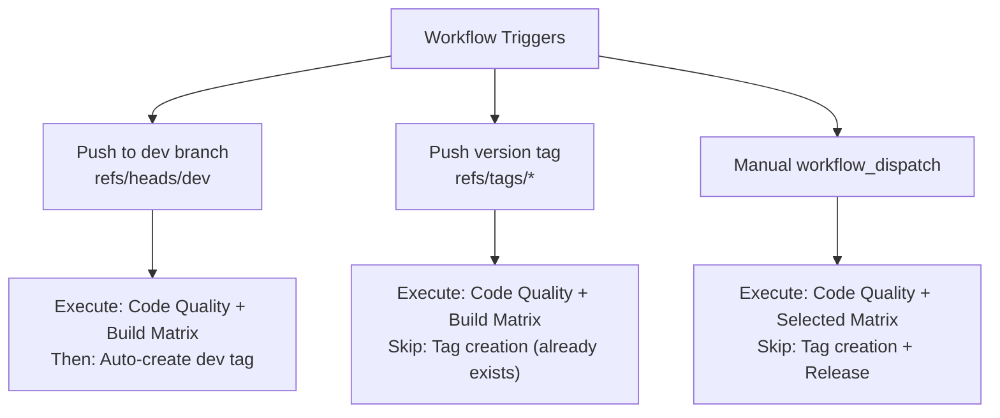
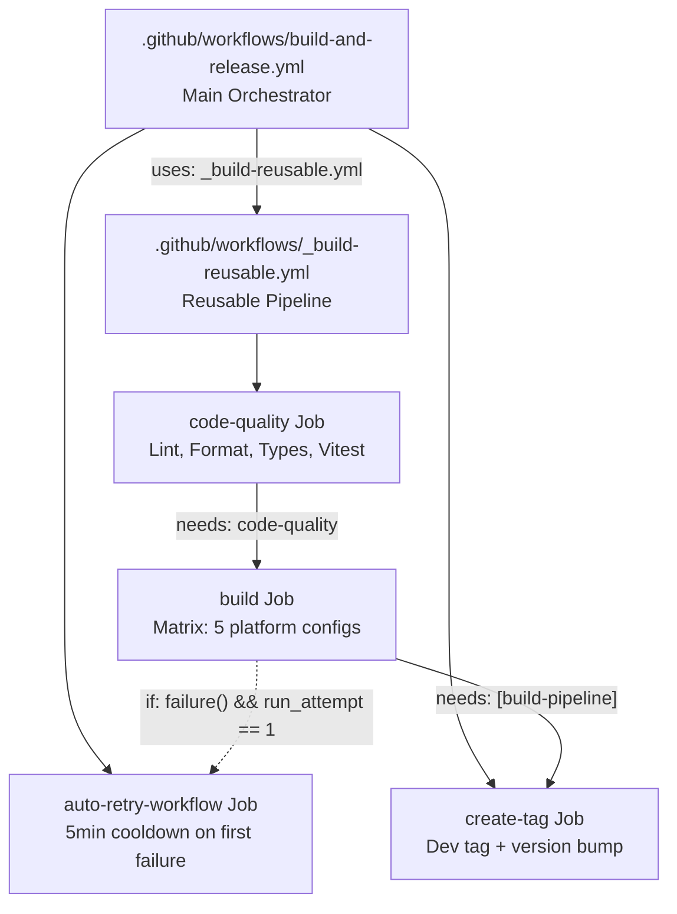

# Build Pipeline

Relevant source files

The following files were used as context for generating this wiki page:

- [.github/actions/call-openai/action.yml](.github/actions/call-openai/action.yml)
- [.github/actions/checkout-pr/action.yml](.github/actions/checkout-pr/action.yml)
- [.github/actions/gather-pr-diff/action.yml](.github/actions/gather-pr-diff/action.yml)
- [.github/actions/read-file-contents/action.yml](.github/actions/read-file-contents/action.yml)
- [.github/workflows/README.md](.github/workflows/README.md)
- [.github/workflows/_build-reusable.yml](.github/workflows/_build-reusable.yml)
- [.github/workflows/build-and-release.yml](.github/workflows/build-and-release.yml)
- [.github/workflows/build-manual.yml](.github/workflows/build-manual.yml)
- [.github/workflows/gpt-pr-assessment.yml](.github/workflows/gpt-pr-assessment.yml)
- [.github/workflows/gpt-review.yml](.github/workflows/gpt-review.yml)
- [.github/workflows/pr-checks-docs.yml](.github/workflows/pr-checks-docs.yml)
- [.github/workflows/pr-checks.yml](.github/workflows/pr-checks.yml)
- [.github/workflows/pr-e2e-artifacts.yml](.github/workflows/pr-e2e-artifacts.yml)
- [bun.lock](bun.lock)
- [electron-builder.yml](electron-builder.yml)
- [package.json](package.json)
- [scripts/README.md](scripts/README.md)
- [scripts/afterPack.js](scripts/afterPack.js)
- [scripts/afterSign.js](scripts/afterSign.js)
- [scripts/build-with-builder.js](scripts/build-with-builder.js)
- [scripts/create-mock-release-artifacts.sh](scripts/create-mock-release-artifacts.sh)
- [scripts/prepare-release-assets.sh](scripts/prepare-release-assets.sh)
- [scripts/rebuildNativeModules.js](scripts/rebuildNativeModules.js)
- [scripts/verify-release-assets.sh](scripts/verify-release-assets.sh)
- [src/index.ts](src/index.ts)
- [src/process/bridge/updateBridge.ts](src/process/bridge/updateBridge.ts)
- [src/process/services/autoUpdaterService.ts](src/process/services/autoUpdaterService.ts)
- [tests/integration/autoUpdate.integration.test.ts](tests/integration/autoUpdate.integration.test.ts)
- [tests/unit/autoUpdaterService.test.ts](tests/unit/autoUpdaterService.test.ts)

## Overview

The build pipeline for AionUi is a multi-platform CI/CD system implemented using GitHub Actions, `electron-vite`, and `electron-builder`. It orchestrates the compilation of TypeScript/React code, the rebuilding of native C++ modules (like `better-sqlite3`), and the packaging of distributables for Windows, macOS, and Linux.

The pipeline is designed for high reliability, featuring incremental build optimizations, automated retry logic for transient macOS failures, and a 5-platform build matrix.

## Workflow Trigger Events

The pipeline is defined in `.github/workflows/build-and-release.yml` and reacts to three primary events:

**Trigger Event Mapping**

*   **Dev Branch Push**: Triggers a full build and automatically creates a development tag following the pattern `v{VERSION}-dev-{COMMIT_SHORT}` [package.json:3](), [.github/workflows/build-and-release.yml:126]().
*   **Version Tag Push**: Triggers a production release. The pipeline filters out `-dev-` tags to avoid redundant builds [.github/workflows/build-and-release.yml:23]().
*   **Manual Dispatch**: Handled via `.github/workflows/build-manual.yml` (and `workflow_dispatch` in other files), allowing developers to trigger specific platform builds with custom parameters via the GitHub Actions UI.

Sources: [.github/workflows/build-and-release.yml:9-23](), [package.json:1-3]()

## Reusable Build Architecture

AionUi uses a "Reusable Workflow" pattern to separate build logic from release management.

**Workflow Composition**

The reusable workflow (`_build-reusable.yml`) ensures that every build passes a strict quality gate before proceeding to the expensive matrix build stage.

Sources: [.github/workflows/build-and-release.yml:19-34](), [.github/workflows/_build-reusable.yml:33-77]()

## Code Quality Gates

Before any platform build starts, the `code-quality` job executes the following suite:

| Check | Command | Purpose |
| :--- | :--- | :--- |
| **ESLint** | `bun run lint` | Static analysis via `oxlint` [package.json:35]() |
| **Prettier** | `bun run format:check` | Formatting check via `oxfmt` [package.json:38]() |
| **TypeScript** | `bunx tsc --noEmit` | Type safety verification [.github/workflows/_build-reusable.yml:68]() |
| **Vitest** | `bunx vitest run` | Unit and integration testing [package.json:40]() |

The `PR Checks` workflow (`.github/workflows/pr-checks.yml`) provides additional gates for contributors, including coverage tests via `Codecov` and internationalization checks using `i18n-check` [.github/workflows/pr-checks.yml:136-219]().

Sources: [.github/workflows/_build-reusable.yml:61-71](), [package.json:35-43](), [.github/workflows/pr-checks.yml:48-134]()

## 5-Platform Build Matrix

The pipeline executes five parallel builds to cover all supported desktop environments.

**Matrix Configuration** [.github/workflows/build-and-release.yml:25-32]()

| Platform | Runner OS | Command | Architecture |
| :--- | :--- | :--- | :--- |
| **macOS Apple Silicon** | `macos-14` | `node scripts/build-with-builder.js arm64 --mac --arm64` | `arm64` |
| **macOS Intel** | `macos-14` | `node scripts/build-with-builder.js x64 --mac --x64` | `x64` |
| **Windows x64** | `windows-2022` | `node scripts/build-with-builder.js x64 --win --x64` | `x64` |
| **Windows ARM64** | `windows-2022` | `node scripts/build-with-builder.js arm64 --win --arm64` | `arm64` |
| **Linux (Universal)** | `ubuntu-latest` | `bun run dist:linux` | `x64-arm64` |

Sources: [.github/workflows/build-and-release.yml:25-32](), [package.json:23-26]()

## Build Process Coordination

The script `scripts/build-with-builder.js` is the central orchestrator for the build process.

### Incremental Build Optimization
The script computes an MD5 hash of the source code (`src/`, `public/`, `scripts/`) and configuration files (`package.json`, `bun.lock`, `electron-builder.yml`). If the hash matches the one stored in `out/.build-hash`, the Vite compilation step is skipped [scripts/build-with-builder.js:46-132]().

### Native Module Rebuild Strategy
Native modules like `better-sqlite3`, `bcrypt`, and `node-pty` require compilation for the specific Electron ABI and target architecture.

*   **macOS/Linux**: Uses `bunx electron-builder install-app-deps` [.github/workflows/_build-reusable.yml:176]().
*   **Windows**: Employs a specialized strategy using `prebuild-install` first, falling back to `electron-rebuild` if binaries are unavailable [scripts/rebuildNativeModules.js:174-210]().
*   **Cross-Architecture**: The `afterPack.js` hook detects if the build machine architecture differs from the target (e.g., building x64 on an arm64 runner) and triggers a targeted rebuild of native modules [scripts/afterPack.js:17-47]().

Sources: [scripts/build-with-builder.js:5-132](), [scripts/rebuildNativeModules.js:71-82](), [scripts/afterPack.js:17-47](), [electron-builder.yml:189-210]()

## Release and Update Management

### Automatic Version Bumping
When a push to `dev` occurs, the pipeline checks if the current version tag already exists. If it does, it uses `bun pm version` to increment the patch version and commits the change back to the repository before creating the tag [.github/workflows/build-and-release.yml:144-165]().

### Auto-Update Metadata
The `electron-updater` integration requires platform-specific metadata files. The `AutoUpdaterService` determines the correct update channel based on the current OS and architecture [src/process/services/autoUpdaterService.ts:17-41]().

**Update Channel Logic**

| Platform | Architecture | Channel Suffix | Resulting File |
| :--- | :--- | :--- | :--- |
| Windows | x64 | (none) | `latest.yml` |
| Windows | arm64 | `latest-win-arm64` | `latest-win-arm64.yml` |
| macOS | arm64 | `latest-arm64` | `latest-arm64-mac.yml` |
| Linux | arm64 | `latest` | `latest-linux-arm64.yml` |

Sources: [.github/workflows/build-and-release.yml:144-165](), [src/process/services/autoUpdaterService.ts:17-41](), [electron-builder.yml:124, 141, 175]()

## Resilience and Retries

The pipeline handles common CI failures with two mechanisms:

1.  **Workflow Retry**: If the entire build pipeline fails on the first attempt, the `auto-retry-workflow` job waits 5 minutes and triggers a full rerun via the GitHub API [.github/workflows/build-and-release.yml:36-90]().
2.  **DMG Retry**: On macOS, if the `.app` is created but the `.dmg` fails (often due to `hdiutil` issues on GitHub runners), the script retries the DMG step up to 3 times after cleaning up stale disk images [scripts/build-with-builder.js:134-154, 221-255]().

Sources: [.github/workflows/build-and-release.yml:36-90](), [scripts/build-with-builder.js:221-255]()