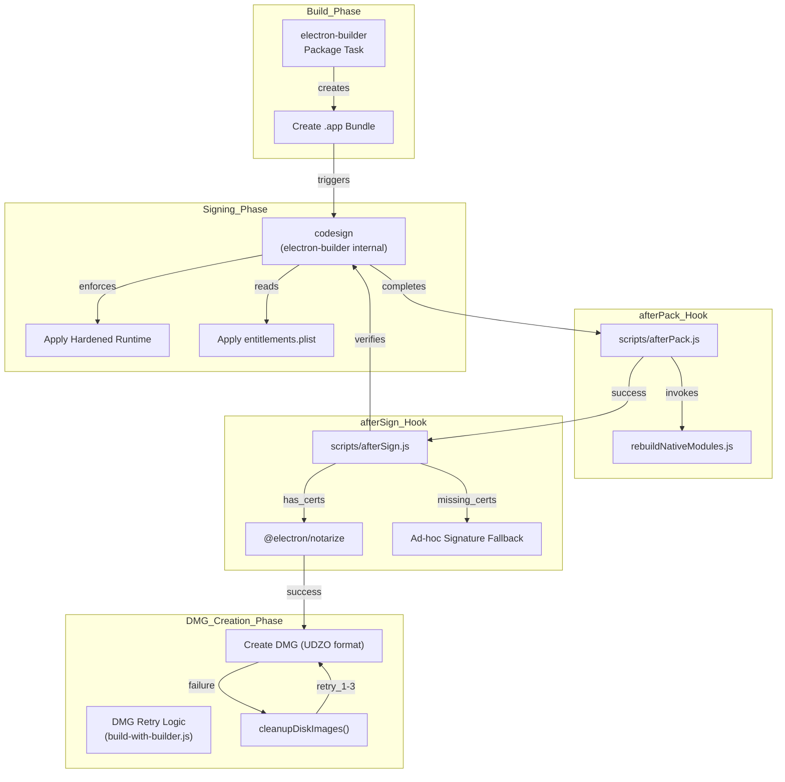
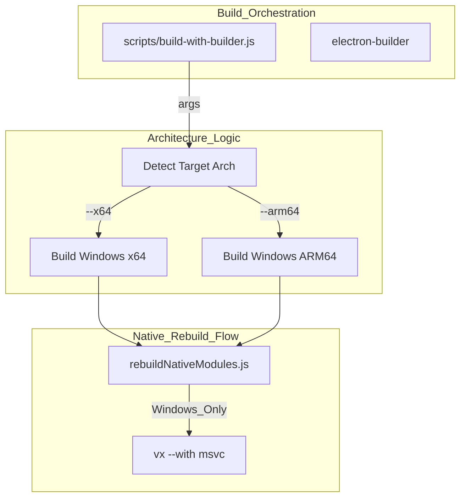

# Code Signing & Notarization

<details>
<summary>Relevant source files</summary>

The following files were used as context for generating this wiki page:

- [.github/workflows/build-and-release.yml](.github/workflows/build-and-release.yml)
- [bun.lock](bun.lock)
- [electron-builder.yml](electron-builder.yml)
- [package.json](package.json)
- [scripts/README.md](scripts/README.md)
- [scripts/afterPack.js](scripts/afterPack.js)
- [scripts/afterSign.js](scripts/afterSign.js)
- [scripts/build-with-builder.js](scripts/build-with-builder.js)
- [scripts/rebuildNativeModules.js](scripts/rebuildNativeModules.js)
- [src/index.ts](src/index.ts)

</details>


## Purpose and Scope

This document describes the code signing and notarization mechanisms used to ensure AionUi's distributables are trusted by operating systems. Code signing cryptographically proves the application's origin and integrity, while notarization (macOS-specific) validates the application through Apple's automated security checks.

The implementation focuses on macOS code signing with keychain management, hardened runtime compliance, and a notarization workflow with high timeout tolerance. For Windows, the system employs architecture detection scripts within the NSIS installer to prevent cross-architecture installation errors and ensure the correct binary is used for the target system.

---

## macOS Code Signing Configuration

AionUi enables hardened runtime and Gatekeeper compliance for macOS builds, which are prerequisites for notarization. The configuration is declared in `electron-builder.yml`.

### Hardened Runtime and Entitlements

The `mac` section of the electron-builder configuration specifies core signing parameters:

```yaml
mac:
  hardenedRuntime: true
  gatekeeperAssess: false
  entitlements: entitlements.plist
  entitlementsInherit: entitlements.plist
```

| Configuration Key | Value | Purpose |
|------------------|-------|---------|
| `hardenedRuntime` | `true` | Enables Apple's hardened runtime, enforcing security restrictions [electron-builder.yml:143]() |
| `gatekeeperAssess` | `false` | Disables Gatekeeper assessment during build [electron-builder.yml:144]() |
| `entitlements` | `entitlements.plist` | Main entitlements file for the app bundle [electron-builder.yml:145]() |
| `entitlementsInherit` | `entitlements.plist` | Entitlements inherited by child processes [electron-builder.yml:146]() |

**Sources:** [electron-builder.yml:136-147]()

---

## Code Signing Hooks

Electron-builder provides lifecycle hooks for custom signing and post-signing operations. AionUi uses two hooks to integrate code signing, native module verification, and notarization:

### afterPack Hook
The `afterPack` hook executes after the application bundle is created but before DMG packaging. It is primarily used to rebuild native modules for cross-architecture builds (e.g., building x64 on an arm64 machine) to ensure all binary artifacts (like `better-sqlite3`) are correctly signed for the target architecture.
[scripts/afterPack.js:17-49](), [electron-builder.yml:167]()

### afterSign Hook
The `afterSign` hook executes after code signing completes. This script invokes Apple's notarization API using the `@electron/notarize` package.
[scripts/afterSign.js:3-11](), [electron-builder.yml:168]()

---

## macOS Notarization Process

The following diagram illustrates the notarization workflow integrated into the build pipeline:

**Diagram: macOS Code Signing and Notarization Flow**


**Sources:** [scripts/afterSign.js:18-48](), [scripts/build-with-builder.js:20-27](), [electron-builder.yml:148-168]()

### Notarization with Timeout Tolerance

The build system implements a "degraded mode" that allows DMG creation to proceed even if the environment is not fully configured for notarization (e.g., missing Apple ID credentials). In such cases, the `afterSign.js` script logs a warning and skips the notarization step rather than failing the entire build.
[scripts/afterSign.js:32-36]()

If the app is not signed, the script attempts to apply an ad-hoc signature as a fallback:
[scripts/afterSign.js:22-30]()

### DMG Retry Logic
The script `build-with-builder.js` handles transient macOS `hdiutil` errors (such as "Device not configured") by retrying DMG creation up to 3 times.
[scripts/build-with-builder.js:20-27]()

1.  **Cleanup**: Before retrying, `cleanupDiskImages()` detaches all mounted disk images using `hdiutil detach -force` to prevent blocking subsequent attempts. [scripts/build-with-builder.js:134-154]()
2.  **Prepackaged Build**: Retries use the `--prepackaged` flag with the existing `.app` path via `createDmgWithPrepackaged()` to preserve styling and signed status. [scripts/build-with-builder.js:221-227]()

---

## Windows Architecture Detection

AionUi uses architecture-specific scripts during the build process to coordinate correct packaging for x64 and ARM64.

**Diagram: Windows Architecture Build Coordination**


**Sources:** [scripts/build-with-builder.js:28-33](), [scripts/rebuildNativeModules.js:47-52](), [electron-builder.yml:118-125]()

### NSIS Configuration
The `electron-builder.yml` configures NSIS to allow manual installation directory changes and custom artifact naming.
[electron-builder.yml:126-135]()

| Feature | Setting | Purpose |
|---------|---------|---------|
| **One-Click** | `false` | Allows users to customize installation and see warnings |
| **Directory Change** | `true` | Standard installer behavior for user choice |
| **Artifact Name** | `${productName}-${version}-${os}-${arch}.${ext}` | Clear identification of the architecture in the filename [electron-builder.yml:133]() |

### Native Module Toolchain
On Windows, the build utility `rebuildNativeModules.js` uses a specialized command prefix `vx --with msvc` to ensure the MSVC compiler environment is correctly injected for native modules like `better-sqlite3`.
[scripts/rebuildNativeModules.js:47-52](), [scripts/rebuildNativeModules.js:75-76]()

---

## Environment & Keychain Management

The build process relies on specific environment variables provided by GitHub Actions to authenticate with Apple's Notary Service.

| Variable | Purpose | Usage Site |
|----------|---------|------------|
| `appleId` | Apple Developer ID | [scripts/afterSign.js:45]() |
| `appleIdPassword` | App-specific password | [scripts/afterSign.js:46]() |
| `teamId` | Apple Team ID | [scripts/afterSign.js:47]() |
| `CSC_LINK` | Certificate (Base64) | Managed by `electron-builder` |
| `CSC_KEY_PASSWORD` | Certificate password | Managed by `electron-builder` |

**Sources:** [scripts/afterSign.js:33-48](), [.github/workflows/build-and-release.yml:27-33]()