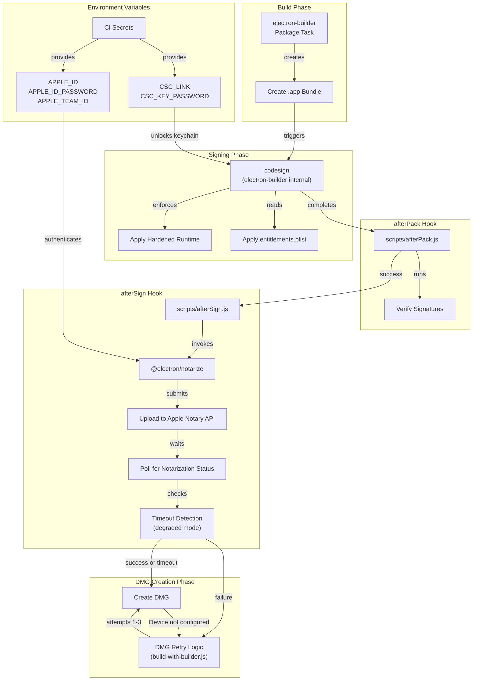
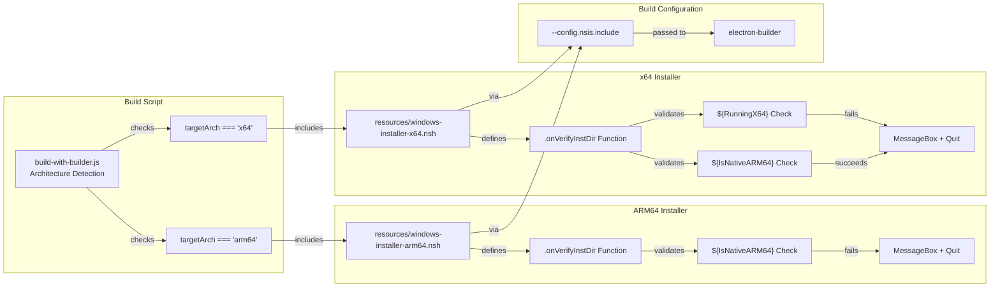

# Code Signing & Notarization

<details>
<summary>Relevant source files</summary>

The following files were used as context for generating this wiki page:

- [.github/workflows/build-and-release.yml](.github/workflows/build-and-release.yml)
- [electron-builder.yml](electron-builder.yml)
- [package.json](package.json)
- [resources/windows-installer-arm64.nsh](resources/windows-installer-arm64.nsh)
- [resources/windows-installer-x64.nsh](resources/windows-installer-x64.nsh)
- [scripts/build-with-builder.js](scripts/build-with-builder.js)

</details>

## Purpose and Scope

This document describes the code signing and notarization mechanisms used to ensure AionUi's distributables are trusted by operating systems. Code signing cryptographically proves the application's origin and integrity, while notarization (macOS-specific) validates the application through Apple's automated security checks.

The primary focus is on macOS code signing with hardened runtime and notarization workflows. Windows installer validation through architecture detection scripts is also covered. For information about the overall build pipeline that triggers these processes, see [Build Pipeline](#11.1). For release artifact management, see [Release Management](#11.5).

---

## macOS Code Signing Configuration

AionUi enables hardened runtime and Gatekeeper compliance for macOS builds, which are prerequisites for notarization. The configuration is declared in `electron-builder.yml`.

### Hardened Runtime and Entitlements

The `mac` section of the electron-builder configuration specifies core signing parameters:

```yaml
mac:
  hardenedRuntime: true
  gatekeeperAssess: false
  entitlements: entitlements.plist
  entitlementsInherit: entitlements.plist
```

| Configuration Key     | Value                | Purpose                                                               |
| --------------------- | -------------------- | --------------------------------------------------------------------- |
| `hardenedRuntime`     | `true`               | Enables Apple's hardened runtime, enforcing security restrictions     |
| `gatekeeperAssess`    | `false`              | Disables Gatekeeper assessment during build (handled by notarization) |
| `entitlements`        | `entitlements.plist` | Main entitlements file for the application bundle                     |
| `entitlementsInherit` | `entitlements.plist` | Entitlements inherited by child processes                             |

The hardened runtime requires explicit entitlements for operations like JIT compilation, dynamic library loading, and debugger attachment. These are declared in `entitlements.plist` (not shown in provided files but referenced in configuration).

**Sources:** [electron-builder.yml:122-132]()

---

## Code Signing Hooks

Electron-builder provides lifecycle hooks for custom signing and post-signing operations. AionUi uses two hooks to integrate code signing and notarization:

### afterPack Hook

The `afterPack` hook executes immediately after electron-builder creates the application bundle but before DMG creation. This is the stage where code signing occurs.

```
afterPack: scripts/afterPack.js
```

While the `afterPack.js` file is not provided in the source list, this hook typically handles:

- Verification of signed binaries
- Additional signing of plugins or native modules
- Pre-notarization cleanup

### afterSign Hook

The `afterSign` hook executes after code signing completes and is the standard location for triggering notarization:

```
afterSign: scripts/afterSign.js
```

This script invokes Apple's notarization API using the `@electron/notarize` package, which is declared as a dev dependency.

**Sources:** [electron-builder.yml:153-154](), [package.json:60]()

---

## macOS Notarization Process

The following diagram illustrates the notarization workflow integrated into the build pipeline:

**Diagram: macOS Code Signing and Notarization Flow**



**Sources:** [electron-builder.yml:122-154](), [scripts/build-with-builder.js:19-24]()

### Notarization Timeout Tolerance

The build system implements a "degraded mode" that allows DMG creation to proceed even if notarization times out. This is referenced in the page 11.4 JSON outline as "notarization with timeout tolerance (degraded mode allows DMG without notarization)".

The DMG retry logic detects notarization failures by checking if the `.app` bundle exists but the `.dmg` file is missing, indicating a failure during DMG creation:

```javascript
const appDir = isMac ? findAppDir(outDir) : null
if (!appDir || dmgExists(outDir)) throw error

// .app exists but no .dmg → DMG creation failed
console.log(
  '\
🔄 Build failed during DMG creation (.app exists, .dmg missing)'
)
```

The retry mechanism attempts DMG creation up to 3 times with 30-second intervals, using the `--prepackaged` flag to preserve styling:

```javascript
for (let attempt = 1; attempt <= DMG_RETRY_MAX; attempt++) {
  cleanupDiskImages()
  spawnSync('sleep', [String(DMG_RETRY_DELAY_SEC)])

  try {
    console.log(`\
📀 DMG retry attempt ${attempt}/${DMG_RETRY_MAX}...`)
    createDmgWithPrepackaged(appDir, targetArch)
    console.log('✅ DMG created successfully on retry')
    return
  } catch (retryError) {
    // Continue to next attempt
  }
}
```

**Sources:** [scripts/build-with-builder.js:19-251]()

---

## Certificate Management in CI/CD

The GitHub Actions workflow provides code signing credentials through encrypted secrets. These secrets are made available to the build jobs through the `secrets: inherit` configuration.

### Required Secrets for macOS

| Secret Name         | Purpose                         | Used By                          |
| ------------------- | ------------------------------- | -------------------------------- |
| `APPLE_ID`          | Apple Developer account email   | Notarization authentication      |
| `APPLE_ID_PASSWORD` | App-specific password           | Notarization authentication      |
| `APPLE_TEAM_ID`     | Developer Team ID               | Notarization team identification |
| `CSC_LINK`          | Base64-encoded .p12 certificate | Code signing certificate         |
| `CSC_KEY_PASSWORD`  | Certificate password            | Unlocking keychain               |

The build matrix defines macOS jobs for both ARM64 and x64 architectures:

```yaml
{"platform":"macos-arm64","os":"macos-14","command":"node scripts/build-with-builder.js arm64 --mac --arm64","artifact-name":"macos-build-arm64","arch":"arm64"},
{"platform":"macos-x64","os":"macos-14","command":"node scripts/build-with-builder.js x64 --mac --x64","artifact-name":"macos-build-x64","arch":"x64"}
```

Both jobs inherit secrets from the repository-level or environment-level configuration specified in the `release` or `dev-release` environments.

**Sources:** [.github/workflows/build-and-release.yml:27-28](), [.github/workflows/build-and-release.yml:207](), [.github/workflows/build-and-release.yml:33]()

---

## Windows Installer Validation

While Windows builds do not use code signing in the current implementation, AionUi includes architecture validation scripts to prevent installation on incompatible systems. These scripts are included in the NSIS installer via electron-builder configuration.

### Architecture Detection Scripts

The build script dynamically includes architecture-specific NSIS scripts based on the target architecture:

**Diagram: Windows Installer Architecture Validation**



**Sources:** [scripts/build-with-builder.js:460-481]()

### ARM64 Validation Script

The ARM64 installer includes a guard that blocks installation on non-ARM64 systems:

```nsis
Function .onVerifyInstDir
  ${IfNot} ${IsNativeARM64}
    MessageBox MB_OK|MB_ICONSTOP \
      "Installation package architecture mismatch..."
    Quit
  ${EndIf}
FunctionEnd
```

This function executes during the installation directory verification phase, which occurs early in the NSIS installer lifecycle before any files are extracted.

**Sources:** [resources/windows-installer-arm64.nsh:1-20]()

### x64 Validation Script

The x64 installer includes dual validation to reject both 32-bit and ARM64 systems:

```nsis
Function .onVerifyInstDir
  ; Block installation on x86 (32-bit) systems
  ${IfNot} ${RunningX64}
    MessageBox MB_OK|MB_ICONSTOP \
      "This AionUi installer is designed for x64 architecture..."
    Quit
  ${EndIf}

  ; Block installation on ARM64 systems
  ${If} ${IsNativeARM64}
    MessageBox MB_OK|MB_ICONSTOP \
      "Your system is ARM64 architecture. Please download the ARM64 version..."
    Quit
  ${EndIf}
FunctionEnd
```

The check order is critical: `RunningX64` must be validated before `IsNativeARM64` because ARM64 systems with WOW64 emulation may report `RunningX64=true`.

**Sources:** [resources/windows-installer-x64.nsh:1-30]()

---

## DMG Creation and Disk Image Issues

macOS DMG creation occasionally fails on GitHub Actions runners with "Device not configured" errors from `hdiutil`. The build script includes comprehensive retry logic to handle these transient failures.

### Disk Image Cleanup Strategy

Before each retry attempt, the script detaches all mounted disk images that may interfere with DMG creation:

```javascript
function cleanupDiskImages() {
  const result = spawnSync(
    'sh',
    [
      '-c',
      "hdiutil info 2>/dev/null | grep /dev/disk | awk '{print $1}' | xargs -I {} hdiutil detach {} -force 2>/dev/null",
    ],
    { stdio: 'ignore' }
  )
  return result.status === 0
}
```

This pipeline:

1. Lists all mounted disk images via `hdiutil info`
2. Extracts device paths (`/dev/diskN`) using `grep` and `awk`
3. Force-detaches each device using `hdiutil detach -force`

**Sources:** [scripts/build-with-builder.js:133-148]()

### Prepackaged DMG Creation

When retrying DMG creation, the script uses electron-builder's `--prepackaged` flag to preserve the original `.app` bundle and all DMG styling configuration:

```javascript
function createDmgWithPrepackaged(appDir, targetArch) {
  const appName = fs.readdirSync(appDir).find((f) => f.endsWith('.app'))
  const appPath = path.join(appDir, appName)

  execSync(
    `bunx electron-builder --mac dmg --${targetArch} --prepackaged "${appPath}" --publish=never`,
    { stdio: 'inherit', shell: process.platform === 'win32' }
  )
}
```

This approach reuses the already-signed `.app` bundle, avoiding redundant compilation and signing operations. The DMG configuration from `electron-builder.yml` is still applied, including window size, icon positions, and UDZO format settings.

**Sources:** [scripts/build-with-builder.js:205-214](), [electron-builder.yml:134-151]()

---

## Build Integration Summary

The following table summarizes how code signing and notarization integrate with the build system:

| Phase                  | Tool/Script                                   | Configuration                             | Environment Variables                            |
| ---------------------- | --------------------------------------------- | ----------------------------------------- | ------------------------------------------------ |
| **Bundle Creation**    | electron-builder                              | `electron-builder.yml`                    | `ELECTRON_BUILDER_ARCH`                          |
| **Code Signing**       | codesign (via electron-builder)               | `mac.hardenedRuntime`, `mac.entitlements` | `CSC_LINK`, `CSC_KEY_PASSWORD`                   |
| **Post-Pack Hook**     | `scripts/afterPack.js`                        | `afterPack` in electron-builder.yml       | (varies)                                         |
| **Notarization**       | `scripts/afterSign.js` + `@electron/notarize` | `afterSign` in electron-builder.yml       | `APPLE_ID`, `APPLE_ID_PASSWORD`, `APPLE_TEAM_ID` |
| **DMG Creation**       | electron-builder + retry logic                | `dmg` section, `--prepackaged` flag       | N/A                                              |
| **Windows Validation** | NSIS scripts                                  | `--config.nsis.include`                   | N/A                                              |

The entire process is orchestrated by `build-with-builder.js`, which wraps electron-builder and implements retry logic for DMG creation failures.

**Sources:** [scripts/build-with-builder.js:1-511](), [electron-builder.yml:1-218](), [package.json:60]()
