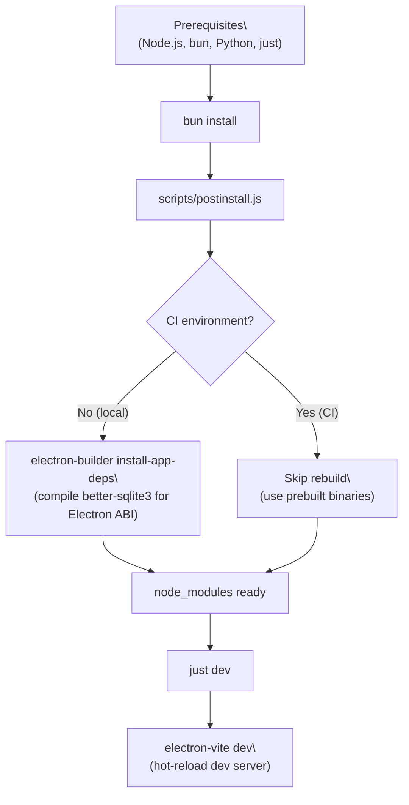
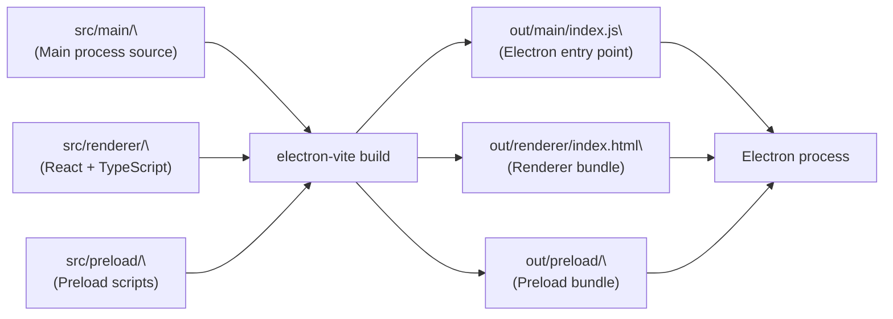
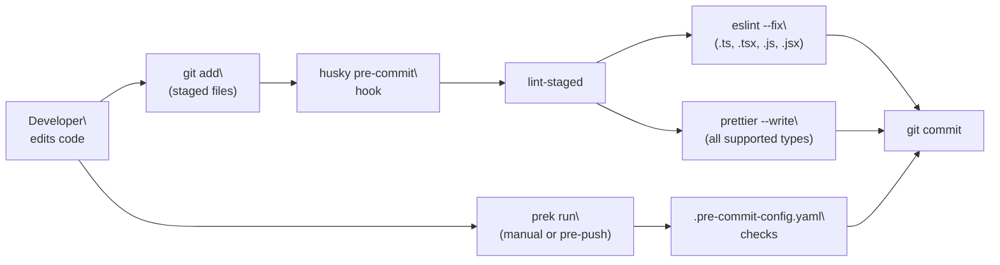

# Development Environment

<details>
<summary>Relevant source files</summary>

The following files were used as context for generating this wiki page:

- [.github/workflows/build-and-release.yml](.github/workflows/build-and-release.yml)
- [electron-builder.yml](electron-builder.yml)
- [package.json](package.json)
- [readme.md](readme.md)
- [readme_ch.md](readme_ch.md)
- [readme_es.md](readme_es.md)
- [readme_jp.md](readme_jp.md)
- [readme_ko.md](readme_ko.md)
- [readme_pt.md](readme_pt.md)
- [readme_tr.md](readme_tr.md)
- [readme_tw.md](readme_tw.md)
- [resources/wechat_group4.png](resources/wechat_group4.png)
- [resources/windows-installer-arm64.nsh](resources/windows-installer-arm64.nsh)
- [resources/windows-installer-x64.nsh](resources/windows-installer-x64.nsh)
- [scripts/build-with-builder.js](scripts/build-with-builder.js)

</details>

This page covers how to set up a local development environment for AionUi, run the application in development mode, use the available debug scripts, and configure code quality tooling. For information about the full build and packaging pipeline that produces release artifacts, see [11.1](). For native module compilation and cross-platform considerations, see [11.3]().

---

## Prerequisites

The following tools must be installed before beginning development:

| Tool    | Required Version | Purpose                                                            |
| ------- | ---------------- | ------------------------------------------------------------------ |
| Node.js | `>=22 <25`       | JavaScript runtime (enforced by `engines` field in `package.json`) |
| bun     | latest           | Package manager and runtime used for all `bun run` scripts         |
| just    | any              | Command runner — wraps common tasks via `justfile`                 |
| Python  | `3.11+`          | Required for native module compilation (`better-sqlite3`)          |
| prek    | any              | Pre-commit code checker (`npm install -g @j178/prek`)              |

The Node.js version constraint is declared at [package.json:7-9]().

Sources: [package.json:1-10](), [readme.md:556-563]()

---

## Initial Setup

```bash
# Clone the repository
git clone https://github.com/iOfficeAI/AionUi.git
cd AionUi

# Install dependencies and compile native modules
just install
```

`just install` triggers `bun install`, which in turn runs the `postinstall` hook defined at [scripts/postinstall.js:1-47](). In a local (non-CI) environment, `postinstall.js` calls `bunx electron-builder install-app-deps` to compile native modules (primarily `better-sqlite3`) against the current Electron ABI. In CI, this step is skipped and prebuilt binaries are used instead.

**Setup diagram — from prerequisites to a working dev environment:**



Sources: [scripts/postinstall.js:1-47](), [readme.md:566-576]()

---

## Running the Application in Development Mode

The primary dev command launches the Electron app with Vite's hot module replacement (HMR) active across the main process, renderer process, and preload scripts.

```bash
just dev       # equivalent to: bun run start
```

This maps to the `start` script in `package.json`: `electron-vite dev` [package.json:11]().

### Alternative Run Modes

| Command                | `package.json` Script | What It Does                                            |
| ---------------------- | --------------------- | ------------------------------------------------------- |
| `just dev`             | `start`               | Standard desktop GUI with HMR                           |
| `just webui`           | `webui`               | Starts with `--webui` flag (Express + WebSocket server) |
| `bun run webui:remote` | `webui:remote`        | WebUI in remote mode (`--webui --remote`)               |
| `bun run webui:prod`   | `webui:prod`          | WebUI with `NODE_ENV=production`                        |
| `bun run resetpass`    | `resetpass`           | Launches password reset CLI (`--resetpass`)             |

The `--webui` and `--remote` flags are parsed by the application's main process entry point. For details on how these flags change application startup behavior, see [3.1]().

Sources: [package.json:10-18](), [readme.md:580-600]()

---

## Build Output Structure

During development and after a build, `electron-vite` places bundled output into the `out/` directory. The `main` field in `package.json` points to `./out/main/index.js` [package.json:6](), which is what Electron loads.

**Toolchain to output directory mapping:**



| Directory       | Contents                                  |
| --------------- | ----------------------------------------- |
| `out/main/`     | Bundled main process code                 |
| `out/renderer/` | Bundled React UI (index.html + JS chunks) |
| `out/preload/`  | Bundled preload scripts (ipcBridge)       |

Sources: [readme.md:603-613](), [scripts/build-with-builder.js:83-90]()

---

## Debug Scripts

Several specialized debug scripts are available via `package.json`:

| Script               | Command                                          | Purpose                                                               |
| -------------------- | ------------------------------------------------ | --------------------------------------------------------------------- |
| `debug:perf`         | `cross-env ACP_PERF=1 PERF_MONITOR=1 bun start`  | Starts dev server with ACP and general performance monitoring enabled |
| `debug:perf:report`  | `bunx tsx scripts/debug-performance.ts --report` | Generates a performance report from collected data                    |
| `debug:mcp`          | `bunx tsx scripts/debug-mcp.ts`                  | Runs the MCP debug script                                             |
| `debug:mcp:list`     | `bunx tsx scripts/debug-mcp.ts list`             | Lists available MCP servers                                           |
| `debug:mcp:validate` | `bunx tsx scripts/debug-mcp.ts validate`         | Validates MCP server configurations                                   |
| `debug:custom-agent` | `bunx tsx scripts/debug-custom-agent.ts`         | Debugs custom ACP agent behavior                                      |

The `debug:perf` script passes `ACP_PERF=1` and `PERF_MONITOR=1` as environment variables, which are read by the main process to activate performance measurement paths [package.json:39]().

Sources: [package.json:39-44]()

---

## Testing

AionUi uses **vitest** as its test framework.

| Script             | Command                        | Purpose                                        |
| ------------------ | ------------------------------ | ---------------------------------------------- |
| `test`             | `vitest run`                   | Single-run all tests                           |
| `test:watch`       | `vitest`                       | Watch mode — re-runs on file changes           |
| `test:coverage`    | `vitest run --coverage`        | Run with v8 coverage via `@vitest/coverage-v8` |
| `test:contract`    | `vitest run tests/contract`    | Run only contract tests                        |
| `test:integration` | `vitest run tests/integration` | Run only integration tests                     |

Sources: [package.json:34-38]()

---

## Code Quality Tooling

### ESLint and Prettier

| Script         | Command                                                   | Notes                            |
| -------------- | --------------------------------------------------------- | -------------------------------- |
| `lint`         | `eslint --quiet --ext .ts,.tsx .`                         | Reports errors only (`--quiet`)  |
| `lint:fix`     | `eslint --ext .ts,.tsx . --fix`                           | Applies auto-fixes               |
| `format`       | `prettier --write "src/**/*.{ts,tsx,js,jsx,json,css,md}"` | Reformats source files           |
| `format:check` | `prettier --check "..."`                                  | Fails if files are not formatted |

ESLint is configured with `@typescript-eslint/eslint-plugin`, `eslint-plugin-import`, and `eslint-plugin-prettier`. The Prettier integration is via `eslint-config-prettier` [package.json:68-80]().

### Husky and lint-staged

Husky is installed via the `prepare` script (`husky`) [package.json:45](). On commit, `lint-staged` runs automatically against staged files:

| File pattern        | Actions applied                         |
| ------------------- | --------------------------------------- |
| `*.{ts,tsx,js,jsx}` | `eslint --fix`, then `prettier --write` |
| `*.{json,css,md}`   | `prettier --write`                      |

This configuration is declared at [package.json:201-209]().

### prek (Pre-commit Checks)

`prek` is a Rust-based pre-commit tool configured via `.pre-commit-config.yaml`. It can be run independently of git commits:

```bash
# Install git hooks (optional)
prek install

# Check staged files
prek run

# Check changes since main branch (mirrors CI behavior)
prek run --from-ref origin/main --to-ref HEAD
```

Sources: [package.json:45-46](), [package.json:201-209](), [readme.md:578-594]()

---

## Code Quality Pipeline Diagram

**How quality checks flow from code change to commit:**



Sources: [package.json:201-209](), [readme.md:578-594]()

---

## Tech Stack Reference

| Technology     | Package                  | Role                                               |
| -------------- | ------------------------ | -------------------------------------------------- |
| Electron       | `electron` ^37.3.1       | Desktop application host                           |
| React          | `react` ^19.1.0          | Renderer UI framework                              |
| TypeScript     | `typescript` ^5.8.3      | Type safety across main and renderer               |
| electron-vite  | `electron-vite` ^5.0.0   | Vite-based bundler for all three entry points      |
| UnoCSS         | `unocss` ^66.3.3         | Atomic CSS engine for renderer styles              |
| better-sqlite3 | `better-sqlite3` ^12.4.1 | Local SQLite database (native module)              |
| vitest         | `vitest` ^4.0.18         | Test runner                                        |
| Prettier       | `prettier` ^3.6.2        | Code formatter                                     |
| ESLint         | `eslint` ^8.57.1         | Linter                                             |
| husky          | `husky` ^9.1.7           | Git hooks                                          |
| lint-staged    | `lint-staged` ^16.2.7    | Pre-commit staged file processing                  |
| patch-package  | `patch-package` ^8.0.0   | Applies patches to dependencies (e.g., `7zip-bin`) |

Sources: [package.json:54-93](), [readme.md:611-619]()

---

## Incremental Builds

The `scripts/build-with-builder.js` script (used for production builds) includes an incremental build feature that skips the Vite compilation phase when no relevant source files have changed. It computes an MD5 hash of key config files (`package.json`, `tsconfig.json`, `electron.vite.config.ts`, `electron-builder.yml`) and the modification time of `src/` and `public/` directories, storing the result in `out/.build-hash` [scripts/build-with-builder.js:30-106]().

The `--skip-vite`, `--skip-native`, `--pack-only`, and `--force` flags can override this behavior. These are relevant when iterating on packaging configuration without needing a full TypeScript recompile.

Sources: [scripts/build-with-builder.js:1-106]()
