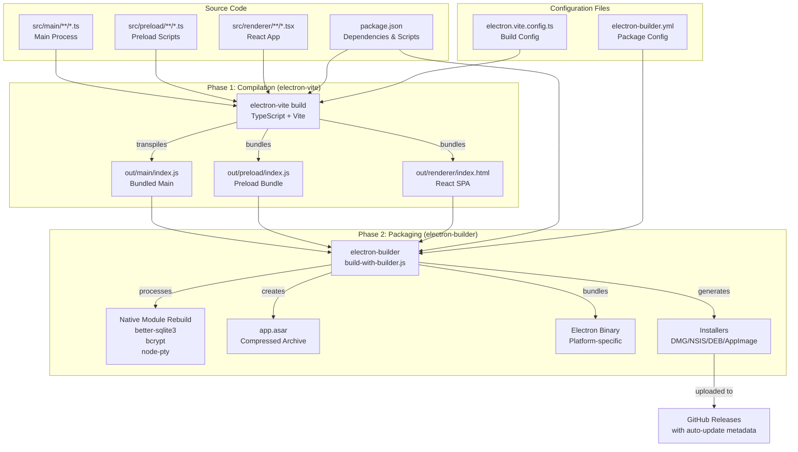
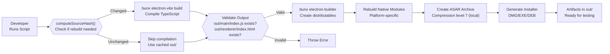
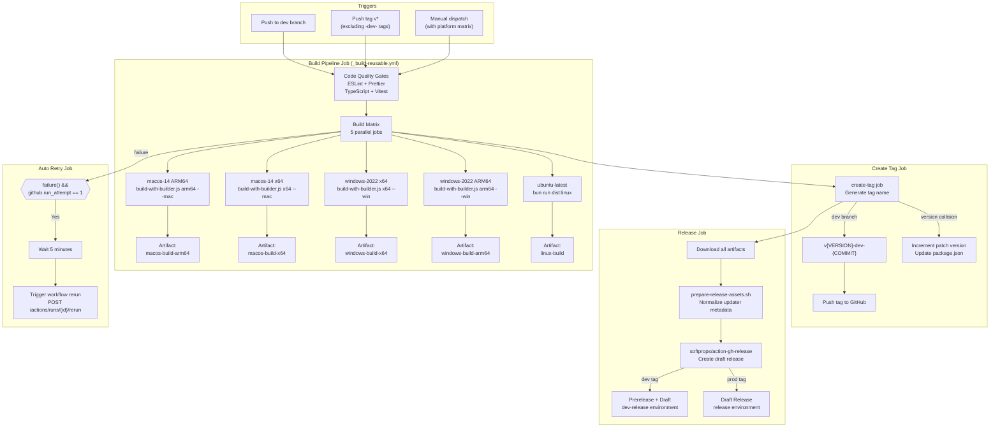
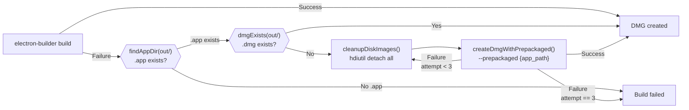
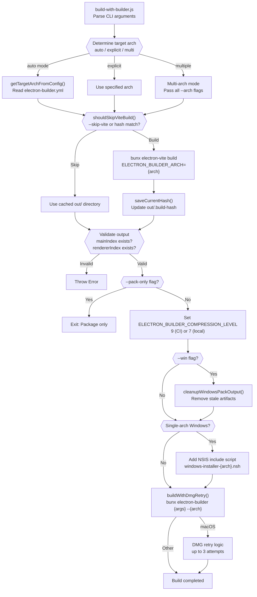

# Build & Deployment

<details>
<summary>Relevant source files</summary>

The following files were used as context for generating this wiki page:

- [.github/workflows/build-and-release.yml](.github/workflows/build-and-release.yml)
- [electron-builder.yml](electron-builder.yml)
- [package.json](package.json)
- [resources/windows-installer-arm64.nsh](resources/windows-installer-arm64.nsh)
- [resources/windows-installer-x64.nsh](resources/windows-installer-x64.nsh)
- [scripts/build-with-builder.js](scripts/build-with-builder.js)

</details>

This document provides an overview of AionUi's build and deployment architecture, explaining how source code is compiled, packaged, and distributed across multiple platforms. The system uses `electron-vite` for TypeScript/React compilation and `electron-builder` for creating platform-specific installers.

For detailed information about specific aspects:

- CI/CD pipeline implementation: See [Build Pipeline](#11.1)
- Two-phase compilation process: See [Two-Phase Build Process](#11.2)
- Native module rebuild strategies: See [Native Module Handling](#11.3)
- Code signing and notarization: See [Code Signing & Notarization](#11.4)
- Release creation and tagging: See [Release Management](#11.5)
- Setting up local development: See [Development Environment](#11.6)

## Build Architecture

AionUi's build system separates concerns into two distinct phases: **compilation** (handled by `electron-vite`) and **packaging** (handled by `electron-builder`). This separation enables incremental builds, faster development iteration, and platform-specific optimizations.

### Build Toolchain



**Sources:** [package.json:1-221](), [electron-builder.yml:1-218](), [scripts/build-with-builder.js:1-511]()

### Build Scripts Overview

The `package.json` defines several build entry points:

| Script       | Command                                          | Purpose                        |
| ------------ | ------------------------------------------------ | ------------------------------ |
| `package`    | `electron-vite build`                            | Compile source code only       |
| `dist`       | `node scripts/build-with-builder.js`             | Full build (compile + package) |
| `dist:mac`   | `build-with-builder.js auto --mac`               | macOS-only build               |
| `dist:win`   | `build-with-builder.js auto --win`               | Windows-only build             |
| `dist:linux` | `build-with-builder.js auto --linux`             | Linux-only build               |
| `build-mac`  | `build-with-builder.js auto --mac --arm64 --x64` | macOS universal build          |

**Sources:** [package.json:18-31]()

## Local Build Workflow

### Basic Build Process



**Sources:** [scripts/build-with-builder.js:44-131](), [scripts/build-with-builder.js:372-424]()

### Incremental Build Optimization

The build script uses MD5 hashing to detect source changes and skip unnecessary recompilation:

**Hash Computation** includes:

- Configuration files: `package.json`, `tsconfig.json`, `electron.vite.config.ts`, `electron-builder.yml`
- Source directories: `src/`, `public/`, `scripts/`
- File metadata: size and modification time

The hash is stored in `out/.build-hash` and compared on subsequent builds. If unchanged and `out/main/index.js` exists, the Vite compilation step is skipped.

**Sources:** [scripts/build-with-builder.js:28-106](), [scripts/build-with-builder.js:118-131]()

## CI/CD Architecture

### GitHub Actions Workflow Structure



**Sources:** [.github/workflows/build-and-release.yml:1-260]()

### Build Matrix Configuration

The workflow defines a 5-platform build matrix in JSON format:

```json
{
  "include": [
    { "platform": "macos-arm64", "os": "macos-14", "arch": "arm64" },
    { "platform": "macos-x64", "os": "macos-14", "arch": "x64" },
    { "platform": "windows-x64", "os": "windows-2022", "arch": "x64" },
    { "platform": "windows-arm64", "os": "windows-2022", "arch": "arm64" },
    { "platform": "linux", "os": "ubuntu-latest", "arch": "x64-arm64" }
  ]
}
```

Each job runs independently with platform-specific setup:

- **macOS**: Xcode tools, Python 3.12, code signing certificates
- **Windows**: MSVC ARM64 toolchain, Python 3.12, prebuild-install
- **Linux**: Standard build tools, multi-arch support (x64 + arm64)

**Sources:** [.github/workflows/build-and-release.yml:25-32]()

## Platform-Specific Considerations

### macOS Builds

**DMG Creation Retry Logic:**
macOS builds include automatic retry for DMG creation failures. If the `.app` bundle exists but the `.dmg` is missing after a build attempt, the system automatically retries using `electron-builder --prepackaged` up to 3 times with 30-second delays.



**Sources:** [scripts/build-with-builder.js:18-26](), [scripts/build-with-builder.js:133-251]()

**Code Signing:**
macOS builds use `hardenedRuntime: true` and entitlements defined in `entitlements.plist`. The `afterSign` hook in `scripts/afterSign.js` handles notarization with Apple's notary service. Notarization failures are tolerated (degraded mode) to prevent builds from blocking on temporary notary service issues.

**Sources:** [electron-builder.yml:129-132](), [electron-builder.yml:154]()

### Windows Builds

**Architecture Detection:**
Windows installers include NSIS scripts that prevent installation on mismatched architectures:

- **x64 installer**: Blocks installation on x86 (32-bit) and ARM64 systems
- **ARM64 installer**: Blocks installation on non-ARM64 systems

The detection uses `!include "x64.nsh"` and checks `${RunningX64}` and `${IsNativeARM64}` macros in the `.onVerifyInstDir` function.

**Sources:** [resources/windows-installer-x64.nsh:1-30](), [resources/windows-installer-arm64.nsh:1-20]()

**Native Module Handling:**
Windows builds use a fallback strategy:

1. Try `prebuild-install` to fetch prebuilt binaries
2. If unavailable, fall back to `electron-rebuild` to compile from source

ARM64 builds require the MSVC ARM64 toolchain for native compilation.

**Stale Output Cleanup:**
Before Windows builds, the script removes stale artifacts matching `/^win(?:-[a-z0-9]+)?-unpacked$/i` and `/-win-[^.]+\.(exe|msi|zip|7z|blockmap)$/i` patterns to prevent packaging conflicts.

**Sources:** [scripts/build-with-builder.js:254-280](), [scripts/build-with-builder.js:483-502]()

### Linux Builds

Linux builds target two formats:

- **DEB**: Debian package with desktop entry and MIME handler for `x-scheme-handler/aionui`
- **AppImage**: Self-contained executable

Both formats support `x64` and `arm64` architectures. The desktop entry includes:

```
Categories: Office;Utility;
MimeType: x-scheme-handler/aionui;
```

**Sources:** [electron-builder.yml:156-176]()

## Native Module Configuration

### ASAR Unpacking

Three native modules require unpacking from the ASAR archive for runtime loading:

| Module           | Reason                                       | Pattern                               |
| ---------------- | -------------------------------------------- | ------------------------------------- |
| `better-sqlite3` | Native binary + `.node` files                | `**/node_modules/better-sqlite3/**/*` |
| `bcrypt`         | Native binary for password hashing           | `**/node_modules/bcrypt/**/*`         |
| `node-pty`       | PTY (pseudo-terminal) support for CLI agents | `**/node_modules/node-pty/**/*`       |

Additional unpacked modules:

- `web-tree-sitter` and `tree-sitter-bash`: WASM files need `fs.readFile` access
- `rules/` and `skills/`: Built-in resources for `fs.readdir` with `withFileTypes`

**Sources:** [electron-builder.yml:181-203]()

### Excluded Native Binaries

To prevent code signing issues, all `tree-sitter-*` native binaries are excluded from packaging:

```yaml
- '!**/node_modules/tree-sitter-*/prebuilds/**'
- '!**/node_modules/tree-sitter-*/build/**'
- '!**/node_modules/tree-sitter-*/**/*.node'
```

JAR files and JNI libraries are also excluded to avoid macOS notarization failures.

**Sources:** [electron-builder.yml:56-87]()

## Distribution Artifacts

### Output Structure

After a successful build, artifacts are generated in the `out/` directory:

**macOS:**

- `AionUi-{version}-mac-arm64.dmg` - ARM64 disk image
- `AionUi-{version}-mac-arm64.zip` - ARM64 portable archive
- `AionUi-{version}-mac-x64.dmg` - x64 disk image
- `AionUi-{version}-mac-x64.zip` - x64 portable archive
- `latest-mac.yml` - Auto-update metadata

**Windows:**

- `AionUi-{version}-win-x64.exe` - x64 NSIS installer
- `AionUi-{version}-win-x64.zip` - x64 portable archive
- `AionUi-{version}-win-arm64.exe` - ARM64 NSIS installer
- `AionUi-{version}-win-arm64.zip` - ARM64 portable archive
- `latest.yml` - Auto-update metadata

**Linux:**

- `AionUi-{version}-linux-x64.deb` - x64 Debian package
- `AionUi-{version}-linux-x64.AppImage` - x64 AppImage
- `AionUi-{version}-linux-arm64.deb` - ARM64 Debian package
- `AionUi-{version}-linux-arm64.AppImage` - ARM64 AppImage
- `latest-linux.yml` - Auto-update metadata

**Sources:** [electron-builder.yml:110-120](), [electron-builder.yml:127](), [electron-builder.yml:163]()

### Auto-Update Metadata

Each platform generates a `latest.yml` (or `latest-mac.yml` / `latest-linux.yml`) file containing:

- Version number
- Release date
- File sizes and checksums (SHA512)
- Download URLs pointing to GitHub releases

These files are consumed by `electron-updater` in the running application for automatic update checks.

**Sources:** [electron-builder.yml:212-218]()

### Compression Settings

ASAR compression level is environment-aware:

- **CI builds**: Level 9 (maximum compression) for smallest download size
- **Local builds**: Level 7 (normal compression) for 30-50% faster ASAR packing

The compression level is controlled via `ELECTRON_BUILDER_COMPRESSION_LEVEL` environment variable, which takes precedence over the `compression: normal` setting in `electron-builder.yml`.

**Sources:** [scripts/build-with-builder.js:431-439](), [electron-builder.yml:207]()

## Build Orchestration Script

The `build-with-builder.js` script coordinates the entire build process:



**Sources:** [scripts/build-with-builder.js:1-511]()

### Command-Line Flags

| Flag                                     | Effect                                               |
| ---------------------------------------- | ---------------------------------------------------- |
| `auto`                                   | Auto-detect architecture from `electron-builder.yml` |
| `--skip-vite`                            | Skip Vite compilation if `out/` exists               |
| `--skip-native`                          | Skip native module rebuilding (reserved)             |
| `--pack-only`                            | Skip electron-builder distributable creation         |
| `--force`                                | Force full rebuild, ignore hash cache                |
| `--mac`, `--win`, `--linux`              | Target platform                                      |
| `--x64`, `--arm64`, `--ia32`, `--armv7l` | Target architecture                                  |

**Sources:** [scripts/build-with-builder.js:283-301]()
