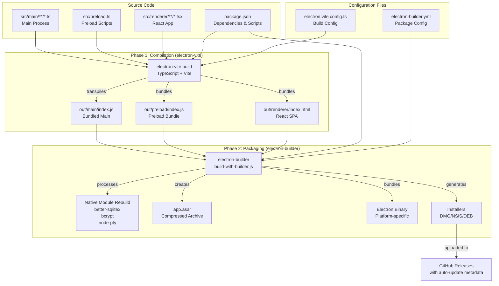
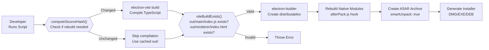
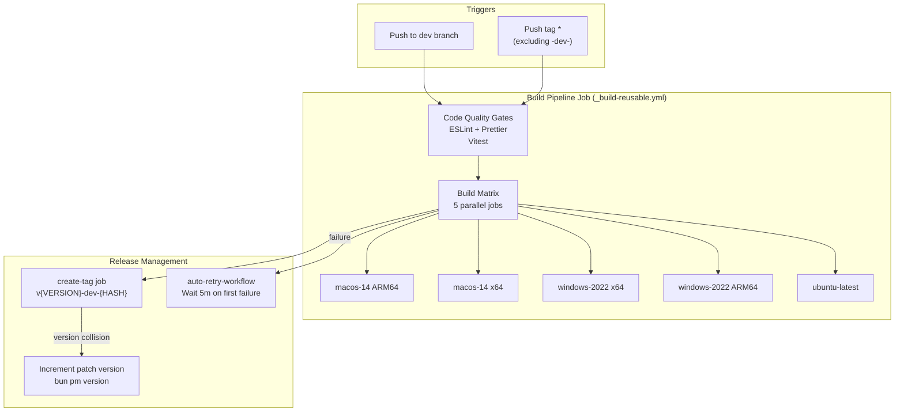

# Build & Deployment

Relevant source files

The following files were used as context for generating this wiki page:

- [.github/workflows/_build-reusable.yml](.github/workflows/_build-reusable.yml)
- [.github/workflows/build-and-release.yml](.github/workflows/build-and-release.yml)
- [.github/workflows/build-manual.yml](.github/workflows/build-manual.yml)
- [bun.lock](bun.lock)
- [electron-builder.yml](electron-builder.yml)
- [package.json](package.json)
- [scripts/README.md](scripts/README.md)
- [scripts/afterPack.js](scripts/afterPack.js)
- [scripts/afterSign.js](scripts/afterSign.js)
- [scripts/build-with-builder.js](scripts/build-with-builder.js)
- [scripts/create-mock-release-artifacts.sh](scripts/create-mock-release-artifacts.sh)
- [scripts/prepare-release-assets.sh](scripts/prepare-release-assets.sh)
- [scripts/rebuildNativeModules.js](scripts/rebuildNativeModules.js)
- [scripts/verify-release-assets.sh](scripts/verify-release-assets.sh)
- [src/index.ts](src/index.ts)
- [src/process/bridge/updateBridge.ts](src/process/bridge/updateBridge.ts)
- [src/process/services/autoUpdaterService.ts](src/process/services/autoUpdaterService.ts)
- [tests/integration/autoUpdate.integration.test.ts](tests/integration/autoUpdate.integration.test.ts)
- [tests/unit/autoUpdaterService.test.ts](tests/unit/autoUpdaterService.test.ts)

This document provides an overview of AionUi's build and deployment architecture, explaining how source code is compiled, packaged, and distributed across multiple platforms. The system uses `electron-vite` for TypeScript/React compilation and `electron-builder` for creating platform-specific installers.

For detailed information about specific aspects:
- CI/CD pipeline implementation: See [Build Pipeline](#11.1)
- Two-phase compilation process: See [Two-Phase Build Process](#11.2)
- Native module rebuild strategies: See [Native Module Handling](#11.3)
- Code signing and notarization: See [Code Signing & Notarization](#11.4)
- Release creation and tagging: See [Release Management](#11.5)
- Setting up local development: See [Development Environment](#11.6)

## Build Architecture

AionUi's build system separates concerns into two distinct phases: **compilation** (handled by `electron-vite`) and **packaging** (handled by `electron-builder`). This separation enables incremental builds, faster development iteration, and platform-specific optimizations.

### Build Toolchain

**Sources:** [package.json:11-25](), [electron-builder.yml:1-183](), [scripts/build-with-builder.js:1-11]()

### Build Scripts Overview

The `package.json` defines several build entry points. Most packaging commands wrap the `scripts/build-with-builder.js` orchestration script.

| Script | Command | Purpose |
|--------|---------|---------|
| `package` | `electron-vite build` | Compile source code only [package.json:21]() |
| `dist` | `node scripts/build-with-builder.js` | Full build (compile + package) [package.json:23]() |
| `dist:mac` | `node scripts/build-with-builder.js auto --mac` | macOS-only build [package.json:24]() |
| `dist:win` | `node scripts/build-with-builder.js auto --win` | Windows-only build [package.json:25]() |
| `dist:linux` | `node scripts/build-with-builder.js auto --linux` | Linux-only build [package.json:26]() |
| `build` | `node scripts/build-with-builder.js auto --mac --arm64 --x64` | macOS universal build [package.json:34]() |

**Sources:** [package.json:12-65]()

## Local Build Workflow

### Basic Build Process

The `build-with-builder.js` script manages the transition from source to distributable, including hash-based incremental logic.

**Sources:** [scripts/build-with-builder.js:46-87](), [scripts/build-with-builder.js:110-116](), [electron-builder.yml:11-12]()

### Incremental Build Optimization

The build script uses MD5 hashing to detect source changes and skip unnecessary recompilation.

**Hash Computation** includes:
- Configuration files: `package.json`, `bun.lock`, `tsconfig.json`, `electron.vite.config.ts`, `electron-builder.yml`.
- Source directories: `src/`, `public/`, `scripts/`.
- File metadata: size and modification time (`mtimeMs`).

The hash is stored in `out/.build-hash` and compared on subsequent builds. If unchanged and `out/main/index.js` exists, the Vite compilation step is skipped via `shouldSkipViteBuild`.

**Sources:** [scripts/build-with-builder.js:29-87](), [scripts/build-with-builder.js:118-132]()

## CI/CD Architecture

### GitHub Actions Workflow Structure

The project uses a sophisticated multi-stage pipeline defined in `build-and-release.yml` and `_build-reusable.yml`.

**Sources:** [.github/workflows/build-and-release.yml:9-33](), [.github/workflows/build-and-release.yml:36-90](), [.github/workflows/build-and-release.yml:92-182](), [.github/workflows/_build-reusable.yml:34-72]()

### Build Matrix Configuration

The workflow defines a 5-platform build matrix:

| Platform | OS Runner | Architecture | Command |
|----------|-----------|--------------|---------|
| `macos-arm64` | `macos-14` | `arm64` | `node scripts/build-with-builder.js arm64 --mac --arm64` |
| `macos-x64` | `macos-14` | `x64` | `node scripts/build-with-builder.js x64 --mac --x64` |
| `windows-x64` | `windows-2022` | `x64` | `node scripts/build-with-builder.js x64 --win --x64` |
| `windows-arm64` | `windows-2022` | `arm64` | `node scripts/build-with-builder.js arm64 --win --arm64` |
| `linux` | `ubuntu-latest` | `x64-arm64` | `bun run dist:linux` |

**Sources:** [.github/workflows/build-and-release.yml:25-32]()

## Platform-Specific Considerations

### macOS Builds

**DMG Creation Retry Logic:**
macOS builds include automatic retry for DMG creation failures, specifically addressing transient `hdiutil` errors on GitHub Actions runners. If the `.app` bundle exists but the `.dmg` is missing, the script detaches all mounted images via `cleanupDiskImages` and retries up to 3 times using `createDmgWithPrepackaged`.

**Sources:** [scripts/build-with-builder.js:20-27](), [scripts/build-with-builder.js:134-154](), [scripts/build-with-builder.js:221-225]()

**Code Signing & Notarization:**
macOS builds use `hardenedRuntime: true` and entitlements defined in `entitlements.plist`. The `afterSign.js` hook handles notarization using `notarytool`, with a fallback to ad-hoc signatures if formal signing fails or credentials are missing.

**Sources:** [electron-builder.yml:143-146](), [scripts/afterSign.js:18-48]()

### Windows Builds

**Native Module Rebuild:**
Windows builds require the MSVC toolchain. The `rebuildNativeModules.js` utility uses `vx --with msvc` to ensure the correct environment variables (like `VCINSTALLDIR`) are injected so `node-gyp` can locate the compiler without separate manual configuration.

**Sources:** [scripts/rebuildNativeModules.js:47-51](), [scripts/rebuildNativeModules.js:99-105]()

**Architecture Detection:**
NSIS installers for Windows are configured via `electron-builder.yml` to support custom icons and installation paths.

**Sources:** [electron-builder.yml:118-134]()

### Linux Builds

Linux builds target the `deb` format for both `x64` and `arm64`. They register a custom protocol handler for `aionui://` links and use `app.png` as the system icon.

**Sources:** [electron-builder.yml:170-188]()

## Native Module Configuration

### ASAR Unpacking

Several native modules and assets require unpacking from the ASAR archive to function correctly at runtime:

| Category | Modules/Paths | Reason |
|----------|---------------|--------|
| **Database** | `better-sqlite3` | Native binary loading [electron-builder.yml:194]() |
| **Auth** | `bcrypt` | Native binary loading [electron-builder.yml:195]() |
| **Terminal** | `node-pty` | Pseudo-terminal support [electron-builder.yml:196]() |
| **WASM** | `web-tree-sitter`, `tree-sitter-bash` | `fs.readFile` access needed [electron-builder.yml:209-210]() |
| **System** | `open`, `default-browser` | Windows ASAR compatibility [electron-builder.yml:203-207]() |

### Native Rebuild Strategy

The `afterPack.js` hook orchestrates the rebuilding of native modules. It detects cross-compilation (e.g., building x64 on an arm64 runner) and cleans up wrong-architecture artifacts from `app.asar.unpacked/node_modules` before rebuilding.

- **Windows**: Rebuilds `better-sqlite3` and injects Windows-specific env vars like `WindowsTargetPlatformVersion`.
- **macOS/Linux**: Rebuilds `better-sqlite3`. Linux uses prebuilt binaries where possible to avoid GLIBC dependencies.

**Sources:** [scripts/afterPack.js:17-47](), [scripts/rebuildNativeModules.js:71-82](), [scripts/rebuildNativeModules.js:99-104]()

## Update System

AionUi uses `electron-updater` for multi-platform updates. The `AutoUpdaterService` determines the correct update channel based on platform and architecture.

- **Windows ARM64**: Uses `latest-win-arm64` channel.
- **macOS ARM64**: Uses `latest-arm64` channel (maps to `latest-arm64-mac.yml`).
- **Standard**: Uses default `latest` channel (e.g., `latest-mac.yml` or `latest.yml`).

**Sources:** [src/process/services/autoUpdaterService.ts:17-41](), [src/process/services/autoUpdaterService.ts:85-90]()