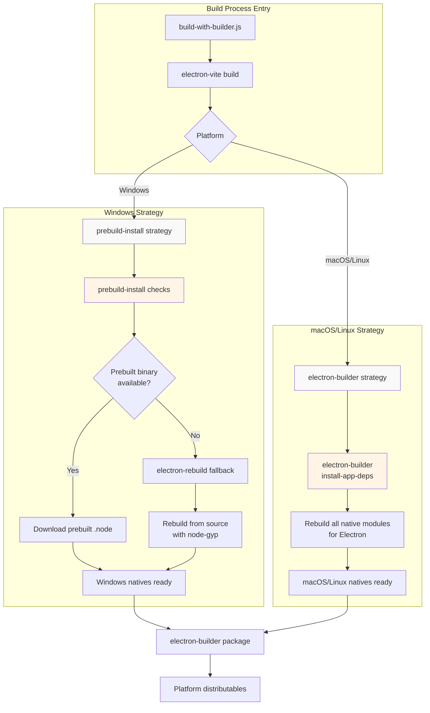
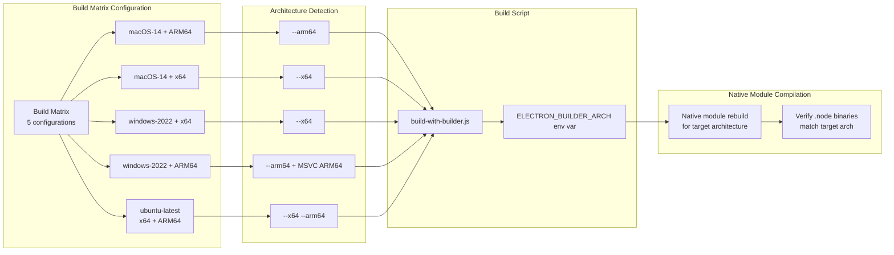
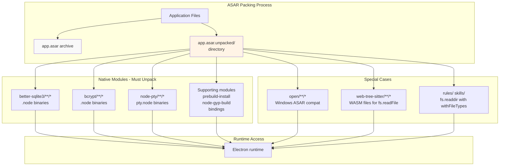
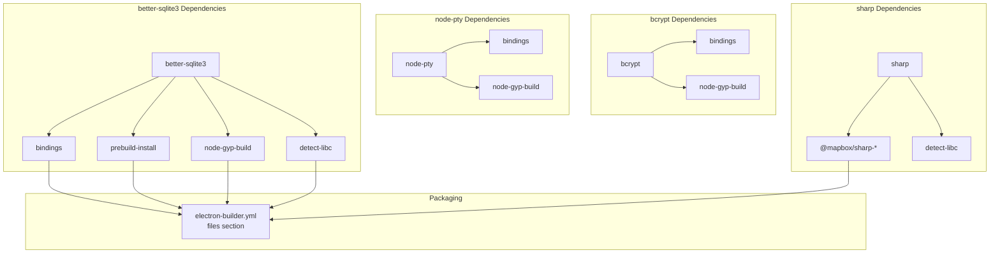
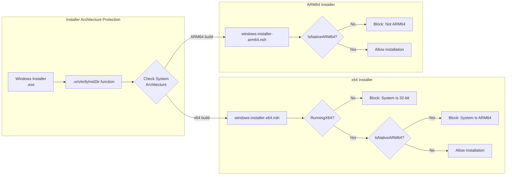

# Native Module Handling

<details>
<summary>Relevant source files</summary>

The following files were used as context for generating this wiki page:

- [.github/workflows/build-and-release.yml](.github/workflows/build-and-release.yml)
- [electron-builder.yml](electron-builder.yml)
- [package.json](package.json)
- [resources/windows-installer-arm64.nsh](resources/windows-installer-arm64.nsh)
- [resources/windows-installer-x64.nsh](resources/windows-installer-x64.nsh)
- [scripts/build-with-builder.js](scripts/build-with-builder.js)

</details>

This document explains how AionUi handles native Node.js modules (modules with C/C++ bindings) during the build and packaging process. It covers platform-specific rebuild strategies, ASAR unpacking requirements, and the configuration that ensures native modules work correctly in the packaged Electron application.

For information about the overall build pipeline and CI/CD workflow, see [Build Pipeline](#11.1). For details on the two-phase build process using electron-vite and electron-builder, see [Two-Phase Build Process](#11.2).

## Overview of Native Modules

AionUi uses several native modules that require compilation for the target platform and Electron version:

| Module              | Purpose                                   | Critical Path              |
| ------------------- | ----------------------------------------- | -------------------------- |
| `better-sqlite3`    | SQLite database for conversation history  | Must be unpacked from ASAR |
| `bcrypt`/`bcryptjs` | Password hashing for WebUI authentication | Must be unpacked from ASAR |
| `node-pty`          | Pseudo-terminal for MCP stdio connections | Must be unpacked from ASAR |
| `sharp`             | Image processing (via `@mapbox/sharp-*`)  | Optional dependency        |

These modules contain compiled `.node` binaries that must match both the target operating system/architecture and the Electron version used by AionUi.

**Sources:** [package.json:103-180](), [electron-builder.yml:29-36]()

## Platform-Specific Rebuild Strategies

AionUi employs different native module rebuild strategies based on the platform to optimize build times and reliability:



**Sources:** [scripts/build-with-builder.js:1-511](), [.github/workflows/build-and-release.yml:19-33]()

### Windows: prebuild-install with Fallback

Windows builds use a two-tier strategy to minimize compilation requirements:

1. **Primary: prebuild-install** - Attempts to download pre-compiled binaries from GitHub releases
   - Modules like `better-sqlite3` publish prebuilt `.node` files for common platforms
   - Fast and reliable when prebuilts are available
   - Configured via `node_modules/prebuild-install` in the dependency tree

2. **Fallback: electron-rebuild** - Compiles from source when prebuilts are unavailable
   - Requires MSVC toolchain (installed via windows-2022 runner)
   - Uses `node-gyp` to compile C++ addons
   - Configured via `electronRebuild` section in package.json

The fallback mechanism is implicit - if `prebuild-install` fails to find a compatible binary, the module's `postinstall` script triggers compilation.

**Sources:** [package.json:185-187](), [.github/workflows/build-and-release.yml:29-30]()

### macOS and Linux: electron-builder install-app-deps

macOS and Linux builds use `electron-builder`'s built-in native module handling:

1. **install-app-deps** command rebuilds all native modules for the target Electron version
2. Triggered automatically by `electron-builder` during the packaging phase
3. Handles cross-compilation (e.g., ARM64 builds on x64 macOS-14 runners)
4. Requires platform-specific toolchains (Xcode on macOS, build-essential on Linux)

This approach is more reliable for Unix-like platforms where native compilation is standardized.

**Sources:** [electron-builder.yml:177-179](), [.github/workflows/build-and-release.yml:27-28]()

### Architecture-Specific Builds

The build system supports cross-compilation for multiple architectures:



The `ELECTRON_BUILDER_ARCH` environment variable is set during the vite build phase to ensure native modules are compiled for the correct architecture.

**Sources:** [scripts/build-with-builder.js:328-361](), [scripts/build-with-builder.js:386-393](), [.github/workflows/build-and-release.yml:26-32]()

## ASAR Unpacking Requirements

Electron packages application files into an ASAR archive for integrity and performance. However, native modules cannot be loaded directly from within ASAR and must be unpacked to the filesystem.

### ASAR Configuration

The `electron-builder.yml` configuration specifies which modules must be unpacked:



**Key unpacking rules:**

1. **Native modules** - Cannot be loaded from ASAR due to dynamic loading requirements
2. **WASM files** - Must be unpacked for `fs.readFile` access (tree-sitter)
3. **Directory enumeration** - Directories scanned with `fs.readdir(..., {withFileTypes: true})` must be unpacked
4. **Platform-specific utilities** - The `open` library requires unpacking on Windows for executable spawning

**Sources:** [electron-builder.yml:181-203](), [electron-builder.yml:29-58]()

### File Configuration vs ASAR Unpacking

The `files` and `asarUnpack` sections work together:

```
files:                          # What gets packaged
  - node_modules/better-sqlite3/**/*
  - node_modules/bcrypt/**/*
  - node_modules/node-pty/**/*

asarUnpack:                    # What gets unpacked from ASAR
  - "**/node_modules/better-sqlite3/**/*"
  - "**/node_modules/bcrypt/**/*"
  - "**/node_modules/node-pty/**/*"
```

**Why both are needed:**

- `files` includes the module in the package
- `asarUnpack` extracts it to `app.asar.unpacked/` at package time
- Electron runtime resolves native modules from unpacked directory

**Sources:** [electron-builder.yml:18-98](), [electron-builder.yml:181-203]()

## Build Configuration Details

### package.json Configuration

```json
{
  "electronRebuild": {
    "electronVersion": "^37.3.1"
  }
}
```

This section ensures native modules are rebuilt against the correct Electron version when fallback compilation is needed.

**Sources:** [package.json:185-187]()

### electron-builder.yml Directives

```yaml
npmRebuild: false # Skip npm rebuild
buildDependenciesFromSource: false # Don't recompile all deps
nodeGypRebuild: false # Disable global node-gyp rebuild
```

These flags disable electron-builder's default rebuild behavior because:

- Windows uses `prebuild-install` strategy (handled by npm postinstall)
- macOS/Linux use explicit `install-app-deps` when needed
- Global rebuilds are inefficient and can cause issues with mixed architectures

**Sources:** [electron-builder.yml:177-179]()

### Compression Settings

The build script sets ASAR compression level based on environment:

```javascript
// CI: maximum compression (level 9) for smallest size
// Local: normal compression (level 7) for 30-50% faster builds
process.env.ELECTRON_BUILDER_COMPRESSION_LEVEL = isCI ? '9' : '7'
```

Native modules in `app.asar.unpacked/` are not compressed, ensuring optimal loading performance.

**Sources:** [scripts/build-with-builder.js:431-439]()

## Dependency Resolution

### Runtime Dependencies for Native Modules

Native modules require supporting packages to be included:



The `files` section in `electron-builder.yml` explicitly includes these support modules to ensure the native module loaders function correctly in the packaged application.

**Sources:** [electron-builder.yml:29-37]()

## Common Issues and Solutions

### Issue: Module Not Found After Packaging

**Symptom:** Native module loads in dev but fails in packaged app with `Cannot find module` error.

**Solution:** Ensure the module is listed in both `files` and `asarUnpack` sections of `electron-builder.yml`.

**Sources:** [electron-builder.yml:18-98](), [electron-builder.yml:181-203]()

### Issue: Wrong Architecture Binary

**Symptom:** Native module loads but crashes with architecture mismatch error.

**Solution:** Verify `ELECTRON_BUILDER_ARCH` is set correctly during build. Check build matrix configuration for cross-compilation requirements.

**Sources:** [scripts/build-with-builder.js:386-393](), [.github/workflows/build-and-release.yml:26-32]()

### Issue: Windows Build Fails with Compilation Errors

**Symptom:** Windows builds fail with "MSBuild not found" or "Python not found" errors.

**Solution:** Ensure MSVC toolchain and Python 3.11+ are installed (handled automatically by windows-2022 runner in CI). For ARM64 builds, verify MSVC ARM64 toolchain is installed.

**Sources:** [.github/workflows/build-and-release.yml:29-30]()

### Issue: macOS Notarization Fails Due to Unsigned Binaries

**Symptom:** macOS notarization rejects package due to unsigned `.node` files.

**Solution:** The `afterSign.js` script handles codesigning of native modules. Tree-sitter native binaries are explicitly excluded via electron-builder.yml to prevent signing conflicts.

**Sources:** [electron-builder.yml:56-64](), [electron-builder.yml:154]()

## Architecture Detection Scripts

For Windows installers, architecture-specific NSIS scripts prevent installation on incompatible systems:



These scripts are automatically included during single-architecture Windows builds via the `--config.nsis.include` flag.

**Sources:** [scripts/build-with-builder.js:460-481](), [resources/windows-installer-arm64.nsh:1-20](), [resources/windows-installer-x64.nsh:1-30]()

## Verification Steps

After packaging, verify native modules are correctly handled:

1. **Check unpacked directory exists:**

   ```
   out/mac-arm64/AionUi.app/Contents/Resources/app.asar.unpacked/
   ```

2. **Verify native binaries match target architecture:**

   ```bash
   file app.asar.unpacked/node_modules/better-sqlite3/build/Release/better_sqlite3.node
   ```

3. **Test module loading in packaged app:**
   - Launch packaged application
   - Create a conversation (tests better-sqlite3)
   - Enable WebUI mode (tests bcrypt)
   - Connect to MCP stdio server (tests node-pty)

**Sources:** [electron-builder.yml:181-203]()
