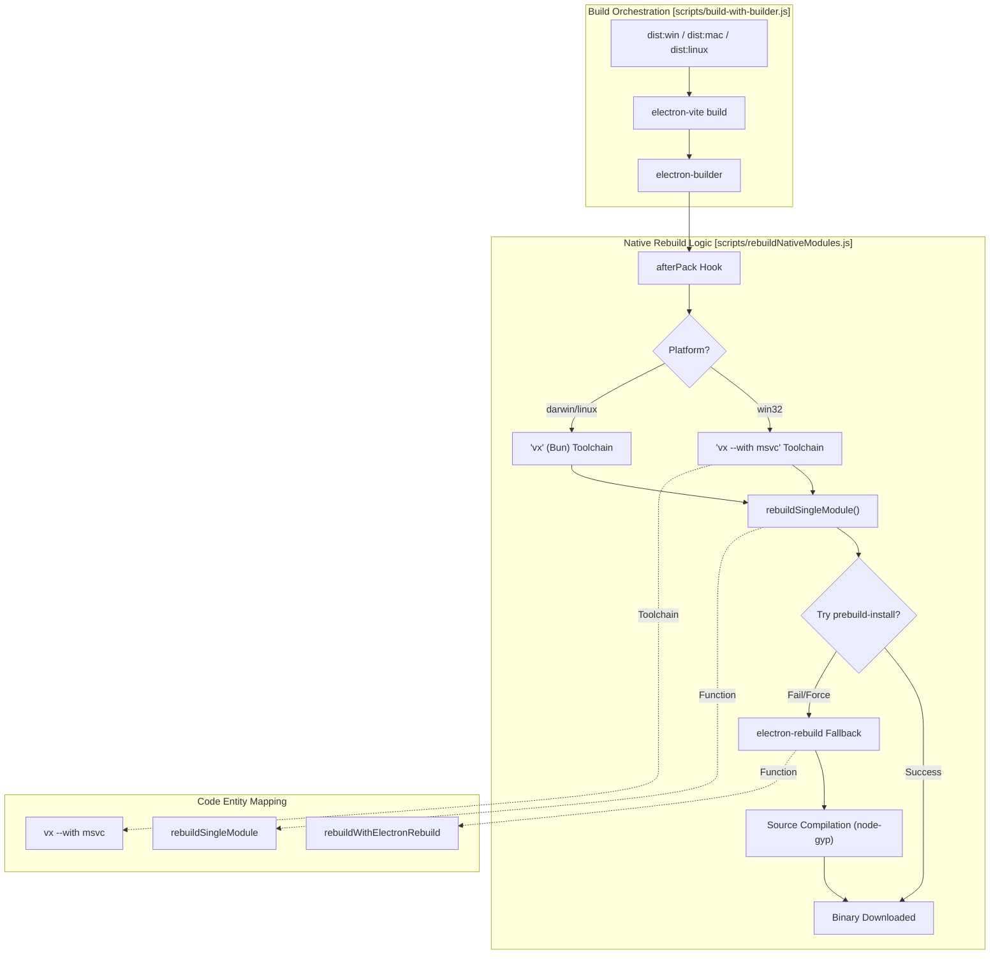
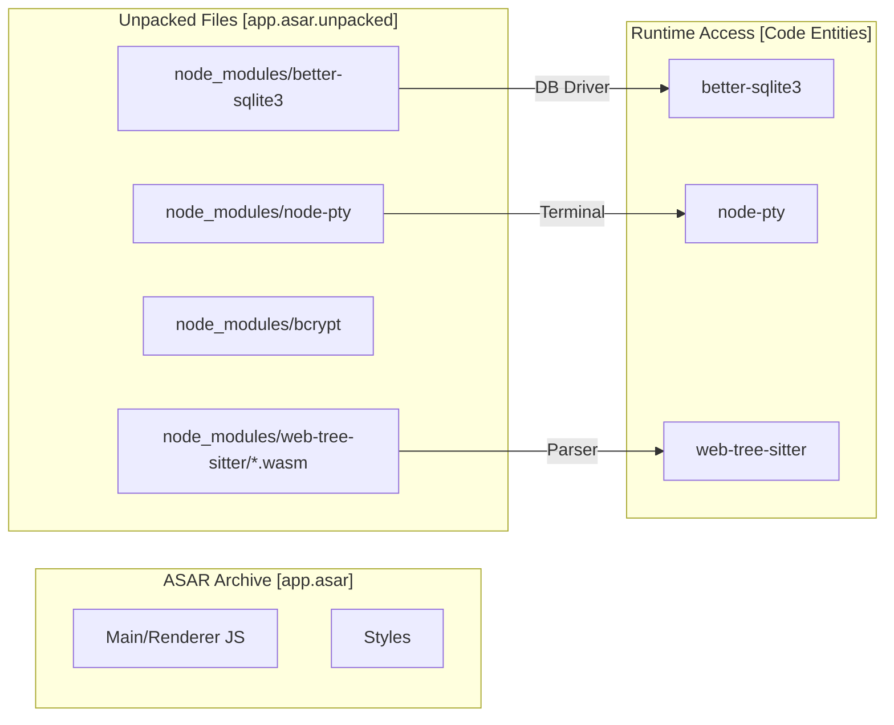

# Native Module Handling

Relevant source files

The following files were used as context for generating this wiki page:

- [.github/workflows/build-and-release.yml](.github/workflows/build-and-release.yml)
- [bun.lock](bun.lock)
- [electron-builder.yml](electron-builder.yml)
- [package.json](package.json)
- [scripts/README.md](scripts/README.md)
- [scripts/afterPack.js](scripts/afterPack.js)
- [scripts/afterSign.js](scripts/afterSign.js)
- [scripts/build-with-builder.js](scripts/build-with-builder.js)
- [scripts/rebuildNativeModules.js](scripts/rebuildNativeModules.js)
- [src/index.ts](src/index.ts)

This document explains how AionUi handles native Node.js modules (modules with C/C++ bindings) during the build and packaging process. It covers platform-specific rebuild strategies, ASAR unpacking requirements, and the configuration that ensures native modules work correctly in the packaged Electron application.

## Overview of Native Modules

AionUi relies on several native modules that require compilation for the target platform and Electron version. These modules contain compiled `.node` binaries that must match the target operating system, architecture, and Electron ABI version [scripts/afterPack.js:27-28]().

| Module | Purpose | ASAR Status |
|--------|---------|---------------|
| `better-sqlite3` | SQLite database for conversation history [package.json:91]() | **Unpacked** |
| `bcryptjs` | Password hashing for WebUI authentication [package.json:90]() | **Unpacked** |
| `node-pty` | Pseudo-terminal for MCP stdio connections [electron-builder.yml:29]() | **Unpacked** |
| `sharp` | High-performance image processing [package.json:137]() | **Unpacked** |

**Sources:** [package.json:90-137](), [electron-builder.yml:27-34](), [electron-builder.yml:189-192]()

## Platform-Specific Rebuild Strategies

AionUi employs a multi-stage rebuild strategy coordinated by `scripts/rebuildNativeModules.js`. This utility provides a unified interface for both development-time and post-packaging rebuilds [scripts/rebuildNativeModules.js:1-10]().

### Build Pipeline Logic

The following diagram illustrates how the build system selects the appropriate toolchain and rebuild method based on the target platform.

**Diagram: Native Module Build Flow**

**Sources:** [scripts/build-with-builder.js:23-34](), [scripts/rebuildNativeModules.js:43-53](), [scripts/rebuildNativeModules.js:174-210]()

### Rebuild Implementation Details

1.  **Windows (MSVC Integration):** Windows builds use the `vx --with msvc` command prefix. This ensures that `VCINSTALLDIR` and related environment variables are injected so `node-gyp` can locate the MSVC compiler without external dependencies [scripts/rebuildNativeModules.js:47-50]().
2.  **Linux (Cross-Architecture):** For Linux cross-compilation (e.g., x64 to ARM64), the system **always** uses `prebuild-install` because `electron-rebuild` cannot reliably cross-compile without a full ARM64 toolchain on the host [scripts/rebuildNativeModules.js:198-202]().
3.  **macOS:** Supports cross-compilation between x64 and arm64 using standard Xcode tools [scripts/rebuildNativeModules.js:145-148]().

**Sources:** [scripts/rebuildNativeModules.js:43-53](), [scripts/rebuildNativeModules.js:142-158](), [scripts/afterPack.js:17-47]()

## ASAR Unpacking and File Rules

Electron's ASAR format is a read-only archive. Native modules (`.node` files) and certain assets cannot be executed or read via standard system calls if they are inside the archive. AionUi uses `smartUnpack` and explicit `asarUnpack` rules to handle this [electron-builder.yml:11-12]().

### ASAR Unpacking Strategy

**Diagram: ASAR Entity Mapping**

**Sources:** [electron-builder.yml:193-210]()

### Key Unpacking Rules
*   **Native Binaries:** `better-sqlite3`, `bcrypt`, and `node-pty` are explicitly unpacked to allow the OS to load the dynamic libraries [electron-builder.yml:194-196]().
*   **Tree-sitter WASM:** Files for `web-tree-sitter` and `tree-sitter-bash` must be unpacked because they require `fs.readFile` access, which is more reliable when the files are outside the ASAR virtual filesystem [electron-builder.yml:209-210]().
*   **Platform Dependencies:** Runtime utilities like `prebuild-install` and `node-gyp-build` are also unpacked to support the native module loading sequence [electron-builder.yml:199-200]().

**Sources:** [electron-builder.yml:193-212]()

## Cross-Architecture Cleanup

During the `afterPack` phase, AionUi performs a cleanup to ensure no "poisoned" binaries (binaries from the wrong architecture) remain in the package. This is critical for macOS and Linux cross-builds [scripts/afterPack.js:103-106]().

1.  **Artifact Removal:** The script deletes `build/` and `bin/` directories for native modules before rebuilding to prevent `node-gyp-build` from loading stale, incorrect binaries [scripts/afterPack.js:111-124]().
2.  **Optional Dependency Pruning:** It identifies and removes packages with the "wrong" architecture suffix (e.g., removing `*-x64` packages when building for `arm64`) [scripts/afterPack.js:128-144]().
3.  **Scoped Package Handling:** It recursively checks scoped packages (like `@napi-rs/*`) to prune architecture-specific optional dependencies that were pulled in by the package manager [scripts/afterPack.js:137-148]().

**Sources:** [scripts/afterPack.js:103-161]()

## Summary of Rebuild Commands

| Target Platform | Command Logic | Fallback |
| :--- | :--- | :--- |
| **Windows** | `vx --with msvc bun x electron-rebuild` [scripts/rebuildNativeModules.js:50]() | Source compile with MSVC 2022 [scripts/rebuildNativeModules.js:100]() |
| **macOS** | `vx bun x electron-rebuild` [scripts/rebuildNativeModules.js:52]() | Prebuild-install download [scripts/rebuildNativeModules.js:220]() |
| **Linux** | `prebuild-install` (Mandatory for cross-arch) [scripts/rebuildNativeModules.js:200]() | Local `node-gyp` (Same-arch only) [scripts/rebuildNativeModules.js:157]() |

**Sources:** [scripts/rebuildNativeModules.js:43-53](), [scripts/rebuildNativeModules.js:129-139](), [scripts/rebuildNativeModules.js:198-202]()