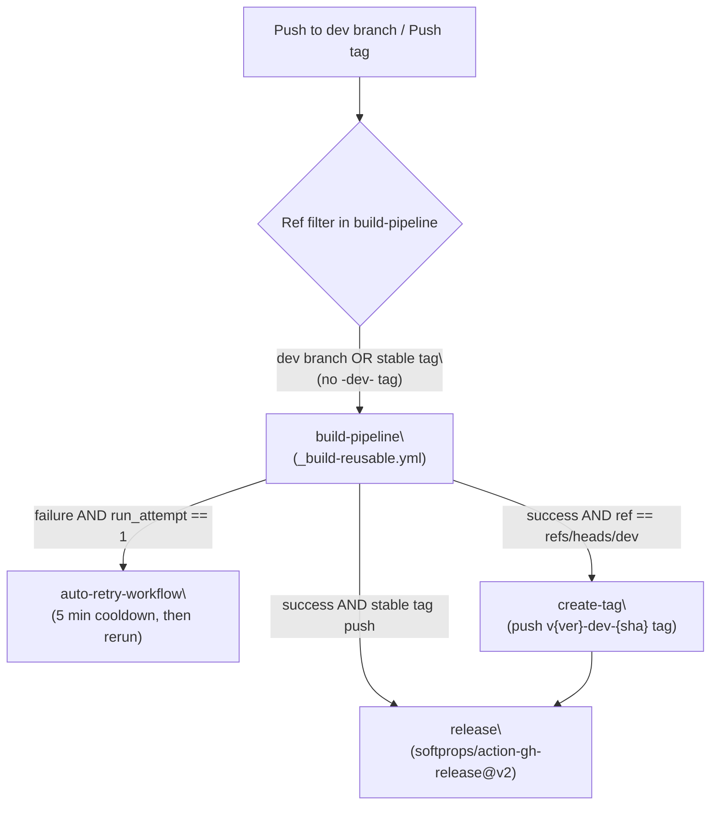
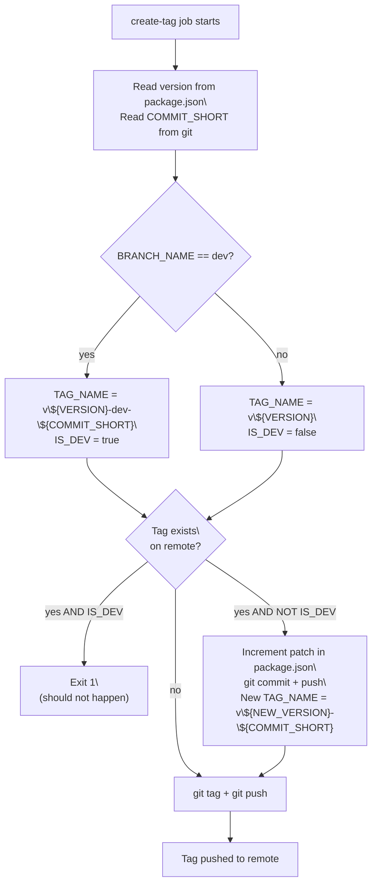
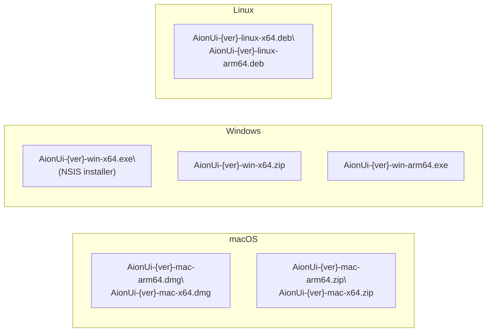
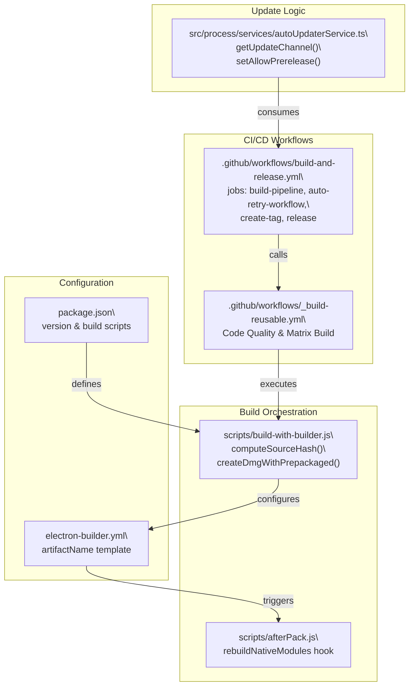

# Release Management

Relevant source files

The following files were used as context for generating this wiki page:

- [.gemini/config.json](.gemini/config.json)
- [.gemini/styleguide.md](.gemini/styleguide.md)
- [.github/workflows/_build-reusable.yml](.github/workflows/_build-reusable.yml)
- [.github/workflows/build-and-release.yml](.github/workflows/build-and-release.yml)
- [.github/workflows/build-manual.yml](.github/workflows/build-manual.yml)
- [.github/workflows/bump-homebrew.yml](.github/workflows/bump-homebrew.yml)
- [.github/workflows/project-automation.yml](.github/workflows/project-automation.yml)
- [bun.lock](bun.lock)
- [electron-builder.yml](electron-builder.yml)
- [homebrew/aionui.rb.example](homebrew/aionui.rb.example)
- [package.json](package.json)
- [scripts/README.md](scripts/README.md)
- [scripts/afterPack.js](scripts/afterPack.js)
- [scripts/afterSign.js](scripts/afterSign.js)
- [scripts/build-with-builder.js](scripts/build-with-builder.js)
- [scripts/create-mock-release-artifacts.sh](scripts/create-mock-release-artifacts.sh)
- [scripts/prepare-release-assets.sh](scripts/prepare-release-assets.sh)
- [scripts/rebuildNativeModules.js](scripts/rebuildNativeModules.js)
- [scripts/verify-release-assets.sh](scripts/verify-release-assets.sh)
- [src/index.ts](src/index.ts)
- [src/process/bridge/updateBridge.ts](src/process/bridge/updateBridge.ts)
- [src/process/services/autoUpdaterService.ts](src/process/services/autoUpdaterService.ts)
- [tests/integration/autoUpdate.integration.test.ts](tests/integration/autoUpdate.integration.test.ts)
- [tests/unit/autoUpdaterService.test.ts](tests/unit/autoUpdaterService.test.ts)

This page documents how AionUi produces and publishes versioned releases: the GitHub Actions workflow jobs, auto-tagging logic on the `dev` branch, the auto-retry mechanism for transient CI failures, and the artifact naming conventions used across all platforms.

For the underlying two-phase build process (electron-vite + electron-builder), see [11.2](). For native module compilation that happens during builds, see [11.3](). For code signing and notarization, see [11.4](). For the in-app update check and download system, see [16]().

---

## Workflow Overview

Release automation is driven by `.github/workflows/build-and-release.yml`. It consists of four jobs with explicit dependency chains:

| Job | File | Condition |
|---|---|---|
| `build-pipeline` | delegates to `_build-reusable.yml` | `dev` branch push OR stable tag push (excludes `-dev-` tags) |
| `auto-retry-workflow` | inline steps | `build-pipeline` failed AND `github.run_attempt == 1` |
| `create-tag` | inline steps | `build-pipeline` succeeded AND ref is `dev` branch |
| `release` | `softprops/action-gh-release@v2` | `build-pipeline` succeeded AND (`create-tag` succeeded OR stable tag push) |

**Release Pipeline Job Dependencies**

Sources: [.github/workflows/build-and-release.yml:18-44](), [.github/workflows/build-and-release.yml:92-96]()

---

## Build Matrix

The `build-pipeline` job passes a JSON matrix to `_build-reusable.yml`. Each matrix entry specifies the runner OS, the build command, the artifact directory name, and the target architecture.

| `platform` | `os` | `arch` | `command` | `artifact-name` |
|---|---|---|---|---|
| `macos-arm64` | `macos-14` | `arm64` | `node scripts/build-with-builder.js arm64 --mac --arm64` | `macos-build-arm64` |
| `macos-x64` | `macos-14` | `x64` | `node scripts/build-with-builder.js x64 --mac --x64` | `macos-build-x64` |
| `windows-x64` | `windows-2022` | `x64` | `node scripts/build-with-builder.js x64 --win --x64` | `windows-build-x64` |
| `windows-arm64` | `windows-2022` | `arm64` | `node scripts/build-with-builder.js arm64 --win --arm64` | `windows-build-arm64` |
| `linux` | `ubuntu-latest` | `x64-arm64` | `bun run dist:linux` | `linux-build` |

Sources: [.github/workflows/build-and-release.yml:25-32]()

---

## Auto-Tagging Logic

When a push to the `dev` branch triggers a successful build, the `create-tag` job computes and pushes a tag automatically.

**Tag format for `dev` branch:**
`v{version}-dev-{commit_short}` (e.g., `v1.9.11-dev-abc1234`)

**Tag format for stable branches:**
`v{version}` (e.g., `v1.9.11`)

The version string is read directly from `package.json` [package.json:3]().

### Collision Handling and Version Bumping
If the computed tag already exists on the remote:
- **Dev branch**: The job exits with an error [/.github/workflows/build-and-release.yml:178-181]().
- **Other branches**: The patch segment of `package.json#version` is auto-incremented via `bun pm version` [/.github/workflows/build-and-release.yml:154](). The workflow then configures a git bot user, commits the change, and pushes back to the branch [/.github/workflows/build-and-release.yml:157-164](). Finally, a new tag is created using the incremented version and the latest commit ID [/.github/workflows/build-and-release.yml:167-171]().

**Auto-Tagging Decision Flow**

Sources: [.github/workflows/build-and-release.yml:117-197]()

---

## Auto-Retry Mechanism

The `auto-retry-workflow` job guards against transient CI failures, such as network timeouts or the specific macOS `hdiutil` "Device not configured" error [scripts/build-with-builder.js:24-25]().

**Conditions for triggering:**
- `needs.build-pipeline` result is `failure()` [/.github/workflows/build-and-release.yml:42]().
- `github.run_attempt == 1` — ensures the retry only happens once to avoid infinite loops [/.github/workflows/build-and-release.yml:43]().

**Retry Procedure:**
1. Log current attempt number [/.github/workflows/build-and-release.yml:53]().
2. Execute a 5-minute (300s) cooldown period [/.github/workflows/build-and-release.yml:61]().
3. Call the GitHub API `/rerun` endpoint to trigger a full workflow restart [/.github/workflows/build-and-release.yml:70-74]().

Sources: [.github/workflows/build-and-release.yml:36-90]()

---

## Release Creation and Metadata

The `release` job runs after `build-pipeline` succeeds. It generates the final GitHub Release object and attaches the build artifacts.

**Release Properties:**

| Property | Value |
|---|---|
| `tag_name` | Computed tag (e.g., `v1.9.11-dev-abc1234`) |
| `name` | `"Development Build {tag}"` for dev; `"{tag}"` for stable |
| `draft` | `true` (Always created as draft for manual review) |
| `prerelease` | `true` when `is_dev == true` or tag contains `beta/alpha/rc` |

### Auto-Update Metadata
Release management also involves generating the `.yml` metadata files used by `electron-updater`.
- **Channel Resolution**: `getUpdateChannel()` determines the channel based on platform and arch (e.g., `latest-win-arm64` or `latest-arm64` for macOS) [src/process/services/autoUpdaterService.ts:17-41]().
- **Prerelease Support**: The `AutoUpdaterService` can be configured via `setAllowPrerelease(true)` to track dev updates, although actual filtering is performed manually via GitHub API to avoid conflicts with custom channel names [src/process/services/autoUpdaterService.ts:170-179]().

**Artifact Naming and Format**

Artifact names are standardized in `electron-builder.yml` using the template `${productName}-${version}-${os}-${arch}.${ext}` [electron-builder.yml:124]().

Sources: [electron-builder.yml:118-175](), [.github/workflows/build-and-release.yml:218-256](), [src/process/services/autoUpdaterService.ts:13-55]()

---

## Workflow-to-Code Entity Map

This diagram maps the release infrastructure components to their implementation files and key functions.

Sources: [.github/workflows/build-and-release.yml:1-256](), [.github/workflows/_build-reusable.yml:1-110](), [scripts/build-with-builder.js:1-100](), [src/process/services/autoUpdaterService.ts:1-90](), [electron-builder.yml:1-124]()