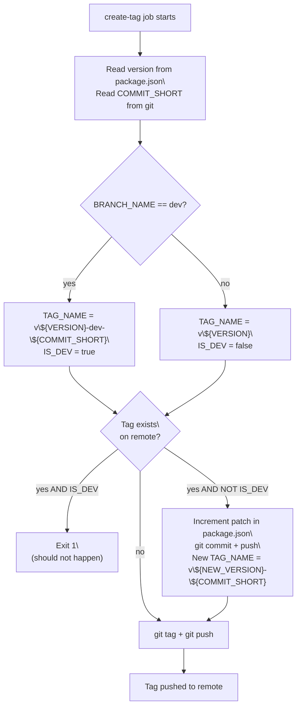
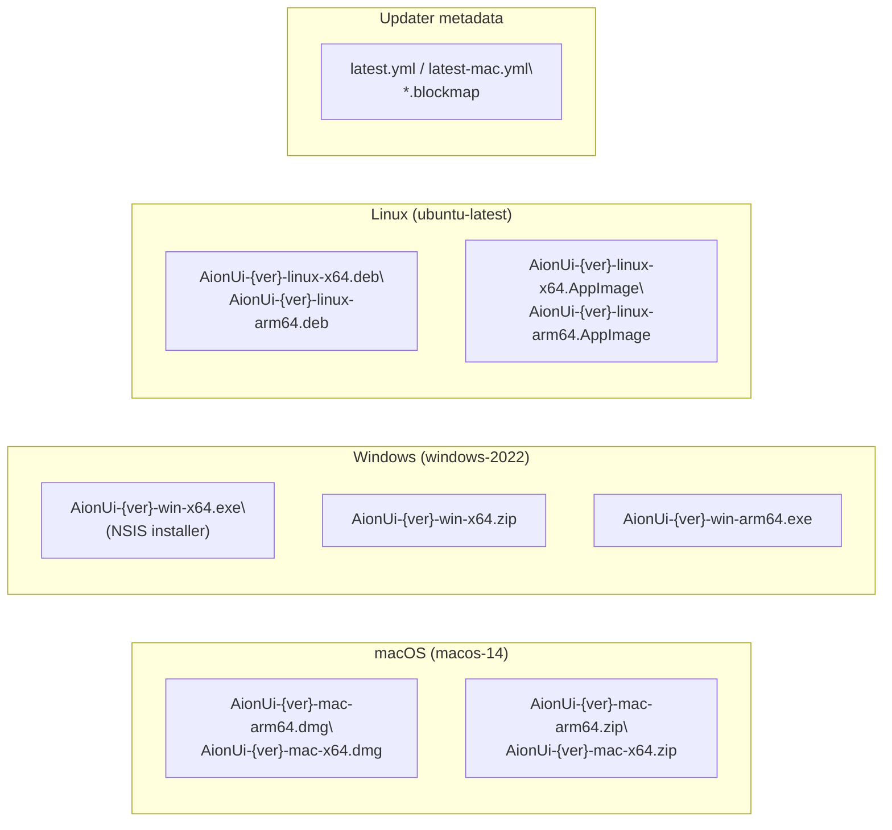
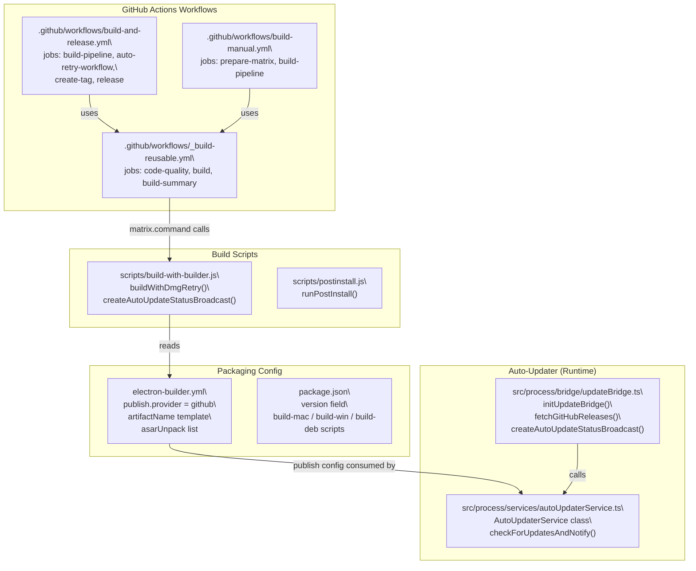

# Release Management

<details>
<summary>Relevant source files</summary>

The following files were used as context for generating this wiki page:

- [.github/workflows/build-and-release.yml](.github/workflows/build-and-release.yml)
- [electron-builder.yml](electron-builder.yml)
- [package.json](package.json)
- [resources/windows-installer-arm64.nsh](resources/windows-installer-arm64.nsh)
- [resources/windows-installer-x64.nsh](resources/windows-installer-x64.nsh)
- [scripts/build-with-builder.js](scripts/build-with-builder.js)

</details>

This page documents how AionUi produces and publishes versioned releases: the GitHub Actions workflow jobs, auto-tagging logic on the `dev` branch, the auto-retry mechanism for transient CI failures, and the artifact naming conventions used across all platforms.

For the underlying two-phase build process (electron-vite + electron-builder), see [11.2](#11.2). For native module compilation that happens during builds, see [11.3](#11.3). For code signing and notarization, see [11.4](#11.4). For the in-app update check and download system, see [14](#14).

---

## Workflow Overview

Release automation is driven by `.github/workflows/build-and-release.yml`. It consists of four jobs with explicit dependency chains:

| Job                   | File                               | Condition                                                                  |
| --------------------- | ---------------------------------- | -------------------------------------------------------------------------- |
| `build-pipeline`      | delegates to `_build-reusable.yml` | `dev` branch push OR stable tag push (excludes `-dev-` tags)               |
| `auto-retry-workflow` | inline steps                       | `build-pipeline` failed AND `github.run_attempt == 1`                      |
| `create-tag`          | inline steps                       | `build-pipeline` succeeded AND ref is `dev` branch                         |
| `release`             | `softprops/action-gh-release@v2`   | `build-pipeline` succeeded AND (`create-tag` succeeded OR stable tag push) |

**Release Pipeline Job Dependencies**


Sources: [.github/workflows/build-and-release.yml:18-55]()

---

## Build Matrix

The `build-pipeline` job passes a JSON matrix to `_build-reusable.yml`. Each matrix entry specifies the runner OS, the build command, the artifact directory name, and the target architecture.

| `platform`      | `os`            | `arch`      | `command`                                                | `artifact-name`       |
| --------------- | --------------- | ----------- | -------------------------------------------------------- | --------------------- |
| `macos-arm64`   | `macos-14`      | `arm64`     | `node scripts/build-with-builder.js arm64 --mac --arm64` | `macos-build-arm64`   |
| `macos-x64`     | `macos-14`      | `x64`       | `node scripts/build-with-builder.js x64 --mac --x64`     | `macos-build-x64`     |
| `windows-x64`   | `windows-2022`  | `x64`       | `node scripts/build-with-builder.js x64 --win --x64`     | `windows-build-x64`   |
| `windows-arm64` | `windows-2022`  | `arm64`     | `node scripts/build-with-builder.js arm64 --win --arm64` | `windows-build-arm64` |
| `linux`         | `ubuntu-latest` | `x64,arm64` | `bun run dist:linux`                                     | `linux-build`         |

The reusable workflow runs a `code-quality` job first (ESLint, Prettier, TypeScript type check, Vitest) and gates the build matrix on its result unless `skip_code_quality` is true.

Sources: [.github/workflows/build-and-release.yml:25-33](), [.github/workflows/\_build-reusable.yml:26-70]()

---

## Auto-Tagging on `dev` Branch

When a push to the `dev` branch triggers a successful build, the `create-tag` job computes and pushes a tag automatically.

**Tag format for `dev` branch:**

```
v{version}-dev-{commit_short}
```

Example: `v1.8.18-dev-abc1234`

**Tag format for stable (non-`dev`) branches:**

```
v{version}
```

Example: `v1.8.18`

The version string is read directly from `package.json`:

```
VERSION=$(node -p "require('./package.json').version")
COMMIT_SHORT=$(git rev-parse --short HEAD)
```

**Collision handling**: If the computed tag already exists on the remote:

- **Dev branch**: The job exits with an error (this should not happen since commit hashes are unique).
- **Other branches**: The patch segment of `package.json#version` is auto-incremented, the change is committed and pushed, and a new tag is created with the incremented version.

**Auto-Tagging Decision Flow**



Sources: [.github/workflows/build-and-release.yml:93-197]()

---

## Auto-Retry on Build Failure

The `auto-retry-workflow` job guards against transient CI failures (network issues, flaky runners, `hdiutil` errors on macOS, etc.).

**Conditions for triggering:**

- `needs.build-pipeline` result is `failure`
- `github.run_attempt == 1` — prevents infinite retry loops
- Trigger event is `push` or `schedule`

**Retry steps:**

1. Log current attempt number and strategy.
2. Sleep 300 seconds (5-minute cooldown).
3. Call `POST /repos/{owner}/{repo}/actions/runs/{run_id}/rerun` via the GitHub API (full rerun, not just failed jobs).

The full-rerun API call (`/rerun` rather than `/rerun-failed-jobs`) is intentional: it re-executes all jobs so that the second attempt starts from a clean state.

Sources: [.github/workflows/build-and-release.yml:37-92](), [12.2](#12.2)

---

## GitHub Release Creation

The `release` job runs after `build-pipeline` and (`create-tag` or a stable tag push). It is blocked from running for `-dev-` tags pushed directly (to avoid double-publishing).

**Environment gating:**

- Dev builds use the `dev-release` GitHub Environment.
- Stable releases use the `release` GitHub Environment.

This allows environment-level approval gates or deployment protection rules to be configured in the repository settings for stable releases.

**Steps in the `release` job:**

1. Determine `tag_name` and `is_dev` from either `create-tag` outputs or the triggering tag ref.
2. Download all artifacts from the `build-pipeline` matrix using `actions/download-artifact@v7` into `build-artifacts/`.
3. Call `softprops/action-gh-release@v2` to create the GitHub Release.

**Release properties set:**

| Property                 | Value                                                                 |
| ------------------------ | --------------------------------------------------------------------- |
| `tag_name`               | Computed tag (e.g., `v1.8.18-dev-abc1234`)                            |
| `name`                   | `"Development Build {tag}"` for dev; `"{tag}"` for stable             |
| `generate_release_notes` | `true` (GitHub auto-generates from PRs/commits)                       |
| `draft`                  | `true` (always created as draft)                                      |
| `prerelease`             | `true` when `is_dev == true` OR tag contains `beta`, `alpha`, or `rc` |

> Releases are always created as drafts. A maintainer must manually publish them.

**Artifact glob patterns uploaded:**

```
build-artifacts/**/*.exe
build-artifacts/**/*.msi
build-artifacts/**/*.dmg
build-artifacts/**/*.deb
build-artifacts/**/*.AppImage
build-artifacts/**/*.zip
build-artifacts/**/*.yml
build-artifacts/**/*.blockmap
```

The `.yml` and `.blockmap` files are metadata consumed by `electron-updater` for delta update calculations.

Sources: [.github/workflows/build-and-release.yml:199-256]()

---

## Artifact Naming Conventions

The artifact file names are set in `electron-builder.yml` using the `artifactName` template variable `${productName}-${version}-${os}-${arch}.${ext}`.

**Artifact Naming and Format**



**Per-platform format details:**

| Platform | Formats               | Notes                                                          |
| -------- | --------------------- | -------------------------------------------------------------- |
| macOS    | `.dmg`, `.zip`        | `UDZO` format DMG; signed + notarized when credentials present |
| Windows  | `.exe` (NSIS), `.zip` | NSIS: one-click off, supports custom install dir               |
| Linux    | `.deb`, `.AppImage`   | Both x64 and arm64 produced on single runner                   |

The `publish` section of `electron-builder.yml` is set to `provider: github` with `owner: iOfficeAI` and `repo: AionUi`, but `build-with-builder.js` always passes `--publish=never` to `electron-builder` to prevent implicit publishing. All publishing is done explicitly by the `release` job.

Sources: [electron-builder.yml:99-170](), [electron-builder.yml:206-211](), [scripts/build-with-builder.js:344-344]()

---

## Manual Build Workflow

`.github/workflows/build-manual.yml` provides a `workflow_dispatch` trigger for ad-hoc builds from any branch. It accepts:

| Input               | Description                                                                       | Default       |
| ------------------- | --------------------------------------------------------------------------------- | ------------- |
| `branch`            | Branch to build from                                                              | `main`        |
| `platform`          | One of `macos-arm64`, `macos-x64`, `windows-x64`, `windows-arm64`, `linux`, `all` | `macos-arm64` |
| `skip_code_quality` | Skip ESLint/Prettier/TSC/Vitest                                                   | `false`       |

A `prepare-matrix` job converts the platform choice to a JSON matrix, then delegates to the same `_build-reusable.yml` reusable workflow. When `append_commit_hash: true` is passed, artifact names are suffixed with the short commit hash.

Manual builds do not trigger the `create-tag` or `release` jobs; they only produce workflow artifacts retained for 7 days.

Sources: [.github/workflows/build-manual.yml:1-83]()

---

## Key Secrets Required

The following repository secrets must be configured for the full release pipeline to function:

| Secret                     | Purpose                                                        |
| -------------------------- | -------------------------------------------------------------- |
| `GH_TOKEN`                 | Push tags, create GitHub Releases (requires `contents: write`) |
| `BUILD_CERTIFICATE_BASE64` | macOS `.p12` signing certificate (base64-encoded)              |
| `P12_PASSWORD`             | Password for the `.p12` certificate                            |
| `KEYCHAIN_PASSWORD`        | Temporary keychain password for macOS CI runner                |
| `APPLE_ID`                 | Apple ID for notarization                                      |
| `APPLE_ID_PASSWORD`        | App-specific password for notarization                         |
| `TEAM_ID`                  | Apple Developer Team ID                                        |
| `IDENTITY`                 | macOS signing identity string (`CSC_NAME`)                     |
| `APP_ID`                   | Application bundle ID                                          |

Sources: [.github/workflows/\_build-reusable.yml:175-205](), [.github/workflows/\_build-reusable.yml:309-339]()

---

## Workflow-to-Code Entity Map

**Release workflow components and their code locations**



Sources: [.github/workflows/build-and-release.yml:1-256](), [.github/workflows/\_build-reusable.yml:1-549](), [scripts/build-with-builder.js:1-377](), [electron-builder.yml:206-211](), [src/process/services/autoUpdaterService.ts:34-275](), [src/process/bridge/updateBridge.ts:378-508]()
