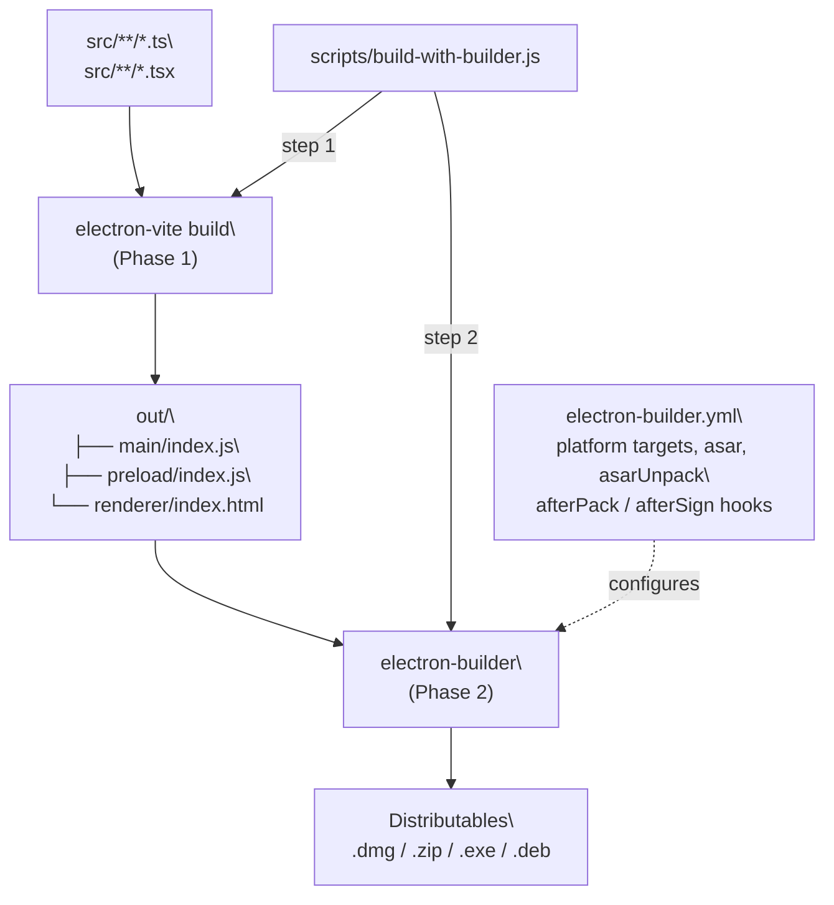
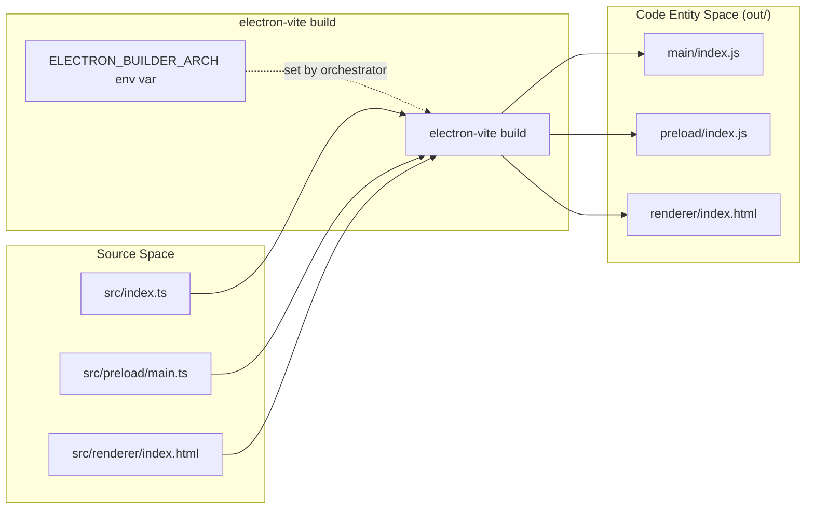
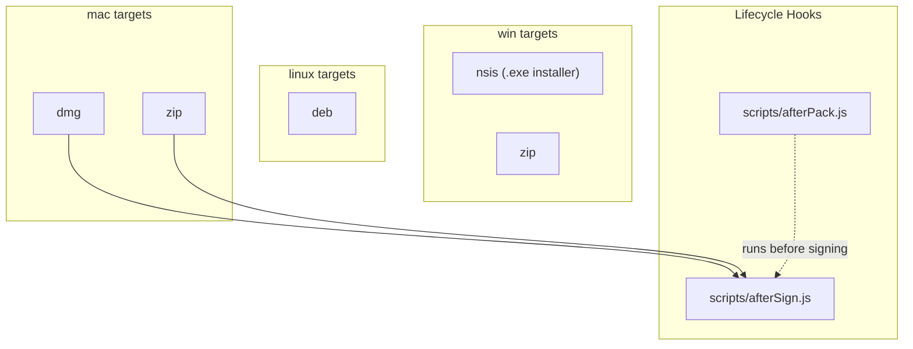
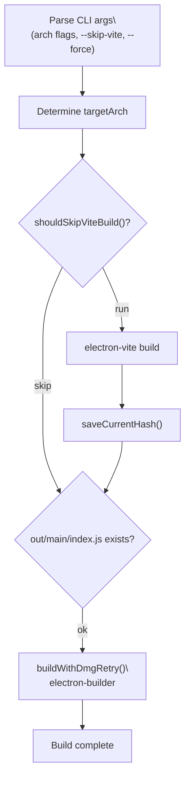
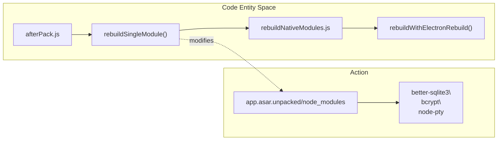

# Two-Phase Build Process

<details>
<summary>Relevant source files</summary>

The following files were used as context for generating this wiki page:

- [.github/workflows/build-and-release.yml](.github/workflows/build-and-release.yml)
- [Dockerfile](Dockerfile)
- [bun.lock](bun.lock)
- [electron-builder.yml](electron-builder.yml)
- [electron.vite.config.ts](electron.vite.config.ts)
- [package.json](package.json)
- [scripts/README.md](scripts/README.md)
- [scripts/afterPack.js](scripts/afterPack.js)
- [scripts/afterSign.js](scripts/afterSign.js)
- [scripts/build-mcp-servers.js](scripts/build-mcp-servers.js)
- [scripts/build-with-builder.js](scripts/build-with-builder.js)
- [scripts/rebuildNativeModules.js](scripts/rebuildNativeModules.js)
- [src/common/config/constants.ts](src/common/config/constants.ts)
- [src/index.ts](src/index.ts)
- [src/process/resources/teamMcp/teamMcpStdio.ts](src/process/resources/teamMcp/teamMcpStdio.ts)
- [src/renderer/components/layout/Layout.tsx](src/renderer/components/layout/Layout.tsx)
- [src/renderer/components/layout/Router.tsx](src/renderer/components/layout/Router.tsx)
- [src/renderer/components/layout/Sider/SiderItem.tsx](src/renderer/components/layout/Sider/SiderItem.tsx)
- [src/renderer/components/layout/Sider/SiderScheduledEntry.tsx](src/renderer/components/layout/Sider/SiderScheduledEntry.tsx)
- [src/renderer/components/layout/Sider/index.tsx](src/renderer/components/layout/Sider/index.tsx)
- [src/renderer/components/layout/Titlebar/index.tsx](src/renderer/components/layout/Titlebar/index.tsx)
- [src/renderer/pages/conversation/GroupedHistory/ConversationRow.tsx](src/renderer/pages/conversation/GroupedHistory/ConversationRow.tsx)
- [src/renderer/pages/conversation/GroupedHistory/ConversationSearchPopover.tsx](src/renderer/pages/conversation/GroupedHistory/ConversationSearchPopover.tsx)
- [src/renderer/pages/conversation/Preview/components/renderers/SelectionToolbar.tsx](src/renderer/pages/conversation/Preview/components/renderers/SelectionToolbar.tsx)
- [src/renderer/pages/conversation/components/WorkspaceCollapse.tsx](src/renderer/pages/conversation/components/WorkspaceCollapse.tsx)
- [src/renderer/pages/settings/AgentSettings/LocalAgents.tsx](src/renderer/pages/settings/AgentSettings/LocalAgents.tsx)
- [tests/unit/LocalAgents.dom.test.tsx](tests/unit/LocalAgents.dom.test.tsx)
- [tests/unit/acpSessionCapabilities.test.ts](tests/unit/acpSessionCapabilities.test.ts)
- [tests/unit/acpSessionOwnership.test.ts](tests/unit/acpSessionOwnership.test.ts)
- [tests/unit/renderer/components/layout/Router.team-route.dom.test.tsx](tests/unit/renderer/components/layout/Router.team-route.dom.test.tsx)
- [tests/unit/renderer/components/layout/Sider.team-hidden.dom.test.tsx](tests/unit/renderer/components/layout/Sider.team-hidden.dom.test.tsx)
- [vite.renderer.config.ts](vite.renderer.config.ts)

</details>


## Purpose and Scope

This document describes the two-phase build architecture used to create distributable AionUi applications. Phase 1 uses `electron-vite` to bundle TypeScript source files into JavaScript bundles in `out/`. Phase 2 uses `electron-builder` to package those bundles into platform-specific installers and archives. Both phases are coordinated by the `scripts/build-with-builder.js` orchestration script.

---

## Build Architecture Overview

The build process separates concerns between application bundling and distribution packaging. Phase 1 (`electron-vite`) compiles TypeScript source into JS bundles. Phase 2 (`electron-builder`) wraps those bundles in platform-specific installers. The `scripts/build-with-builder.js` script is the single entry point for both phases.

**Two-Phase Build Flow**



Sources: [scripts/build-with-builder.js:4-11](), [electron-builder.yml:14-16]()

---

## Phase 1: Vite Bundling (electron-vite)

Phase 1 runs `electron-vite build`, which compiles the main process, preload scripts, and renderer (React) into the `out/` directory.

### Output Structure

After Phase 1 completes, the script verifies that exactly these two files exist before proceeding to Phase 2:

| File | Purpose |
|------|---------|
| `out/main/index.js` | Main Electron process bundle [package.json:11]() |
| `out/renderer/index.html` | Renderer (React) entry point |

The preload bundle is also placed in `out/preload/` but not separately verified by the script's `viteBuildExists` check.

**Phase 1: electron-vite Input → Output**



Sources: [scripts/build-with-builder.js:110-116](), [electron-builder.yml:18-22](), [electron.vite.config.ts:118-163]()

### Incremental Build System

`build-with-builder.js` implements a hash-based incremental build to skip Phase 1 when the source has not changed.

The function `computeSourceHash()` hashes the contents of key config files (`package.json`, `bun.lock`, `electron.vite.config.ts`, `electron-builder.yml`) and the modification timestamps/sizes of files in `src/`, `public/`, and `scripts/`. The result is written to `out/.build-hash` after a successful build.

On subsequent runs, `shouldSkipViteBuild()` compares the current hash against the cached hash. If they match and the required `out/` files exist, Phase 1 is skipped entirely.

| Condition | Phase 1 Behavior |
|-----------|-----------------|
| `--force` flag | Always runs |
| `--skip-vite` flag | Always skips |
| Hash match + output exists | Skips (incremental) |
| Hash mismatch or output missing | Runs full build |

Sources: [scripts/build-with-builder.js:29-87](), [scripts/build-with-builder.js:118-132]()

---

## Phase 2: Distribution Packaging (electron-builder)

Phase 2 runs `electron-builder` against the `out/` directory produced by Phase 1 and creates platform-specific distribution packages.

### Input Requirements

`electron-builder.yml` specifies which files are included in the package. The key patterns are:

```yaml
files:
  - out/main/**/*
  - out/preload/**/*
  - out/renderer/**/*
  - public/**/*
  - package.json
  - node_modules/better-sqlite3/**/*
  - node_modules/bcrypt/**/*
  - node_modules/node-pty/**/*
```

Sources: [electron-builder.yml:18-34]()

### Platform-Specific Targets

Each platform has its own target configurations in `electron-builder.yml`.

**electron-builder.yml Platform Targets → Artifacts**



| Platform | Targets | Architectures |
|----------|---------|--------------|
| `mac` | `dmg`, `zip` | `arm64`, `x64` |
| `win` | `nsis`, `zip` | `x64`, `arm64` |
| `linux` | `deb` | `x64`, `arm64` |

Sources: [electron-builder.yml:118-175]()

### Asar Archive Configuration

`electron-builder.yml` enables asar packaging with `smartUnpack: true`. Native modules that require filesystem access for their `.node` binaries are listed under `asarUnpack` so they are placed in `app.asar.unpacked/` at runtime:

| Unpacked Pattern | Reason |
|-----------------|--------|
| `better-sqlite3/**/*` | Native binary cannot load from asar |
| `bcrypt/**/*` | Native binary |
| `node-pty/**/*` | Native binary |
| `web-tree-sitter/**/*` | WASM files loaded via `fs.readFile` |
| `open/**/*` | Windows asar compatibility |

Sources: [electron-builder.yml:11-12](), [electron-builder.yml:193-210]()

---

## Orchestration: build-with-builder.js

`scripts/build-with-builder.js` is the single entry point for production builds.

### Script Flow

**scripts/build-with-builder.js execution flow**



Sources: [scripts/build-with-builder.js:285-377]() (Implicit logic in orchestrator)

### DMG Retry Logic

macOS CI runners occasionally suffer from transient `hdiutil` "Device not configured" errors. The script handles this with `buildWithDmgRetry()`.

If the platform is macOS and a `.app` bundle exists but the `.dmg` is missing after an error, it retries up to 3 times. It uses `cleanupDiskImages()` to force detach blocked mounts and `createDmgWithPrepackaged()` to call `electron-builder` with the `--prepackaged` flag, preserving DMG styling.

Sources: [scripts/build-with-builder.js:20-27](), [scripts/build-with-builder.js:134-154](), [scripts/build-with-builder.js:221-235]()

---

## Package.json Build Scripts

All production build scripts delegate to `scripts/build-with-builder.js`:

| Script | Invocation | Purpose |
|--------|-----------|---------|
| `dist` | `node scripts/build-with-builder.js` | Current platform/arch |
| `dist:mac` | `node scripts/build-with-builder.js auto --mac` | macOS auto-detect arch |
| `build-mac:arm64` | `node scripts/build-with-builder.js arm64 --mac --arm64` | macOS ARM64 |
| `build-win:x64` | `node scripts/build-with-builder.js x64 --win --x64` | Windows x64 |

Sources: [package.json:23-34]()

---

## CI/CD Integration

The GitHub Actions `build-and-release.yml` workflow uses a matrix to execute these commands across different OS runners.

| Platform | Runner OS | Command |
|----------|----------|---------|
| `macos-arm64` | `macos-14` | `node scripts/build-with-builder.js arm64 --mac --arm64` |
| `windows-x64` | `windows-2022` | `node scripts/build-with-builder.js x64 --win --x64` |
| `linux` | `ubuntu-latest` | `bun run dist:linux` |

Sources: [.github/workflows/build-and-release.yml:25-32]()

---

## Native Module Rebuild Strategy

Native modules are handled by the `scripts/rebuildNativeModules.js` utility and `afterPack.js` hook.

**Native Module Lifecycle**



1. **Architecture Detection**: `afterPack.js` detects if the build is a cross-compilation (e.g., x64 → arm64) [scripts/afterPack.js:17-25]().
2. **Cleanup**: For cross-compilation, it removes wrong-architecture build artifacts from `node_modules` [scripts/afterPack.js:105-125]().
3. **Rebuild**: It uses `rebuildSingleModule` to ensure binaries match the target Electron ABI. It attempts `prebuild-install` first for speed, falling back to source compilation using `node-gyp` [scripts/rebuildNativeModules.js:161-184]().
4. **Toolchain Management**: On Windows, it uses `getCommandPrefix` to inject `vx --with msvc` ensuring the MSVC compiler is available for compilation [scripts/rebuildNativeModules.js:43-53]().

Sources: [scripts/afterPack.js:17-161](), [scripts/rebuildNativeModules.js:1-184]()