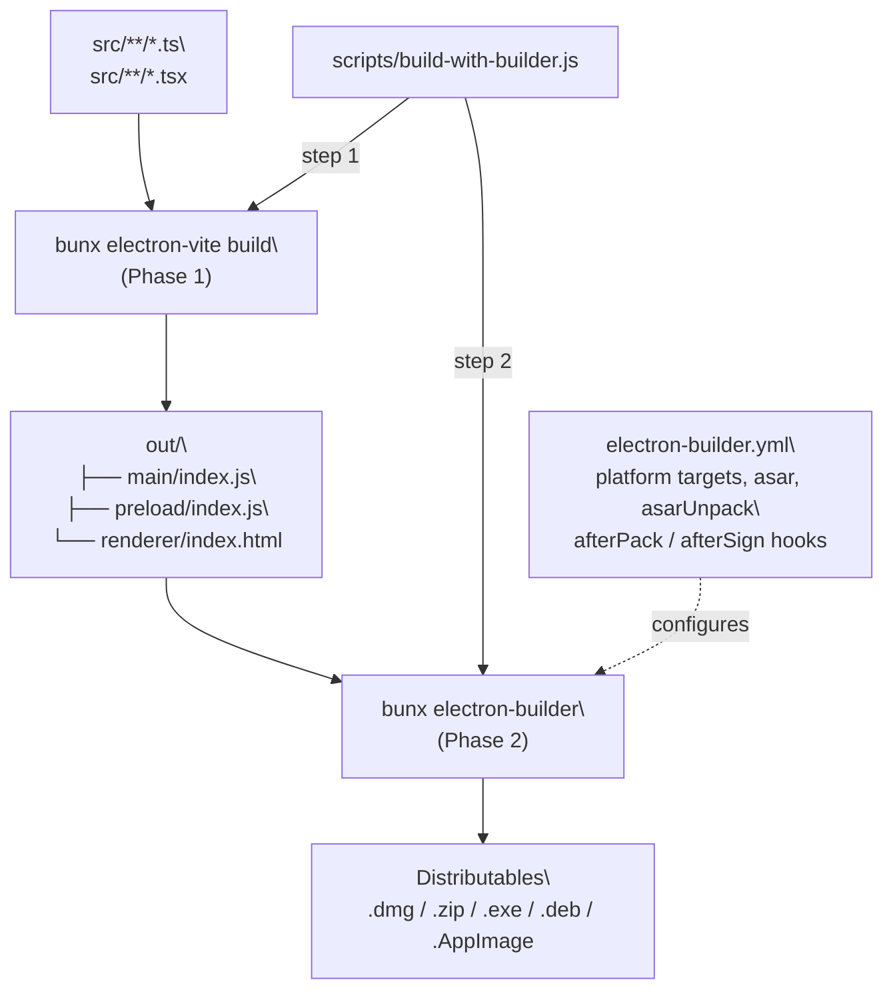
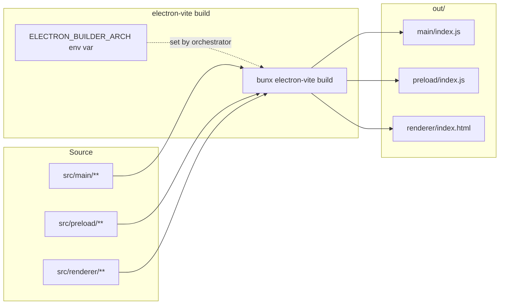
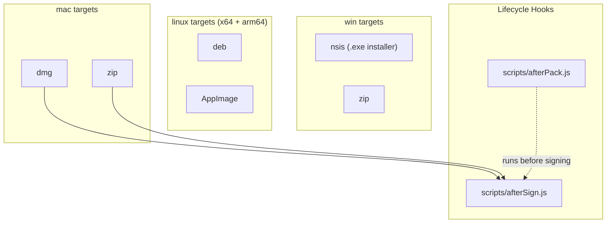
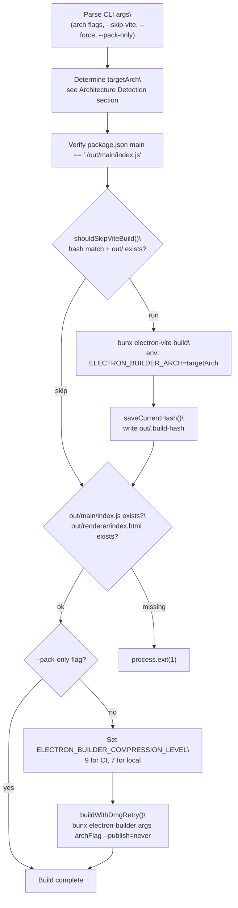
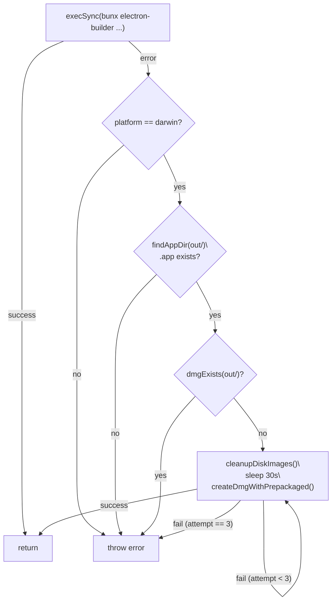

# Two-Phase Build Process

<details>
<summary>Relevant source files</summary>

The following files were used as context for generating this wiki page:

- [.github/workflows/build-and-release.yml](.github/workflows/build-and-release.yml)
- [electron-builder.yml](electron-builder.yml)
- [package.json](package.json)
- [resources/windows-installer-arm64.nsh](resources/windows-installer-arm64.nsh)
- [resources/windows-installer-x64.nsh](resources/windows-installer-x64.nsh)
- [scripts/build-with-builder.js](scripts/build-with-builder.js)

</details>

## Purpose and Scope

This document describes the two-phase build architecture used to create distributable AionUi applications. Phase 1 uses `electron-vite` to bundle TypeScript source files into JavaScript bundles in `out/`. Phase 2 uses `electron-builder` to package those bundles into platform-specific installers and archives. Both phases are coordinated by `scripts/build-with-builder.js`.

For information about the CI/CD pipeline that executes this build process, see page 11.1. For details about native module compilation, see page 11.3. For code signing and notarization, see page 11.4.

---

## Build Architecture Overview

The build process separates concerns between application bundling and distribution packaging. Phase 1 (`electron-vite`) compiles TypeScript source into JS bundles. Phase 2 (`electron-builder`) wraps those bundles in platform-specific installers. The `scripts/build-with-builder.js` script is the single entry point for both phases.

**Two-Phase Build Flow**



Sources: [scripts/build-with-builder.js:287-377](), [electron-builder.yml:1-211]()

---

## Phase 1: Vite Bundling (electron-vite)

Phase 1 runs `bunx electron-vite build`, which compiles the main process, preload scripts, and renderer (React) into the `out/` directory. The build is driven by `electron.vite.config.ts`.

### Output Structure

After Phase 1 completes, the script verifies that exactly these two files exist before proceeding to Phase 2:

| File                      | Purpose                      |
| ------------------------- | ---------------------------- |
| `out/main/index.js`       | Main Electron process bundle |
| `out/renderer/index.html` | Renderer (React) entry point |

The preload bundle is also placed in `out/preload/` but not separately verified.

**Phase 1: electron-vite Input → Output**



Sources: [scripts/build-with-builder.js:298-313](), [electron-builder.yml:13-17]()

### Incremental Build System

`build-with-builder.js` implements a hash-based incremental build to skip Phase 1 when the source has not changed.

The function `computeSourceHash()` hashes the contents of key config files (`package.json`, `tsconfig.json`, `electron.vite.config.ts`, `electron-builder.yml`) and the modification timestamps of `src/` and `public/`. The result is written to `out/.build-hash` after a successful build.

On subsequent runs, `shouldSkipViteBuild()` compares the current hash against the cached hash. If they match and `out/main/index.js` and `out/renderer/index.html` exist, Phase 1 is skipped entirely.

| Condition                       | Phase 1 Behavior    |
| ------------------------------- | ------------------- |
| `--force` flag                  | Always runs         |
| `--skip-vite` flag              | Always skips        |
| Hash match + output exists      | Skips (incremental) |
| Hash mismatch or output missing | Runs full build     |

Sources: [scripts/build-with-builder.js:30-106]()

---

## Phase 2: Distribution Packaging (electron-builder)

Phase 2 runs `bunx electron-builder` against the `out/` directory produced by Phase 1 and creates platform-specific distribution packages. `electron-builder` handles asar packaging, native module unpacking, code signing, and installer creation.

### Input Requirements

`electron-builder.yml` specifies which files are included in the package. The key patterns are:

```
out/main/**/*
out/preload/**/*
out/renderer/**/*
public/**/*
rules/**/*
skills/**/*
node_modules/better-sqlite3/**/*
node_modules/bcrypt/**/*
node_modules/node-pty/**/*
node_modules/web-tree-sitter/**/*
... (other native module dependencies)
```

The `directories` block in `electron-builder.yml` controls input and output locations:

```
directories:
  output: out
  buildResources: resources
```

Note that both the Vite build output and the final distributables land under `out/`. The Vite step writes to `out/main/`, `out/preload/`, and `out/renderer/`, while `electron-builder` writes `.dmg`, `.exe`, `.deb`, etc. to the root of `out/`.

Sources: [electron-builder.yml:9-93]()

### Platform-Specific Targets

Each platform has its own target configurations in `electron-builder.yml`. The `artifactName` pattern `${productName}-${version}-${os}-${arch}.${ext}` is applied uniformly.

**electron-builder.yml Platform Targets → Artifacts**



| Platform | Targets           | Architectures                     |
| -------- | ----------------- | --------------------------------- |
| `mac`    | `dmg`, `zip`      | `arm64`, `x64` (separate CI jobs) |
| `win`    | `nsis`, `zip`     | `x64`, `arm64`                    |
| `linux`  | `deb`, `AppImage` | `x64`, `arm64`                    |

Sources: [electron-builder.yml:99-170](), [electron-builder.yml:148-149]()

### Asar Archive Configuration

`electron-builder.yml` enables asar packaging with `smartUnpack: true`. Native modules and resource directories that require filesystem access are listed under `asarUnpack` so they are placed in `app.asar.unpacked/` at runtime:

| Unpacked Pattern                      | Reason                               |
| ------------------------------------- | ------------------------------------ |
| `better-sqlite3/**`                   | `.node` binary, can't load from asar |
| `bcrypt/**`                           | `.node` binary                       |
| `node-pty/**`                         | `.node` binary                       |
| `web-tree-sitter/**`                  | WASM files loaded via `fs.readFile`  |
| `tree-sitter-bash/**`                 | WASM grammar file                    |
| `rules/**`, `skills/**`               | `fs.readdir` with `withFileTypes`    |
| `open/**`, `default-browser/**`, etc. | Windows asar compatibility           |

Sources: [electron-builder.yml:175-197]()

### Artifact Naming Convention

The `artifactName` template `${productName}-${version}-${os}-${arch}.${ext}` is set per platform in `electron-builder.yml`. Example outputs for version `1.8.18`:

- `AionUi-1.8.18-mac-arm64.dmg`
- `AionUi-1.8.18-win-x64.exe`
- `AionUi-1.8.18-linux-x64.deb`

Sources: [electron-builder.yml:105-122]()

---

## Orchestration: build-with-builder.js

`scripts/build-with-builder.js` is the single entry point for all production builds. It handles argument parsing, architecture detection, incremental build checks, Phase 1 and Phase 2 execution, and DMG retry logic.

### Script Flow

**scripts/build-with-builder.js execution flow**



Sources: [scripts/build-with-builder.js:285-377]()

### Architecture Detection Logic

The script supports four architecture specification methods, resolved in this order:

| Method                       | Example                     | Behavior                                                                              |
| ---------------------------- | --------------------------- | ------------------------------------------------------------------------------------- |
| Multiple explicit arch flags | `arm64 --mac --arm64 --x64` | `multiArch = true`; passes all to electron-builder                                    |
| `auto` + platform flag       | `auto --mac`                | Reads first `arch:` entry from `electron-builder.yml` via `getTargetArchFromConfig()` |
| Single explicit arch         | `arm64 --mac --arm64`       | `targetArch = arm64`                                                                  |
| No arch flag                 | `--mac`                     | `targetArch = process.arch` (host)                                                    |

Both bare (`arm64`) and prefixed (`--arm64`) forms are accepted and deduplicated. The determined `targetArch` is passed as `ELECTRON_BUILDER_ARCH` to `electron-vite build` and as `--${arch}` to `electron-builder`.

Sources: [scripts/build-with-builder.js:197-276]()

### Phase 1 Execution

After the incremental check, if a build is needed, the script runs:

```
bunx electron-vite build
```

with `ELECTRON_BUILDER_ARCH` set to `targetArch` in the child process environment. After a successful build, `saveCurrentHash()` writes the current source hash to `out/.build-hash`.

Sources: [scripts/build-with-builder.js:298-313]()

### DMG Retry Logic

macOS CI runners can experience transient `hdiutil` "Device not configured" errors during DMG creation (a known issue with `macos-14` GitHub Actions runners). The script handles this with `buildWithDmgRetry()`.

The function first attempts the full `electron-builder` command. If it fails and the platform is macOS, it checks whether a `.app` bundle already exists in `out/mac*/` but no `.dmg` is present. If so, it concludes the failure was DMG-specific and retries up to `DMG_RETRY_MAX` (3) times with a `DMG_RETRY_DELAY_SEC` (30 second) wait between attempts.

On each retry:

1. `cleanupDiskImages()` runs `hdiutil detach -force` on all mounted disk images.
2. `createDmgWithPrepackaged()` calls `electron-builder --mac dmg --${arch} --prepackaged <path/to/App.app>`, which re-uses the existing `.app` and re-creates only the DMG step.

This preserves the full DMG window layout and icon positions from `electron-builder.yml`.

**DMG Retry Decision Tree**



Sources: [scripts/build-with-builder.js:108-195]()

### Phase 2 Execution

The script constructs the `electron-builder` command and delegates to `buildWithDmgRetry()`:

```
bunx electron-builder <builderArgs> <archFlag> --publish=never
```

`--publish=never` is always set. Publishing is handled by a separate CI release job (see page 11.5), not by `electron-builder`'s built-in publish mechanism.

In multi-arch mode, `archFlag` is the joined set of all arch flags (e.g., `--arm64 --x64`). In single-arch mode, it is `--${targetArch}`.

The compression level is controlled by the `ELECTRON_BUILDER_COMPRESSION_LEVEL` environment variable:

| Environment    | Compression level | Effect                      |
| -------------- | ----------------- | --------------------------- |
| CI (`CI=true`) | `9` (maximum)     | Smallest output size        |
| Local          | `7` (normal)      | ~30–50% faster ASAR packing |

Sources: [scripts/build-with-builder.js:341-374]()

---

## Package.json Build Scripts

All production build scripts in `package.json` delegate to `scripts/build-with-builder.js`:

| Script             | Invocation                                                    | Purpose                                 |
| ------------------ | ------------------------------------------------------------- | --------------------------------------- |
| `dist`             | `node scripts/build-with-builder.js`                          | Current platform, host arch             |
| `dist:mac`         | `node scripts/build-with-builder.js auto --mac`               | macOS, arch from `electron-builder.yml` |
| `dist:win`         | `node scripts/build-with-builder.js auto --win`               | Windows, arch from config               |
| `dist:linux`       | `node scripts/build-with-builder.js auto --linux`             | Linux, arch from config                 |
| `build-mac`        | `node scripts/build-with-builder.js auto --mac --arm64 --x64` | macOS multi-arch (arm64 + x64)          |
| `build-win`        | `node scripts/build-with-builder.js auto --win`               | Windows                                 |
| `build-deb`        | `node scripts/build-with-builder.js auto --linux`             | Linux deb/AppImage                      |
| `build-mac:arm64`  | `node scripts/build-with-builder.js arm64 --mac --arm64`      | macOS ARM64 only                        |
| `build-mac:x64`    | `node scripts/build-with-builder.js x64 --mac --x64`          | macOS Intel only                        |
| `package` / `make` | `electron-vite build`                                         | Phase 1 only (no packaging)             |

Sources: [package.json:18-29]()

---

## CI/CD Integration

The GitHub Actions `build-and-release.yml` workflow delegates to a reusable workflow (`_build-reusable.yml`) with a matrix of platform/arch combinations. Each matrix entry specifies exactly which `build-with-builder.js` invocation to run:

| Platform        | Runner OS       | Command                                                  |
| --------------- | --------------- | -------------------------------------------------------- |
| `macos-arm64`   | `macos-14`      | `node scripts/build-with-builder.js arm64 --mac --arm64` |
| `macos-x64`     | `macos-14`      | `node scripts/build-with-builder.js x64 --mac --x64`     |
| `windows-x64`   | `windows-2022`  | `node scripts/build-with-builder.js x64 --win --x64`     |
| `windows-arm64` | `windows-2022`  | `node scripts/build-with-builder.js arm64 --win --arm64` |
| `linux`         | `ubuntu-latest` | `bun run dist:linux` (multi-arch via config)             |

Each job runs both phases sequentially on its assigned runner OS. Native module rebuilding is handled by `scripts/afterPack.js` and `scripts/rebuildNativeModules.js` — see page 11.3 for details.

Sources: [.github/workflows/build-and-release.yml:19-33]()

---

## Native Module Rebuild Strategy

Native modules (`better-sqlite3`, `bcrypt`, `node-pty`) must be compiled for the specific Electron Node.js ABI. The rebuild strategy differs by environment:

### Local Development

`scripts/postinstall.js` runs after `npm install` / `bun install`. In a local (non-CI) environment it executes `bunx electron-builder install-app-deps` with `npm_config_build_from_source=true` to compile native modules against the local Electron version. In CI it skips this step — prebuilt binaries are used until the `afterPack` hook runs.

Sources: [scripts/postinstall.js:11-40]()

### During Packaging (afterPack)

`electron-builder.yml` specifies `afterPack: scripts/afterPack.js`. This hook fires after the application files are staged but before the final archive is created, and is responsible for rebuilding native modules for the target architecture. See page 11.3 for full details.

Sources: [electron-builder.yml:148]()

---

## Directory Layout

Both phases share the `out/` directory. Phase 1 writes bundles to subdirectories; Phase 2 writes distributables to the root. There is no directory copying or path-fixup step between phases.

```
out/
├── .build-hash          ← incremental build cache (hash of source files)
├── main/
│   └── index.js         ← main process bundle (Phase 1 output)
├── preload/
│   └── index.js         ← preload bundle (Phase 1 output)
├── renderer/
│   └── index.html       ← renderer entry (Phase 1 output)
├── mac-arm64/
│   └── AionUi.app/      ← staged .app (Phase 2 intermediate)
├── AionUi-1.8.18-mac-arm64.dmg   ← Phase 2 final artifact
├── AionUi-1.8.18-mac-arm64.zip
└── ... (other platform artifacts)
```

`electron-builder.yml` under `files:` lists `out/main/**/*`, `out/preload/**/*`, and `out/renderer/**/*` as the bundled application code to include.

Sources: [electron-builder.yml:13-17](), [scripts/build-with-builder.js:316-330]()

---

## Build Caching

### Incremental Vite Build Cache

The orchestration script caches Phase 1 results using a content hash stored in `out/.build-hash`. The hash covers these files and directories:

| Hashed Input              | Method                           |
| ------------------------- | -------------------------------- |
| `package.json`            | File content                     |
| `package-lock.json`       | File content                     |
| `tsconfig.json`           | File content                     |
| `electron.vite.config.ts` | File content                     |
| `electron-builder.yml`    | File content                     |
| `src/` directory          | `mtime` (modification timestamp) |
| `public/` directory       | `mtime`                          |

If the hash matches and `out/main/index.js` + `out/renderer/index.html` both exist, the Vite build step is skipped. Pass `--force` to bypass this check, or `--skip-vite` to unconditionally skip Phase 1.

Sources: [scripts/build-with-builder.js:30-106]()

### Electron Download Cache

`electron-builder.yml` reads the Electron binary cache location from an environment variable:

```
electronDownload:
  cache: ${env.ELECTRON_CACHE}
```

In CI this is typically set to a runner temp directory to persist the Electron binary across workflow steps.

Sources: [electron-builder.yml:203-204]()

---

## Error Handling

### Phase 1 Verification Failures

After Phase 1, the orchestration script explicitly checks for the existence of `out/main/index.js` and `out/renderer/index.html`. If either file is missing, it throws with a descriptive message and the process exits with code `1` before Phase 2 is attempted.

Sources: [scripts/build-with-builder.js:316-332]()

### Phase 2 DMG Failures

macOS DMG failures are handled by `buildWithDmgRetry()` as described in the DMG Retry Logic section above. Other Phase 2 errors propagate to the top-level `catch` block, which logs the message and calls `process.exit(1)`.

Sources: [scripts/build-with-builder.js:160-195](), [scripts/build-with-builder.js:374-377]()

---

## Debugging Build Issues

When troubleshooting build failures, examine these key indicators:

### Phase 1 Debug Points

1. **Entry point resolution**: Verify all 5 entry points resolve correctly
2. **Native module externals**: Check that native modules are marked external
3. **Output directory structure**: Confirm `.webpack/{arch}/main` vs `.webpack/main`
4. **Asar unpacking**: Verify `AutoUnpackNativesPlugin` configuration

### Phase 2 Debug Points

1. **File patterns**: Check `electron-builder.yml` includes all required files
2. **Asar configuration**: Verify native modules are in `asarUnpack` list
3. **Architecture flags**: Confirm `--${arch}` matches Phase 1 target
4. **Code signing**: Check `afterPack.js` and `afterSign.js` scripts execute

### CI-Specific Debug

The workflow includes extensive logging:

```yaml
- name: Print build configuration
  shell: bash
  run: |
    echo "Platform: ${{ matrix.platform }}"
    echo "Target Architecture: ${{ matrix.arch }}"
    echo "Build Command: ${{ matrix.command }}"
```

```yaml
- name: List build artifacts
  shell: bash
  run: |
    ls -lh out/ || true
    find out/ -type f \( -name "*.exe" -o -name "*.dmg" ... \) -exec basename {} \;
```

**Sources:** [.github/workflows/build-and-release.yml:132-143](), [.github/workflows/build-and-release.yml:386-401]()
