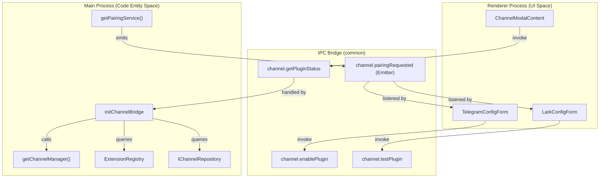
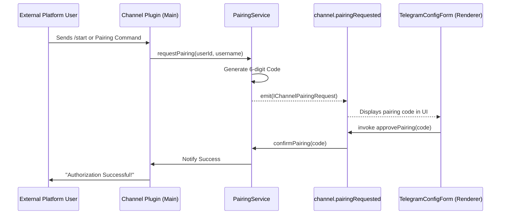

# Channel Architecture

Relevant source files

The following files were used as context for generating this wiki page:

- [src/common/platform/register-electron.ts](src/common/platform/register-electron.ts)
- [src/common/platform/register-node.ts](src/common/platform/register-node.ts)
- [src/process/bridge/channelBridge.ts](src/process/bridge/channelBridge.ts)
- [src/process/bridge/fsBridge.ts](src/process/bridge/fsBridge.ts)
- [src/renderer/components/settings/SettingsModal/contents/WebuiModalContent.tsx](src/renderer/components/settings/SettingsModal/contents/WebuiModalContent.tsx)
- [src/renderer/components/settings/SettingsModal/contents/channels/ChannelModalContent.tsx](src/renderer/components/settings/SettingsModal/contents/channels/ChannelModalContent.tsx)
- [src/renderer/components/settings/SettingsModal/contents/channels/DingTalkConfigForm.tsx](src/renderer/components/settings/SettingsModal/contents/channels/DingTalkConfigForm.tsx)
- [src/renderer/components/settings/SettingsModal/contents/channels/LarkConfigForm.tsx](src/renderer/components/settings/SettingsModal/contents/channels/LarkConfigForm.tsx)
- [src/renderer/components/settings/SettingsModal/contents/channels/TelegramConfigForm.tsx](src/renderer/components/settings/SettingsModal/contents/channels/TelegramConfigForm.tsx)
- [src/renderer/pages/settings/AgentSettings/AssistantManagement/AddCustomPathModal.tsx](src/renderer/pages/settings/AgentSettings/AssistantManagement/AddCustomPathModal.tsx)
- [src/renderer/pages/settings/DisplaySettings/CssThemeModal.tsx](src/renderer/pages/settings/DisplaySettings/CssThemeModal.tsx)
- [src/renderer/pages/settings/SkillsHubSettings.tsx](src/renderer/pages/settings/SkillsHubSettings.tsx)
- [tests/unit/ChannelModelSelectionRestore.dom.test.tsx](tests/unit/ChannelModelSelectionRestore.dom.test.tsx)
- [tests/unit/SkillsHubSettings.dom.test.tsx](tests/unit/SkillsHubSettings.dom.test.tsx)
- [tests/unit/fsBridge.skills.test.ts](tests/unit/fsBridge.skills.test.ts)
- [tests/unit/platform/NodePlatformServices.test.ts](tests/unit/platform/NodePlatformServices.test.ts)
- [tests/unit/process/bridge/fsBridge.downloadRemoteBuffer.test.ts](tests/unit/process/bridge/fsBridge.downloadRemoteBuffer.test.ts)
- [tests/unit/process/bridge/fsBridge.readFile.test.ts](tests/unit/process/bridge/fsBridge.readFile.test.ts)
- [tests/unit/process/bridge/fsBridge.standalone.test.ts](tests/unit/process/bridge/fsBridge.standalone.test.ts)
- [tests/unit/skillsMarket.test.ts](tests/unit/skillsMarket.test.ts)

## Purpose and Scope

This document describes the architecture of AionUi's channel integration system, which enables external chat platforms (Telegram, Lark, DingTalk, WeChat) to interface with AionUi's agent capabilities. It covers the IPC bridge APIs for plugin management, the pairing authorization flow, user management, and how channel events are synchronized between the main process and the renderer.

For details on specific platform implementations, see [6.2 Platform Integrations]().

---

## System Overview

The channel system provides a plugin-based architecture for integrating third-party chat platforms. Each platform integration is implemented as a plugin that runs in the main process and communicates with the renderer through the `channel` IPC bridge namespace.

### Core Components

| Component | Location | Responsibility |
|-----------|----------|----------------|
| **channel namespace** | [src/common/adapter/ipcBridge.ts:572-602]() | IPC API definitions for all channel operations. |
| **ChannelManager** | [src/process/channels/core/ChannelManager.ts:8]() | Singleton managing plugin lifecycles (enable/disable). |
| **initChannelBridge** | [src/process/bridge/channelBridge.ts:26]() | Initializes the IPC providers for channel management. |
| **ExtensionRegistry** | [src/process/extensions/index.ts:10]() | Loads and provides metadata for extension-contributed channels. |
| **PairingService** | [src/process/channels/pairing/PairingService.ts:9]() | Manages temporary codes for user authorization. |

---

## Channel IPC Bridge Architecture

The channel architecture bridges the "Natural Language Space" of external platforms with the "Code Entity Space" of AionUi's agents via a dedicated IPC layer.

### Data Flow Diagram

The following diagram illustrates how the UI components interact with the backend services through the `channel` bridge.

**Sources:** [src/process/bridge/channelBridge.ts:26-34](), [src/common/adapter/ipcBridge.ts:572-602](), [src/renderer/components/settings/SettingsModal/contents/channels/ChannelModalContent.tsx:165](), [src/renderer/components/settings/SettingsModal/contents/channels/TelegramConfigForm.tsx:56]()

---

## Plugin Management API

The `channel` namespace in `ipcBridge` provides the primary interface for the UI to interact with chat platform plugins.

### Key API Providers

| Method | Implementation | Purpose |
|--------|----------------|---------|
| `getPluginStatus` | [src/process/bridge/channelBridge.ts:34-169]() | Aggregates status from DB, built-in types, and extensions. |
| `enablePlugin` | [src/process/bridge/channelBridge.ts:174-188]() | Calls `ChannelManager.enablePlugin` to start a bot. |
| `disablePlugin` | [src/process/bridge/channelBridge.ts:192-206]() | Stops a running bot and updates persistent state via `ChannelManager`. |
| `testPlugin` | [src/process/bridge/channelBridge.ts:210-226]() | Validates credentials (e.g., Bot Token) without saving to DB. |

### Extension-Contributed Channels
AionUi supports channels provided by third-party extensions. The `getPluginStatus` provider resolves metadata (icons, descriptions, credential fields) from the `ExtensionRegistry`.
- **Metadata Resolution**: The system uses `registry.getChannelPluginMeta(pluginType)` to fetch configuration schemas for extensions [src/process/bridge/channelBridge.ts:51]().
- **Asset URL Conversion**: Icons for extension channels are converted to `aion-asset://` protocol URLs using `toAssetUrl` [src/process/bridge/channelBridge.ts:77-78]().

**Sources:** [src/process/bridge/channelBridge.ts:34-169](), [src/process/extensions/protocol/assetProtocol.ts:11]()

---

## Pairing Authorization Flow

The pairing system enables users on external platforms (like Telegram or Lark) to request authorization to use AionUi's agents.

### Authorization Sequence

**Sources:** [src/process/bridge/channelBridge.ts:245-275](), [src/common/adapter/ipcBridge.ts:583-602](), [src/renderer/components/settings/SettingsModal/contents/channels/TelegramConfigForm.tsx:171-180]()

### Pairing API Reference
- `getPendingPairings`: Returns a list of users waiting for approval [src/process/bridge/channelBridge.ts:231-240]().
- `approvePairing`: Finalizes the link between an external ID and the local instance [src/process/bridge/channelBridge.ts:245-256]().
- `rejectPairing`: Denies and clears the temporary code [src/process/bridge/channelBridge.ts:261-272]().

---

## Session and User Tracking

Once authorized, external users and their active chat sessions are managed through dedicated providers.

### User and Session Management
- **getAuthorizedUsers**: Lists all users stored in the `channelRepo` [src/process/bridge/channelBridge.ts:280-292]().
- **revokeUser**: Removes authorization for a specific user ID [src/process/bridge/channelBridge.ts:297-311]().
- **getActiveSessions**: Returns real-time session data from the `ChannelManager`, including message counts and platform-specific identifiers [src/process/bridge/channelBridge.ts:316-330]().

### Data Models
| Type | Source | Key Fields |
|------|--------|------------|
| `IChannelUser` | [src/process/channels/types.ts]() | `userId`, `platformType`, `authorizedAt`, `username` |
| `IChannelSession` | [src/process/channels/types.ts]() | `sessionId`, `conversationId`, `platformType` |

**Sources:** [src/process/bridge/channelBridge.ts:280-330](), [src/process/channels/types.ts:18]()

---

## Event Synchronization

The channel system uses an event-driven architecture to keep the renderer UI synchronized with main process state changes.

### IPC Emitters
| Emitter | Channel | Payload | Trigger |
|---------|---------|---------|---------|
| `pairingRequested` | `channel.pairing-requested` | `IChannelPairingRequest` | When `PairingService` receives a new request from a bot. |
| `pluginStatusChanged` | `channel.plugin-status-changed` | `{ pluginId, status }` | When a plugin starts, stops, or encounters an error. |
| `userAuthorized` | `channel.user-authorized` | `IChannelUser` | When a pairing code is successfully approved via `approvePairing`. |

**Sources:** [src/common/adapter/ipcBridge.ts:598-602](), [src/process/bridge/channelBridge.ts:27-28](), [src/renderer/components/settings/SettingsModal/contents/channels/TelegramConfigForm.tsx:184-191]()

---

## Configuration Persistence

Channel settings, including default models and agents, are persisted using `ConfigStorage`.

### Channel Model Selection
A specialized hook `useChannelModelSelection` wraps model selection with persistence logic:
1. **Restoration**: On mount, it resolves saved model references (e.g., `assistant.telegram.defaultModel`) into full `TProviderWithModel` objects [src/renderer/components/settings/SettingsModal/contents/channels/ChannelModalContent.tsx:72-114]().
2. **Persistence**: When a user selects a model, it updates `ConfigStorage` and calls `channel.syncChannelSettings` to notify the backend bot process [src/renderer/components/settings/SettingsModal/contents/channels/ChannelModalContent.tsx:118-154]().

### Configuration Keys
| Key | Type | Description |
|-----|------|-------------|
| `assistant.[platform].defaultModel` | `ChannelModelConfigKey` | The model used for new conversations on this platform [src/renderer/components/settings/SettingsModal/contents/channels/ChannelModalContent.tsx:27-31](). |
| `assistant.[platform].agent` | `object` | The specific agent (Gemini, ACP, etc.) assigned to the platform [src/renderer/components/settings/SettingsModal/contents/channels/TelegramConfigForm.tsx:158](). |

**Sources:** [src/renderer/components/settings/SettingsModal/contents/channels/ChannelModalContent.tsx:56-160](), [src/renderer/components/settings/SettingsModal/contents/channels/TelegramConfigForm.tsx:156-167]()