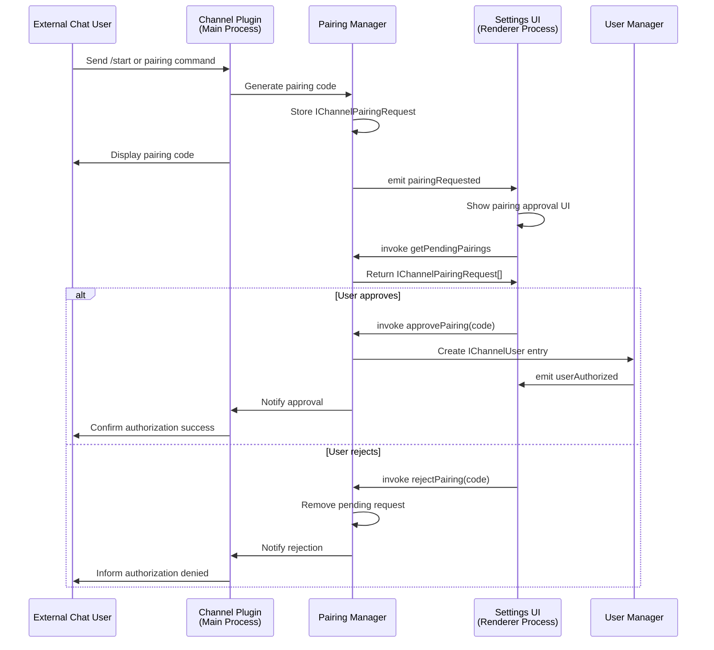
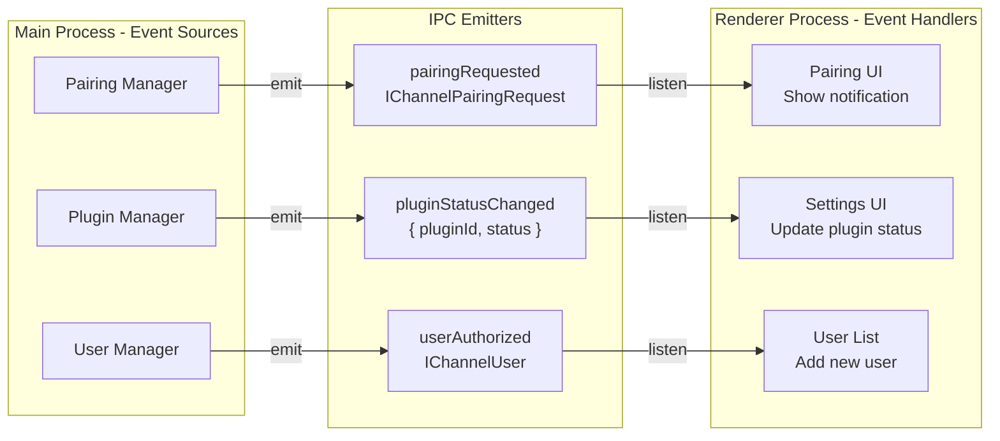

# Channel Architecture

<details>
<summary>Relevant source files</summary>

The following files were used as context for generating this wiki page:

- [src/common/ipcBridge.ts](src/common/ipcBridge.ts)
- [src/common/storage.ts](src/common/storage.ts)
- [src/renderer/pages/guid/index.tsx](src/renderer/pages/guid/index.tsx)

</details>

## Purpose and Scope

This document describes the architecture of AionUi's channel integration system, which enables external chat platforms (Telegram, Lark, DingTalk) to interface with AionUi's agent capabilities. It covers the IPC bridge APIs for plugin management, the pairing authorization flow, user management, session tracking, and event synchronization between the main process and renderer.

For details on specific platform implementations (Telegram Bot, Lark/Feishu Bot, DingTalk AI Card Stream), see [Platform Integrations](#6.2).

---

## System Overview

The channel system provides a plugin-based architecture for integrating third-party chat platforms. Each platform integration is implemented as a plugin that runs in the main process and communicates with the renderer through the IPC bridge. The system supports plugin lifecycle management, user authorization via pairing codes, session tracking, and bidirectional event synchronization.

### Core Components

| Component              | Location                            | Responsibility                                               |
| ---------------------- | ----------------------------------- | ------------------------------------------------------------ |
| **channel namespace**  | [src/common/ipcBridge.ts:572-602]() | IPC API definitions for all channel operations               |
| **ConfigStorage**      | [src/common/storage.ts:19]()        | Persistent storage for assistant configurations              |
| **TChatConversation**  | [src/common/storage.ts:154-302]()   | Conversation model with `source` and `channelChatId` fields  |
| **ConversationSource** | [src/common/storage.ts:131]()       | Type union: `'aionui' \| 'telegram' \| 'lark' \| 'dingtalk'` |

---

## Channel IPC Bridge Architecture

```mermaid
graph TB
    subgraph "Renderer Process - Settings UI"
        SETTINGS["Channel Settings Page"]
        PAIRING["Pairing Approval UI"]
        USERS["User Management UI"]
    end

    subgraph "IPC Bridge - channel namespace"
        PROVIDERS["Request Providers"]
        PROVIDERS --> GET_STATUS["getPluginStatus"]
        PROVIDERS --> ENABLE["enablePlugin"]
        PROVIDERS --> DISABLE["disablePlugin"]
        PROVIDERS --> TEST["testPlugin"]
        PROVIDERS --> GET_PAIR["getPendingPairings"]
        PROVIDERS --> APPROVE["approvePairing"]
        PROVIDERS --> REJECT["rejectPairing"]
        PROVIDERS --> GET_USERS["getAuthorizedUsers"]
        PROVIDERS --> REVOKE["revokeUser"]
        PROVIDERS --> GET_SESSIONS["getActiveSessions"]
        PROVIDERS --> SYNC["syncChannelSettings"]

        EMITTERS["Event Emitters"]
        EMITTERS --> PAIR_REQ["pairingRequested"]
        EMITTERS --> STATUS_CHG["pluginStatusChanged"]
        EMITTERS --> USER_AUTH["userAuthorized"]
    end

    subgraph "Main Process - Channel System"
        PLUGIN_MGR["Plugin Manager"]
        PAIR_MGR["Pairing Manager"]
        USER_MGR["User Manager"]
        SESSION_MGR["Session Manager"]

        PLUGIN_MGR --> TELEGRAM["Telegram Plugin"]
        PLUGIN_MGR --> LARK["Lark Plugin"]
        PLUGIN_MGR --> DINGTALK["DingTalk Plugin"]
    end

    subgraph "Configuration Storage"
        CONFIG["ConfigStorage"]
        CONFIG --> TELE_CFG["assistant.telegram.defaultModel<br/>assistant.telegram.agent"]
        CONFIG --> LARK_CFG["assistant.lark.defaultModel<br/>assistant.lark.agent"]
        CONFIG --> DING_CFG["assistant.dingtalk.defaultModel<br/>assistant.dingtalk.agent"]
    end

    SETTINGS --> GET_STATUS
    SETTINGS --> ENABLE
    SETTINGS --> DISABLE
    SETTINGS --> TEST
    SETTINGS --> SYNC

    PAIRING --> GET_PAIR
    PAIRING --> APPROVE
    PAIRING --> REJECT

    USERS --> GET_USERS
    USERS --> REVOKE

    GET_STATUS --> PLUGIN_MGR
    ENABLE --> PLUGIN_MGR
    DISABLE --> PLUGIN_MGR
    TEST --> PLUGIN_MGR

    GET_PAIR --> PAIR_MGR
    APPROVE --> PAIR_MGR
    REJECT --> PAIR_MGR

    GET_USERS --> USER_MGR
    REVOKE --> USER_MGR

    GET_SESSIONS --> SESSION_MGR

    SYNC --> CONFIG

    PLUGIN_MGR -.->|emit| STATUS_CHG
    PAIR_MGR -.->|emit| PAIR_REQ
    USER_MGR -.->|emit| USER_AUTH

    PAIR_REQ -.->|listen| PAIRING
    STATUS_CHG -.->|listen| SETTINGS
    USER_AUTH -.->|listen| USERS
```



**Sources:** [src/common/ipcBridge.ts:572-602]()

---

## Plugin Management API

The `channel` namespace in `ipcBridge` provides a comprehensive API for managing chat platform plugins.

### Plugin Lifecycle Methods

| Method            | IPC Channel                 | Parameters                          | Return Type                         | Purpose                                     |
| ----------------- | --------------------------- | ----------------------------------- | ----------------------------------- | ------------------------------------------- |
| `getPluginStatus` | `channel.get-plugin-status` | `void`                              | `IChannelPluginStatus[]`            | Retrieve status of all registered plugins   |
| `enablePlugin`    | `channel.enable-plugin`     | `{ pluginId, config }`              | `IBridgeResponse`                   | Activate a plugin with configuration        |
| `disablePlugin`   | `channel.disable-plugin`    | `{ pluginId }`                      | `IBridgeResponse`                   | Deactivate a running plugin                 |
| `testPlugin`      | `channel.test-plugin`       | `{ pluginId, token, extraConfig? }` | `{ success, botUsername?, error? }` | Validate plugin credentials before enabling |

### IChannelPluginStatus Structure

```typescript
interface IChannelPluginStatus {
  pluginId: string // 'telegram' | 'lark' | 'dingtalk'
  enabled: boolean // Whether plugin is active
  botUsername?: string // Bot identifier on platform
  config: Record<string, unknown> // Platform-specific config
  lastSync?: number // Timestamp of last successful sync
  error?: string // Current error state if any
}
```

**Sources:** [src/common/ipcBridge.ts:578-581]()

---

## Pairing Authorization Flow

The pairing system enables users on external platforms to request authorization to use AionUi's AI agents. The flow uses temporary pairing codes to establish secure connections.



### Pairing Management API

| Method               | IPC Channel                    | Parameters         | Return Type                | Purpose                                  |
| -------------------- | ------------------------------ | ------------------ | -------------------------- | ---------------------------------------- |
| `getPendingPairings` | `channel.get-pending-pairings` | `void`             | `IChannelPairingRequest[]` | Fetch all pending authorization requests |
| `approvePairing`     | `channel.approve-pairing`      | `{ code: string }` | `IBridgeResponse`          | Grant authorization for a pairing code   |
| `rejectPairing`      | `channel.reject-pairing`       | `{ code: string }` | `IBridgeResponse`          | Deny authorization for a pairing code    |

### IChannelPairingRequest Structure

```typescript
interface IChannelPairingRequest {
  code: string // Temporary pairing code (e.g., "ABC123")
  platform: 'telegram' | 'lark' | 'dingtalk'
  userId: string // Platform-specific user ID
  username?: string // User's display name
  chatId?: string // Platform chat identifier
  requestedAt: number // Timestamp of request
  expiresAt: number // Expiration timestamp
}
```

**Sources:** [src/common/ipcBridge.ts:583-586]()

---

## User Management

Once authorized, users are tracked in the system to maintain persistent access and session state.

### User Management API

| Method               | IPC Channel                    | Parameters           | Return Type       | Purpose                           |
| -------------------- | ------------------------------ | -------------------- | ----------------- | --------------------------------- |
| `getAuthorizedUsers` | `channel.get-authorized-users` | `void`               | `IChannelUser[]`  | List all authorized channel users |
| `revokeUser`         | `channel.revoke-user`          | `{ userId: string }` | `IBridgeResponse` | Revoke a user's authorization     |

### IChannelUser Structure

```typescript
interface IChannelUser {
  userId: string // Unique user identifier
  platform: 'telegram' | 'lark' | 'dingtalk'
  username?: string // Display name
  authorizedAt: number // Authorization timestamp
  lastActiveAt?: number // Last interaction timestamp
  sessionCount: number // Number of active sessions
}
```

**Sources:** [src/common/ipcBridge.ts:588-590]()

---

## Session Tracking

The session management system provides read-only visibility into active conversations happening on external platforms.

### Session Management API

| Method              | IPC Channel                   | Parameters | Return Type         | Purpose                              |
| ------------------- | ----------------------------- | ---------- | ------------------- | ------------------------------------ |
| `getActiveSessions` | `channel.get-active-sessions` | `void`     | `IChannelSession[]` | Retrieve all active channel sessions |

### IChannelSession Structure

```typescript
interface IChannelSession {
  sessionId: string // Unique session identifier
  platform: 'telegram' | 'lark' | 'dingtalk'
  userId: string // Associated user ID
  chatId: string // Platform chat identifier
  conversationId: string // AionUi conversation ID
  startedAt: number // Session start timestamp
  lastMessageAt: number // Last message timestamp
  messageCount: number // Total messages in session
}
```

**Sources:** [src/common/ipcBridge.ts:592-593]()

---

## Event Synchronization System

The channel system uses an event-driven architecture to keep the renderer UI synchronized with main process state changes.



### Event Emitters

| Event                 | IPC Channel                     | Payload Type                                         | Trigger                                   |
| --------------------- | ------------------------------- | ---------------------------------------------------- | ----------------------------------------- |
| `pairingRequested`    | `channel.pairing-requested`     | `IChannelPairingRequest`                             | External user initiates pairing           |
| `pluginStatusChanged` | `channel.plugin-status-changed` | `{ pluginId: string, status: IChannelPluginStatus }` | Plugin enabled/disabled or status updated |
| `userAuthorized`      | `channel.user-authorized`       | `IChannelUser`                                       | User authorization approved               |

**Sources:** [src/common/ipcBridge.ts:598-602]()

---

## Configuration Persistence

Channel-specific assistant settings are stored in `ConfigStorage` with separate configuration namespaces for each platform.

### Assistant Configuration Schema

Each platform stores two configuration keys:

1. **Default Model**: The AI model used for conversations on that platform
2. **Agent Selection**: The backend agent type and configuration

```typescript
// Telegram configuration
'assistant.telegram.defaultModel'?: {
  id: string;        // Provider ID
  useModel: string;  // Model identifier
}

'assistant.telegram.agent'?: {
  backend: AcpBackendAll;     // Agent backend type
  customAgentId?: string;     // Custom agent UUID
  name?: string;              // Agent display name
}
```

### Platform Configuration Keys

| Platform    | Model Key                         | Agent Key                  |
| ----------- | --------------------------------- | -------------------------- |
| Telegram    | `assistant.telegram.defaultModel` | `assistant.telegram.agent` |
| Lark/Feishu | `assistant.lark.defaultModel`     | `assistant.lark.agent`     |
| DingTalk    | `assistant.dingtalk.defaultModel` | `assistant.dingtalk.agent` |

### Settings Synchronization

The `syncChannelSettings` method provides a unified interface for updating channel configurations:

```typescript
channel.syncChannelSettings({
  platform: 'telegram',
  agent: {
    backend: 'claude',
    name: 'claude-sonnet-4-20250514',
  },
  model: {
    id: 'anthropic-official',
    useModel: 'claude-sonnet-4-20250514',
  },
})
```

**Sources:** [src/common/storage.ts:86-117](), [src/common/ipcBridge.ts:595-596]()

---

## Conversation Source Tracking

Channel conversations are distinguished from regular AionUi conversations using the `source` and `channelChatId` fields in the `TChatConversation` model.

### ConversationSource Type

```typescript
type ConversationSource = 'aionui' | 'telegram' | 'lark' | 'dingtalk'
```

### TChatConversation Channel Fields

```typescript
interface TChatConversation {
  // ... other fields
  source?: ConversationSource // Defaults to 'aionui'
  channelChatId?: string // Platform-specific chat identifier
}
```

This enables:

- **Conversation isolation**: Each `channelChatId` maintains its own conversation history
- **Source attribution**: UI can display different icons or labels for channel conversations
- **Session mapping**: Links AionUi conversations to external platform sessions

**Sources:** [src/common/storage.ts:131](), [src/common/storage.ts:143-146]()

---

## Complete API Reference

### Request-Response Providers

```typescript
// Plugin Management
channel.getPluginStatus() -> IBridgeResponse<IChannelPluginStatus[]>
channel.enablePlugin({ pluginId, config }) -> IBridgeResponse
channel.disablePlugin({ pluginId }) -> IBridgeResponse
channel.testPlugin({ pluginId, token, extraConfig? }) -> IBridgeResponse<{ success, botUsername?, error? }>

// Pairing Management
channel.getPendingPairings() -> IBridgeResponse<IChannelPairingRequest[]>
channel.approvePairing({ code }) -> IBridgeResponse
channel.rejectPairing({ code }) -> IBridgeResponse

// User Management
channel.getAuthorizedUsers() -> IBridgeResponse<IChannelUser[]>
channel.revokeUser({ userId }) -> IBridgeResponse

// Session Management
channel.getActiveSessions() -> IBridgeResponse<IChannelSession[]>

// Configuration
channel.syncChannelSettings({ platform, agent, model? }) -> IBridgeResponse
```

### Event Emitters

```typescript
// Listen for events in renderer process
channel.pairingRequested.listen((request: IChannelPairingRequest) => {
  // Handle new pairing request
})

channel.pluginStatusChanged.listen(({ pluginId, status }) => {
  // Update UI with new plugin status
})

channel.userAuthorized.listen((user: IChannelUser) => {
  // Add newly authorized user to list
})
```

**Sources:** [src/common/ipcBridge.ts:572-602]()

---

## Integration with Agent System

Channel plugins create conversations using the standard `conversation.create` API, but with channel-specific metadata:

```typescript
conversation.create({
  type: 'acp', // or 'gemini', 'codex', etc.
  model: {
    id: 'anthropic-official',
    useModel: 'claude-sonnet-4-20250514',
    // ... other provider fields
  },
  extra: {
    backend: 'claude',
    workspace: '/path/to/workspace',
    // Channel-specific fields
  },
  source: 'telegram', // Mark conversation source
  channelChatId: 'user:123456', // Platform chat identifier
})
```

Messages sent from channel plugins use the standard `conversation.sendMessage` API, and receive responses through the `conversation.responseStream` event emitter.

**Sources:** [src/common/ipcBridge.ts:25-55](), [src/common/storage.ts:143-146]()
