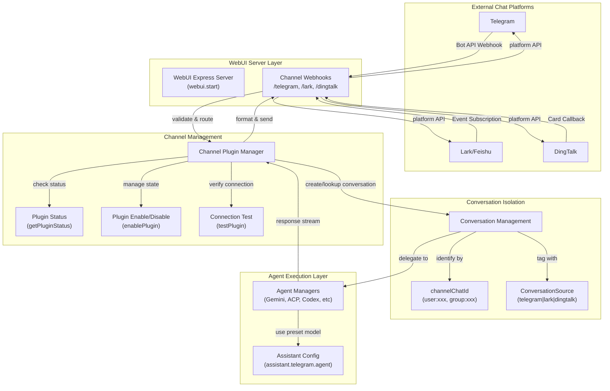
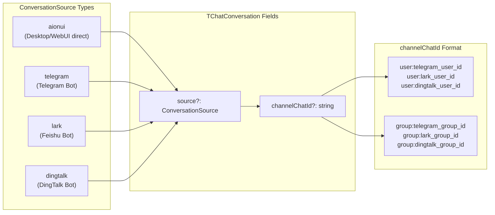
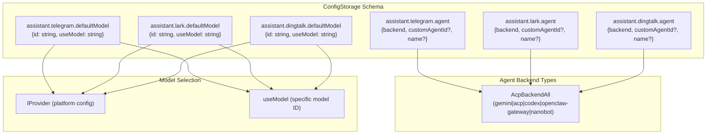
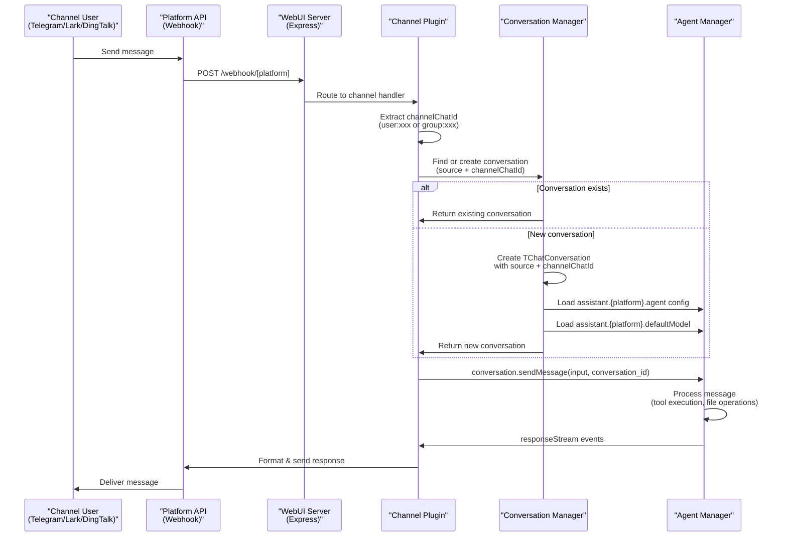
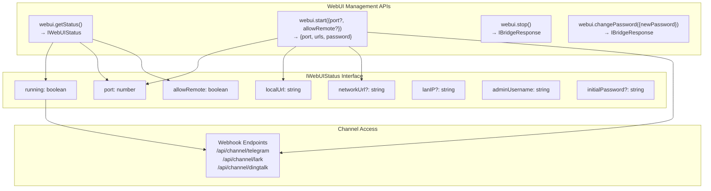
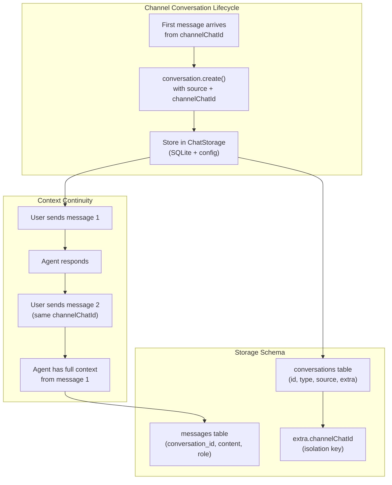
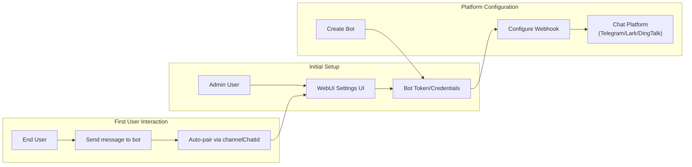
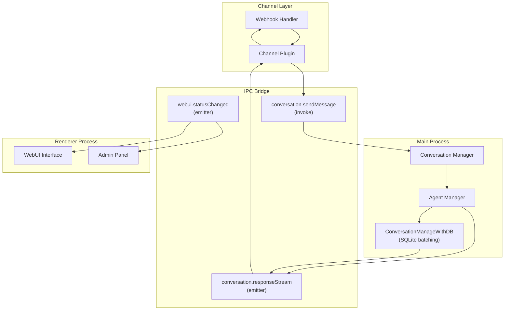
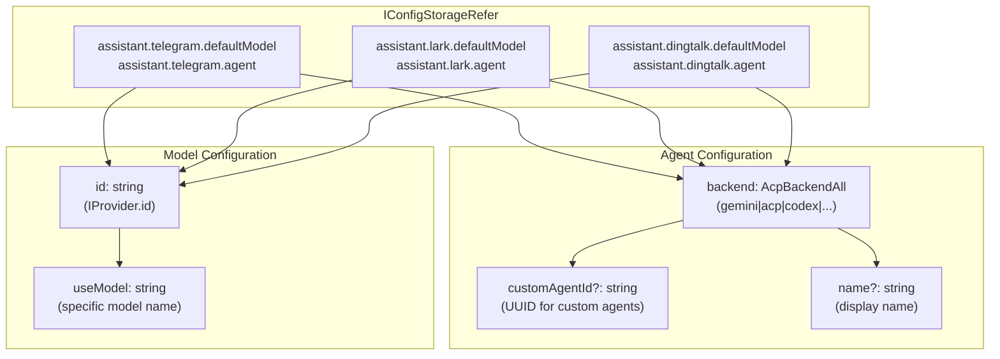

# Channel Integration

<details>
<summary>Relevant source files</summary>

The following files were used as context for generating this wiki page:

- [readme.md](readme.md)
- [readme_ch.md](readme_ch.md)
- [readme_es.md](readme_es.md)
- [readme_jp.md](readme_jp.md)
- [readme_ko.md](readme_ko.md)
- [readme_pt.md](readme_pt.md)
- [readme_tr.md](readme_tr.md)
- [readme_tw.md](readme_tw.md)
- [resources/wechat_group4.png](resources/wechat_group4.png)
- [src/common/ipcBridge.ts](src/common/ipcBridge.ts)
- [src/common/storage.ts](src/common/storage.ts)
- [src/renderer/pages/guid/index.tsx](src/renderer/pages/guid/index.tsx)

</details>

## Purpose and Scope

This document describes AionUi's channel plugin system for integrating external chat platforms (Telegram, Lark/Feishu, DingTalk) with the application's AI agents. Channel integration enables users to interact with AionUi agents directly from their preferred messaging platforms without opening the desktop application.

For information about the WebUI server that hosts channel webhooks, see [WebUI Server Architecture](#3.5). For details on specific agent implementations that handle channel requests, see [AI Agent Systems](#4).

---

## Channel Plugin Architecture

The channel plugin system operates as an extension to AionUi's WebUI mode, enabling external messaging platforms to create and manage conversations with AI agents. Each channel platform (Telegram, Lark, DingTalk) acts as a remote client that communicates with AionUi through platform-specific webhook endpoints.

### Core Components



**Sources:** [src/common/storage.ts:131-146](), [readme.md:186-194](), [src/common/ipcBridge.ts:391-410]()

---

## Conversation Data Model

### Conversation Source Tracking

Each conversation in AionUi maintains metadata about its origin through two key fields:

| Field           | Type                                             | Purpose                                                                   |
| --------------- | ------------------------------------------------ | ------------------------------------------------------------------------- |
| `source`        | `'aionui' \| 'telegram' \| 'lark' \| 'dingtalk'` | Identifies the platform that created the conversation                     |
| `channelChatId` | `string` (optional)                              | Isolates conversations by user or group (format: `user:xxx`, `group:xxx`) |

The `ConversationSource` type system ensures type-safe handling of channel-originated conversations:



**Sources:** [src/common/storage.ts:131-146]()

### Conversation Isolation Strategy

The `channelChatId` field implements multi-tenant isolation for channel-based conversations:

1. **User Conversations**: Format `user:{platform_user_id}`
   - Each user on a platform gets isolated conversation history
   - Private messages are tracked separately per user
   - Example: `user:123456789` for Telegram user ID 123456789

2. **Group Conversations**: Format `group:{platform_group_id}`
   - Group chats share conversation context among all members
   - Allows collaborative AI interactions
   - Example: `group:987654321` for Lark group ID 987654321

3. **Isolation Enforcement**: The combination of `source` + `channelChatId` creates unique conversation namespaces, preventing data leakage between different platform users or groups.

**Sources:** [src/common/storage.ts:144-146]()

---

## Assistant Configuration for Channels

Each channel platform has dedicated configuration in `ConfigStorage` that determines which agent and model to use for incoming requests:



| Configuration Key                   | Type                                                              | Purpose                                                |
| ----------------------------------- | ----------------------------------------------------------------- | ------------------------------------------------------ |
| `assistant.{platform}.defaultModel` | `{id: string, useModel: string}`                                  | Specifies provider and model for channel conversations |
| `assistant.{platform}.agent`        | `{backend: AcpBackendAll, customAgentId?: string, name?: string}` | Selects which agent implementation to use              |

**Sources:** [src/common/storage.ts:85-117]()

---

## Channel Message Flow

### Inbound Message Processing



**Sources:** [src/common/ipcBridge.ts:26-55](), [src/common/storage.ts:131-146]()

### Response Streaming

Channel plugins handle streaming responses differently based on platform capabilities:

| Platform        | Streaming Strategy                                    | Fallback Behavior                             |
| --------------- | ----------------------------------------------------- | --------------------------------------------- |
| **Telegram**    | Incremental message updates via `editMessageText` API | Full message replacement if edit fails        |
| **Lark/Feishu** | Message card updates with progressive content         | Send new message if card update times out     |
| **DingTalk**    | AI Card Stream protocol with chunk delivery           | Automatic fallback to standard message format |

**Sources:** [readme.md:186-194]()

---

## WebUI Integration

Channels are enabled and configured through the WebUI settings interface:

### WebUI Status Structure



### Configuration Flow

1. **Enable WebUI**: Call `webui.start()` with optional port and remote access settings
2. **Configure Channel**: Navigate to Settings → WebUI Settings → Channel
3. **Set Bot Token**: Enter platform-specific bot token or credentials
4. **Enable Plugin**: Use `enablePlugin` API to activate channel
5. **Test Connection**: Use `testPlugin` API to verify webhook connectivity

**Sources:** [src/common/ipcBridge.ts:382-410](), [readme.md:194]()

---

## Channel Management APIs

While the specific channel management APIs are referenced in the architecture but not fully visible in the provided codebase, the system design indicates the following API pattern:

### Expected Channel API Pattern

```typescript
// Inferred from architecture description
export const channel = {
  // Query plugin status for a specific platform
  getPluginStatus: bridge.buildProvider<
    IBridgeResponse<{
      enabled: boolean
      configured: boolean
      lastActivity?: number
      error?: string
    }>,
    { platform: 'telegram' | 'lark' | 'dingtalk' }
  >('channel.get-plugin-status'),

  // Enable or disable a channel plugin
  enablePlugin: bridge.buildProvider<
    IBridgeResponse,
    {
      platform: 'telegram' | 'lark' | 'dingtalk'
      enabled: boolean
      config?: Record<string, unknown>
    }
  >('channel.enable-plugin'),

  // Test channel connection and webhook
  testPlugin: bridge.buildProvider<
    IBridgeResponse<{ success: boolean; message?: string }>,
    { platform: 'telegram' | 'lark' | 'dingtalk' }
  >('channel.test-plugin'),
}
```

**Sources:** Based on TOC description [#6.1]()

---

## Platform-Specific Integrations

### Telegram Bot Integration

**Features:**

- Direct message support with `user:telegram_id` isolation
- Group chat support with `group:telegram_group_id` isolation
- Incremental message editing for streaming responses
- Bot command support (slash commands forwarded to agents)

**Webhook Endpoint:** `/api/channel/telegram`

**Configuration Requirements:**

- Bot Token (from BotFather)
- Webhook URL (WebUI network URL + endpoint)

**Sources:** [readme.md:189]()

### Lark/Feishu Bot Integration

**Features:**

- Enterprise user authentication
- Group conversation support
- Message card format for rich responses
- Event subscription for real-time message delivery

**Webhook Endpoint:** `/api/channel/lark`

**Configuration Requirements:**

- App ID and App Secret (from Lark Developer Console)
- Verification Token
- Event subscription URL (WebUI endpoint)

**Sources:** [readme.md:190]()

### DingTalk Integration

**Features:**

- AI Card Stream protocol for progressive message delivery
- Automatic fallback to standard message format
- Enterprise workspace integration
- Streaming token updates via card callback

**Webhook Endpoint:** `/api/channel/dingtalk`

**Configuration Requirements:**

- Robot AppKey and AppSecret
- Webhook URL for card callbacks
- Stream mode enabled in DingTalk console

**Sources:** [readme.md:191]()

---

## Session Management and Context Persistence

Channel conversations maintain persistent context through the standard AionUi conversation storage system:



**Key Behaviors:**

1. **Conversation Lookup**: On each incoming message, the system queries for existing conversations matching `(source, channelChatId)`
2. **Context Loading**: All previous messages are loaded from the database and provided to the agent
3. **History Persistence**: Agent responses are saved to maintain conversation continuity across sessions
4. **Workspace Isolation**: Each channel conversation can have its own workspace directory for file operations

**Sources:** [src/common/storage.ts:154-302](), [src/common/ipcBridge.ts:26-32]()

---

## User Authorization and Pairing

The channel system implements user authorization at the platform level:

### Authorization Levels

| Level                       | Description                                               | Implementation                                       |
| --------------------------- | --------------------------------------------------------- | ---------------------------------------------------- |
| **Platform Authentication** | User verified by chat platform (Telegram, Lark, DingTalk) | Platform handles OAuth/login before webhook delivery |
| **Bot Access Control**      | Bot token/credentials validate the webhook source         | WebUI verifies token on each request                 |
| **Conversation Isolation**  | `channelChatId` prevents cross-user data access           | Enforced by conversation lookup logic                |
| **WebUI Authentication**    | Admin password protects WebUI settings interface          | Required to configure channel plugins                |

### Pairing Management



**Pairing Flow:**

1. Admin configures bot token in WebUI settings
2. Platform delivers first message from user
3. System creates conversation with `channelChatId = user:{platform_user_id}`
4. Subsequent messages from same user automatically route to same conversation
5. No explicit pairing action required from end user

**Sources:** [readme.md:194](), [src/common/storage.ts:144-146]()

---

## Event Synchronization

Channel events synchronize with the main application through the IPC bridge and event emitter system:

### Event Flow Architecture



### Synchronized Events

| Event Type          | IPC Channel                     | Purpose                                    |
| ------------------- | ------------------------------- | ------------------------------------------ |
| **Message Send**    | `conversation.sendMessage`      | Forward user message from channel to agent |
| **Response Stream** | `conversation.responseStream`   | Deliver agent response chunks to channel   |
| **Status Change**   | `webui.statusChanged`           | Notify UI when WebUI/channels start/stop   |
| **Confirmation**    | `conversation.confirmation.add` | Request user approval for tool execution   |
| **File Operation**  | `fileStream.contentUpdate`      | Stream file changes from agent to channel  |

**Synchronization Guarantees:**

- **At-least-once delivery**: Messages are persisted to SQLite before acknowledgment
- **Order preservation**: Events processed sequentially per `channelChatId`
- **Batching strategy**: `ConversationManageWithDB` uses 2-second debounce to batch streaming updates

**Sources:** [src/common/ipcBridge.ts:26-55](), [src/common/ipcBridge.ts:407]()

---

## Configuration Storage Schema

Channel plugin configurations are stored in `ConfigStorage` with platform-specific keys:



**Storage Location:** `ConfigStorage` (persistent JSON file in userData directory)

**Configuration Keys:**

| Key                               | Type                                                              | Default | Description                                   |
| --------------------------------- | ----------------------------------------------------------------- | ------- | --------------------------------------------- |
| `assistant.telegram.defaultModel` | `{id: string, useModel: string}`                                  | None    | Provider and model for Telegram conversations |
| `assistant.telegram.agent`        | `{backend: AcpBackendAll, customAgentId?: string, name?: string}` | None    | Agent backend selection for Telegram          |
| `assistant.lark.defaultModel`     | `{id: string, useModel: string}`                                  | None    | Provider and model for Lark conversations     |
| `assistant.lark.agent`            | `{backend: AcpBackendAll, customAgentId?: string, name?: string}` | None    | Agent backend selection for Lark              |
| `assistant.dingtalk.defaultModel` | `{id: string, useModel: string}`                                  | None    | Provider and model for DingTalk conversations |
| `assistant.dingtalk.agent`        | `{backend: AcpBackendAll, customAgentId?: string, name?: string}` | None    | Agent backend selection for DingTalk          |

**Sources:** [src/common/storage.ts:85-117]()

---

## Cross-Platform Considerations

### Platform-Specific Limitations

| Platform        | Message Length Limit    | Supported Media Types          | Streaming Support | Group Chat |
| --------------- | ----------------------- | ------------------------------ | ----------------- | ---------- |
| **Telegram**    | 4096 characters         | Text, images, documents, audio | Via edit message  | ✓          |
| **Lark/Feishu** | 10000 characters (card) | Text, images, files via card   | Via card update   | ✓          |
| **DingTalk**    | 5000 characters (card)  | Text, markdown, images         | AI Card Stream    | ✓          |

### Rate Limiting

Each platform enforces API rate limits that channels must respect:

- **Telegram**: 30 messages/second per bot, 20 messages/minute per group
- **Lark**: 100 calls/minute per app
- **DingTalk**: 20 messages/minute per robot in group chat

Channel plugins implement exponential backoff and retry logic to handle rate limit errors gracefully.

**Sources:** [readme.md:186-192]()

---

## Security Considerations

### Webhook Validation

Each channel plugin validates incoming webhooks to prevent unauthorized access:

1. **Token Verification**: Bot token/secret must match configured credentials
2. **Signature Checking**: Platform-signed payloads verified using HMAC
3. **Timestamp Validation**: Reject requests older than 5 minutes
4. **IP Whitelist** (optional): Restrict webhooks to platform IP ranges

### Data Privacy

- **Conversation Isolation**: `channelChatId` ensures users cannot access each other's conversations
- **Local Storage**: All conversation history stored locally in SQLite database
- **No Platform Access**: AionUi never sends conversation data back to chat platforms except responses
- **Admin Control**: WebUI admin password required to configure channels

**Sources:** [readme.md:449-451](), [src/common/storage.ts:144-146]()

---

## Future Platform Support

The channel architecture is designed to be extensible for additional platforms:

- **Slack** (mentioned as "coming soon" in readme)
- **Discord**
- **Microsoft Teams**
- **WhatsApp Business API**

To add a new platform, implement:

1. Webhook handler for platform events
2. Message formatter for platform-specific response format
3. Configuration schema in `IConfigStorageRefer`
4. Platform-specific streaming strategy

**Sources:** [readme.md:192]()
