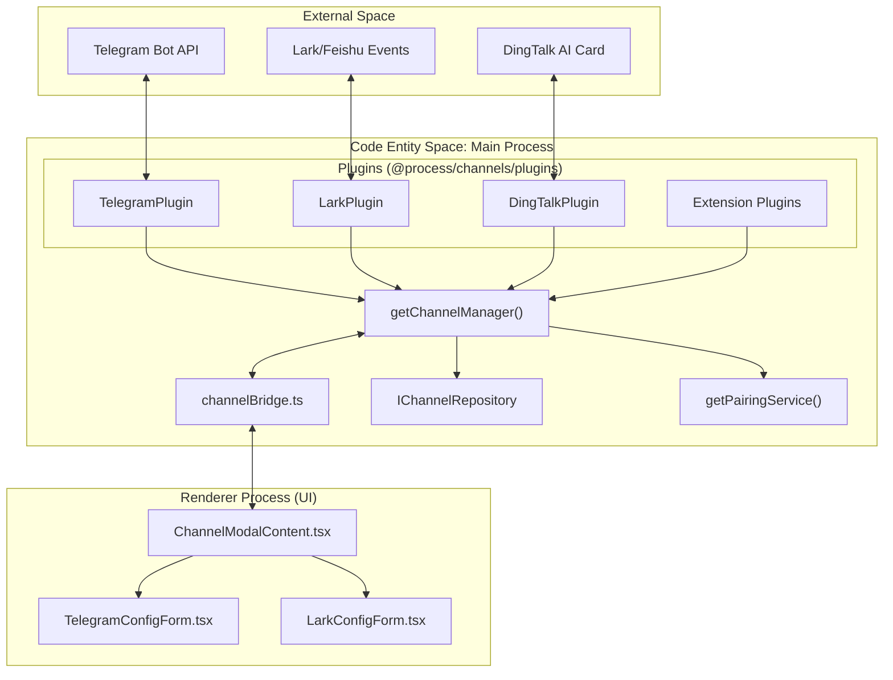

# Channel Integration

Relevant source files

The following files were used as context for generating this wiki page:

- [src/common/platform/register-electron.ts](src/common/platform/register-electron.ts)
- [src/common/platform/register-node.ts](src/common/platform/register-node.ts)
- [src/process/bridge/channelBridge.ts](src/process/bridge/channelBridge.ts)
- [src/process/bridge/fsBridge.ts](src/process/bridge/fsBridge.ts)
- [src/renderer/components/settings/SettingsModal/contents/WebuiModalContent.tsx](src/renderer/components/settings/SettingsModal/contents/WebuiModalContent.tsx)
- [src/renderer/components/settings/SettingsModal/contents/channels/ChannelModalContent.tsx](src/renderer/components/settings/SettingsModal/contents/channels/ChannelModalContent.tsx)
- [src/renderer/components/settings/SettingsModal/contents/channels/DingTalkConfigForm.tsx](src/renderer/components/settings/SettingsModal/contents/channels/DingTalkConfigForm.tsx)
- [src/renderer/components/settings/SettingsModal/contents/channels/LarkConfigForm.tsx](src/renderer/components/settings/SettingsModal/contents/channels/LarkConfigForm.tsx)
- [src/renderer/components/settings/SettingsModal/contents/channels/TelegramConfigForm.tsx](src/renderer/components/settings/SettingsModal/contents/channels/TelegramConfigForm.tsx)
- [src/renderer/pages/settings/AgentSettings/AssistantManagement/AddCustomPathModal.tsx](src/renderer/pages/settings/AgentSettings/AssistantManagement/AddCustomPathModal.tsx)
- [src/renderer/pages/settings/DisplaySettings/CssThemeModal.tsx](src/renderer/pages/settings/DisplaySettings/CssThemeModal.tsx)
- [src/renderer/pages/settings/SkillsHubSettings.tsx](src/renderer/pages/settings/SkillsHubSettings.tsx)
- [tests/unit/ChannelModelSelectionRestore.dom.test.tsx](tests/unit/ChannelModelSelectionRestore.dom.test.tsx)
- [tests/unit/SkillsHubSettings.dom.test.tsx](tests/unit/SkillsHubSettings.dom.test.tsx)
- [tests/unit/fsBridge.skills.test.ts](tests/unit/fsBridge.skills.test.ts)
- [tests/unit/platform/NodePlatformServices.test.ts](tests/unit/platform/NodePlatformServices.test.ts)
- [tests/unit/process/bridge/fsBridge.downloadRemoteBuffer.test.ts](tests/unit/process/bridge/fsBridge.downloadRemoteBuffer.test.ts)
- [tests/unit/process/bridge/fsBridge.readFile.test.ts](tests/unit/process/bridge/fsBridge.readFile.test.ts)
- [tests/unit/process/bridge/fsBridge.standalone.test.ts](tests/unit/process/bridge/fsBridge.standalone.test.ts)
- [tests/unit/skillsMarket.test.ts](tests/unit/skillsMarket.test.ts)

## Purpose and Scope

This document describes AionUi's channel plugin system for integrating external chat platforms (Telegram, Lark/Feishu, DingTalk, WeChat, Slack, Discord) with the application's AI agents. Channel integration enables users to interact with AionUi agents directly from their preferred messaging platforms.

This is a **parent page**. For deep technical implementation details, see:
- [Channel Architecture](#6.1) — Detailed documentation on the `ChannelManager`, plugin lifecycle, and the IPC bridge.
- [Platform Integrations](#6.2) — Specific details for Telegram, Lark, DingTalk, and the pairing/authorization flow.

---

## Channel Plugin Architecture

The channel system operates as a plugin-based architecture managed by a central `ChannelManager`. It bridges external messaging platforms to AionUi's internal agent execution layer. Each platform integration is treated as a plugin that can be dynamically enabled, disabled, and configured.

### Core Components and Code Entities

**Sources:** [src/process/bridge/channelBridge.ts:7-20](), [src/process/bridge/channelBridge.ts:26-27](), [src/renderer/components/settings/SettingsModal/contents/channels/ChannelModalContent.tsx:22-25]()

---

## Plugin Management and Lifecycle

The system supports both **Built-in Plugins** and **Extension Plugins**. Built-in types include `telegram`, `lark`, `dingtalk`, `slack`, `discord`, and `weixin` [src/process/bridge/channelBridge.ts:36-36](). Extensions can contribute additional channel types via the `ExtensionRegistry` [src/process/bridge/channelBridge.ts:46-48]().

### Plugin Status States
The `IChannelPluginStatus` interface tracks the state of each integration:
- **`enabled`**: Whether the user has activated the plugin in settings [src/process/bridge/channelBridge.ts:108-108]().
- **`status`**: Current operational state (e.g., `running`, `stopped`) [src/process/bridge/channelBridge.ts:110-110]().
- **`hasToken`**: Verification that necessary credentials (API keys/tokens) are provided [src/process/bridge/channelBridge.ts:113-113]().
- **`isExtension`**: Boolean flag distinguishing built-in plugins from third-party extensions [src/process/bridge/channelBridge.ts:114-114]().

### Initialization and Sync
The `ChannelBridge` facilitates synchronization between the UI and the backend.
1. **Discovery**: `getPluginStatus.provider` scans the `channelRepo` and `ExtensionRegistry` to build the status map [src/process/bridge/channelBridge.ts:34-117]().
2. **Configuration**: Users provide credentials and model preferences. Settings are persisted via `ConfigStorage` [src/renderer/components/settings/SettingsModal/contents/channels/ChannelModalContent.tsx:121-122]().
3. **Activation**: `channel.enablePlugin.provider` triggers the `ChannelManager` to start the plugin with the provided config [src/process/bridge/channelBridge.ts:174-183]().
4. **Settings Sync**: Changes to agents or models are synchronized to active plugins via `channel.syncChannelSettings` [src/renderer/components/settings/SettingsModal/contents/channels/TelegramConfigForm.tsx:159-161]().

**Sources:** [src/process/bridge/channelBridge.ts:34-169](), [src/renderer/components/settings/SettingsModal/contents/channels/ChannelModalContent.tsx:49-114](), [src/renderer/components/settings/SettingsModal/contents/channels/TelegramConfigForm.tsx:156-167]()

---

## User Authorization and Pairing

AionUi implements a pairing mechanism to authorize external users and link them to specific internal agent contexts.

### Pairing Flow
1. **Request**: A user on an external platform (e.g., Telegram) sends a message. If unauthorized, a pairing request is generated.
2. **Notification**: The `channel.pairingRequested` event is emitted to the renderer [src/renderer/components/settings/SettingsModal/contents/channels/TelegramConfigForm.tsx:171-180]().
3. **Approval**: The administrator views `pendingPairings` in the settings UI and approves or denies the request [src/renderer/components/settings/SettingsModal/contents/channels/TelegramConfigForm.tsx:82-94]().
4. **Authorization**: Once approved, the user is added to `authorizedUsers` and can interact with the bot [src/renderer/components/settings/SettingsModal/contents/channels/TelegramConfigForm.tsx:97-109]().

### Default Agent and Model
Administrators can configure default agents and models per channel. For example, Telegram can be configured to use a specific `backend` (e.g., `gemini`) and a specific model reference [src/renderer/components/settings/SettingsModal/contents/channels/TelegramConfigForm.tsx:139-147]().

**Sources:** [src/renderer/components/settings/SettingsModal/contents/channels/TelegramConfigForm.tsx:70-115](), [src/renderer/components/settings/SettingsModal/contents/channels/LarkConfigForm.tsx:88-118]()

---

## Platform-Specific Integrations

The UI provides specialized configuration forms for each major platform:

| Platform | Form Component | Key Credentials |
| :--- | :--- | :--- |
| **Telegram** | `TelegramConfigForm` | Bot Token [src/renderer/components/settings/SettingsModal/contents/channels/TelegramConfigForm.tsx:64-64]() |
| **Lark** | `LarkConfigForm` | App ID, App Secret, Encrypt Key [src/renderer/components/settings/SettingsModal/contents/channels/LarkConfigForm.tsx:66-68]() |
| **DingTalk** | `DingTalkConfigForm` | Client ID, Client Secret [src/renderer/components/settings/SettingsModal/contents/channels/DingTalkConfigForm.tsx:1-10]() |
| **WeChat** | `WeixinConfigForm` | Account credentials [src/renderer/components/settings/SettingsModal/contents/channels/WeixinConfigForm.tsx:1-10]() |

### WebUI Integration
The channel system is often used in conjunction with the WebUI server. The `WebuiModalContent` provides access to the QR code login system, which allows mobile users to link their devices to the desktop instance [src/renderer/components/settings/SettingsModal/contents/WebuiModalContent.tsx:97-101]().

**Sources:** [src/renderer/components/settings/SettingsModal/contents/channels/ChannelModalContent.tsx:22-25](), [src/renderer/components/settings/SettingsModal/contents/WebuiModalContent.tsx:73-101]()

---

## Extension and Custom Channels

Extensions can extend the channel system by contributing `channelPlugins` in their manifest.

### Metadata Resolution
The `ChannelBridge` resolves extension-specific UI elements:
- **Credential Fields**: Dynamically rendered fields defined by the extension [src/process/bridge/channelBridge.ts:55-55]().
- **Config Fields**: Additional configuration parameters [src/process/bridge/channelBridge.ts:56-56]().
- **Icon Resolution**: Support for `aion-asset://` and local file paths converted to asset URLs [src/process/bridge/channelBridge.ts:67-79]().

### Dynamic Rendering
The `ChannelModalContent` uses the `extensionMeta` to render configuration inputs for non-builtin channels, supporting field types like `text`, `password`, `select`, `number`, and `boolean` [src/renderer/components/settings/SettingsModal/contents/channels/ChannelModalContent.tsx:33-42]().

**Sources:** [src/process/bridge/channelBridge.ts:48-86](), [src/renderer/components/settings/SettingsModal/contents/channels/ChannelModalContent.tsx:33-45]()