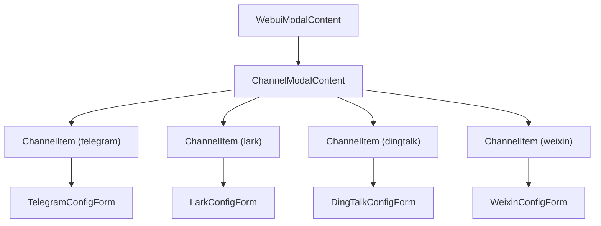
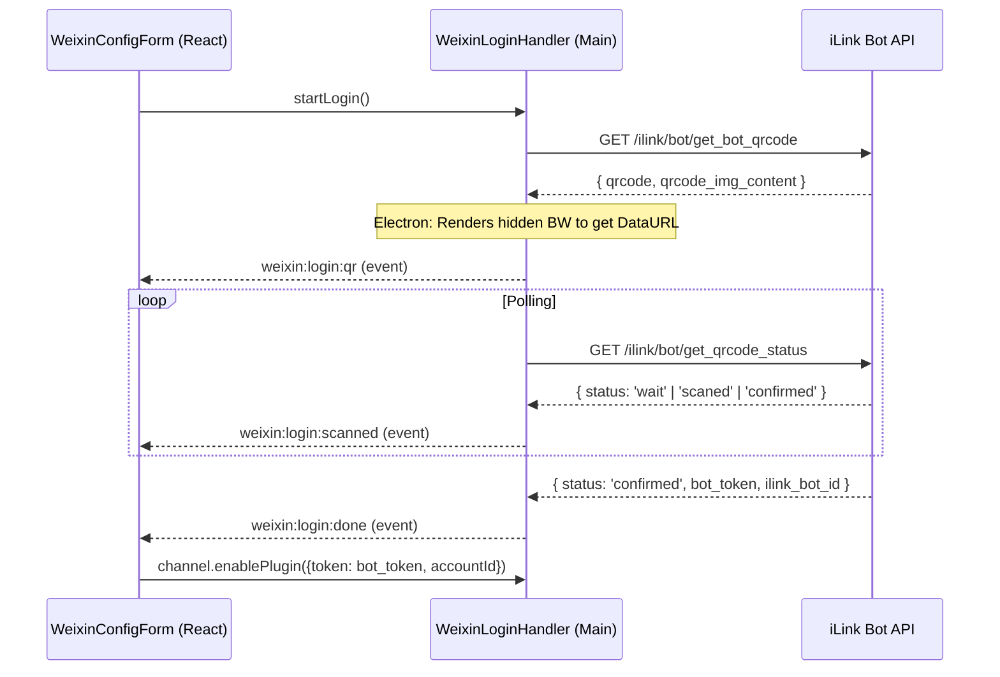
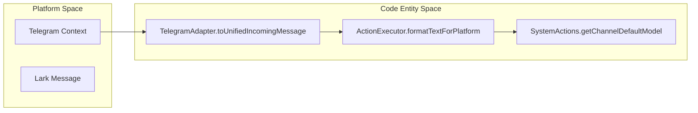

# Platform Integrations

Relevant source files

The following files were used as context for generating this wiki page:

- [src/process/agent/acp/AcpAdapter.ts](src/process/agent/acp/AcpAdapter.ts)
- [src/process/bridge/channelBridge.ts](src/process/bridge/channelBridge.ts)
- [src/process/channels/actions/SystemActions.ts](src/process/channels/actions/SystemActions.ts)
- [src/process/channels/gateway/ActionExecutor.ts](src/process/channels/gateway/ActionExecutor.ts)
- [src/process/channels/plugins/telegram/TelegramAdapter.ts](src/process/channels/plugins/telegram/TelegramAdapter.ts)
- [src/process/task/workerTaskManagerSingleton.ts](src/process/task/workerTaskManagerSingleton.ts)
- [tests/unit/acpAdapter.test.ts](tests/unit/acpAdapter.test.ts)
- [tests/unit/acpAdapterUserMessageChunk.test.ts](tests/unit/acpAdapterUserMessageChunk.test.ts)
- [tests/unit/acpAgentSetModel.test.ts](tests/unit/acpAgentSetModel.test.ts)
- [tests/unit/channels/telegramAdapter.test.ts](tests/unit/channels/telegramAdapter.test.ts)
- [tests/unit/channels/weixinSystemActions.test.ts](tests/unit/channels/weixinSystemActions.test.ts)
- [tests/unit/workerTaskManagerSingleton.test.ts](tests/unit/workerTaskManagerSingleton.test.ts)

This page documents the configuration UI and specific integration flows for the messaging platform channels supported by AionUi: **Telegram**, **Lark/Feishu**, **DingTalk**, and **WeChat (Weixin)**. It covers the React components, IPC bridge methods, and platform-specific authentication flows (including QR-code login for WeChat).

For the underlying backend architecture that processes messages from these platforms (plugin lifecycle, session management, pairing codes), see [Channel Architecture (6.1)]().

---

## Entry Point

Channel configuration is managed within the **Settings → Remote / WebUI** modal. The `WebuiModalContent` component orchestrates the display of the **Channels** tab.

In the renderer process, `ChannelModalContent` serves as the primary container. It retrieves plugin states via `channel.getPluginStatus.invoke()` [[src/process/bridge/channelBridge.ts:34-169]]() and listens for real-time updates via the `channel.pluginStatusChanged` emitter.

### UI Component Hierarchy

Sources: [[src/process/bridge/channelBridge.ts:34-169]]()

---

## WeChat (Weixin) Integration

The WeChat integration utilizes the **iLink Bot API**. Unlike other platforms that use static tokens, WeChat requires a dynamic QR-code login flow to obtain a `botToken` and `accountId`.

### Login Flow (Desktop vs. WebUI)

The system supports two distinct login modes depending on how AionUi is running:

1.  **Desktop (Electron) Mode**: Uses a hidden `BrowserWindow` to render the WeChat QR page and extract the canvas as a base64 Data URL.
2.  **WebUI (Browser) Mode**: Uses an **Server-Sent Events (SSE)** stream at `/api/channel/weixin/login` to push login states (`qr`, `scanned`, `done`) to the browser.

### WeChat Login Sequence

Sources: [[src/process/bridge/channelBridge.ts:174-188]]()

---

## Platform Configuration Details

### Telegram
- **Credential**: Bot Token from `@BotFather`.
- **Adapter**: `TelegramAdapter` converts between Telegram's `grammy` Context and the system's `IUnifiedIncomingMessage` [[src/process/channels/plugins/telegram/TelegramAdapter.ts:32-75]]().
- **Formatting**: Uses `markdownToTelegramHtml` to convert Markdown to Telegram-compatible HTML tags like `<b>`, `<i>`, and `<pre><code>` [[src/process/channels/plugins/telegram/TelegramAdapter.ts:267-310]]().

### Lark / Feishu
- **Credentials**: `App ID`, `App Secret`, and optional `Encrypt Key` / `Verification Token`.
- **Implementation**: Uses `LarkCards` to generate interactive message cards for main menus and tool confirmations [[src/process/channels/gateway/ActionExecutor.ts:42-50]]().

### DingTalk
- **Credentials**: `Client ID` and `Client Secret`.
- **Implementation**: Uses `DingTalkCards` for specialized AI Card Stream UI components [[src/process/channels/gateway/ActionExecutor.ts:56-61]]().

---

## Model and Agent Selection

Each platform allows users to bind a specific AI agent and model. The system uses `getChannelDefaultModel` to resolve the provider and model for each platform [[src/process/channels/actions/SystemActions.ts:56-150]]().

### Model Resolution Logic

| Scenario | Resolution Logic |
|---|---|
| **Saved Selection** | Reads from `assistant.{platform}.defaultModel` in `ConfigStorage` [[src/process/channels/actions/SystemActions.ts:71-78]](). |
| **Google Auth** | Checks for `~/.gemini/oauth_creds.json`. If present, uses `GOOGLE_AUTH_PROVIDER_ID` [[src/process/channels/actions/SystemActions.ts:80-108]](). |
| **API Key Fallback** | Searches for any Gemini provider with a valid API key [[src/process/channels/actions/SystemActions.ts:132-139]](). |
| **Global Fallback** | Uses the first available provider with an API key [[src/process/channels/actions/SystemActions.ts:141-149]](). |

### Agent and Message Flow

Incoming platform messages are processed by `ActionExecutor`, which formats responses based on the platform's specific markdown or HTML requirements [[src/process/channels/gateway/ActionExecutor.ts:103-117]]().

Sources: [[src/process/channels/plugins/telegram/TelegramAdapter.ts:32-75]](), [[src/process/channels/gateway/ActionExecutor.ts:103-117]](), [[src/process/channels/actions/SystemActions.ts:56-150]]()

---

## Pairing and Authorization

All platforms share a unified pairing flow to authorize external users:

1.  **Request**: An unauthorized user messages the bot. The bot replies with a pairing code.
2.  **Notification**: The main process emits `channel.pairingRequested` [[src/process/bridge/channelBridge.ts:137-144]]().
3.  **Approval**: The admin clicks "Approve" in the Settings UI, calling `channel.approvePairing.invoke({ code })`.
4.  **Persistence**: The user is added to the authorized list in the database.

### IPC Bridge Reference (Channel Namespace)

| Method | Purpose |
|---|---|
| `getPluginStatus` | Returns status, connection state, and metadata for all plugins [[src/process/bridge/channelBridge.ts:34-169]](). |
| `enablePlugin` | Persists credentials and starts the platform bot [[src/process/bridge/channelBridge.ts:174-188]](). |
| `disablePlugin` | Stops the running bot instance [[src/process/bridge/channelBridge.ts:194-207]](). |
| `testPlugin` | Validates credentials without enabling the plugin [[src/process/bridge/channelBridge.ts:212-225]](). |

Sources: [[src/process/bridge/channelBridge.ts:26-225]](), [[src/process/channels/actions/SystemActions.ts:56-150]]()