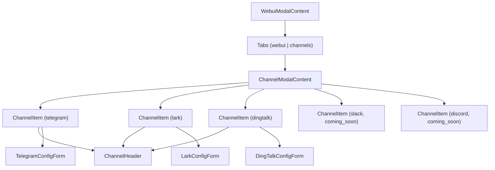
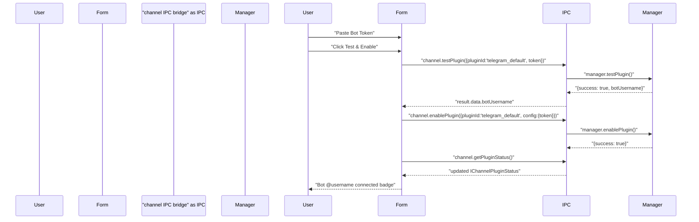
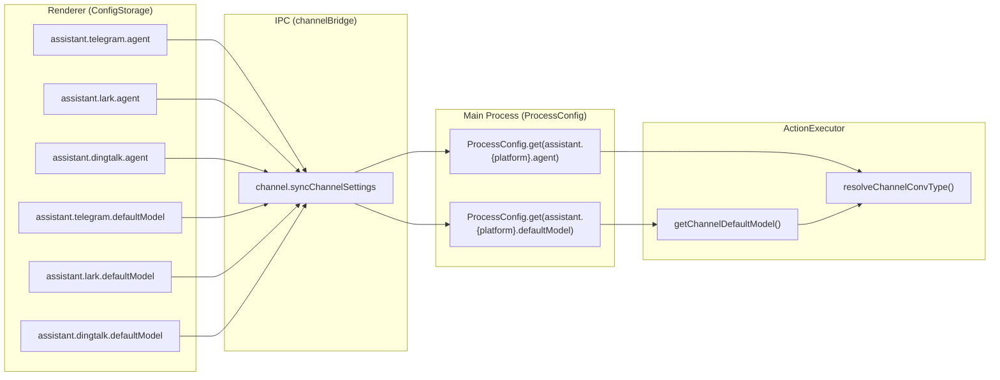
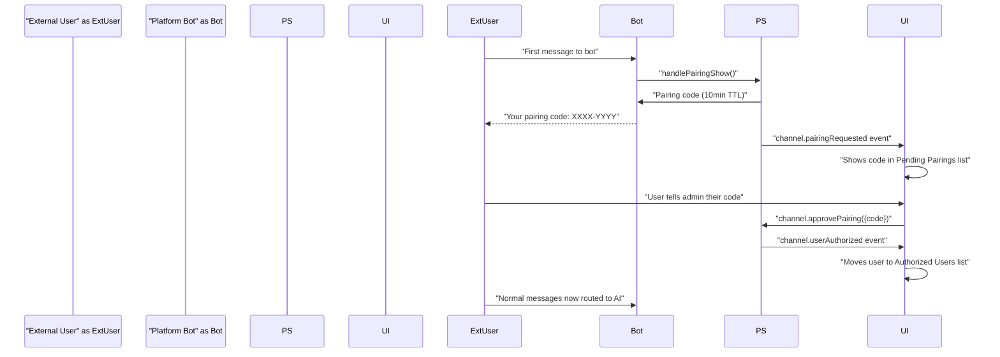
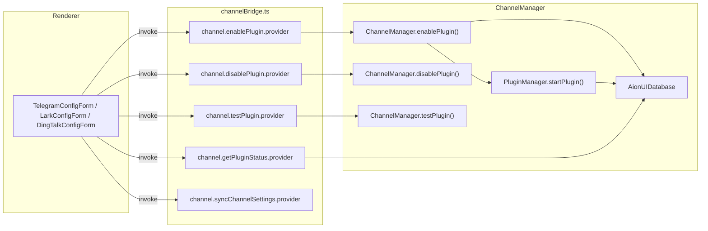

# Platform Integrations

Relevant source files

The following files were used as context for generating this wiki page:

- [readme.md](readme.md)
- [readme_ch.md](readme_ch.md)
- [readme_es.md](readme_es.md)
- [readme_jp.md](readme_jp.md)
- [readme_ko.md](readme_ko.md)
- [readme_pt.md](readme_pt.md)
- [readme_tr.md](readme_tr.md)
- [readme_tw.md](readme_tw.md)
- [resources/wechat_group4.png](resources/wechat_group4.png)

This page documents the configuration UI for the three active messaging platform integrations: **Telegram**, **Lark/Feishu**, and **DingTalk**. It covers the React components that allow users to enter bot credentials, test connections, enable/disable bots, select AI agents and models, and manage authorized users.

For the underlying backend architecture that processes messages from these platforms (plugin lifecycle, session management, pairing codes), see [Channel Architecture](#6.1).

---

## Entry Point

Channel configuration is embedded in the **Settings → Remote / WebUI** modal. The `WebuiModalContent` component [src/renderer/components/SettingsModal/contents/WebuiModalContent.tsx:53-757]() renders two tabs: **WebUI** and **Channels**. Selecting the Channels tab renders `ChannelModalContent`.

In browser (non-Electron) mode, `WebuiModalContent` skips the tab bar entirely and renders only `ChannelModalContent` directly [src/renderer/components/SettingsModal/contents/WebuiModalContent.tsx:517-528]().

**UI Component Hierarchy**

Sources: [src/renderer/components/SettingsModal/contents/WebuiModalContent.tsx:684-720](), [src/renderer/components/SettingsModal/contents/ChannelModalContent.tsx:113-440](), [src/renderer/components/SettingsModal/contents/channels/ChannelItem.tsx](), [src/renderer/components/SettingsModal/contents/channels/ChannelHeader.tsx]()

---

## ChannelModalContent

`ChannelModalContent` [src/renderer/components/SettingsModal/contents/ChannelModalContent.tsx:113-440]() is the top-level orchestrator for all channel panels. On mount it calls `channel.getPluginStatus.invoke()` to retrieve current plugin states for all platforms, and subscribes to the `channel.pluginStatusChanged` event emitter to keep the UI in sync.

### State managed per platform

| State variable                                                  | Type                           | Purpose                              |
| --------------------------------------------------------------- | ------------------------------ | ------------------------------------ |
| `pluginStatus`                                                  | `IChannelPluginStatus \| null` | Telegram plugin status               |
| `larkPluginStatus`                                              | `IChannelPluginStatus \| null` | Lark plugin status                   |
| `dingtalkPluginStatus`                                          | `IChannelPluginStatus \| null` | DingTalk plugin status               |
| `enableLoading` / `larkEnableLoading` / `dingtalkEnableLoading` | `boolean`                      | Enable/disable in-progress indicator |
| `collapseKeys`                                                  | `Record<string, boolean>`      | Collapse state of each panel         |
| `telegramModelSelection`                                        | `GeminiModelSelection`         | Persisted model for Telegram         |
| `larkModelSelection`                                            | `GeminiModelSelection`         | Persisted model for Lark             |
| `dingtalkModelSelection`                                        | `GeminiModelSelection`         | Persisted model for DingTalk         |

### Toggle handlers

Enabling a plugin requires that credentials are already saved (`pluginStatus.hasToken`). If not, a warning toast fires and the toggle resets. Disabling calls `channel.disablePlugin` with the matching plugin ID string (`telegram_default`, `lark_default`, `dingtalk_default`).

Sources: [src/renderer/components/SettingsModal/contents/ChannelModalContent.tsx:140-302]()

---

## Channel Panel Components

### ChannelItem

`ChannelItem` [src/renderer/components/SettingsModal/contents/channels/ChannelItem.tsx]() wraps an Arco `Collapse` component. Expanding it renders the platform-specific config form from `channel.content`. The collapse toggle is separate from the enable/disable switch.

### ChannelHeader

`ChannelHeader` [src/renderer/components/SettingsModal/contents/channels/ChannelHeader.tsx]() displays:

- Platform logo SVG (`channel-logos/telegram.svg`, `lark.svg`, `dingtalk.svg`, etc.)
- Channel title
- A `coming_soon` tag for Slack and Discord
- An Arco `Switch` for enabling/disabling the bot

The switch `onClick` is `stopPropagation`-guarded to prevent triggering the collapse toggle.

### ChannelConfig type

The `ChannelConfig` type (in `src/renderer/components/SettingsModal/contents/channels/types.ts`) carries:

| Field          | Description                                      |
| -------------- | ------------------------------------------------ |
| `id`           | Platform key (`telegram`, `lark`, `dingtalk`, …) |
| `status`       | `'active'` or `'coming_soon'`                    |
| `enabled`      | Whether the bot is currently on                  |
| `isConnected`  | Whether the plugin's WebSocket/polling is live   |
| `botUsername`  | Bot username if connected (Telegram)             |
| `defaultModel` | Display name of the selected model               |
| `content`      | The platform-specific `React.ReactNode` form     |

Sources: [src/renderer/components/SettingsModal/contents/channels/ChannelItem.tsx](), [src/renderer/components/SettingsModal/contents/channels/ChannelHeader.tsx](), [src/renderer/components/SettingsModal/contents/ChannelModalContent.tsx:303-363]()

---

## Platform Configuration Forms

### Telegram — TelegramConfigForm

`TelegramConfigForm` [src/renderer/components/SettingsModal/contents/TelegramConfigForm.tsx]() is the simplest of the three forms. It requires a single credential: a **Bot Token** obtained from Telegram's `@BotFather`.

**Setup flow:**

Sources: [src/renderer/components/SettingsModal/contents/TelegramConfigForm.tsx:171-225]()

**Credential locking:** When `authorizedUsers.length > 0`, the token input is disabled with a tooltip explaining that the channel must be disabled and all authorized users removed before credentials can be changed [src/renderer/components/SettingsModal/contents/TelegramConfigForm.tsx:303-316]().

---

### Lark / Feishu — LarkConfigForm

`LarkConfigForm` [src/renderer/components/SettingsModal/contents/LarkConfigForm.tsx]() requires two mandatory credentials and has optional security fields:

| Field              | Required | Description                                        |
| ------------------ | -------- | -------------------------------------------------- |
| App ID             | ✓        | From Feishu Developer Console (`cli_xxxxxxxxxx`)   |
| App Secret         | ✓        | From Feishu Developer Console                      |
| Encrypt Key        | —        | For event encryption (Event Subscription settings) |
| Verification Token | —        | For event verification                             |

Optional fields are hidden under a collapsible toggle. The `LARK_DEV_DOCS_URL` constant [src/renderer/components/SettingsModal/contents/LarkConfigForm.tsx:59]() points to the Feishu bot echo bot documentation.

The `handleTestConnection` function [src/renderer/components/SettingsModal/contents/LarkConfigForm.tsx:188-256]() calls `channel.testPlugin` with `extraConfig: {appId, appSecret}` instead of a `token` field. On success it automatically calls `handleAutoEnable` which calls `channel.enablePlugin` with the full credentials object (including optional fields).

The `IPluginCredentials` interface for Lark [src/channels/types.ts:22-33]() uses `appId`, `appSecret`, `encryptKey`, and `verificationToken` fields, while Telegram uses `token` and DingTalk uses `clientId` / `clientSecret`.

Sources: [src/renderer/components/SettingsModal/contents/LarkConfigForm.tsx:61-256](), [src/channels/types.ts:22-33]()

---

### DingTalk — DingTalkConfigForm

`DingTalkConfigForm` follows the same pattern as `LarkConfigForm` and requires:

| Field         | Description                 |
| ------------- | --------------------------- |
| Client ID     | From DingTalk Open Platform |
| Client Secret | From DingTalk Open Platform |

DingTalk uses a WebSocket Stream connection via the `dingtalk-stream` SDK, established in `DingTalkPlugin` [src/channels/plugins/dingtalk/DingTalkPlugin.ts:104-119](). The credentials flow through `channel.enablePlugin` into `ChannelManager.enablePlugin`, which extracts `clientId` and `clientSecret` from the config object [src/channels/core/ChannelManager.ts:232-240]().

Sources: [src/channels/core/ChannelManager.ts:218-243](), [src/channels/plugins/dingtalk/DingTalkPlugin.ts:89-99]()

---

## Model and Agent Selection

Each platform config form contains two independent selectors: a **model selector** and an **agent selector**.

### Model selector — useChannelModelSelection

`ChannelModalContent` creates one `GeminiModelSelection` per platform using the `useChannelModelSelection` internal hook [src/renderer/components/SettingsModal/contents/ChannelModalContent.tsx:36-108](). This hook:

1. Reads the persisted model ref from `ConfigStorage` at the key `assistant.{platform}.defaultModel`.
2. Resolves it against the provider list from `useModelProviderList`.
3. Passes the resolved `TProviderWithModel` as `initialModel` to `useGeminiModelSelection` (avoids triggering the toast on mount).
4. On user selection, persists to `ConfigStorage` and calls `channel.syncChannelSettings.invoke({platform, agent, model})`.

**Config keys:**

| Platform | Config key                        |
| -------- | --------------------------------- |
| Telegram | `assistant.telegram.defaultModel` |
| Lark     | `assistant.lark.defaultModel`     |
| DingTalk | `assistant.dingtalk.defaultModel` |

The main process reads these via `ProcessConfig.get('assistant.{platform}.defaultModel')` inside `getChannelDefaultModel` [src/channels/actions/SystemActions.ts:30-86]() when creating a new conversation for an incoming message.

### Agent selector

Each config form independently loads available agents via `acpConversation.getAvailableAgents.invoke()`. The list is filtered to exclude preset agents [src/renderer/components/SettingsModal/contents/TelegramConfigForm.tsx:113-115](). A dropdown allows the user to choose among:

| Backend value      | Channel agent type | Display     |
| ------------------ | ------------------ | ----------- |
| `gemini`           | `gemini`           | 🤖 Gemini   |
| `claude`           | `acp`              | 🧠 Claude   |
| `codex`            | `codex`            | ⚡ Codex    |
| `openclaw-gateway` | `openclaw-gateway` | 🦞 OpenClaw |

The selection is persisted to `assistant.{platform}.agent` via `ConfigStorage.set` and synchronized via `channel.syncChannelSettings` [src/renderer/components/SettingsModal/contents/TelegramConfigForm.tsx:135-144]().

**Config and IPC mapping**

Sources: [src/renderer/components/SettingsModal/contents/ChannelModalContent.tsx:36-108](), [src/channels/actions/SystemActions.ts:30-86](), [src/channels/gateway/ActionExecutor.ts:350-362]()

---

## Pairing and Authorized User Management

All three config forms share identical pairing and user management UI patterns.

### Pending pairing requests

On mount, the form calls `channel.getPendingPairings.invoke()` and filters results for its own platform. It also subscribes to `channel.pairingRequested` to receive real-time updates when a new user scans a code. Each pending request shows:

- Display name
- Pairing code
- Request time
- Remaining TTL in minutes
- Approve / Reject buttons

`handleApprovePairing` calls `channel.approvePairing.invoke({code})`. `handleRejectPairing` calls `channel.rejectPairing.invoke({code})`.

### Authorized users

`channel.getAuthorizedUsers.invoke()` loads the current list. The form also listens to `channel.userAuthorized` for real-time additions when a pairing is approved on the main process side. Each authorized user entry shows:

- Display name, platform user ID
- Authorization timestamp
- A revoke button that calls `channel.revokeUser.invoke({userId})`

### Credential locking rule

When `authorizedUsers.length > 0`, all credential fields are disabled and wrapped in `<Tooltip>` with a message explaining that the channel must be disabled and all users removed before credentials can be modified [src/renderer/components/SettingsModal/contents/LarkConfigForm.tsx:352-368]().

**Pairing lifecycle**

Sources: [src/renderer/components/SettingsModal/contents/TelegramConfigForm.tsx:72-169](), [src/renderer/components/SettingsModal/contents/LarkConfigForm.tsx:84-185](), [src/process/bridge/channelBridge.ts:101-200]()

---

## IPC Bridge Reference

The renderer communicates with the main process channel system exclusively through the `channel` IPC bridge namespace. All calls are defined in `src/process/bridge/channelBridge.ts` and `src/common/ipcBridge.ts`.

**IPC calls used by the platform integration UI:**

| IPC call                      | Direction  | Purpose                                      |
| ----------------------------- | ---------- | -------------------------------------------- |
| `channel.getPluginStatus`     | invoke     | Get `IChannelPluginStatus[]` for all plugins |
| `channel.enablePlugin`        | invoke     | Start a plugin with given config             |
| `channel.disablePlugin`       | invoke     | Stop a running plugin                        |
| `channel.testPlugin`          | invoke     | Validate credentials without persisting      |
| `channel.getPendingPairings`  | invoke     | Fetch pending `IChannelPairingRequest[]`     |
| `channel.getAuthorizedUsers`  | invoke     | Fetch `IChannelUser[]`                       |
| `channel.approvePairing`      | invoke     | Approve a pending pairing by code            |
| `channel.rejectPairing`       | invoke     | Reject a pending pairing by code             |
| `channel.revokeUser`          | invoke     | Remove an authorized user                    |
| `channel.syncChannelSettings` | invoke     | Push agent + model selection to main process |
| `channel.pluginStatusChanged` | event (on) | Plugin status updates                        |
| `channel.pairingRequested`    | event (on) | New pairing request notification             |
| `channel.userAuthorized`      | event (on) | Pairing approval confirmation                |

**IPC-to-ChannelManager code path**

Sources: [src/process/bridge/channelBridge.ts:18-200](), [src/channels/core/ChannelManager.ts:204-320]()

---

## Plugin Credential Handling

When `enablePlugin` is called, `ChannelManager.enablePlugin` [src/channels/core/ChannelManager.ts:204-300]() extracts credentials from the config map depending on `pluginType`:

- `telegram` → reads `config.token`
- `lark` → reads `config.appId`, `config.appSecret`, `config.encryptKey`, `config.verificationToken`
- `dingtalk` → reads `config.clientId`, `config.clientSecret`

These are stored as `IPluginCredentials` in the database and loaded back on startup. The `hasPluginCredentials` utility [src/channels/types.ts:39-44]() determines whether a plugin has a valid credential set, which drives the `hasToken` field on `IChannelPluginStatus` and the credential-locking logic in the config forms.

Sources: [src/channels/types.ts:22-44](), [src/channels/core/ChannelManager.ts:218-243](), [src/process/bridge/channelBridge.ts:26-53]()

---

## Slack and Discord (Coming Soon)

`ChannelModalContent` includes entries for Slack and Discord in the `channels` array, both with `status: 'coming_soon'` [src/renderer/components/SettingsModal/contents/ChannelModalContent.tsx:342-361](). Their enable switches are disabled and their collapsed content shows only a "coming soon" message. No config forms exist for these platforms.

Sources: [src/renderer/components/SettingsModal/contents/ChannelModalContent.tsx:342-363](), [src/renderer/components/SettingsModal/contents/channels/ChannelHeader.tsx:38-40]()
