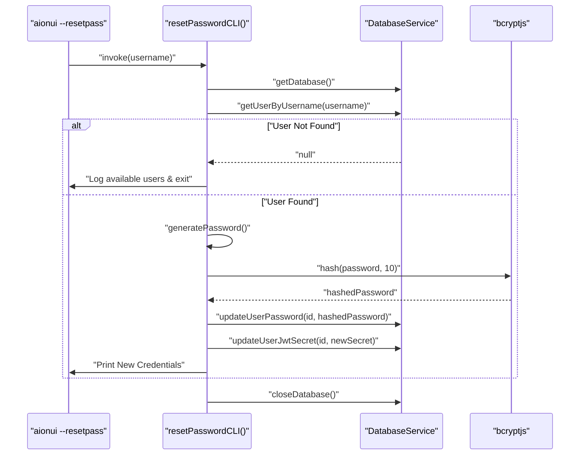
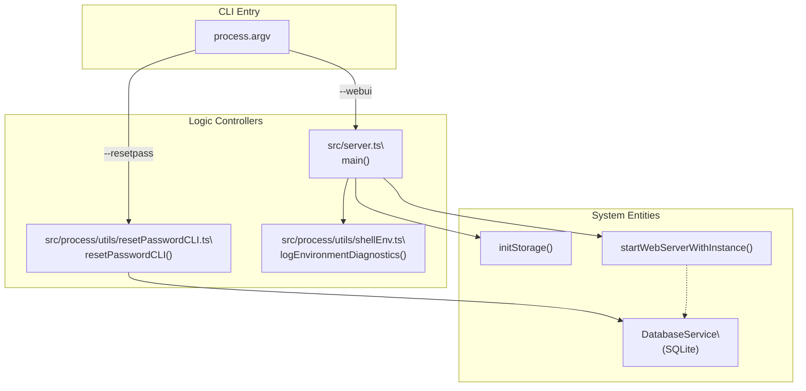

# CLI Utilities

Relevant source files

The following files were used as context for generating this wiki page:

- [src/process/agent/acp/AcpDetector.ts](src/process/agent/acp/AcpDetector.ts)
- [src/process/channels/plugins/telegram/TelegramPlugin.ts](src/process/channels/plugins/telegram/TelegramPlugin.ts)
- [src/process/utils/resetPasswordCLI.ts](src/process/utils/resetPasswordCLI.ts)
- [src/process/worker/acp.ts](src/process/worker/acp.ts)
- [src/server.ts](src/server.ts)
- [tests/unit/acpDetector.test.ts](tests/unit/acpDetector.test.ts)
- [tests/unit/common/appEnv.test.ts](tests/unit/common/appEnv.test.ts)
- [tests/unit/directoryApi.test.ts](tests/unit/directoryApi.test.ts)
- [tests/unit/extensions/extensionLoader.test.ts](tests/unit/extensions/extensionLoader.test.ts)
- [tests/unit/process/utils/resetPasswordCLI.test.ts](tests/unit/process/utils/resetPasswordCLI.test.ts)
- [tests/unit/process/utils/shellEnvDiagnostics.test.ts](tests/unit/process/utils/shellEnvDiagnostics.test.ts)

This page documents the command-line interface (CLI) features available in AionUi: the startup flags that control application mode, the `--resetpass` password reset utility, and the environment diagnostics tools. These utilities allow for headless server management, database recovery, and system troubleshooting without a graphical interface.

---

## CLI Flags Overview

AionUi's entry points (both Electron and standalone server) accept flags that modify startup behavior. In the standalone server mode (`src/server.ts`), these are parsed directly from `process.argv` [src/server.ts:24-26]().

| Flag | Argument | Description |
|---|---|---|
| `--webui` | none | Start the embedded Express web server (default in `server.ts`) [src/server.ts:113]() |
| `--remote` | none | Bind the WebUI server to `0.0.0.0` (allows LAN access) [src/server.ts:25]() |
| `--resetpass` | `[username]` | Reset the password for a specific user (defaults to `admin`) [src/server.ts:84-90]() |
| `--no-sandbox` | none | Disables Chromium sandbox; required in certain Linux/Android environments |

Sources: [src/server.ts:24-90]()

---

## WebUI Server Management

### Standalone Server (`src/server.ts`)

The `src/server.ts` file serves as the entry point for running AionUi without Electron. It handles initialization of core subsystems like storage, extensions, and channels before starting the Express server.

**Initialization Sequence:**
1. **Platform Registration**: Registers Node-specific services via `register-node` [src/server.ts:10]().
2. **Storage**: Initializes the data directory (respects `DATA_DIR` env var) [src/server.ts:93]().
3. **Extension Registry**: Scans and loads all installed extensions [src/server.ts:97]().
4. **Channel Manager**: Initializes communication plugins (Telegram, etc.) [src/server.ts:104]().
5. **Bridge**: Sets up the non-Electron IPC bridge via `initBridgeStandalone` [src/server.ts:110]().
6. **Server Start**: Launches the WebUI on the specified port [src/server.ts:113]().

Sources: [src/server.ts:1-118]()

### Environment Overrides

The server respects several environment variables for configuration:

| Variable | Description | Source |
|---|---|---|
| `PORT` | Sets the WebUI listen port (default: 3000) | [src/server.ts:24]() |
| `ALLOW_REMOTE` | Set to `true` to enable remote access (equivalent to `--remote`) | [src/server.ts:25]() |
| `DATA_DIR` | Custom path for database and configuration storage | [src/server.ts:92-93]() |

Sources: [src/server.ts:24-93]()

---

## Password Reset Utility (`--resetpass`)

### Overview

The `--resetpass` utility allows administrators to recover access to the WebUI by generating a new random password for a specified account. It operates directly on the SQLite database using the `getDatabase()` abstraction [src/process/utils/resetPasswordCLI.ts:87]().

**Execution Logic:**
- **Username Resolution**: If no username follows the flag, it defaults to `admin` [src/process/utils/resetPasswordCLI.ts:62-70]().
- **Database Check**: Verifies the database is initialized and contains users [src/process/utils/resetPasswordCLI.ts:88-103]().
- **Password Generation**: Creates a 12-character alphanumeric string [src/process/utils/resetPasswordCLI.ts:53-60]().
- **Security Rotation**: In addition to updating the `password_hash` using `bcryptjs` (10 rounds), it generates a new 64-byte `jwt_secret` to invalidate all existing sessions [src/process/utils/resetPasswordCLI.ts:133-145]().

Sources: [src/process/utils/resetPasswordCLI.ts:1-172]()

### Implementation Diagram

**`resetPasswordCLI` sequence and data flow**

Sources: [src/process/utils/resetPasswordCLI.ts:78-172]()

---

## System Diagnostics

Upon startup, the server utility executes `logEnvironmentDiagnostics` to aid in troubleshooting environment issues [src/server.ts:29]().

### Diagnostics Features
- **Tool Discovery**: Uses `resolveToolInfo` to locate binaries like `node`, `git`, `python`, and `npm` on the system PATH, capturing their paths and versions [src/process/utils/shellEnv.ts:139-191]().
- **Resource Monitoring**: Logs system memory (formatted via `formatBytes`) and CPU architecture [src/process/utils/shellEnv.ts:49-70]().
- **Path Validation**: Verifies the presence of critical directories using `fs.existsSync` [src/process/utils/shellEnv.ts:34-37]().

Sources: [src/process/utils/shellEnv.ts:1-200](), [src/server.ts:29]()

---

## CLI Entity Mapping

**Mapping CLI inputs to internal Code Entities**

Sources: [src/server.ts:83-118](), [src/process/utils/resetPasswordCLI.ts:78-172](), [src/process/utils/shellEnv.ts:197-205]()

---

## Signal Handling and Shutdown

The CLI server implements robust shutdown logic to prevent database corruption. It registers handlers for `SIGINT` and `SIGTERM` at the top level [src/server.ts:80-81]().

- **Graceful Shutdown**: Attempts to shut down the `ChannelManager`, terminates WebSocket clients, and closes the Express server [src/server.ts:58-71]().
- **Database Safety**: Explicitly calls `closeDatabase()` to ensure SQLite checkpoints the Write-Ahead Log (WAL) file [src/server.ts:66]().
- **Force Exit**: If a second signal is received, it forces an immediate exit after a final database closure attempt [src/server.ts:49-54]().

Sources: [src/server.ts:48-81]()