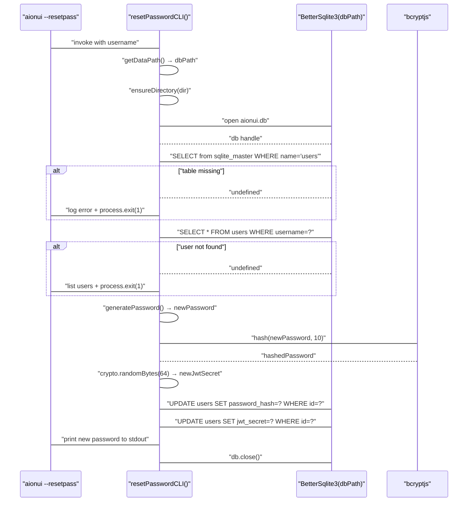
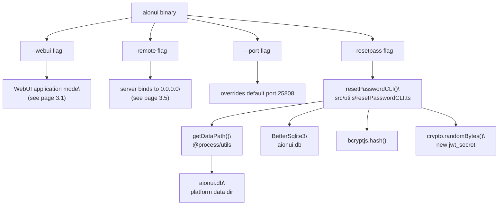

# CLI Utilities

<details>
<summary>Relevant source files</summary>

The following files were used as context for generating this wiki page:

- [.github/workflows/\_build-reusable.yml](.github/workflows/_build-reusable.yml)
- [.github/workflows/build-manual.yml](.github/workflows/build-manual.yml)
- [bun.lock](bun.lock)
- [src/index.ts](src/index.ts)
- [src/utils/configureChromium.ts](src/utils/configureChromium.ts)
- [tests/integration/autoUpdate.integration.test.ts](tests/integration/autoUpdate.integration.test.ts)
- [tests/unit/autoUpdaterService.test.ts](tests/unit/autoUpdaterService.test.ts)
- [tests/unit/test_acp_connection_disconnect.ts](tests/unit/test_acp_connection_disconnect.ts)
- [vitest.config.ts](vitest.config.ts)

</details>

This page documents the command-line interface (CLI) features available in AionUi: the startup flags that control application mode, the `--resetpass` password reset utility, and environment variable overrides. For details on how the application modes work internally once started, see [Application Modes](#3.1). For the WebUI server architecture that `--webui` activates, see [WebUI Server Architecture](#3.5).

---

## CLI Flags Overview

AionUi's executable binary accepts a set of flags that modify its startup behavior. These flags are parsed by the main process at launch.

| Flag           | Argument     | Description                                                                    |
| -------------- | ------------ | ------------------------------------------------------------------------------ |
| `--webui`      | none         | Start the embedded Express web server instead of rendering the Electron window |
| `--remote`     | none         | Bind the WebUI server to `0.0.0.0` (allows LAN access)                         |
| `--port`       | `<number>`   | Override the default WebUI listen port                                         |
| `--resetpass`  | `[username]` | Reset the password for a WebUI user (default: `admin`)                         |
| `--no-sandbox` | none         | Required in sandboxed environments such as Termux/proot-Ubuntu                 |

Sources: [WEBUI_GUIDE.md:596-603](), [WEBUI_GUIDE.md:606-673]()

---

## WebUI Mode Flags

### `--webui`

Starts AionUi without its native Electron window. Instead it launches an embedded Express HTTP server and serves the React UI over the browser. By default the server listens on `localhost:25808` (the port may vary; check terminal output).

**Platform invocation examples:**

| Platform               | Command                                                  |
| ---------------------- | -------------------------------------------------------- |
| Windows                | `"C:\Program Files\AionUi\AionUi.exe" --webui`           |
| macOS                  | `/Applications/AionUi.app/Contents/MacOS/AionUi --webui` |
| Linux (deb)            | `aionui --webui`                                         |
| Linux (AppImage)       | `./AionUi-*.AppImage --webui`                            |
| Android (Termux/proot) | `AionUi --no-sandbox --webui`                            |

Sources: [WEBUI_GUIDE.md:29-140]()

### `--remote`

When combined with `--webui`, binds the server to `0.0.0.0` instead of `127.0.0.1`, making it reachable from other devices on the same network.

```
aionui --webui --remote
```

> **Security note**: Remote mode exposes the server to the local network. Use only on trusted networks. JWT-based authentication is still enforced (see [Authentication](#9)).

Sources: [WEBUI_GUIDE.md:426-448]()

### `--port`

Overrides the default listen port:

```
aionui --webui --port 8080
```

Sources: [WEBUI_GUIDE.md:353-356](), [WEBUI_GUIDE.md:566-568]()

---

## Environment Variables

Environment variables can substitute for or supplement CLI flags. CLI flags take highest precedence, followed by environment variables, then the `webui.config.json` file.

| Variable              | Effect                                                                 |
| --------------------- | ---------------------------------------------------------------------- |
| `AIONUI_PORT`         | Sets the WebUI listen port                                             |
| `AIONUI_ALLOW_REMOTE` | `true` is equivalent to passing `--remote`                             |
| `AIONUI_HOST`         | Setting to `0.0.0.0` has the same effect as `AIONUI_ALLOW_REMOTE=true` |

Sources: [WEBUI_GUIDE.md:549-568]()

---

## User Configuration File (`webui.config.json`)

From v1.5.0 onwards, persistent WebUI startup preferences can be stored in a `webui.config.json` file in the Electron user-data directory.

| Platform | Path                                                     |
| -------- | -------------------------------------------------------- |
| Windows  | `%APPDATA%/AionUi/webui.config.json`                     |
| macOS    | `~/Library/Application Support/AionUi/webui.config.json` |
| Linux    | `~/.config/AionUi/webui.config.json`                     |

Example contents:

```json
{
  "port": 8080,
  "allowRemote": true
}
```

Sources: [WEBUI_GUIDE.md:572-592]()

---

## Password Reset — `--resetpass`

### Overview

The `--resetpass` flag is used to recover access to a WebUI account when the password has been forgotten. It operates directly on the SQLite database without starting the full application.

```
aionui --resetpass [username]
```

If `username` is omitted, it defaults to `admin`. The command:

1. Locates the database file at `<dataPath>/aionui.db`
2. Verifies the `users` table exists
3. Looks up the specified username
4. Generates a new random 12-character alphanumeric password
5. Hashes it with bcrypt (salt rounds = 10)
6. Updates `password_hash` in the database
7. Rotates `jwt_secret` (invalidating all existing sessions)
8. Prints the new password to the terminal

> **Warning**: All existing JWT tokens are invalidated immediately when `jwt_secret` is rotated. Every active browser session must re-authenticate.

Sources: [src/utils/resetPasswordCLI.ts:69-158]()

---

### `resetPasswordCLI` Implementation

The implementation lives in `src/utils/resetPasswordCLI.ts` and is invoked by the main process when it detects the `--resetpass` flag.

**Key functions and their roles:**

| Symbol              | Location                                 | Role                                                               |
| ------------------- | ---------------------------------------- | ------------------------------------------------------------------ |
| `resetPasswordCLI`  | [src/utils/resetPasswordCLI.ts:69-158]() | Main entry point; orchestrates the full reset sequence             |
| `hashPassword`      | [src/utils/resetPasswordCLI.ts:49-51]()  | Wrapper around `bcrypt.hash` with salt rounds = 10                 |
| `hashPasswordAsync` | [src/utils/resetPasswordCLI.ts:36-45]()  | Promise wrapper for the callback-based `bcrypt.hash`               |
| `generatePassword`  | [src/utils/resetPasswordCLI.ts:54-61]()  | Generates a 12-character alphanumeric password using `Math.random` |
| `getDataPath`       | (imported from `@process/utils`)         | Returns the platform-appropriate user data directory               |
| `ensureDirectory`   | (imported from `@process/utils`)         | Creates the directory if it does not exist                         |

Sources: [src/utils/resetPasswordCLI.ts:1-60]()

---

### Execution Flow Diagram

**`resetPasswordCLI` execution sequence**



Sources: [src/utils/resetPasswordCLI.ts:69-158]()

---

### Code Entity Map

**How CLI flags map to code and system components**



Sources: [src/utils/resetPasswordCLI.ts:69-158](), [WEBUI_GUIDE.md:596-673]()

---

## Linux systemd Service

For running AionUi as a persistent background service on Linux, a systemd unit file can be created at `/etc/systemd/system/aionui-webui.service`:

```ini
[Unit]
Description=AionUi WebUI Service
After=network.target

[Service]
Type=simple
User=YOUR_USERNAME
ExecStart=/opt/AionUi/aionui --webui --remote
Restart=on-failure
RestartSec=10

[Install]
WantedBy=multi-user.target
```

Enable and start:

```bash
sudo systemctl daemon-reload
sudo systemctl enable aionui-webui.service
sudo systemctl start aionui-webui.service
```

Sources: [WEBUI_GUIDE.md:186-215]()

---

## Precedence Rules

When the same setting (e.g. port, remote access) is specified in multiple places, AionUi uses this priority order:

```
CLI flag  >  Environment variable  >  webui.config.json
```

Sources: [WEBUI_GUIDE.md:589-592]()
