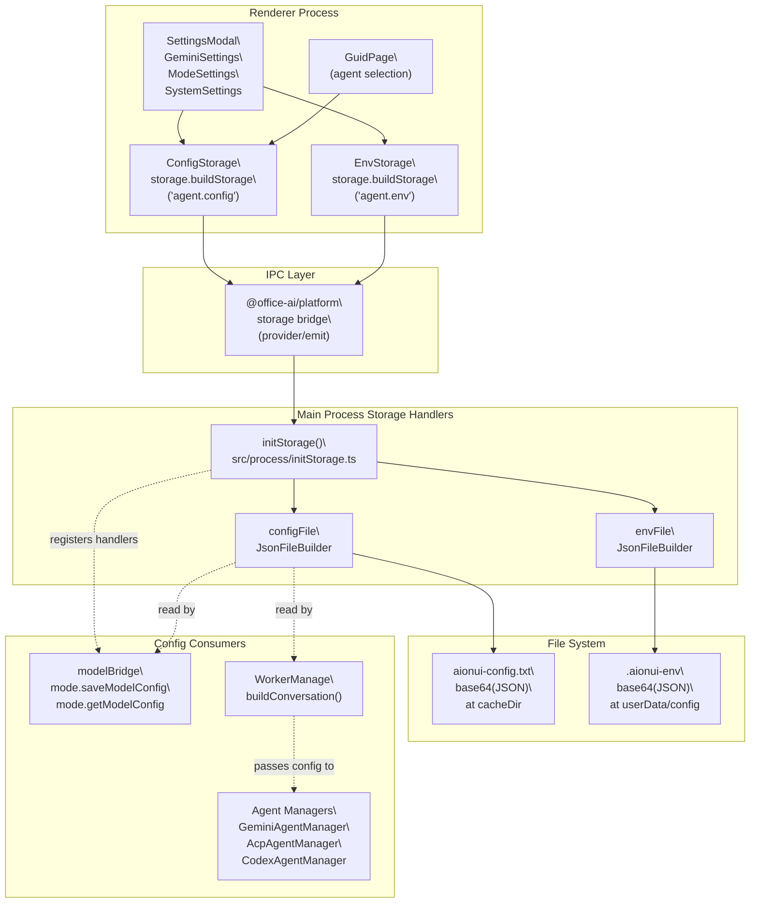

# Configuration System

<details>
<summary>Relevant source files</summary>

The following files were used as context for generating this wiki page:

- [src/common/ipcBridge.ts](src/common/ipcBridge.ts)
- [src/common/storage.ts](src/common/storage.ts)
- [src/common/utils/protocolDetector.ts](src/common/utils/protocolDetector.ts)
- [src/process/WorkerManage.ts](src/process/WorkerManage.ts)
- [src/process/bridge/modelBridge.ts](src/process/bridge/modelBridge.ts)
- [src/process/initBridge.ts](src/process/initBridge.ts)
- [src/renderer/assets/logos/minimax.png](src/renderer/assets/logos/minimax.png)
- [src/renderer/config/modelPlatforms.ts](src/renderer/config/modelPlatforms.ts)
- [src/renderer/pages/guid/index.tsx](src/renderer/pages/guid/index.tsx)
- [src/renderer/pages/settings/components/AddModelModal.tsx](src/renderer/pages/settings/components/AddModelModal.tsx)
- [src/renderer/pages/settings/components/AddPlatformModal.tsx](src/renderer/pages/settings/components/AddPlatformModal.tsx)
- [src/renderer/pages/settings/components/EditModeModal.tsx](src/renderer/pages/settings/components/EditModeModal.tsx)

</details>

The configuration system manages all persistent application preferences through a dual-process architecture with typed interfaces (`IConfigStorageRefer`, `IEnvStorageRefer`), configuration cascading from multiple sources, and hot-reload mechanisms for runtime updates.

Related pages: [Storage Architecture](#8.2) for file format and `JsonFileBuilder` internals, [Data Migration](#8.3) for migration flags and schema evolution.

---

## System Architecture

The configuration layer provides typed storage for AI provider credentials, model selections, UI preferences, MCP server lists, and channel settings. Configuration values cascade from defaults → file storage → environment variables → runtime overrides, with automatic persistence and selective hot-reload to running agents.

**Key components:**

- `ConfigStorage` (`agent.config`): typed storage interface backed by `IConfigStorageRefer`
- `EnvStorage` (`agent.env`): directory paths configuration via `IEnvStorageRefer`
- `configFile`: main process `JsonFileBuilder` instance for `aionui-config.txt`
- `envFile`: main process `JsonFileBuilder` instance for `.aionui-env`
- IPC bridge: dual-process read/write with serialization queue

**Diagram: Dual-Process Configuration Architecture**



Sources: [src/common/storage.ts:13-22](), [src/process/initStorage.ts:25-258](), [src/process/bridge/modelBridge.ts:428-469]()

## Storage Objects and Platform Keys

Four typed storage objects provide access to different data domains. Each is created via `storage.buildStorage(platformKey)` and backed by a `JsonFileBuilder` instance in the main process.

| Export Name          | Platform Key         | Interface                    | Backing File              | Purpose                                               |
| -------------------- | -------------------- | ---------------------------- | ------------------------- | ----------------------------------------------------- |
| `ConfigStorage`      | `agent.config`       | `IConfigStorageRefer`        | `aionui-config.txt`       | Application settings, model providers, UI preferences |
| `EnvStorage`         | `agent.env`          | `IEnvStorageRefer`           | `.aionui-env`             | Directory paths (workDir, cacheDir)                   |
| `ChatStorage`        | `agent.chat`         | `IChatConversationRefer`     | `aionui-chat.txt`         | Conversation metadata list                            |
| `ChatMessageStorage` | `agent.chat.message` | `Record<string, TMessage[]>` | `aionui-chat-message.txt` | Per-conversation message arrays                       |

The `STORAGE_PATH` constant in `initStorage.ts` maps logical names to filenames. All files are stored as base64-encoded JSON.

Sources: [src/common/storage.ts:13-22](), [src/process/initStorage.ts:25-32]()

---

## `IConfigStorageRefer` — Full Key Reference

The `IConfigStorageRefer` interface ([src/common/storage.ts:24-116]()) defines every key that can be stored in the config file. Keys are grouped by concern below.

### Agent Configuration

| Key                | Type Summary                          | Description                                                                                    |
| ------------------ | ------------------------------------- | ---------------------------------------------------------------------------------------------- |
| `gemini.config`    | object                                | Auth type, proxy URL, `GOOGLE_GEMINI_BASE_URL`, `accountProjects`, `yoloMode`, `preferredMode` |
| `codex.config`     | object (optional)                     | `cliPath`, `yoloMode`                                                                          |
| `acp.config`       | `{ [backend in AcpBackend]?: {...} }` | Per-backend auth tokens, CLI paths, yolo mode, preferred model/mode                            |
| `acp.customAgents` | `AcpBackendConfig[]`                  | User-defined ACP CLI agent definitions                                                         |
| `acp.cachedModels` | `Record<string, AcpModelInfo>`        | Cached model lists from ACP backends for the Guid page                                         |

### Model and Tool Configuration

| Key                          | Type Summary                                 | Description                                                                    |
| ---------------------------- | -------------------------------------------- | ------------------------------------------------------------------------------ |
| `model.config`               | `IProvider[]`                                | All configured AI model providers (OpenAI-compatible platforms, Bedrock, etc.) |
| `mcp.config`                 | `IMcpServer[]`                               | List of registered MCP servers                                                 |
| `mcp.agentInstallStatus`     | `Record<string, string[]>`                   | Tracks which MCP servers are installed per agent                               |
| `tools.imageGenerationModel` | `TProviderWithModel & { switch: boolean }`   | Default model for the image generation tool                                    |
| `gemini.defaultModel`        | `string \| { id: string; useModel: string }` | Default Gemini model selection                                                 |

### UI Preferences

| Key                 | Type Summary  | Description                                  |
| ------------------- | ------------- | -------------------------------------------- |
| `language`          | `string`      | Active UI locale (e.g. `en-US`, `zh-CN`)     |
| `theme`             | `string`      | UI theme name                                |
| `colorScheme`       | `string`      | `light` or `dark`                            |
| `customCss`         | `string`      | User-supplied CSS injected into the renderer |
| `css.themes`        | `ICssTheme[]` | Saved CSS theme presets                      |
| `css.activeThemeId` | `string`      | ID of the currently active CSS theme preset  |

### Workspace and Conversation Preferences

| Key                      | Type Summary         | Description                                                  |
| ------------------------ | -------------------- | ------------------------------------------------------------ |
| `workspace.pasteConfirm` | `boolean` (optional) | If `true`, skip the paste-into-workspace confirmation dialog |
| `guid.lastSelectedAgent` | `string` (optional)  | Last agent type selected on the home page                    |

### Channel Assistant Settings

| Key                               | Type Summary                                    | Description                            |
| --------------------------------- | ----------------------------------------------- | -------------------------------------- |
| `assistant.telegram.defaultModel` | `{ id, useModel }` (optional)                   | Default model for Telegram channel bot |
| `assistant.telegram.agent`        | `{ backend, customAgentId?, name? }` (optional) | Agent used by Telegram channel         |
| `assistant.lark.defaultModel`     | `{ id, useModel }` (optional)                   | Default model for Lark channel bot     |
| `assistant.lark.agent`            | `{ backend, customAgentId?, name? }` (optional) | Agent used by Lark channel             |
| `assistant.dingtalk.defaultModel` | `{ id, useModel }` (optional)                   | Default model for DingTalk channel bot |
| `assistant.dingtalk.agent`        | `{ backend, customAgentId?, name? }` (optional) | Agent used by DingTalk channel         |

### Migration Flags

These boolean flags prevent one-time data migrations from running more than once.

| Key                                      | Description                                         |
| ---------------------------------------- | --------------------------------------------------- |
| `migration.assistantEnabledFixed`        | Fixes old assistant `enabled` default values        |
| `migration.coworkDefaultSkillsAdded`     | **Deprecated** — superseded by `v2` flag            |
| `migration.builtinDefaultSkillsAdded_v2` | Adds default skills to all built-in assistants      |
| `migration.promptsI18nAdded`             | Adds `promptsI18n` field to all built-in assistants |

Sources: [src/common/storage.ts:24-116]()

---

## `IEnvStorageRefer` — Directory Configuration

The `EnvStorage` object stores only one key:

| Key          | Type                                    | Description                                                    |
| ------------ | --------------------------------------- | -------------------------------------------------------------- |
| `aionui.dir` | `{ workDir: string; cacheDir: string }` | Paths for the user's workspace root and config cache directory |

This key is read **synchronously** at main process startup (`envFile.getSync('aionui.dir')`) to determine where `configFile` should be located on disk. Changing `cacheDir` moves where `aionui-config.txt` is written.

Sources: [src/common/storage.ts:118-123](), [src/process/initStorage.ts:248-254]()

## Main Process Initialization

At startup, `initStorage()` constructs `envFile` and `configFile` `JsonFileBuilder` instances. The `envFile` is read **synchronously** to resolve the `cacheDir` path before constructing `configFile`.

**Diagram: Startup Path Resolution Sequence**

```mermaid
sequenceDiagram
  participant APP as "app.on('ready')"
  participant INIT as "initStorage()"
  participant GCP as "getConfigPath()"
  participant ENVFILE as "envFile\
JsonFileBuilder"
  participant ENVDISK as ".aionui-env"
  participant CONFIGFILE as "configFile\
JsonFileBuilder"
  participant CONFIGDISK as "aionui-config.txt"

  APP->>INIT: call initStorage()
  INIT->>GCP: getConfigPath()
  GCP-->>INIT: userData/config
  INIT->>ENVFILE: new JsonFileBuilder(path)
  INIT->>ENVFILE: envFile.getSync('aionui.dir')
  ENVFILE->>ENVDISK: readFileSync + base64 decode
  ENVDISK-->>ENVFILE: { cacheDir, workDir }
  ENVFILE-->>INIT: returns cacheDir or default
  INIT->>CONFIGFILE: new JsonFileBuilder(cacheDir/aionui-config.txt)
  CONFIGFILE->>CONFIGDISK: ready for async reads/writes
```

**File path mapping** (from `STORAGE_PATH`):

```
config         →  aionui-config.txt
chatMessage    →  aionui-chat-message.txt
chat           →  aionui-chat.txt
env            →  .aionui-env
assistants     →  assistants/    (directory)
skills         →  skills/        (directory)
```

**JsonFileBuilder capabilities:**

- Sequential async queue: all operations serialized to prevent race conditions
- Base64 encoding: `btoa(encodeURIComponent(JSON.stringify(data)))`
- Synchronous read: `toJsonSync()` via `readFileSync` for startup-critical reads

Sources: [src/process/initStorage.ts:25-35](), [src/process/initStorage.ts:248-258](), [src/process/initStorage.ts:106-246]()

## Renderer Process Access

Components import `ConfigStorage` from `src/common/storage.ts` and call async methods. The `storage.buildStorage('agent.config')` factory returns a proxy that communicates over IPC with the main process.

**API methods:**

```typescript
// Read single key
const config = await ConfigStorage.get('gemini.config')

// Write single key
await ConfigStorage.set('language', 'zh-CN')

// Read entire config object
const all = await ConfigStorage.toJson()

// Batch update
await ConfigStorage.merge({ language: 'zh-CN', theme: 'dark' })
```

**Registration flow:** During `initStorage()`, the main process registers the `agent.config` platform key with the storage bridge system, binding it to the `configFile` instance.

Sources: [src/common/storage.ts:13-22](), [src/process/initStorage.ts:1-30]()

---

## Config Key Lifecycle

**Diagram: Config Read/Write Flow**

```mermaid
sequenceDiagram
  participant UI as "SettingsModal\
(Renderer)"
  participant CS as "ConfigStorage\
(src/common/storage.ts)"
  participant IPC as "IPC Bridge\
(@office-ai/platform)"
  participant INIT as "initStorage handler\
(src/process/initStorage.ts)"
  participant CF as "configFile\
JsonFileBuilder"
  participant DISK as "aionui-config.txt"

  UI->>CS: ConfigStorage.set('language', 'zh-CN')
  CS->>IPC: storage bridge set(key, value)
  IPC->>INIT: IPC call: agent.config set
  INIT->>CF: configFile.set('language', 'zh-CN')
  CF->>CF: toJson() [read current]
  CF->>DISK: write(base64(JSON))
  CF-->>INIT: returns value
  INIT-->>IPC: IPC response
  IPC-->>CS: resolved promise
  CS-->>UI: done
```

Sources: [src/common/storage.ts:13-22](), [src/process/initStorage.ts:204-237]()

---

## Relation to Other Storage Instances

For data that is **not** application configuration, separate storage instances are used. Refer to [Storage Architecture](#8.2) for the complete file layout and the `JsonFileBuilder` internals. Refer to [Data Migration](#8.3) for how the `migration.*` flags in `IConfigStorageRefer` trigger one-time database migrations.
