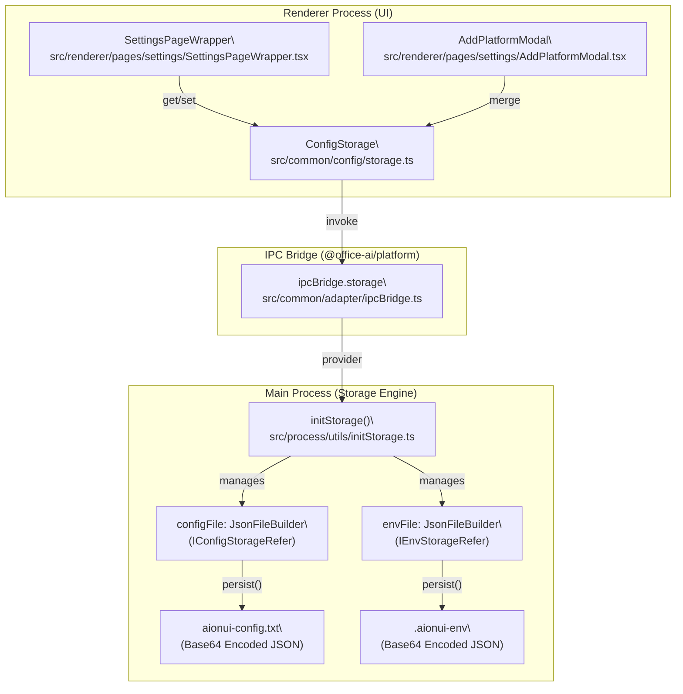
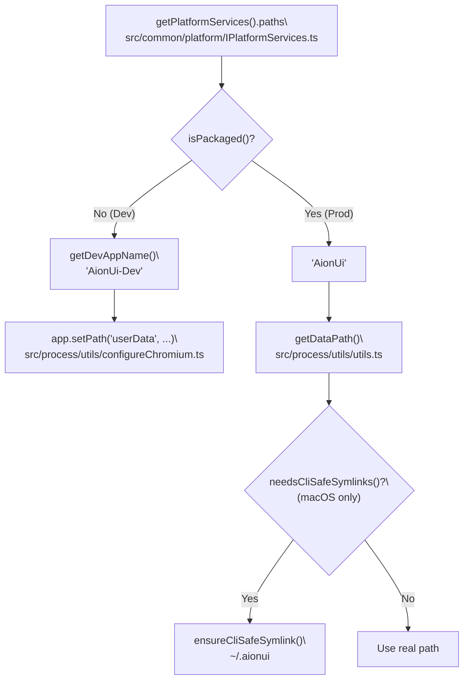

# Configuration System

<details>
<summary>Relevant source files</summary>

The following files were used as context for generating this wiki page:

- [src/common/platform/ElectronPlatformServices.ts](src/common/platform/ElectronPlatformServices.ts)
- [src/common/platform/IPlatformServices.ts](src/common/platform/IPlatformServices.ts)
- [src/common/platform/NodePlatformServices.ts](src/common/platform/NodePlatformServices.ts)
- [src/common/platform/index.ts](src/common/platform/index.ts)
- [src/process/bridge/applicationBridgeCore.ts](src/process/bridge/applicationBridgeCore.ts)
- [src/process/bridge/webuiBridge.ts](src/process/bridge/webuiBridge.ts)
- [src/process/index.ts](src/process/index.ts)
- [src/process/utils/configureChromium.ts](src/process/utils/configureChromium.ts)
- [src/process/utils/index.ts](src/process/utils/index.ts)
- [src/process/utils/initBridgeStandalone.ts](src/process/utils/initBridgeStandalone.ts)
- [src/process/utils/initStorage.ts](src/process/utils/initStorage.ts)
- [src/process/utils/utils.ts](src/process/utils/utils.ts)
- [src/process/webserver/auth/middleware/TokenMiddleware.ts](src/process/webserver/auth/middleware/TokenMiddleware.ts)
- [src/process/webserver/middleware/csrfClient.ts](src/process/webserver/middleware/csrfClient.ts)
- [src/renderer/hooks/context/AuthContext.tsx](src/renderer/hooks/context/AuthContext.tsx)
- [src/renderer/pages/conversation/Workspace/hooks/useWorkspaceEvents.ts](src/renderer/pages/conversation/Workspace/hooks/useWorkspaceEvents.ts)
- [src/renderer/pages/conversation/Workspace/hooks/useWorkspaceTree.ts](src/renderer/pages/conversation/Workspace/hooks/useWorkspaceTree.ts)
- [tests/unit/platform/platformRegistry.test.ts](tests/unit/platform/platformRegistry.test.ts)
- [tests/unit/process/bridge/applicationBridgeCore.test.ts](tests/unit/process/bridge/applicationBridgeCore.test.ts)
- [tests/unit/process/initStorage.jsonFileBuilder.test.ts](tests/unit/process/initStorage.jsonFileBuilder.test.ts)
- [tests/unit/process/utils/configureChromium.test.ts](tests/unit/process/utils/configureChromium.test.ts)
- [tests/unit/webserver/csrfClient.dom.test.ts](tests/unit/webserver/csrfClient.dom.test.ts)

</details>


The configuration system manages all persistent application preferences through a dual-process architecture with typed interfaces (`IConfigStorageRefer`, `IEnvStorageRefer`), configuration cascading from multiple sources, and hot-reload mechanisms for runtime updates.

---

## System Architecture

The configuration layer provides typed storage for AI provider credentials, model selections, UI preferences, MCP server lists, and channel settings. Configuration values cascade from defaults → file storage → environment variables → runtime overrides, with automatic persistence and selective hot-reload to running agents.

**Key components:**
- `ConfigStorage` (`agent.config`): typed storage interface backed by `IConfigStorageRefer` [src/process/utils/initStorage.ts:22-22]()
- `EnvStorage` (`agent.env`): directory paths configuration via `IEnvStorageRefer` [src/process/utils/initStorage.ts:22-22]()
- `JsonFileBuilder`: The core class providing in-memory caching with serialized disk persistence [src/process/utils/initStorage.ts:130-130]()
- `STORAGE_PATH`: Constant mapping logical storage keys to physical filenames [src/process/utils/initStorage.ts:46-55]()

**Diagram: Configuration Data Flow and Entity Mapping**



Sources: [src/process/utils/initStorage.ts:22-55](), [src/process/utils/initStorage.ts:130-180](), [src/process/index.ts:25-30]()

## Storage Objects and Platform Keys

Four typed storage objects provide access to different data domains. Each is created via `storage.buildStorage(platformKey)` and backed by a `JsonFileBuilder` instance in the main process.

| Export Name | Platform Key | Interface | Backing File | Purpose |
|---|---|---|---|---|
| `ConfigStorage` | `agent.config` | `IConfigStorageRefer` | `aionui-config.txt` | Application settings, model providers, UI preferences |
| `EnvStorage` | `agent.env` | `IEnvStorageRefer` | `.aionui-env` | Directory paths (workDir, cacheDir) |
| `ChatStorage` | `agent.chat` | `IChatConversationRefer` | `aionui-chat.txt` | Conversation metadata list |
| `ChatMessageStorage` | `agent.chat.message` | `Record<string, TMessage[]>` | `aionui-chat-message.txt` | Per-conversation message arrays |

The `STORAGE_PATH` constant in `initStorage.ts` maps logical names to filenames [src/process/utils/initStorage.ts:46-55](). All files are stored as base64-encoded JSON strings [src/process/utils/initStorage.ts:132-133]().

Sources: [src/process/utils/initStorage.ts:22-55](), [src/process/utils/initStorage.ts:130-150]()

---

## Configuration Cascading & Resolution

AionUi resolves configuration through a specific hierarchy to allow for environment-specific overrides (e.g., CLI mode or WebUI mode).

1.  **Defaults**: Hardcoded values within the `IConfigStorageRefer` schema.
2.  **File Storage**: Values loaded from `aionui-config.txt` via `JsonFileBuilder.toJsonSync()` [src/process/utils/initStorage.ts:138-152]().
3.  **Environment Variables**: The system checks `process.env` for specific overrides (e.g., `AIONUI_CDP_PORT`) [src/process/utils/configureChromium.ts:62-62]().
4.  **Runtime CLI Arguments**: Arguments like `--webui` or `--resetpass` trigger specific Chromium flag configurations and storage behaviors [src/process/utils/configureChromium.ts:31-36]().

### Hot-Reload Mechanisms
The system supports runtime updates without full application restarts:
- **WebUI Restart**: When configuration changes occur, the `initWebuiBridge` can stop the existing `webServerInstance` and restart it with new parameters [src/process/bridge/webuiBridge.ts:58-81]().
- **Throttled UI Refresh**: Components like `useWorkspaceEvents` use a `throttledRefresh` (2000ms) to prevent rapid workspace UI updates during continuous agent tool calls [src/renderer/pages/conversation/Workspace/hooks/useWorkspaceEvents.ts:94-109]().

Sources: [src/process/utils/initStorage.ts:138-152](), [src/process/bridge/webuiBridge.ts:58-81](), [src/process/utils/configureChromium.ts:31-48]()

---

## Platform-Specific Path Resolution

Configuration paths are resolved differently based on the platform and environment (Dev vs. Production).

**Diagram: Path Resolution Logic**



- **macOS Space Handling**: On macOS, `userData` resides in "Application Support" which contains spaces. AionUi creates a CLI-safe symlink in the home directory (e.g., `~/.aionui`) to ensure compatibility with CLI tools that cannot handle spaces [src/process/utils/utils.ts:44-90]().
- **Environment Isolation**: In development mode, the app name is changed to `AionUi-Dev` to isolate the `userData` directory from the production installation [src/process/utils/configureChromium.ts:19-26]().

Sources: [src/process/utils/utils.ts:44-114](), [src/process/utils/configureChromium.ts:19-26](), [src/common/platform/index.ts:49-66]()

---

## Implementation Details: `JsonFileBuilder`

The `JsonFileBuilder` is the primary engine for configuration persistence [src/process/utils/initStorage.ts:130-130]().

- **In-Memory Cache**: Data is kept in a `cache` variable for microsecond-level reads [src/process/utils/initStorage.ts:136-159]().
- **Serialized Writes**: Disk writes are chained via a `writeChain` promise to prevent file corruption during concurrent write operations [src/process/utils/initStorage.ts:162-178]().
- **Encoding**: Data is stored using `base64(encodeURIComponent(JSON))` for backward compatibility with legacy storage formats [src/process/utils/initStorage.ts:132-133]().

```typescript
// src/process/utils/initStorage.ts:164-178
const persist = (): Promise<S> => {
  const data = cache ?? ({} as S);
  const encoded = encode(JSON.stringify(data));
  const writeOp = writeChain.then(() => WriteFile(filePath, encoded));
  writeChain = writeOp.catch(() => {});
  return writeOp.then(() => data);
};
```

Sources: [src/process/utils/initStorage.ts:130-221]()