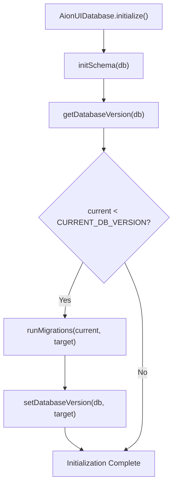
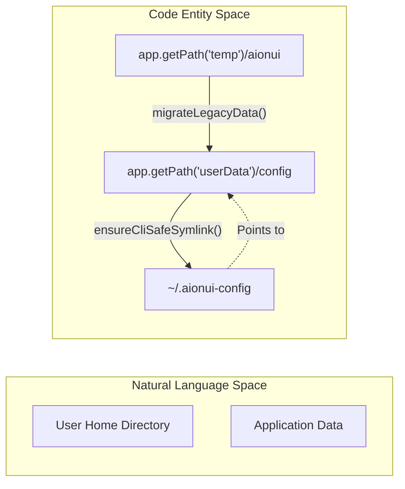
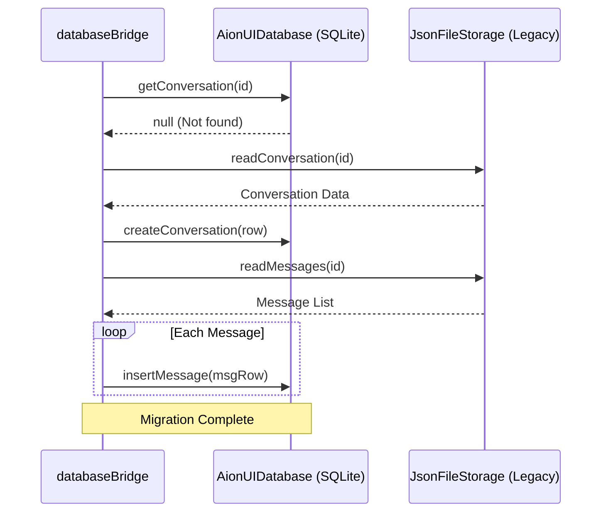

# Data Migration

Relevant source files

The following files were used as context for generating this wiki page:

- [src/process/agent/openclaw/OpenClawGatewayConnection.ts](src/process/agent/openclaw/OpenClawGatewayConnection.ts)
- [src/process/agent/openclaw/types.ts](src/process/agent/openclaw/types.ts)
- [src/process/agent/remote/types.ts](src/process/agent/remote/types.ts)
- [src/process/bridge/remoteAgentBridge.ts](src/process/bridge/remoteAgentBridge.ts)
- [src/process/services/database/index.ts](src/process/services/database/index.ts)
- [src/process/services/database/migrations.ts](src/process/services/database/migrations.ts)
- [src/process/services/database/schema.ts](src/process/services/database/schema.ts)
- [tests/unit/RemoteAgentCore.test.ts](tests/unit/RemoteAgentCore.test.ts)
- [tests/unit/RemoteAgentManager.test.ts](tests/unit/RemoteAgentManager.test.ts)
- [tests/unit/normalizeWsUrl.test.ts](tests/unit/normalizeWsUrl.test.ts)
- [tests/unit/process/services/database/index.test.ts](tests/unit/process/services/database/index.test.ts)
- [tests/unit/remoteAgentBridge.test.ts](tests/unit/remoteAgentBridge.test.ts)
- [tests/unit/schema.test.ts](tests/unit/schema.test.ts)
- [tests/unit/usePresetAssistantInfo.dom.test.ts](tests/unit/usePresetAssistantInfo.dom.test.ts)

## Purpose and Scope

This page documents AionUi's data migration systems, which handle critical transitions in directory structures, storage formats, and database schemas:

1.  **Legacy Path Migration**: Moving data from the old temp directory to the new persistent config directory with CLI-safe path handling.
2.  **Storage Format Migration**: Lazy migration from file-based storage (`JsonFileBuilder`) to SQLite database (`better-sqlite3`) for conversations and messages.
3.  **Database Schema Migrations**: Versioned SQL migrations for the SQLite database to handle feature updates (e.g., Team Mode, Remote Agents).

For information about the ongoing storage architecture, see [Storage Architecture (8.2)](). For configuration loading and resolution, see [Configuration System (8.1)]().

---

## Overview

Data migration in AionUi is designed to be **non-disruptive** and **reversible**. The system performs path migrations at startup, while database storage transitions are handled lazily to avoid blocking the initialization sequence. SQLite schema updates are managed via a versioned migration runner.

### Migration Timeline

| Migration Phase | Trigger Point | Impact |
| :--- | :--- | :--- |
| **Legacy Path Migration** | Application startup (one-time) | Moves all data from temp to config directory |
| **CLI-Safe Symlinks** | Every startup (macOS only) | Creates/verifies `~/.aionui` and `~/.aionui-config` symlinks |
| **Database Storage Migration** | On-demand (lazy) | Migrates conversations/messages from files to SQLite when accessed |
| **Database Schema Migrations** | Database initialization | Executes SQL scripts to update tables from version `N` to `CURRENT_DB_VERSION` |

**Sources**: [src/process/services/database/index.ts:182-198](), [src/process/services/database/schema.ts:151-154]()

---

## Database Schema Migration System

AionUi uses a versioned migration system for its SQLite database. The current schema version is tracked using SQLite's `user_version` pragma.

### Migration Execution Flow

When the `AionUIDatabase` is initialized, it compares the version stored in the database file with the `CURRENT_DB_VERSION` defined in the code.

**Sources**: [src/process/services/database/index.ts:182-191](), [src/process/services/database/schema.ts:133-148](), [src/process/services/database/schema.ts:154-154]()

### Migration Implementation

Migrations are defined as objects implementing the `IMigration` interface, containing `up` and `down` scripts.

| Version | Name | Key Changes |
| :--- | :--- | :--- |
| 1 | Initial schema | Creation of `users`, `conversations`, and `messages` tables. |
| 2 | Performance indexes | Added `idx_messages_conv_created_desc` and `idx_conversations_user_type`. |
| 6 | JWT Security | Added `jwt_secret` column to the `users` table. |
| 7 | Personal Assistant | Added `assistant_plugins`, `assistant_users`, and `assistant_sessions`. |
| 22 | Current Version | Includes Team Mode tables (`teams`, `mailbox`, `team_tasks`). |

**Sources**: [src/process/services/database/migrations.ts:12-17](), [src/process/services/database/migrations.ts:43-61](), [src/process/services/database/migrations.ts:120-147](), [src/process/services/database/schema.ts:154-154]()

### Corruption Recovery

If database initialization fails due to corruption (e.g., "disk image is malformed"), the system attempts an automatic recovery:
1.  The failed driver is closed to release file locks [src/process/services/database/index.ts:118-125]().
2.  The corrupted `.db` file is renamed to a `.backup.[timestamp]` file [src/process/services/database/index.ts:146-150]().
3.  Stale WAL sidecar files (`-wal`, `-shm`) are deleted to prevent infinite recovery loops [src/process/services/database/index.ts:163-173]().
4.  A fresh database is initialized from scratch.

**Sources**: [src/process/services/database/index.ts:103-180]()

---

## Legacy Path Migration & Symlinks

### Directory Structure Change

To support CLI tools (like Qwen or Claude) that often fail when paths contain spaces, AionUi migrates data to a persistent config directory and creates space-free symlinks on macOS.

**Sources**: [src/process/services/database/index.ts:104-105](), [src/process/services/database/index.ts:146-150]()

---

## Database Storage Migration (Lazy)

The transition from legacy file-based storage (`aionui-chat.txt`) to the SQLite database is handled lazily.

### Migration Logic

The migration is transparent to the user and occurs when a conversation is requested via the IPC bridge.

1.  **Check**: The system checks if the conversation ID exists in the SQLite `conversations` table.
2.  **Insert**: If missing, it reads the legacy JSON file, creates a row in the `conversations` table, and batch-inserts all associated messages into the `messages` table.
3.  **Cleanup**: Once successfully migrated to the database, the system uses the DB as the primary source of truth for all subsequent operations.

**Sources**: [src/process/services/database/index.ts:213-225](), [src/process/services/database/schema.ts:43-71]()

### Data Flow: Legacy to SQLite

**Sources**: [src/process/services/database/index.ts:206-215](), [src/process/services/database/schema.ts:61-71]()

---

## Summary

AionUi's data migration system ensures reliability across updates:
*   **Schema Migrations**: Handled by `runMigrations` using SQLite `user_version` [src/process/services/database/index.ts:200-202]().
*   **Resilience**: Automatic recovery from corruption by backing up and resetting the DB [src/process/services/database/index.ts:141-161]().
*   **Performance**: Uses Write-Ahead Logging (WAL) and `busy_timeout` to handle concurrent access [src/process/services/database/schema.ts:12-25]().