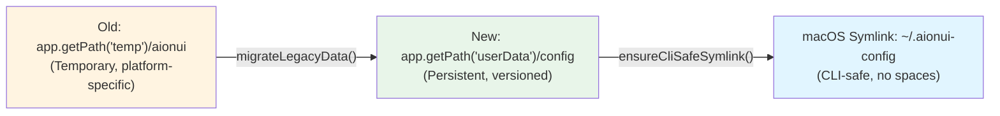
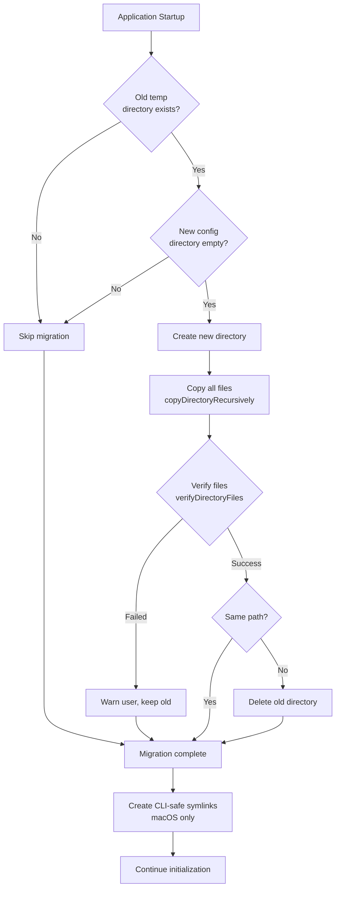
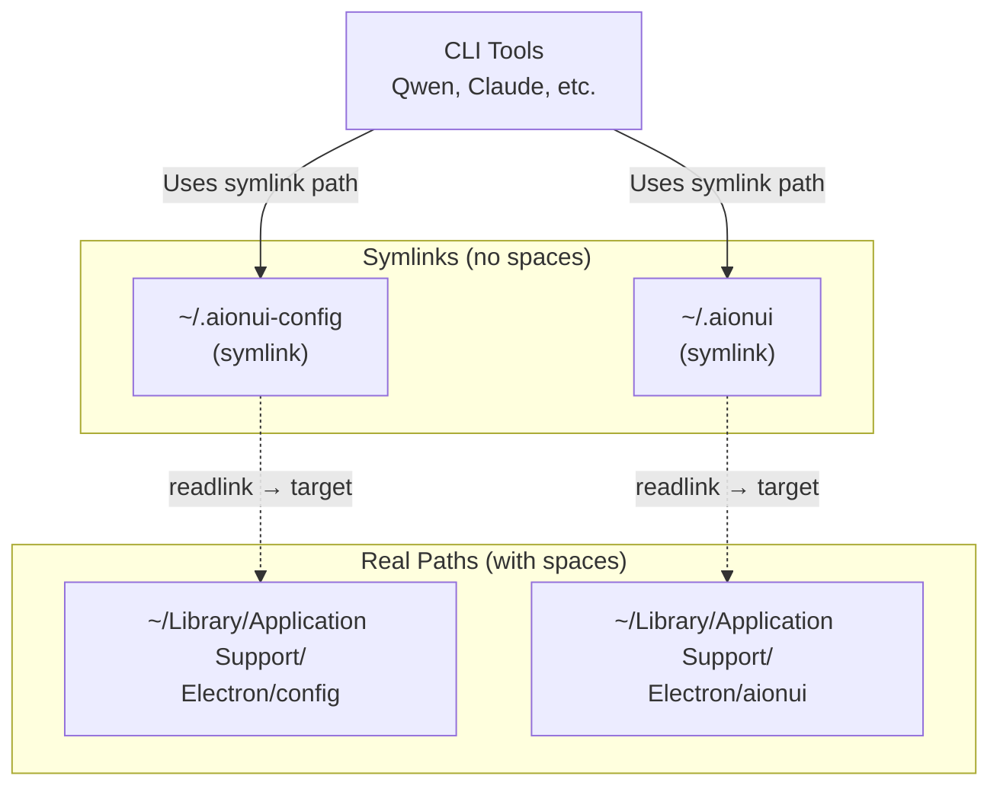
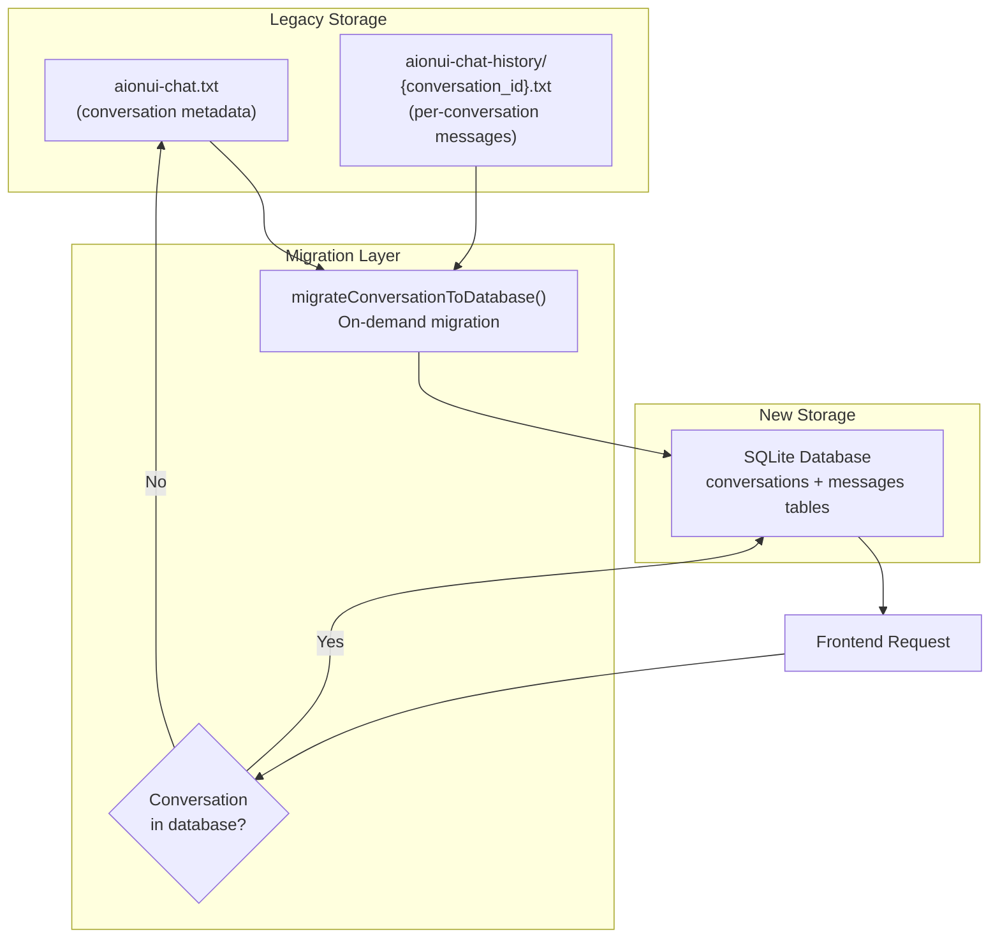
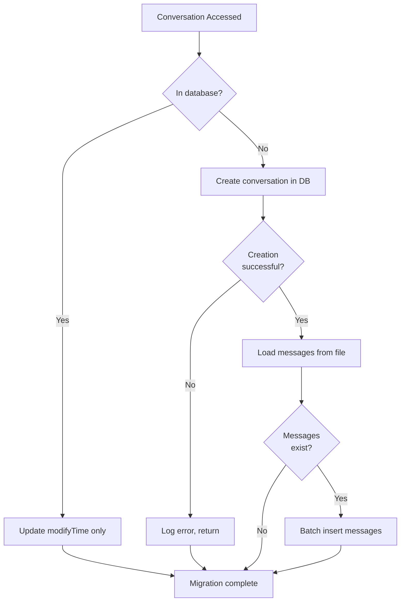
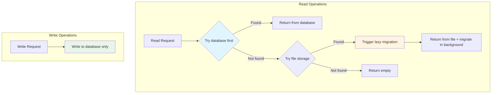
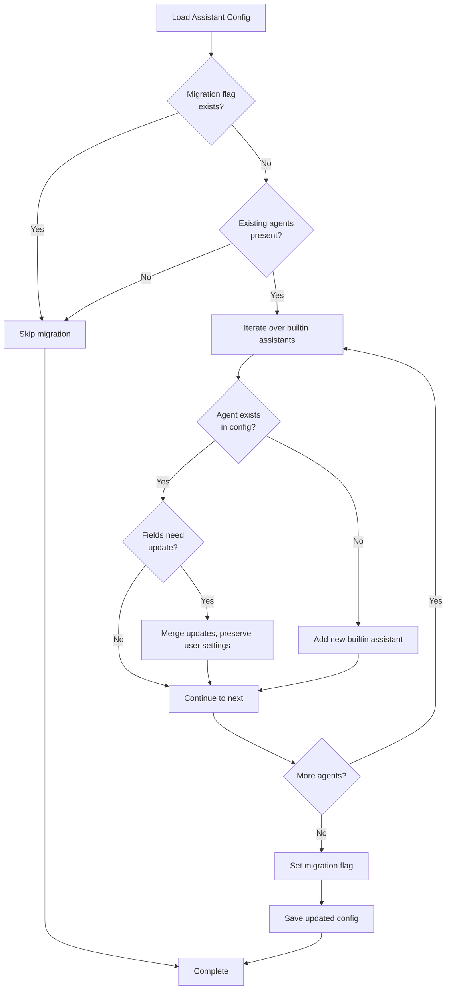
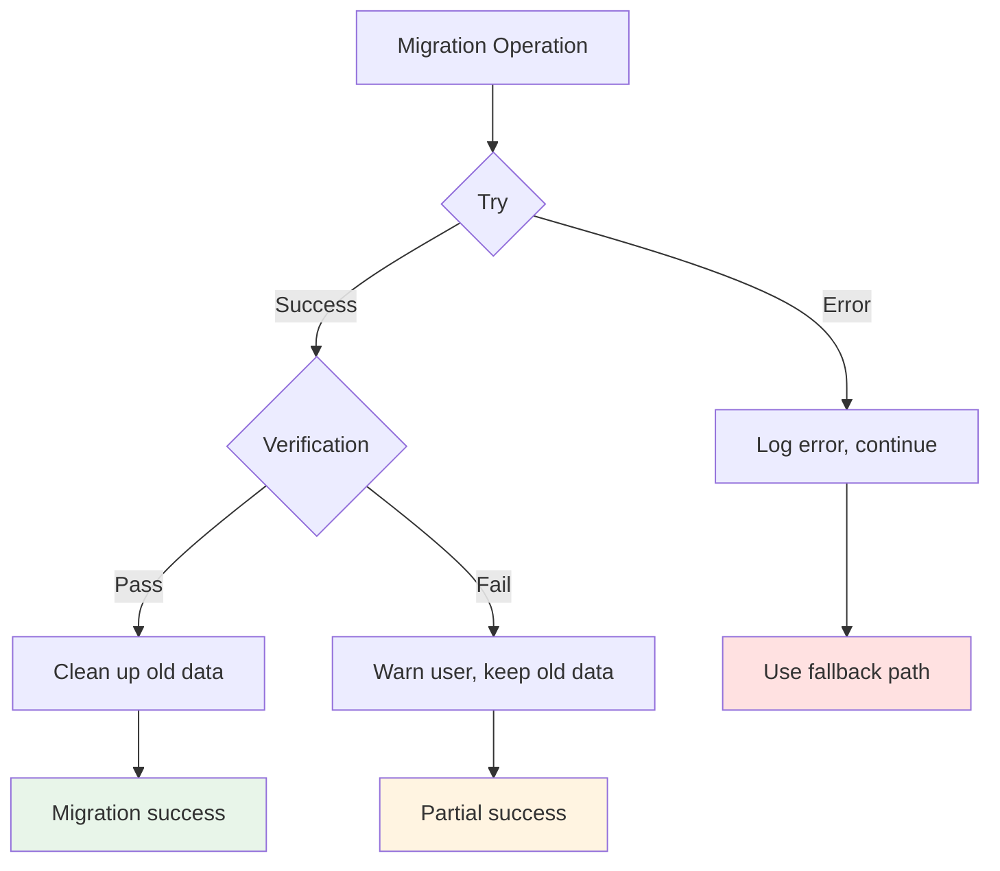
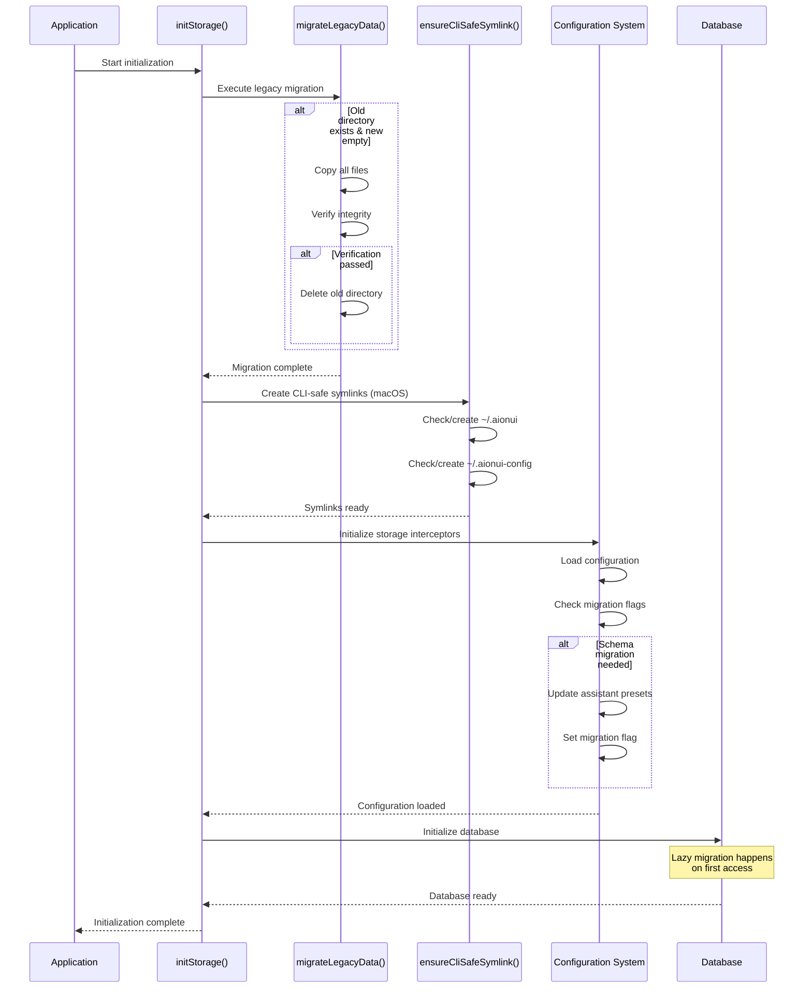

# Data Migration

<details>
<summary>Relevant source files</summary>

The following files were used as context for generating this wiki page:

- [src/common/ipcBridge.ts](src/common/ipcBridge.ts)
- [src/common/storage.ts](src/common/storage.ts)
- [src/renderer/pages/guid/index.tsx](src/renderer/pages/guid/index.tsx)

</details>

## Purpose and Scope

This page documents AionUi's data migration systems, which handle two critical types of migration:

1. **Legacy Path Migration**: Moving data from the old temp directory (`app.getPath('temp')/aionui`) to the new config directory (`app.getPath('userData')/config`) with CLI-safe path handling
2. **Storage Format Migration**: Lazy migration from file-based storage to SQLite database for conversations and messages

For information about the ongoing storage architecture, see [Storage Architecture](#7.2). For configuration loading and resolution, see [Configuration System](#7.1).

---

## Overview

Data migration in AionUi is designed to be **non-disruptive** and **reversible**, with automatic verification and cleanup. The system performs migrations at startup, with lazy migration for database transitions to avoid blocking the initialization sequence.

### Migration Timeline

| Migration Phase           | Trigger Point                  | Impact                                                              |
| ------------------------- | ------------------------------ | ------------------------------------------------------------------- |
| **Legacy Path Migration** | Application startup (one-time) | Moves all data from temp to config directory                        |
| **CLI-Safe Symlinks**     | Every startup (macOS only)     | Creates/verifies `~/.aionui` and `~/.aionui-config` symlinks        |
| **Database Migration**    | On-demand (lazy)               | Migrates conversations/messages from files to SQLite when accessed  |
| **Schema Migrations**     | Configuration load             | Updates assistant presets, adds default skills, fixes enabled flags |

**Sources**: [src/process/initStorage.ts:43-88](), [src/process/initStorage.ts:580-700](), [src/process/utils.ts:27-92]()

---

## Legacy Path Migration

### Migration Rationale

The legacy path migration addresses two critical issues:

1. **Platform Consistency**: The old temp directory location varied by platform and was not suitable for persistent storage
2. **CLI Tool Compatibility**: Paths with spaces (e.g., `~/Library/Application Support/`) break CLI tools like Qwen, which cannot properly handle quoted paths

### Directory Structure Change



**Sources**: [src/process/utils.ts:13-16](), [src/process/utils.ts:88-92]()

### Migration Process

The `migrateLegacyData()` function implements a safe, atomic migration with verification:



**Sources**: [src/process/initStorage.ts:43-88]()

### Migration Implementation

The migration is implemented in three key functions:

**`migrateLegacyData()`** - Main migration logic ([src/process/initStorage.ts:43-88]()):

```
1. Check if old directory exists (getTempPath())
2. Check if new directory is empty or non-existent
3. If migration conditions met:
   - Create new directory (mkdirSync)
   - Copy all contents (copyDirectoryRecursively)
   - Verify integrity (verifyDirectoryFiles)
   - If verified and paths differ: delete old directory
4. Return migration status
```

**`copyDirectoryRecursively()`** - Safe directory copy ([src/process/utils.ts:219-265]()):

```
- Validates paths to prevent infinite recursion
- Prevents copying to self (src === dest)
- Prevents copying to subdirectory (dest.startsWith(src))
- Prevents copying to parent directory (src.startsWith(dest))
- Supports overwrite control via options.overwrite flag
- Platform-aware path normalization (lowercase on Windows)
```

**`verifyDirectoryFiles()`** - Migration verification ([src/process/utils.ts:267-306]()):

```
- Compares file/directory names in both locations
- Recursively verifies subdirectory structure
- Returns false if any discrepancy detected
- Prevents cleanup of old directory if verification fails
```

**Sources**: [src/process/initStorage.ts:43-88](), [src/process/utils.ts:219-306]()

---

## CLI-Safe Symlinks (macOS)

### Problem: Spaces in Default Paths

On macOS, the default config path is:

```
~/Library/Application Support/Electron/config
```

This path contains **spaces**, which breaks CLI tools that cannot properly handle quoted paths. The Qwen CLI tool, for example, fails with:

```
Error: ENOENT: no such file or directory '/Users/username/Library/Application'
```

### Solution: Home Directory Symlinks

The `ensureCliSafeSymlink()` function creates symlinks in the home directory without spaces:



**Sources**: [src/process/utils.ts:27-72]()

### Symlink Creation Logic

The `ensureCliSafeSymlink()` function handles several edge cases:

**Creation/Verification** ([src/process/utils.ts:27-72]()):

```
1. Check if symlink exists (lstatSync)
2. If symlink exists:
   - Verify it points to correct target (readlinkSync)
   - If target correct: ensure target directory exists
   - If wrong target: remove and recreate
3. If directory exists (not symlink):
   - Use original path (don't touch user's directory)
4. If regular file exists:
   - Remove file blocking symlink path (issue #841)
5. Create symlink (symlinkSync)
```

**Error Handling**:

- **Broken Symlink (#841)**: If target directory deleted, recreate it ([src/process/utils.ts:44-45]())
- **File Blocking Path (#841)**: Remove regular file at symlink path ([src/process/utils.ts:56]())
- **Creation Failure**: Fall back to original path ([src/process/utils.ts:69-71]())

**Sources**: [src/process/utils.ts:27-72](), [src/process/utils.ts:373-394]()

### Usage in Storage System

Both storage paths use CLI-safe symlinks:

```
getDataPath()   → ensureCliSafeSymlink(userData/aionui, ".aionui")
getConfigPath() → ensureCliSafeSymlink(userData/config, ".aionui-config")
```

These functions are called during initialization and return the symlink path on macOS, the original path on other platforms:

```
// On macOS:
getDataPath()   // → ~/.aionui (symlink)
getConfigPath() // → ~/.aionui-config (symlink)

// On Windows/Linux:
getDataPath()   // → /path/to/userData/aionui (original)
getConfigPath() // → /path/to/userData/config (original)
```

**Sources**: [src/process/utils.ts:78-92](), [src/process/initStorage.ts:588-589]()

---

## Database Migration System

### File-Based to SQLite Migration

The database migration is **lazy** and **transparent**, migrating conversations from file storage (`JsonFileBuilder`) to SQLite database (`better-sqlite3`) only when accessed.



**Sources**: [src/process/bridge/migrationUtils.ts:15-52](), [src/process/bridge/databaseBridge.ts:27-66]()

### Lazy Migration Triggers

Migration occurs automatically when conversations are accessed:

| Operation                        | File                  | Lines       | Migration Behavior                                               |
| -------------------------------- | --------------------- | ----------- | ---------------------------------------------------------------- |
| **Get Single Conversation**      | conversationBridge.ts | [325-358]() | Try database first, fallback to file + migrate in background     |
| **Get Associated Conversations** | conversationBridge.ts | [100-144]() | Load from database, merge file-only conversations, migrate all   |
| **Get User Conversations**       | databaseBridge.ts     | [27-66]()   | Database as source of truth, backfill from file, migrate missing |

**Sources**: [src/process/bridge/conversationBridge.ts:325-358](), [src/process/bridge/conversationBridge.ts:100-144](), [src/process/bridge/databaseBridge.ts:27-66]()

### Migration Implementation

**`migrateConversationToDatabase()`** ([src/process/bridge/migrationUtils.ts:15-52]()):



**Migration Steps**:

1. Check if conversation already in database ([migrationUtils.ts:20-25]())
2. If exists, just update `modifyTime` and return
3. If not exists:
   - Create conversation record in database
   - Load messages from file storage (`ProcessChatMessage.get()`)
   - Batch insert all messages
   - Handle errors gracefully (log and continue)

**Sources**: [src/process/bridge/migrationUtils.ts:15-52]()

### Hybrid Storage During Migration

During the migration period, the system operates in **hybrid mode**:



**Key Design Decisions**:

1. **Database as Source of Truth**: New writes only go to database ([conversationBridge.ts:154-159]())
2. **Fallback to Files**: If not in database, check file storage for legacy data
3. **Background Migration**: Migration happens asynchronously, doesn't block read operations
4. **No Duplicate Data**: Once migrated, files can be deleted manually (not automatic to preserve data safety)

**Sources**: [src/process/bridge/conversationBridge.ts:325-358](), [src/process/bridge/databaseBridge.ts:27-66]()

---

## Schema Migration System

### Assistant Preset Migrations

The system includes automatic schema migrations for assistant configurations to handle version upgrades:

**Migration Flags** ([src/process/initStorage.ts:623-695]()):

| Flag Key                                 | Purpose                                          | When Applied                        |
| ---------------------------------------- | ------------------------------------------------ | ----------------------------------- |
| `migration.assistantEnabledFixed`        | Fix all assistants defaulting to enabled         | First run after upgrade             |
| `migration.builtinDefaultSkillsAdded_v2` | Add default enabled skills to builtin assistants | First run after skills system added |

### Migration Pattern: Conditional Updates



**Sources**: [src/process/initStorage.ts:621-696]()

### Assistant Schema Migration Logic

The assistant migration preserves **user settings** while updating **system metadata**:

**Fields Updated** ([src/process/initStorage.ts:648]()):

- `name`, `description`, `avatar` (system metadata)
- `isPreset`, `isBuiltin` (system flags)

**Fields Preserved** ([src/process/initStorage.ts:654-657](), [src/process/initStorage.ts:669-674]()):

- `enabled` (user preference)
- `presetAgentType` (user selection)
- `enabledSkills` (user selection, migrated only if empty)

**Migration Examples**:

```typescript
// Example 1: Fix enabled state (migration.assistantEnabledFixed)
// Before: All assistants have enabled=true (bug)
// After: Only Cowork has enabled=true, others disabled

// Example 2: Add default skills (migration.builtinDefaultSkillsAdded_v2)
// Before: Builtin assistants have empty enabledSkills
// After: Builtin assistants have defaultEnabledSkills from preset config
//        User-modified enabledSkills are preserved
```

**Sources**: [src/process/initStorage.ts:648-684]()

---

## Migration Verification and Safety

### Verification Mechanisms

The migration system includes multiple safety checks:

**File Structure Verification** ([src/process/utils.ts:267-306]()):

```
verifyDirectoryFiles(oldDir, newDir):
  1. Check both directories exist
  2. Compare entry counts
  3. Compare entry names (sorted)
  4. Compare entry types (file vs directory)
  5. Recursively verify subdirectories
  6. Return false if any mismatch
```

**Directory Integrity** ([src/process/utils.ts:373-394]()):

```
ensureDirectory(path):
  1. Check if path exists and is directory → return
  2. If symlink → verify target exists
     - If broken → remove and recreate
  3. If regular file → remove (blocking path)
  4. Create directory (recursive)
```

**Sources**: [src/process/utils.ts:267-306](), [src/process/utils.ts:373-394]()

### Error Handling

All migration operations include comprehensive error handling:



**Fallback Strategies**:

1. **Path Migration Fails**: Keep old directory, continue initialization ([src/process/initStorage.ts:83-87]())
2. **Symlink Creation Fails**: Use original path ([src/process/utils.ts:69-71]())
3. **Database Migration Fails**: Continue using file storage ([src/process/bridge/migrationUtils.ts:49-51]())
4. **Verification Fails**: Preserve old directory, warn user ([src/process/initStorage.ts:69-79]())

**Sources**: [src/process/initStorage.ts:43-88](), [src/process/utils.ts:27-72](), [src/process/bridge/migrationUtils.ts:15-52]()

---

## Migration Execution Flow

### Startup Sequence

The complete migration sequence during application startup:



**Sources**: [src/process/initStorage.ts:580-700](), [src/process/index.ts:15-30]()

### Timing and Performance

Migration impact on startup time:

| Migration Type         | When                        | Blocking        | Typical Duration                 |
| ---------------------- | --------------------------- | --------------- | -------------------------------- |
| **Legacy Path**        | First startup only          | Yes             | 100-500ms (depends on data size) |
| **CLI Symlinks**       | Every startup               | Yes             | <10ms                            |
| **Schema Updates**     | First startup after upgrade | Yes             | <50ms                            |
| **Database Migration** | On-demand                   | No (background) | N/A (lazy)                       |

The lazy database migration design ensures that **startup time is not affected** by the size of existing data, as conversations are migrated only when accessed.

**Sources**: [src/process/initStorage.ts:43-88](), [src/process/bridge/migrationUtils.ts:15-52]()

---

## Summary

AionUi's data migration system handles three critical transitions:

1. **Legacy Path Migration**: One-time move from temp to config directory with integrity verification
2. **CLI-Safe Symlinks**: Platform-specific path handling to support CLI tools with space-intolerant parsers
3. **Storage Format Migration**: Lazy, transparent migration from file-based to SQLite storage

The system is designed for **safety** (verification, fallbacks), **performance** (lazy migration), and **transparency** (no user intervention required).

**Key Files**:

- [src/process/initStorage.ts]() - Main migration entry point
- [src/process/utils.ts:27-306]() - Path handling and verification utilities
- [src/process/bridge/migrationUtils.ts]() - Database migration logic
- [src/process/bridge/databaseBridge.ts]() - Hybrid storage with lazy migration
- [src/process/bridge/conversationBridge.ts]() - Conversation access with migration triggers

**Sources**: [src/process/initStorage.ts:43-700](), [src/process/utils.ts:27-394](), [src/process/bridge/migrationUtils.ts:1-52](), [src/process/bridge/databaseBridge.ts:13-67](), [src/process/bridge/conversationBridge.ts:100-358]()
