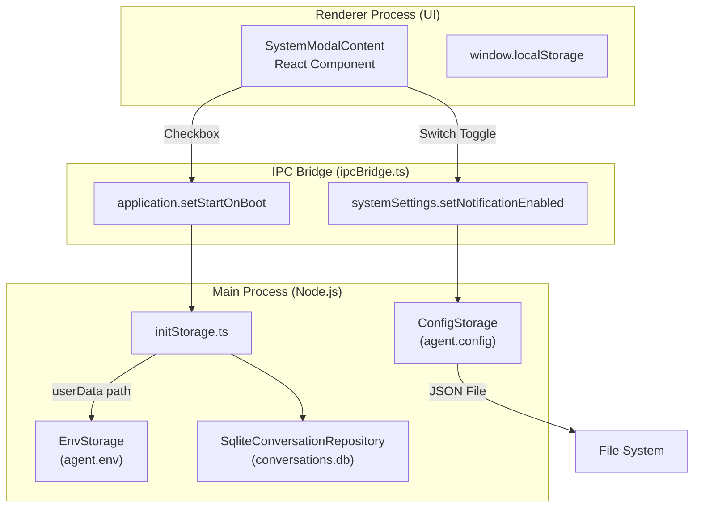
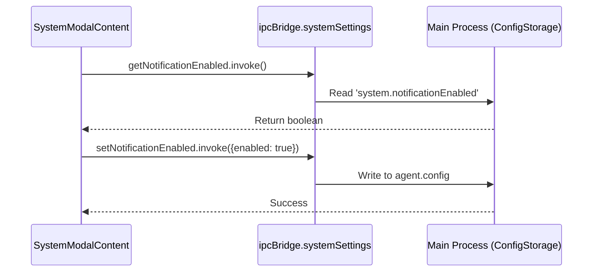

# Configuration & Persistence

Relevant source files

The following files were used as context for generating this wiki page:

- [src/common/config/storage.ts](src/common/config/storage.ts)
- [src/common/platform/ElectronPlatformServices.ts](src/common/platform/ElectronPlatformServices.ts)
- [src/common/platform/IPlatformServices.ts](src/common/platform/IPlatformServices.ts)
- [src/common/platform/NodePlatformServices.ts](src/common/platform/NodePlatformServices.ts)
- [src/common/platform/index.ts](src/common/platform/index.ts)
- [src/process/index.ts](src/process/index.ts)
- [src/process/utils/configureChromium.ts](src/process/utils/configureChromium.ts)
- [src/process/utils/initBridgeStandalone.ts](src/process/utils/initBridgeStandalone.ts)
- [src/renderer/components/settings/SettingsModal/contents/SystemModalContent/index.tsx](src/renderer/components/settings/SettingsModal/contents/SystemModalContent/index.tsx)
- [src/renderer/pages/settings/AgentSettings/RemoteAgentManagement.tsx](src/renderer/pages/settings/AgentSettings/RemoteAgentManagement.tsx)
- [src/renderer/services/i18n/i18n-keys.d.ts](src/renderer/services/i18n/i18n-keys.d.ts)
- [src/renderer/services/i18n/locales/en-US/settings.json](src/renderer/services/i18n/locales/en-US/settings.json)
- [src/renderer/services/i18n/locales/ja-JP/settings.json](src/renderer/services/i18n/locales/ja-JP/settings.json)
- [src/renderer/services/i18n/locales/ko-KR/settings.json](src/renderer/services/i18n/locales/ko-KR/settings.json)
- [src/renderer/services/i18n/locales/ru-RU/settings.json](src/renderer/services/i18n/locales/ru-RU/settings.json)
- [src/renderer/services/i18n/locales/tr-TR/settings.json](src/renderer/services/i18n/locales/tr-TR/settings.json)
- [src/renderer/services/i18n/locales/zh-CN/settings.json](src/renderer/services/i18n/locales/zh-CN/settings.json)
- [src/renderer/services/i18n/locales/zh-TW/settings.json](src/renderer/services/i18n/locales/zh-TW/settings.json)
- [tests/unit/RemoteAgentManagement.dom.test.tsx](tests/unit/RemoteAgentManagement.dom.test.tsx)
- [tests/unit/platform/platformRegistry.test.ts](tests/unit/platform/platformRegistry.test.ts)
- [tests/unit/process/utils/configureChromium.test.ts](tests/unit/process/utils/configureChromium.test.ts)

This page provides an overview of AionUi's configuration management and data persistence strategies. The system implements a multi-layered architecture separating configuration, conversation metadata, and message history. It uses a hybrid approach combining JSON files for configuration and SQLite for conversation data, enabling both human-editable settings and efficient querying.

## Child Pages
- **[Configuration System](#8.1)**: Documents the `ConfigStorage` schema (`IConfigStorageRefer`), configuration cascading (defaults < file < environment < runtime), and hot-reload mechanisms.
- **[Storage Architecture](#8.2)**: Explains the `storage.buildStorage` factory, localStorage vs SQLite usage patterns, draft persistence, and panel state persistence.
- **[Data Migration](#8.3)**: Documents migration flags in `ConfigStorage`, version tracking, and how schema changes are handled.

For conversation data models and message transformation, see page 7.1 and 7.2. For IPC communication patterns, see page 3.3.

---

## System Overview

### Storage Abstractions

AionUi's persistence system provides four primary storage abstractions built using the `storage.buildStorage` factory [src/common/config/storage.ts:14-23]():

| Storage Interface | Configuration Namespace | Purpose | Example Keys |
|------------------|-------------------|---------|--------------|
| `ConfigStorage` | `agent.config` | System settings, agent config, model providers | `model.config`, `gemini.config`, `acp.config` |
| `ChatStorage` | `agent.chat` | Conversation metadata list | `chat.history` |
| `ChatMessageStorage` | `agent.chat.message` | Message history (per conversation) | Per-conversation message files |
| `EnvStorage` | `agent.env` | Directory paths and environment isolation | `aionui.dir` |

**Sources:** [src/common/config/storage.ts:14-23]()

### Persistence Layer Architecture

The following diagram bridges the User Interface components to the Main Process storage entities.

**Title: Persistence Layer Architecture (Code Entity Space)**

**Sources:** [src/renderer/components/settings/SettingsModal/contents/SystemModalContent/index.tsx:152-164](), [src/process/index.ts:25-30](), [src/common/config/storage.ts:20-23]()

### Key Configuration Domains

Configuration in `ConfigStorage` is organized into typed domains defined by the `IConfigStorageRefer` interface [src/common/config/storage.ts:25-174]():

| Configuration Domain | Storage Key | Type | Purpose |
|---------------------|-------------|------|---------|
| Model Providers | `model.config` | `IProvider[]` | API endpoints, keys, model lists, capabilities |
| MCP Servers | `mcp.config` | `IMcpServer[]` | Model Context Protocol server configurations |
| Agent Settings | `gemini.config`, `acp.config`, `codex.config` | Object | Auth methods, CLI paths, timeouts [src/common/config/storage.ts:26-59]() |
| UI Preferences | `language`, `theme`, `customCss` | String | Localization and theming [src/common/config/storage.ts:72-83]() |
| System Flags | `system.closeToTray`, `system.notificationEnabled` | Boolean | Desktop integration behavior [src/common/config/storage.ts:109-112]() |

**Sources:** [src/common/config/storage.ts:25-174]()

---

## Configuration Management

### System Settings Lifecycle

System settings such as `closeToTray`, `notificationEnabled`, and `promptTimeout` are managed via the `SystemModalContent` component [src/renderer/components/settings/SettingsModal/contents/SystemModalContent/index.tsx:31-54](). These settings are persisted to `ConfigStorage` and synchronized across processes using the `ipcBridge`.

**Title: Configuration Sync Flow**

**Sources:** [src/renderer/components/settings/SettingsModal/contents/SystemModalContent/index.tsx:78-82](), [src/renderer/components/settings/SettingsModal/contents/SystemModalContent/index.tsx:152-157]()

### Timeouts and Resource Limits
The system allows fine-grained control over process lifecycles:
*   **Prompt Timeout:** `acp.promptTimeout` (Default 300s) [src/common/config/storage.ts:60-61]().
*   **Agent Idle Timeout:** `acp.agentIdleTimeout` (Default 5m) - Automatically kills ACP agent processes to reclaim memory [src/common/config/storage.ts:62-63]().

---

## Data Migration and Versioning

AionUi uses migration flags within `ConfigStorage` to handle schema updates and data integrity across versions [src/common/config/storage.ts:98-108]().

| Migration Flag | Purpose |
|----------------|---------|
| `migration.assistantEnabledFixed` | Fixes default values for assistant status |
| `migration.builtinDefaultSkillsAdded_v2` | Injects default skills into system assistants |
| `migration.promptsI18nAdded` | Migrates legacy string prompts to localized objects |
| `migration.electronConfigImported` | Handles migration from desktop to server-mode config |

**Sources:** [src/common/config/storage.ts:98-108]()

---

## Platform and Environment Isolation

### Development Isolation
To prevent development builds from interfering with production data, the system implements app name isolation. In development mode, the app name is set to `AionUi-Dev` or `AionUi-Dev-2` (for multi-instance testing) [src/common/platform/index.ts:11-14](). This changes the `userData` path automatically [src/common/platform/index.ts:43-46]().

### Directory Layout
The `IEnvStorageRefer` defines the core directory structure [src/common/config/storage.ts:176-180]():
*   **workDir:** Base directory for project files and agent operations.
*   **cacheDir:** Temporary storage for downloads and ephemeral data.

**Sources:** [src/common/platform/index.ts:43-46](), [src/common/config/storage.ts:176-180]()

---

## Best Practices

1.  **Type Safety:** Always define new configuration keys in the `IConfigStorageRefer` interface [src/common/config/storage.ts:25-174]().
2.  **IPC Bridge usage:** Use `ipcBridge.systemSettings` for UI-to-Main communication instead of direct storage access where possible [src/renderer/components/settings/SettingsModal/contents/SystemModalContent/index.tsx:7-8]().
3.  **Migration Awareness:** When changing data structures, add a new migration flag and implement the logic in `initStorage` [src/process/index.ts:29]().
4.  **Platform Abstraction:** Use `getPlatformServices().paths` for file operations to ensure cross-platform compatibility (Electron vs Node) [src/common/platform/index.ts:49-66]().