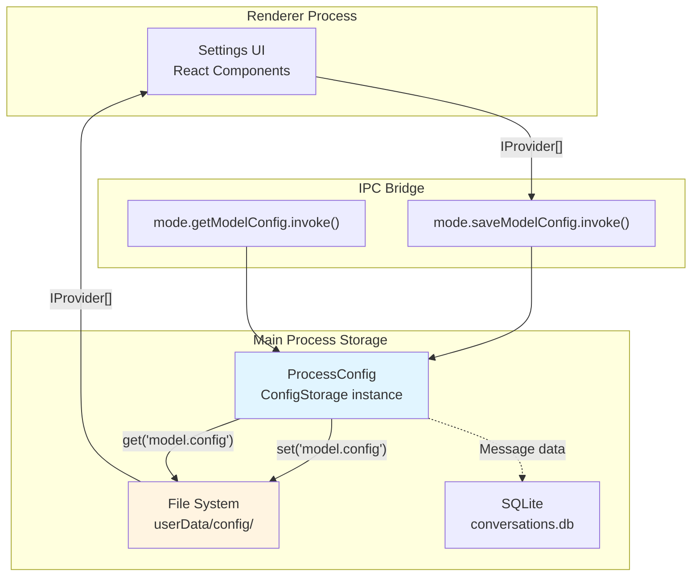
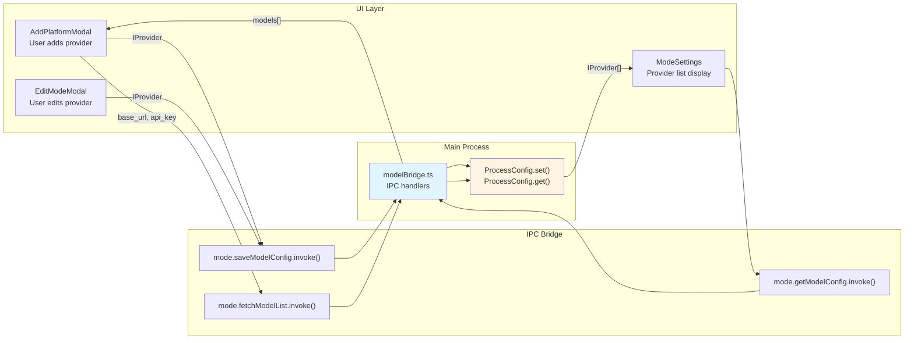
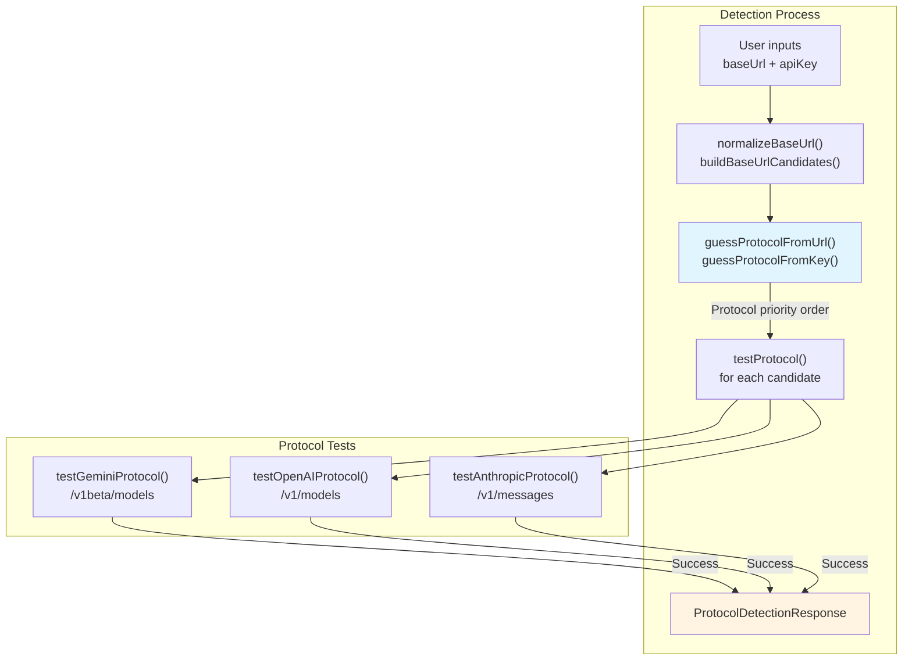
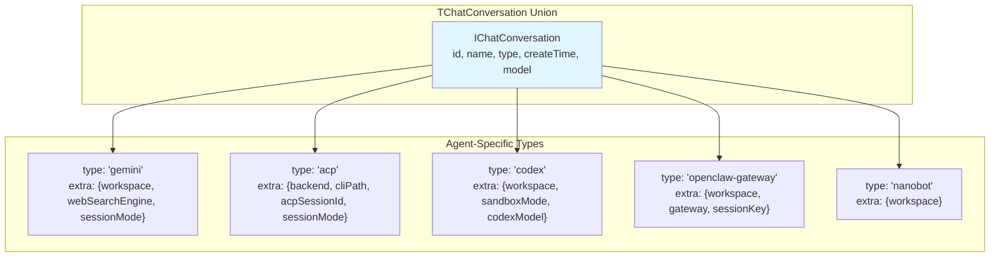
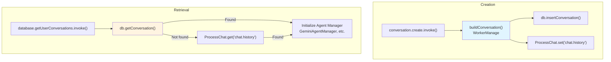
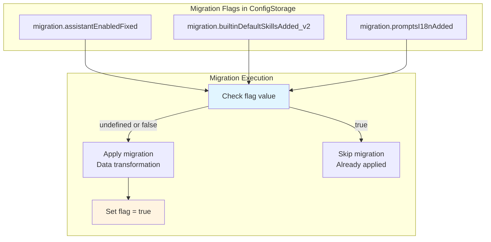
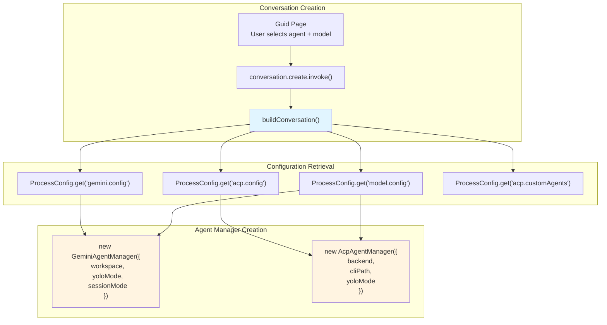
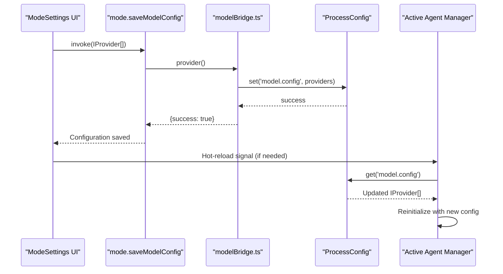
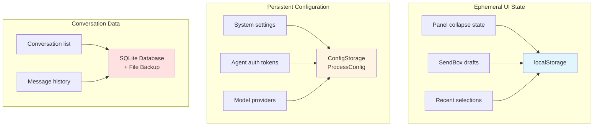

# Configuration & Persistence

<details>
<summary>Relevant source files</summary>

The following files were used as context for generating this wiki page:

- [src/common/ipcBridge.ts](src/common/ipcBridge.ts)
- [src/common/storage.ts](src/common/storage.ts)
- [src/common/utils/protocolDetector.ts](src/common/utils/protocolDetector.ts)
- [src/process/WorkerManage.ts](src/process/WorkerManage.ts)
- [src/process/bridge/modelBridge.ts](src/process/bridge/modelBridge.ts)
- [src/process/initBridge.ts](src/process/initBridge.ts)
- [src/renderer/assets/logos/minimax.png](src/renderer/assets/logos/minimax.png)
- [src/renderer/config/modelPlatforms.ts](src/renderer/config/modelPlatforms.ts)
- [src/renderer/pages/guid/index.tsx](src/renderer/pages/guid/index.tsx)
- [src/renderer/pages/settings/components/AddModelModal.tsx](src/renderer/pages/settings/components/AddModelModal.tsx)
- [src/renderer/pages/settings/components/AddPlatformModal.tsx](src/renderer/pages/settings/components/AddPlatformModal.tsx)
- [src/renderer/pages/settings/components/EditModeModal.tsx](src/renderer/pages/settings/components/EditModeModal.tsx)

</details>

This page provides an overview of AionUi's configuration management and data persistence strategies. The system implements a multi-layered architecture separating configuration, conversation metadata, and message history. It uses a hybrid approach combining JSON files for configuration and SQLite for conversation data, enabling both human-editable settings and efficient querying.

**Child Pages:**

- **[Configuration System (8.1)](#)**: ConfigStorage schema, configuration cascading (defaults < file < environment < runtime), and hot-reload mechanisms
- **[Storage Architecture (8.2)](#)**: storage.buildStorage factory, localStorage vs SQLite usage patterns, draft persistence, and panel state persistence
- **[Data Migration (8.3)](#)**: Migration flags in ConfigStorage, version tracking, and schema change handling

For conversation data models and message transformation, see page 7.1 and 7.2. For IPC communication patterns, see page 3.3.

---

## System Overview

### Storage Abstractions

AionUi's persistence system provides four primary storage abstractions built using `storage.buildStorage()`:

| Storage Interface    | Configuration Key      | Purpose                                        | Example Keys                                        |
| -------------------- | ---------------------- | ---------------------------------------------- | --------------------------------------------------- |
| `ConfigStorage`      | `'agent.config'`       | System settings, agent config, model providers | `'model.config'`, `'gemini.config'`, `'acp.config'` |
| `ChatStorage`        | `'agent.chat'`         | Conversation metadata list                     | `'chat.history'`                                    |
| `ChatMessageStorage` | `'agent.chat.message'` | Message history (per conversation)             | Per-conversation message files                      |
| `EnvStorage`         | `'agent.env'`          | Directory paths                                | `'aionui.dir'`                                      |

**Sources:** [src/common/storage.ts:10-22]()

### Storage Backend Strategy



**Sources:** [src/common/ipcBridge.ts:224-230](), [src/process/bridge/modelBridge.ts:428-469](), [src/common/storage.ts:10-22]()

### Key Configuration Domains

Configuration in `ConfigStorage` is organized into typed domains defined by the `IConfigStorageRefer` interface:

| Configuration Domain | Storage Key                                         | Type                 | Purpose                                            |
| -------------------- | --------------------------------------------------- | -------------------- | -------------------------------------------------- |
| Model Providers      | `'model.config'`                                    | `IProvider[]`        | API endpoints, keys, model lists, capabilities     |
| MCP Servers          | `'mcp.config'`                                      | `IMcpServer[]`       | Model Context Protocol server configurations       |
| Agent Settings       | `'gemini.config'`, `'acp.config'`, `'codex.config'` | Object               | Auth methods, CLI paths, yolo mode per agent       |
| UI Preferences       | `'language'`, `'theme'`, `'customCss'`              | String               | Localization and theming                           |
| Custom Agents        | `'acp.customAgents'`                                | `AcpBackendConfig[]` | Built-in and user-defined assistant configurations |

**Sources:** [src/common/storage.ts:24-118]()

---

## Configuration Management

### Model Provider Configuration

The model provider system (`IProvider[]` at `'model.config'`) supports 20+ AI platforms through a unified interface:

**Title:** Model Provider Configuration Flow



**IProvider Structure:**

```typescript
interface IProvider {
  id: string
  platform: string // 'gemini', 'openai', 'anthropic', 'bedrock', etc.
  name: string
  baseUrl: string
  apiKey: string
  model: string[] // Available models
  capabilities?: ModelCapability[] // vision, function_calling, web_search, etc.
  bedrockConfig?: {
    // AWS Bedrock specific
    authMethod: 'accessKey' | 'profile'
    region: string
  }
  modelProtocols?: Record<string, string> // New API per-model protocol mapping
}
```

**Sources:** [src/common/storage.ts:327-386](), [src/process/bridge/modelBridge.ts:63-426](), [src/renderer/pages/settings/components/AddPlatformModal.tsx:1-442]()

### Protocol Detection

The `mode.detectProtocol` IPC endpoint automatically identifies API protocol types (OpenAI, Gemini, Anthropic) by probing endpoints:

**Title:** Protocol Detection Workflow



**Sources:** [src/common/utils/protocolDetector.ts:1-468](), [src/process/bridge/modelBridge.ts:472-588]()

For detailed configuration schema, cascading rules, and hot-reload mechanisms, see page **8.1 Configuration System**.

---

## Conversation Data Model

### TChatConversation Union Type

The `TChatConversation` type is a discriminated union that stores conversation metadata with agent-specific configuration:

**Title:** Conversation Type Discrimination



**Common Fields:**

| Field    | Type                                                              | Purpose                                                  |
| -------- | ----------------------------------------------------------------- | -------------------------------------------------------- |
| `id`     | `string`                                                          | Unique conversation identifier                           |
| `type`   | `'gemini' \| 'acp' \| 'codex' \| 'openclaw-gateway' \| 'nanobot'` | Agent type discriminator                                 |
| `model`  | `TProviderWithModel`                                              | Selected model provider configuration                    |
| `extra`  | Agent-specific                                                    | Configuration object varying by agent type               |
| `source` | `ConversationSource`                                              | Origin: `'aionui'`, `'telegram'`, `'lark'`, `'dingtalk'` |

**Sources:** [src/common/storage.ts:127-302]()

### Storage and Retrieval

**Title:** Conversation Storage Architecture



**Sources:** [src/common/ipcBridge.ts:25-34](), [src/process/WorkerManage.ts:38-126](), [src/common/storage.ts:154-302]()

For detailed information on storage.buildStorage factory, localStorage vs SQLite patterns, and draft persistence, see page **8.2 Storage Architecture**.

---

## Data Migration

The migration system handles schema evolution using feature flags stored in `ConfigStorage`:

**Title:** Migration Flag System



**Common Migration Patterns:**

| Migration Type      | Example                                | Storage Key                                |
| ------------------- | -------------------------------------- | ------------------------------------------ |
| Field rename        | `selectedModel` → `useModel`           | Per-conversation in `TChatConversation`    |
| Schema addition     | Add `enabledSkills` to assistants      | `'migration.builtinDefaultSkillsAdded_v2'` |
| Data transformation | Convert prompt strings to i18n objects | `'migration.promptsI18nAdded'`             |

**Sources:** [src/common/storage.ts:74-82]()

For detailed migration implementation including legacy data migration, temp-to-config directory moves, and CLI-safe symlinks on macOS, see page **8.3 Data Migration**.

---

## Agent Configuration Integration

### Configuration Loading at Agent Initialization

**Title:** Agent Configuration Resolution



**Sources:** [src/process/WorkerManage.ts:38-126](), [src/common/ipcBridge.ts:25-34]()

### Runtime Configuration Updates

Configuration changes in the Settings UI are immediately persisted and can trigger hot-reload in active agents:

**Title:** Configuration Hot-Reload Flow



**Sources:** [src/process/bridge/modelBridge.ts:428-436](), [src/renderer/pages/settings/ModeSettings.tsx]()

---

## Persistence Patterns

### IPC Bridge Configuration Endpoints

The `ipcBridge` provides type-safe IPC communication for configuration operations:

**Configuration IPC Providers:**

| IPC Channel            | Request Type                    | Response Type               | Implementation                                |
| ---------------------- | ------------------------------- | --------------------------- | --------------------------------------------- |
| `mode.saveModelConfig` | `IProvider[]`                   | `IBridgeResponse`           | [src/process/bridge/modelBridge.ts:428-436]() |
| `mode.getModelConfig`  | `void`                          | `IProvider[]`               | [src/process/bridge/modelBridge.ts:438-469]() |
| `mode.fetchModelList`  | `{base_url, api_key, platform}` | `{mode: string[]}`          | [src/process/bridge/modelBridge.ts:64-426]()  |
| `mode.detectProtocol`  | `ProtocolDetectionRequest`      | `ProtocolDetectionResponse` | [src/process/bridge/modelBridge.ts:472-588]() |

**Sources:** [src/common/ipcBridge.ts:224-230]()

### localStorage vs ConfigStorage Usage

**localStorage** (Renderer-only):

- UI panel state (collapse state, split ratios)
- SendBox drafts (per-conversation)
- Recent selections (last selected agent on Guid page)

**ConfigStorage** (Cross-process, persisted):

- System settings (`language`, `theme`, `customCss`)
- Agent authentication (`gemini.config`, `acp.config`)
- Model providers (`model.config`)
- Migration flags (`migration.*`)

**Title:** Storage Strategy by Data Type



**Sources:** [src/common/storage.ts:10-22](), [src/renderer/hooks/useSendBoxDraft.ts]()

---

## Directory Structure and Path Resolution

### Storage Directory Layout

```
userData/                                    (app.getPath('userData'))
├── config/                                  (getConfigPath())
│   ├── aionui-config.txt                   (ConfigStorage - all settings)
│   ├── aionui-chat.txt                     (ChatStorage - conversation list)
│   ├── .aionui-env                         (EnvStorage - paths)
│   ├── aionui-chat-history/                (Message backups)
│   │   ├── {conversation_id}.txt
│   │   └── backup/
│   │       └── {conversation_id}_{timestamp}.txt
│   ├── assistants/                          (Assistant rule files)
│   │   ├── builtin-cowork.en-US.md
│   │   ├── builtin-cowork.zh-CN.md
│   │   └── custom-{uuid}.en-US.md
│   └── skills/                              (Skill definitions)
│       ├── _builtin/                        (Built-in skills)
│       │   ├── skill-creator/
│       │   │   └── SKILL.md
│       │   └── pptx/
│       │       └── SKILL.md
│       ├── custom-skill.md                  (User flat skill)
│       └── custom-skill/                    (User skill directory)
│           └── SKILL.md
└── conversations.db                         (SQLite database)

macOS symlinks (CLI-safe paths):
~/.aionui         → ~/Library/Application Support/Electron/aionui
~/.aionui-config  → ~/Library/Application Support/Electron/config
```

**Sources:** [src/process/initStorage.ts:25-350](), [src/process/utils.ts:78-92]()

### Path Resolution Functions

| Function                | Purpose                 | Returns                                            |
| ----------------------- | ----------------------- | -------------------------------------------------- |
| `getConfigPath()`       | Configuration directory | `userData/config` (or `~/.aionui-config` on macOS) |
| `getDataPath()`         | Data directory          | `userData/aionui` (or `~/.aionui` on macOS)        |
| `getTempPath()`         | Temporary workspace     | `temp/aionui`                                      |
| `getAssistantsDir()`    | Assistant rules         | `config/assistants`                                |
| `getSkillsDir()`        | Skills                  | `config/skills`                                    |
| `getBuiltinSkillsDir()` | Built-in skills         | `config/skills/_builtin`                           |

**CLI-Safe Symlinks (macOS):**

The `ensureCliSafeSymlink()` function creates symlinks in the home directory to avoid spaces in paths, which break CLI tools like Qwen. The function:

1. Checks if symlink exists and points to correct target
2. Verifies target directory exists (fixes broken symlinks)
3. Removes blocking files/wrong symlinks
4. Creates new symlink if needed

**Sources:** [src/process/utils.ts:27-92](), [src/process/initStorage.ts:331-350]()

---

## Best Practices

### Configuration Design

1. **Use TypeScript Interfaces:** Define all configuration keys in `IConfigStorageRefer` for type safety
2. **Namespace Keys:** Use dot notation (`'agent.config'`, `'gemini.config'`) to group related settings
3. **Migration Flags:** Add `'migration.*'` flags for schema changes to enable gradual rollout
4. **Optional Fields:** Make new fields optional (`?:`) to maintain backward compatibility

### File vs Database Trade-offs

**Use Files When:**

- Configuration needs to be human-editable
- Data is relatively small (<1MB)
- Frequent random access is not required
- Backup/restore should be simple file copying

**Use Database When:**

- Data requires complex queries (filtering, sorting, pagination)
- Relationships between entities need to be maintained
- Atomic transactions are required
- Data volume may grow large

### Performance Considerations

1. **Minimize File Writes:** The `JsonFileBuilder` queue serializes operations, so batch updates when possible
2. **Cache Configuration:** Load configuration once at startup, store in memory, write back only on changes
3. **Lazy Load Messages:** Don't load all conversation messages upfront; query database on-demand
4. **Index Database Tables:** Ensure SQLite indexes on frequently queried columns (conversation_id, timestamp)

**Sources:** [src/process/initStorage.ts:106-124](), [src/common/storage.ts:13-22]()
