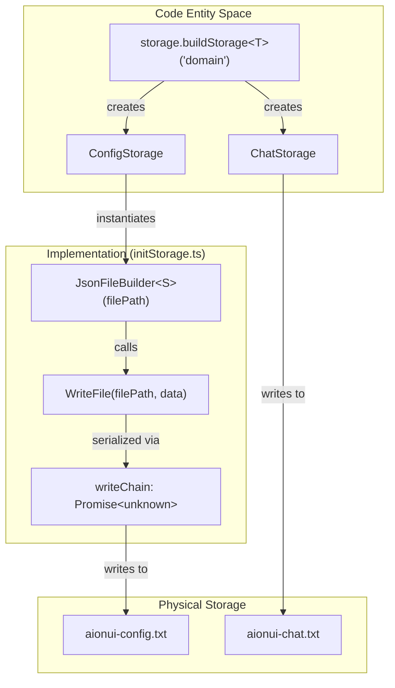
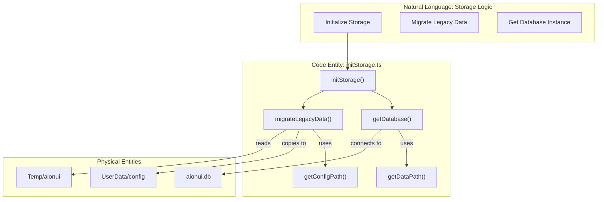

# Storage Architecture

Relevant source files

The following files were used as context for generating this wiki page:

- [src/common/config/storage.ts](src/common/config/storage.ts)
- [src/common/platform/ElectronPlatformServices.ts](src/common/platform/ElectronPlatformServices.ts)
- [src/common/platform/IPlatformServices.ts](src/common/platform/IPlatformServices.ts)
- [src/common/platform/NodePlatformServices.ts](src/common/platform/NodePlatformServices.ts)
- [src/common/platform/index.ts](src/common/platform/index.ts)
- [src/process/bridge/applicationBridgeCore.ts](src/process/bridge/applicationBridgeCore.ts)
- [src/process/index.ts](src/process/index.ts)
- [src/process/utils/configureChromium.ts](src/process/utils/configureChromium.ts)
- [src/process/utils/index.ts](src/process/utils/index.ts)
- [src/process/utils/initBridgeStandalone.ts](src/process/utils/initBridgeStandalone.ts)
- [src/process/utils/initStorage.ts](src/process/utils/initStorage.ts)
- [src/process/utils/utils.ts](src/process/utils/utils.ts)
- [src/process/webserver/auth/middleware/TokenMiddleware.ts](src/process/webserver/auth/middleware/TokenMiddleware.ts)
- [src/process/webserver/middleware/csrfClient.ts](src/process/webserver/middleware/csrfClient.ts)
- [src/renderer/components/settings/SettingsModal/contents/SystemModalContent/index.tsx](src/renderer/components/settings/SettingsModal/contents/SystemModalContent/index.tsx)
- [src/renderer/hooks/context/AuthContext.tsx](src/renderer/hooks/context/AuthContext.tsx)
- [src/renderer/pages/conversation/Workspace/hooks/useWorkspaceEvents.ts](src/renderer/pages/conversation/Workspace/hooks/useWorkspaceEvents.ts)
- [src/renderer/pages/conversation/Workspace/hooks/useWorkspaceTree.ts](src/renderer/pages/conversation/Workspace/hooks/useWorkspaceTree.ts)
- [src/renderer/pages/settings/AgentSettings/RemoteAgentManagement.tsx](src/renderer/pages/settings/AgentSettings/RemoteAgentManagement.tsx)
- [src/renderer/services/i18n/i18n-keys.d.ts](src/renderer/services/i18n/i18n-keys.d.ts)
- [src/renderer/services/i18n/locales/en-US/settings.json](src/renderer/services/i18n/locales/en-US/settings.json)
- [src/renderer/services/i18n/locales/ja-JP/settings.json](src/renderer/services/i18n/locales/ja-JP/settings.json)
- [src/renderer/services/i18n/locales/ko-KR/settings.json](src/renderer/services/i18n/locales/ko-KR/settings.json)
- [src/renderer/services/i18n/locales/ru-RU/settings.json](src/renderer/services/i18n/locales/ru-RU/settings.json)
- [src/renderer/services/i18n/locales/tr-TR/settings.json](src/renderer/services/i18n/locales/tr-TR/settings.json)
- [src/renderer/services/i18n/locales/zh-CN/settings.json](src/renderer/services/i18n/locales/zh-CN/settings.json)
- [src/renderer/services/i18n/locales/zh-TW/settings.json](src/renderer/services/i18n/locales/zh-TW/settings.json)
- [tests/unit/RemoteAgentManagement.dom.test.tsx](tests/unit/RemoteAgentManagement.dom.test.tsx)
- [tests/unit/platform/platformRegistry.test.ts](tests/unit/platform/platformRegistry.test.ts)
- [tests/unit/process/bridge/applicationBridgeCore.test.ts](tests/unit/process/bridge/applicationBridgeCore.test.ts)
- [tests/unit/process/initStorage.jsonFileBuilder.test.ts](tests/unit/process/initStorage.jsonFileBuilder.test.ts)
- [tests/unit/process/utils/configureChromium.test.ts](tests/unit/process/utils/configureChromium.test.ts)
- [tests/unit/webserver/csrfClient.dom.test.ts](tests/unit/webserver/csrfClient.dom.test.ts)

## Purpose and Scope

This document explains AionUi's multi-layered storage architecture, focusing on the `storage.buildStorage` factory pattern, the transition from legacy file-based storage to SQLite, and the persistence patterns for drafts and UI states. AionUi employs a dual-strategy approach: using `localStorage` (and its file-based equivalent in the main process) for configuration/metadata, and SQLite for high-volume conversation and message persistence.

---

## Storage Factory Pattern

AionUi uses a factory-based storage system that creates isolated storage domains with type safety and automatic serialization. In the main process, this is implemented via `JsonFileBuilder` to persist data to the file system, mimicking the `localStorage` API used in the renderer.

### buildStorage Factory Implementation

The system utilizes specialized builders to manage JSON-based flat-file storage in the user's configuration directory [src/process/utils/initStorage.ts:130-178]().

#### Code Entity to Storage Flow
The following diagram bridges the `storage.buildStorage` call in the code to the physical `JsonFileBuilder` entity in the main process.

**Key Functions:**
- `JsonFileBuilder`: Provides an in-memory cache with serialized disk persistence. It handles Base64 encoding/decoding for backward compatibility [src/process/utils/initStorage.ts:130-133]().
- `writeChain`: A promise chain that serializes disk writes to prevent file corruption during concurrent operations [src/process/utils/initStorage.ts:162-178]().
- `persist()`: Encodes the in-memory cache using `btoa(encodeURIComponent())` before writing to disk [src/process/utils/initStorage.ts:132-164]().

**Sources:** [src/process/utils/initStorage.ts:113-221](), [src/common/config/storage.ts:14-23]()

---

## Storage Domains and Backends

AionUi organizes storage into domains, mapped to specific files in the application's configuration directory [src/process/utils/initStorage.ts:46-55]().

### Domain Mapping

| Domain Class | File Path | Primary Purpose | Backend |
|--------------|-----------|-----------------|---------|
| `ConfigStorage` | `aionui-config.txt` | System settings, providers, and migration flags [src/common/config/storage.ts:25-174]() | File (JSON) |
| `ChatStorage` | `aionui-chat.txt` | Legacy conversation metadata (History) | File (JSON) |
| `ChatMessageStorage`| `aionui-chat-message.txt`| Legacy message storage | File (JSON) |
| `EnvStorage` | `.aionui-env` | Environment variables and system paths [src/common/config/storage.ts:176-181]() | File (Text) |
| `SQLite DB` | `aionui.db` | Modern persistence for all conversations/messages | SQLite |

### System Settings Persistence
Settings such as `closeToTray`, `notificationEnabled`, and `agentIdleTimeout` are persisted via `ConfigStorage` and accessed through the `ipcBridge.systemSettings` provider [src/renderer/components/settings/SettingsModal/contents/SystemModalContent/index.tsx:71-119]().

**Sources:** [src/common/config/storage.ts:25-181](), [src/process/utils/initStorage.ts:46-55](), [src/renderer/components/settings/SettingsModal/contents/SystemModalContent/index.tsx:166-184]()

---

## Conversation and Message Persistence

### Legacy to SQLite Data Flow
AionUi is transitioning to SQLite for better performance. The `initStorage` utility handles directory setup and legacy data migration from temporary directories to the user data path [src/process/utils/initStorage.ts:66-111]().

### Message Batching and Drafts
To ensure UI responsiveness during high-frequency AI streaming, message updates are often debounced before database persistence.

**Draft Persistence:**
- **Drafts**: UI components like `SystemModalContent` use local state that is flushed to `ConfigStorage` on blur or change [src/renderer/components/settings/SettingsModal/contents/SystemModalContent/index.tsx:170-184]().
- **Prompt Timeouts**: Global LLM request timeouts (default 300s) are stored under the `acp.promptTimeout` key [src/renderer/components/settings/SettingsModal/contents/SystemModalContent/index.tsx:173]().

**Sources:** [src/process/utils/initStorage.ts:29-32](), [src/process/utils/utils.ts:98-114](), [src/renderer/components/settings/SettingsModal/contents/SystemModalContent/index.tsx:166-184]()

---

## Workspace and Panel State

The Workspace UI manages file system state and UI layout persistence using React hooks and IPC emitters.

### Panel State
- **Workspace Tree**: `useWorkspaceTree` maintains the expansion and selection state of the file explorer [src/renderer/pages/conversation/Workspace/hooks/useWorkspaceTree.ts:25-33]().
- **Throttled Refresh**: To prevent UI flickering during rapid file writes by an agent, the system uses a 2000ms throttle for refreshing the workspace view [src/renderer/pages/conversation/Workspace/hooks/useWorkspaceEvents.ts:96-108]().

### File System Interaction
The application ensures "CLI-safe" paths (avoiding spaces) by creating symbolic links on platforms like macOS where the default `userData` path contains spaces (e.g., "Application Support") [src/process/utils/utils.ts:44-90]().

| Feature | Implementation | Source |
|---------|----------------|--------|
| **Symlink Creation** | `ensureCliSafeSymlink` | [src/process/utils/utils.ts:44-90]() |
| **Path Resolution** | `resolveCliSafePath` | [src/process/utils/utils.ts:126-137]() |
| **Tree Refresh** | `throttledRefresh` | [src/renderer/pages/conversation/Workspace/hooks/useWorkspaceEvents.ts:96-108]() |

**Sources:** [src/process/utils/utils.ts:44-137](), [src/renderer/pages/conversation/Workspace/hooks/useWorkspaceEvents.ts:91-147](), [src/renderer/pages/conversation/Workspace/hooks/useWorkspaceTree.ts:25-42]()