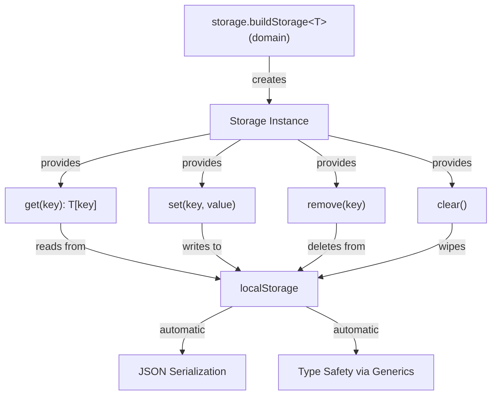
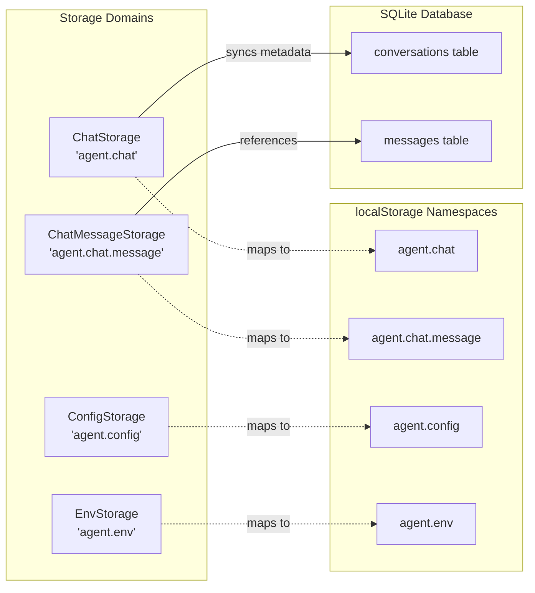
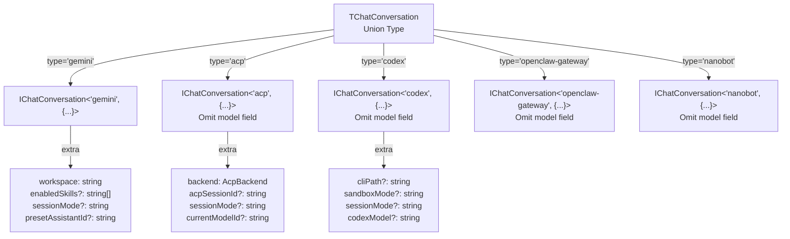
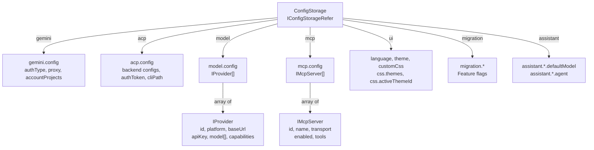
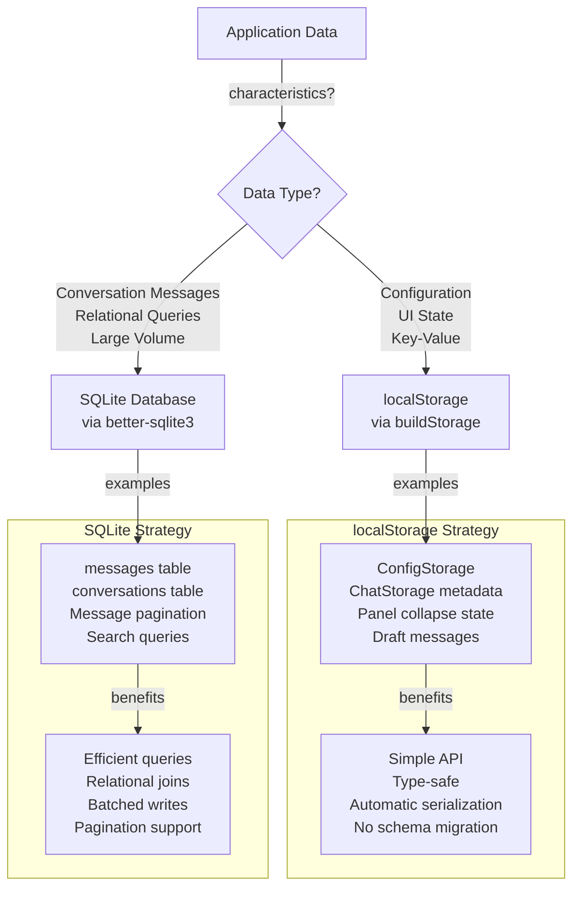
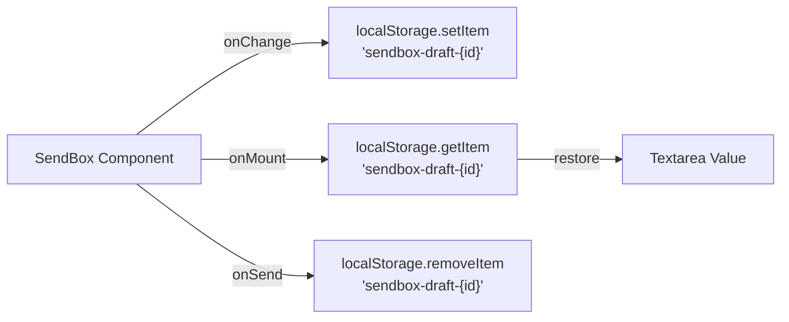
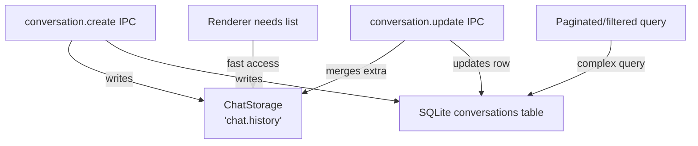
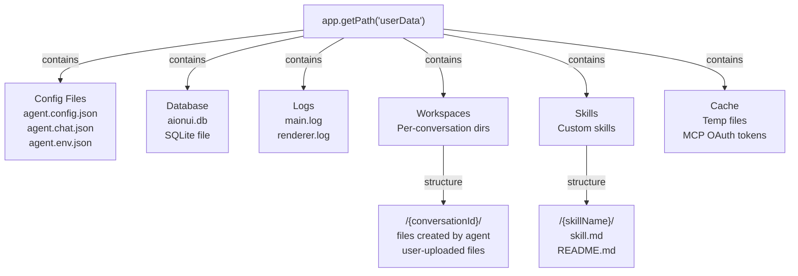
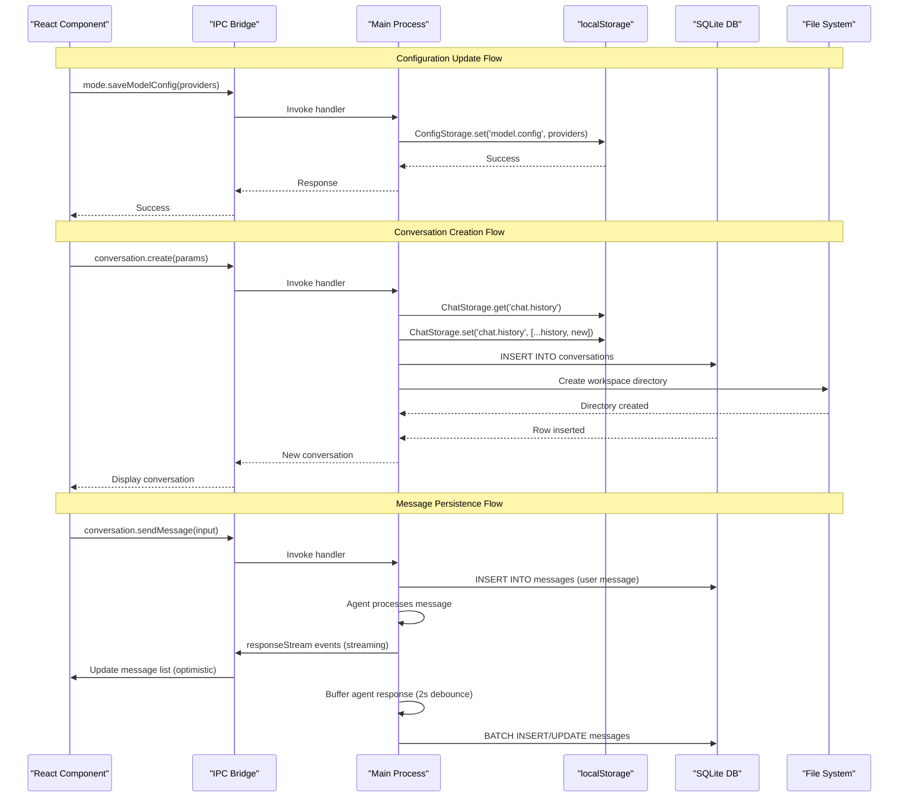

# Storage Architecture

<details>
<summary>Relevant source files</summary>

The following files were used as context for generating this wiki page:

- [src/common/ipcBridge.ts](src/common/ipcBridge.ts)
- [src/common/storage.ts](src/common/storage.ts)
- [src/renderer/pages/guid/index.tsx](src/renderer/pages/guid/index.tsx)

</details>

## Purpose and Scope

This document explains AionUi's multi-layered storage architecture, including the `buildStorage` factory pattern, storage domain isolation, and the dual-strategy approach using localStorage for configuration and SQLite for conversation persistence. For information about the configuration schema and hot-reload mechanisms, see [Configuration System](#8.1). For database schema details and batching mechanisms, see [Database System](#3.6).

---

## Storage Factory Pattern

AionUi uses a factory-based storage system provided by `@office-ai/platform` that creates isolated storage domains with type safety and automatic serialization.

### buildStorage Factory



**How buildStorage Works**

The factory function accepts a domain name (e.g., `'agent.config'`) and an optional type parameter defining the storage schema. It returns a storage instance with type-safe methods for reading and writing data to localStorage under the specified domain namespace.

**Sources:** [src/common/storage.ts:8](), [src/common/storage.ts:13-22]()

---

## Storage Domains

AionUi organizes storage into isolated domains, each responsible for a specific category of data.

### Domain Overview

| Domain               | Storage Key            | Purpose               | Backend      |
| -------------------- | ---------------------- | --------------------- | ------------ |
| `ChatStorage`        | `'agent.chat'`         | Conversation metadata | localStorage |
| `ChatMessageStorage` | `'agent.chat.message'` | Message references    | localStorage |
| `ConfigStorage`      | `'agent.config'`       | System configuration  | localStorage |
| `EnvStorage`         | `'agent.env'`          | Environment settings  | localStorage |



**Sources:** [src/common/storage.ts:13-22]()

---

## ChatStorage - Conversation Metadata

Stores conversation metadata including type, model selection, workspace configuration, and extra parameters.

### Schema Definition

```typescript
// Type: IChatConversationRefer
{
  'chat.history': TChatConversation[]
}
```

### Conversation Union Type

`TChatConversation` is a discriminated union supporting five agent types:

| Type               | Required Fields      | Optional Extra Fields                                                                                 |
| ------------------ | -------------------- | ----------------------------------------------------------------------------------------------------- |
| `gemini`           | `workspace`, `model` | `customWorkspace`, `webSearchEngine`, `contextFileName`, `enabledSkills`, `sessionMode`               |
| `acp`              | `backend`            | `workspace`, `cliPath`, `agentName`, `customAgentId`, `acpSessionId`, `sessionMode`, `currentModelId` |
| `codex`            | -                    | `workspace`, `cliPath`, `sandboxMode`, `sessionMode`, `codexModel`                                    |
| `openclaw-gateway` | -                    | `workspace`, `backend`, `gateway`, `sessionKey`, `runtimeValidation`                                  |
| `nanobot`          | -                    | `workspace`, `customWorkspace`, `enabledSkills`                                                       |



**Key Fields**

- **`type`**: Discriminator field for agent type
- **`model`**: `TProviderWithModel` - Selected model configuration (omitted for non-Gemini agents)
- **`extra`**: Type-specific configuration object
- **`source`**: `ConversationSource` - Origin (`'aionui'`, `'telegram'`, `'lark'`, `'dingtalk'`)
- **`channelChatId`**: Channel isolation ID for platform integrations

**Sources:** [src/common/storage.ts:133-302](), [src/common/storage.ts:304-306]()

---

## ConfigStorage - System Configuration

Stores all system configuration including model providers, authentication, UI preferences, and migration flags.

### Schema Overview



### Key Configuration Keys

| Key Pattern                | Type           | Purpose                                |
| -------------------------- | -------------- | -------------------------------------- |
| `gemini.config`            | Object         | Gemini authentication and API settings |
| `acp.config`               | Object         | Per-backend ACP configuration          |
| `acp.customAgents`         | Array          | Custom ACP agent definitions           |
| `acp.cachedModels`         | Record         | Cached model lists for Guid page       |
| `model.config`             | `IProvider[]`  | Model provider configurations          |
| `mcp.config`               | `IMcpServer[]` | MCP server configurations              |
| `language`                 | string         | UI language preference                 |
| `theme`                    | string         | Theme mode (`'light'`, `'dark'`)       |
| `customCss`                | string         | User-defined CSS overrides             |
| `css.themes`               | `ICssTheme[]`  | Custom CSS theme list                  |
| `migration.*`              | boolean        | Migration completion flags             |
| `assistant.*.defaultModel` | Object         | Per-assistant model selection          |
| `assistant.*.agent`        | Object         | Per-assistant agent configuration      |

### IProvider Structure

```typescript
interface IProvider {
  id: string
  platform: string // 'openai', 'gemini', 'anthropic', etc.
  name: string
  baseUrl: string
  apiKey: string
  model: string[] // Available model names
  capabilities?: ModelCapability[]
  contextLimit?: number
  modelProtocols?: Record<string, string> // For 'new-api' platform
  bedrockConfig?: {
    /* AWS Bedrock auth */
  }
  enabled?: boolean // Provider-level switch
  modelEnabled?: Record<string, boolean> // Per-model switches
  modelHealth?: Record<
    string,
    {
      /* health check results */
    }
  >
}
```

**Sources:** [src/common/storage.ts:19](), [src/common/storage.ts:24-118](), [src/common/storage.ts:327-386]()

---

## EnvStorage - Environment Settings

Stores system paths configured by the user.

### Schema

```typescript
interface IEnvStorageRefer {
  'aionui.dir': {
    workDir: string // Default workspace root
    cacheDir: string // Cache directory for temp files
  }
}
```

These paths can be updated via the `application.updateSystemInfo` IPC provider and are queried via `application.systemInfo`.

**Sources:** [src/common/storage.ts:22](), [src/common/storage.ts:120-125](), [src/common/ipcBridge.ts:95-97]()

---

## Storage Backend Selection

AionUi uses a dual storage strategy based on data characteristics.

### localStorage vs SQLite Decision Matrix



### localStorage Usage Patterns

**Used for:**

- Configuration settings (model providers, API keys, preferences)
- Conversation metadata (type, workspace, extra config)
- UI state (theme, language, panel collapse)
- Draft persistence (unsent messages per conversation)
- Migration flags

**Accessed via:**

- `ConfigStorage.get('model.config')`
- `ChatStorage.get('chat.history')`
- Direct window.localStorage for UI state (e.g., `'sendbox-draft-{conversationId}'`)

### SQLite Database Usage Patterns

**Used for:**

- Message content and history
- Conversation message relationships
- Paginated message queries
- Full-text search (future enhancement)

**Accessed via:**

- `database.getConversationMessages` IPC provider
- `database.getUserConversations` IPC provider
- `ConversationManageWithDB` in main process for batched writes

**Sources:** [src/common/ipcBridge.ts:325-328]()

---

## Persistence Patterns

### Draft Persistence

Unsent message drafts are persisted to localStorage to survive page refreshes and application restarts.



**Implementation:**

- Key pattern: `sendbox-draft-{conversationId}`
- Auto-save on input change (debounced)
- Restored on component mount
- Cleared on message send

**Sources:** Referenced in [src/common/ipcBridge.ts]() via `useSendBoxDraft` hook

### Panel State Persistence

UI panel states (collapse/expand, split ratios) are persisted to remember user layout preferences.

| State                     | Storage Key                      | Values               |
| ------------------------- | -------------------------------- | -------------------- |
| Workspace panel collapse  | `workspace-panel-collapsed-{id}` | `'true'` / `'false'` |
| Preview panel split ratio | `preview-panel-split-ratio`      | Float (0.0 - 1.0)    |
| Left sidebar collapse     | `left-sidebar-collapsed`         | `'true'` / `'false'` |

**Sources:** Referenced in TOC description for page 8.2

### Conversation Metadata Sync

Conversation metadata is stored in both localStorage (`ChatStorage`) and SQLite (`conversations` table) for different access patterns.



**Sync Strategy:**

1. **Create**: Write to both localStorage and SQLite atomically
2. **Update**: Update both stores with `mergeExtra` option for partial updates
3. **Read**: Use localStorage for quick access, SQLite for complex queries
4. **Delete**: Remove from both stores

**Sources:** [src/common/ipcBridge.ts:26-31]()

---

## File System Storage

AionUi uses the file system for workspace files, skills, and user data.

### Directory Structure



### Workspace Management

Each conversation has an isolated workspace directory for file operations.

**Workspace Path Resolution:**

1. **Custom Workspace**: User-specified path (`extra.customWorkspace = true`)
2. **Default Workspace**: `{workDir}/{conversationId}`

**File Operations:**

- `fs.getFilesByDir` - List files in workspace
- `fs.readFile` - Read file content
- `fs.writeFile` - Write file (triggers `fileStream.contentUpdate` event)
- `fs.removeEntry` - Delete file/folder
- `fs.renameEntry` - Rename file/folder
- `fs.copyFilesToWorkspace` - Bulk file import

**Sources:** [src/common/ipcBridge.ts:136-188]()

### Skills Storage

Skills are markdown files stored in the `skills/` directory, loaded by `SkillManager` and filtered by `enabledSkills` configuration.

**Built-in Skills:**

- Read via `fs.readBuiltinSkill`
- Located in application resources

**Custom Skills:**

- Imported via `fs.importSkill`
- Scanned via `fs.scanForSkills`
- Detected via `fs.detectCommonSkillPaths`

**Skill Filtering:**

- Each conversation has `extra.enabledSkills?: string[]`
- Skills are loaded only if their name is in the enabled list
- Empty list = all skills enabled

**Sources:** [src/common/ipcBridge.ts:179-187](), [src/common/storage.ts:167]()

### Cache Directory

Temporary files and OAuth tokens are stored in the cache directory.

**Contents:**

- Electron cache files
- Downloaded updates
- Temporary file conversions
- MCP OAuth access tokens (`mcp-oauth-{serverName}.json`)

**Sources:** [src/common/ipcBridge.ts:95]()

---

## Data Flow: UI to Storage



**Sources:** [src/common/ipcBridge.ts:226-227](), [src/common/ipcBridge.ts:26-34]()

---

## Storage Performance Considerations

### localStorage Limitations

- **Synchronous API**: Blocks main thread during read/write
- **Size Limit**: ~10MB per origin (browser-dependent)
- **No Indexing**: Linear search for complex queries
- **Serialization Overhead**: JSON.stringify/parse on every operation

**Mitigation:**

- Use for configuration and small datasets only
- Large message history stored in SQLite
- Debounce frequent writes (e.g., draft auto-save)

### SQLite Optimizations

- **Batched Writes**: `ConversationManageWithDB` uses 2-second debounce to batch message updates
- **Indexed Queries**: Primary keys and foreign keys for efficient lookups
- **Connection Pooling**: Single connection reused across operations
- **WAL Mode**: Write-Ahead Logging for concurrent reads during writes

**Sources:** Referenced in [Database System](#3.6)

### File System Caching

- **Workspace File List**: Cached in memory, refreshed on `workspace.refresh` event
- **Skill Loading**: Skills loaded once at agent initialization, filtered by `enabledSkills`
- **Image Base64**: Remote images cached to avoid re-fetching

**Sources:** [src/common/ipcBridge.ts:38](), [src/common/ipcBridge.ts:139]()

---

## Summary

AionUi's storage architecture uses a multi-layered approach optimized for different data access patterns:

1. **localStorage** via `buildStorage` for configuration, UI state, and metadata
2. **SQLite** for conversation messages and relational queries
3. **File System** for workspaces, skills, and user data

The `buildStorage` factory provides type-safe, isolated storage domains, while the dual localStorage/SQLite strategy balances simplicity with query performance. Panel states and drafts persist across sessions, and file operations are streamed to the UI for real-time feedback.

**Sources:** [src/common/storage.ts:8-22](), [src/common/ipcBridge.ts:18-603]()
