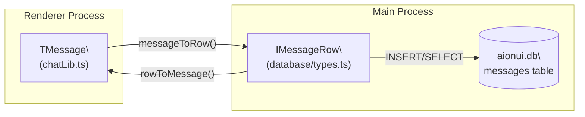
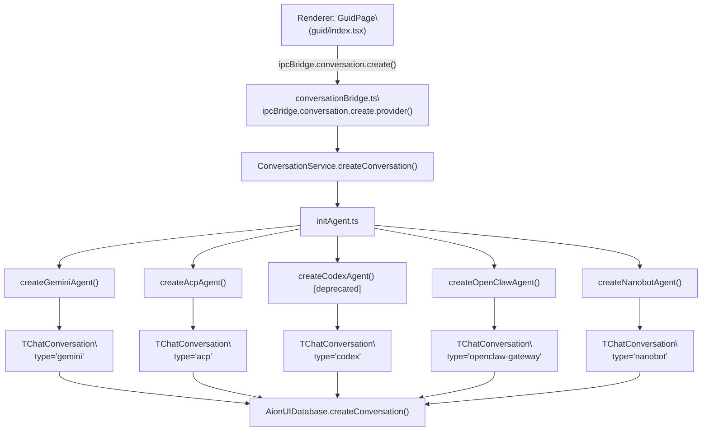
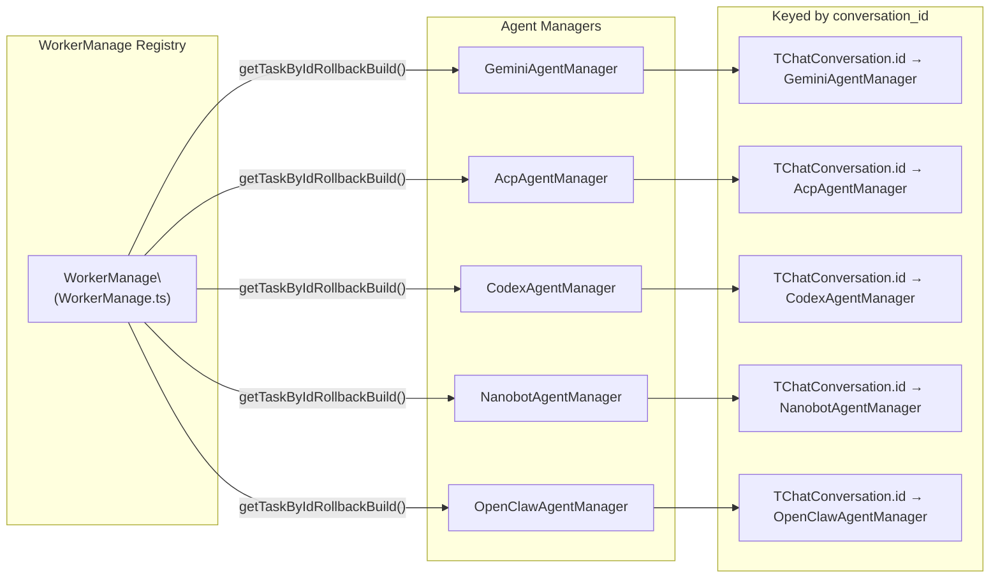

# Conversation Data Model

<details>
<summary>Relevant source files</summary>

The following files were used as context for generating this wiki page:

- [src/common/ipcBridge.ts](src/common/ipcBridge.ts)
- [src/common/storage.ts](src/common/storage.ts)
- [src/renderer/pages/guid/index.tsx](src/renderer/pages/guid/index.tsx)

</details>

This page documents the core data types for conversations and messages in AionUi, how conversations are instantiated for each agent type, and how `WorkerManage` maps a conversation ID to a live agent task. For how raw stream events become `TMessage` objects, see [Message Transformation Pipeline](#7.2). For the SQLite schema and CRUD operations that persist these types, see [Database System](#3.6). For the migration of legacy file-based records into the database, see [Data Migration](#8.3).

---

## `TChatConversation` — The Central Type

`TChatConversation` is a **discriminated union** defined in [src/common/storage.ts:152-231]() whose `type` field selects one of five agent variants. All variants share a common base shape (`IChatConversation`) and carry an `extra` object with agent-specific fields.

### Base Shape (`IChatConversation`)

[src/common/storage.ts:131-145]()

| Field           | Type                                                | Description                                                                     |
| --------------- | --------------------------------------------------- | ------------------------------------------------------------------------------- |
| `id`            | `string`                                            | UUID, unique conversation identifier                                            |
| `name`          | `string`                                            | Display name (usually the workspace path initially)                             |
| `desc`          | `string?`                                           | Optional description                                                            |
| `type`          | `string`                                            | Discriminant: `'gemini'`, `'acp'`, `'codex'`, `'openclaw-gateway'`, `'nanobot'` |
| `extra`         | `object`                                            | Variant-specific fields (see below)                                             |
| `model`         | `TProviderWithModel`                                | Provider + model selection                                                      |
| `status`        | `'pending' \| 'running' \| 'finished' \| undefined` | Runtime lifecycle state                                                         |
| `createTime`    | `number`                                            | Unix timestamp (ms)                                                             |
| `modifyTime`    | `number`                                            | Unix timestamp (ms)                                                             |
| `source`        | `ConversationSource?`                               | `'aionui' \| 'telegram' \| 'lark' \| 'dingtalk'`                                |
| `channelChatId` | `string?`                                           | Isolation key for channel-originated conversations                              |

> Note: the `acp`, `codex`, `openclaw-gateway`, and `nanobot` variants use `Omit<IChatConversation<...>, 'model'>` because those agents manage their own model state or do not require explicit model configuration.

Sources: [src/common/storage.ts:133-147](), [src/common/storage.ts:131]()

---

### Variant `extra` Fields

**Figure: TChatConversation discriminated union structure**

```mermaid
classDiagram
  class "IChatConversation" {
    +id: string
    +name: string
    +type: string
    +model: TProviderWithModel
    +status: string
    +source: ConversationSource
    +createTime: number
    +modifyTime: number
    +extra: object
  }

  class "GeminiExtra" {
    +workspace: string
    +customWorkspace: boolean
    +webSearchEngine: string
    +presetRules: string
    +enabledSkills: string[]
    +presetAssistantId: string
    +sessionMode: string
    +pinned: boolean
    +pinnedAt: number
    +contextFileName: string
    +contextContent: string
    +lastTokenUsage: TokenUsageData
    +isHealthCheck: boolean
  }

  class "AcpExtra" {
    +workspace: string
    +backend: AcpBackend
    +cliPath: string
    +agentName: string
    +customAgentId: string
    +presetContext: string
    +enabledSkills: string[]
    +presetAssistantId: string
    +acpSessionId: string
    +acpSessionUpdatedAt: number
    +sessionMode: string
    +currentModelId: string
    +pinned: boolean
    +pinnedAt: number
    +isHealthCheck: boolean
  }

  class "CodexExtra" {
    +workspace: string
    +cliPath: string
    +sandboxMode: string
    +presetContext: string
    +enabledSkills: string[]
    +presetAssistantId: string
    +sessionMode: string
    +codexModel: string
    +pinned: boolean
    +pinnedAt: number
    +isHealthCheck: boolean
  }

  class "OpenClawExtra" {
    +workspace: string
    +backend: AcpBackendAll
    +agentName: string
    +gateway: GatewayConfig
    +sessionKey: string
    +runtimeValidation: object
    +enabledSkills: string[]
    +presetAssistantId: string
    +pinned: boolean
    +pinnedAt: number
    +isHealthCheck: boolean
  }

  class "NanobotExtra" {
    +workspace: string
    +customWorkspace: boolean
    +enabledSkills: string[]
    +presetAssistantId: string
    +pinned: boolean
    +pinnedAt: number
    +isHealthCheck: boolean
  }

  "IChatConversation" <|-- "GeminiExtra" : type=gemini
  "IChatConversation" <|-- "AcpExtra" : type=acp
  "IChatConversation" <|-- "CodexExtra" : type=codex
  "IChatConversation" <|-- "OpenClawExtra" : type=openclaw-gateway
  "IChatConversation" <|-- "NanobotExtra" : type=nanobot
```

Sources: [src/common/storage.ts:154-302]()

#### Per-variant `extra` reference table

| Field                           |   `gemini`    |      `acp`      |     `codex`     | `openclaw-gateway` |  `nanobot`   |
| ------------------------------- | :-----------: | :-------------: | :-------------: | :----------------: | :----------: |
| `workspace`                     | ✔ (required)  |  ✔ (optional)   |  ✔ (optional)   |    ✔ (optional)    | ✔ (optional) |
| `customWorkspace`               |       ✔       |        ✔        |        ✔        |         ✔          |      ✔       |
| `presetRules` / `presetContext` | `presetRules` | `presetContext` | `presetContext` |         —          |      —       |
| `enabledSkills`                 |       ✔       |        ✔        |        ✔        |         ✔          |      ✔       |
| `presetAssistantId`             |       ✔       |        ✔        |        ✔        |         ✔          |      ✔       |
| `sessionMode`                   |       ✔       |        ✔        |        ✔        |         —          |      —       |
| `pinned` / `pinnedAt`           |       ✔       |        ✔        |        ✔        |         ✔          |      ✔       |
| `isHealthCheck`                 |       ✔       |        ✔        |        ✔        |         ✔          |      ✔       |
| `backend` (ACP type)            |       —       |  ✔ (required)   |        —        |    ✔ (optional)    |      —       |
| `acpSessionId`                  |       —       |        ✔        |        —        |         —          |      —       |
| `acpSessionUpdatedAt`           |       —       |        ✔        |        —        |         —          |      —       |
| `currentModelId`                |       —       |        ✔        |        —        |         —          |      —       |
| `codexModel`                    |       —       |        —        |        ✔        |         —          |      —       |
| `sandboxMode`                   |       —       |        —        |        ✔        |         —          |      —       |
| `gateway` (OpenClaw)            |       —       |        —        |        —        |         ✔          |      —       |
| `sessionKey`                    |       —       |        —        |        —        |         ✔          |      —       |
| `runtimeValidation`             |       —       |        —        |        —        |         ✔          |      —       |
| `webSearchEngine`               |       ✔       |        —        |        —        |         —          |      —       |
| `lastTokenUsage`                |       ✔       |        —        |        —        |         —          |      —       |
| `contextFileName`               |       ✔       |        —        |        —        |         —          |      —       |
| `contextContent`                |       ✔       |        —        |        —        |         —          |      —       |
| `agentName`                     |       —       |        ✔        |        —        |         ✔          |      —       |
| `customAgentId`                 |       —       |        ✔        |        —        |         —          |      —       |
| `cliPath`                       |       —       |        ✔        |        ✔        |         —          |      —       |

Sources: [src/common/storage.ts:154-302]()

---

## `TMessage`

`TMessage` is defined in `src/common/chatLib.ts` and is imported by the database layer [src/process/database/types.ts:9](). Messages are stored in the `messages` SQLite table as serialized `IMessageRow` records.

**Figure: TMessage to IMessageRow serialization**



Sources: [src/process/database/types.ts:1-15](), [src/process/database/export.ts:31]()

---

## Conversation Factory Functions

Each agent type has a corresponding factory function in [src/process/initAgent.ts](). These functions build workspace directories and return a fully-populated `TChatConversation` object before it is persisted.

**Figure: Conversation creation flow from IPC to factory**



Sources: [src/process/initAgent.ts:40-99](), [src/process/bridge/conversationBridge.ts:72-84]()

### `createGeminiAgent`

[src/process/initAgent.ts:40-69]()

Parameters: `model`, `workspace?`, `defaultFiles?`, `webSearchEngine?`, `customWorkspace?`, `contextFileName?`, `presetRules?`, `enabledSkills?`, `presetAssistantId?`, `sessionMode?`

Key behaviors:

- If no `workspace` is supplied, creates a temp directory at `<workDir>/gemini-temp-<timestamp>`.
- Sets `contextContent` to `presetRules` for backward compatibility.
- Assigns a UUID via `uuid()`.

### `createAcpAgent`

[src/process/initAgent.ts:71-99]()

Parameters: `options: ICreateConversationParams` (provides `extra.backend`, `extra.workspace`, `extra.cliPath`, `extra.agentName`, `extra.customAgentId`, `extra.presetContext`, `extra.enabledSkills`, `extra.presetAssistantId`, `extra.sessionMode`, `extra.currentModelId`).

Key behaviors:

- Temp directory pattern: `<backend>-temp-<timestamp>`.
- Does **not** set a `model` field (uses `Omit<..., 'model'>`).

### `createCodexAgent` (deprecated)

[src/process/initAgent.ts:101-127]()

Marked `@deprecated`. New Codex conversations use the ACP protocol path (`createAcpAgent`). Still present for legacy conversation loading.

### `createOpenClawAgent`

[src/process/initAgent.ts:129-167]()

Parameters: `options: ICreateConversationParams` (provides `extra.workspace`, `extra.backend`, `extra.agentName`, `extra.gateway`, `extra.sessionKey`, `extra.runtimeValidation`, etc.).

Key behaviors:

- Temp directory pattern: `openclaw-temp-<timestamp>`.
- Does **not** set a `model` field (uses `Omit<..., 'model'>`).
- Supports gateway configuration for external OpenClaw instances.

### `createNanobotAgent`

[src/process/initAgent.ts:169-189]()

Parameters: `options: ICreateConversationParams` (provides `extra.workspace`, `extra.customWorkspace`, `extra.enabledSkills`, `extra.presetAssistantId`).

Key behaviors:

- Simplified agent implementation without external dependencies.
- Temp directory pattern: `nanobot-temp-<timestamp>`.
- Does **not** set a `model` field (uses `Omit<..., 'model'>`).

---

## Database Serialization: `IConversationRow` and `IMessageRow`

Conversations and messages are serialized to SQLite via row types in [src/process/database/types.ts](). Conversion functions handle the marshalling:

| Conversion                                                  | Direction   |
| ----------------------------------------------------------- | ----------- |
| `conversationToRow(c: TChatConversation): IConversationRow` | To SQLite   |
| `rowToConversation(r: IConversationRow): TChatConversation` | From SQLite |
| `messageToRow(m: TMessage): IMessageRow`                    | To SQLite   |
| `rowToMessage(r: IMessageRow): TMessage`                    | From SQLite |

The `conversations` table schema includes a `type` CHECK constraint that enforces the five valid conversation types:

```sql
CREATE TABLE IF NOT EXISTS conversations (
  id TEXT PRIMARY KEY,
  user_id TEXT NOT NULL,
  name TEXT NOT NULL,
  type TEXT NOT NULL CHECK(type IN ('gemini', 'acp', 'codex', 'openclaw-gateway', 'nanobot')),
  extra TEXT NOT NULL,     -- JSON serialized extra fields
  model TEXT,              -- JSON serialized TProviderWithModel (nullable for acp/codex/openclaw/nanobot)
  status TEXT CHECK(status IN ('pending', 'running', 'finished')),
  source TEXT,             -- Conversation source: 'aionui', 'telegram', 'lark', 'dingtalk'
  channel_chat_id TEXT,    -- Channel isolation ID for channel-originated conversations
  created_at INTEGER NOT NULL,
  updated_at INTEGER NOT NULL,
  FOREIGN KEY (user_id) REFERENCES users(id) ON DELETE CASCADE
);
```

The `extra` field stores variant-specific configuration as JSON, and the `model` field is nullable to accommodate agents that manage their own model state.

Sources: [src/process/database/schema.ts:41-60](), [src/process/database/types.ts:1-58](), [src/process/database/export.ts:31]()

---

## `WorkerManage` — Conversation-to-Agent Task Mapping

`WorkerManage` is the runtime registry that maps a `conversation_id` to an active agent manager instance. It is referenced throughout `conversationBridge.ts` via calls like `WorkerManage.getTaskByIdRollbackBuild(conversation_id)`.

**Figure: WorkerManage task registry**



Sources: [src/process/bridge/conversationBridge.ts:34-36](), [src/process/bridge/conversationBridge.ts:87-100]()

The method `getTaskByIdRollbackBuild` either retrieves an existing manager or lazily rebuilds one from the persisted `TChatConversation` record. The returned manager is then type-narrowed at call sites using the conversation's `type` field.

---

## IPC Bridge Operations

The `conversation` namespace in [src/common/ipcBridge.ts:25-55]() exposes all CRUD and lifecycle operations on `TChatConversation` from the renderer:

| IPC Key                                 | Handler                                 | Description                                                                   |
| --------------------------------------- | --------------------------------------- | ----------------------------------------------------------------------------- |
| `create-conversation`                   | `conversation.create`                   | Create and persist a new `TChatConversation` from `ICreateConversationParams` |
| `create-conversation-with-conversation` | `conversation.createWithConversation`   | Create from existing conversation (supports migration)                        |
| `get-conversation`                      | `conversation.get`                      | Fetch by ID                                                                   |
| `get-associated-conversation`           | `conversation.getAssociateConversation` | Fetch related conversations                                                   |
| `remove-conversation`                   | `conversation.remove`                   | Delete conversation and messages                                              |
| `update-conversation`                   | `conversation.update`                   | Patch `Partial<TChatConversation>` with optional `mergeExtra`                 |
| `reset-conversation`                    | `conversation.reset`                    | Reset conversation state                                                      |
| `chat.stop.stream`                      | `conversation.stop`                     | Stop the active agent stream                                                  |
| `chat.send.message`                     | `conversation.sendMessage`              | Send a user message (unified interface for all agent types)                   |
| `conversation.get-slash-commands`       | `conversation.getSlashCommands`         | Get available slash commands for the conversation                             |
| `conversation.confirm.message`          | `conversation.confirmMessage`           | Unified confirmation for tool execution                                       |
| `chat.response.stream`                  | `conversation.responseStream`           | Emitter for inbound `IResponseMessage` events                                 |
| `conversation.get-workspace`            | `conversation.getWorkspace`             | List workspace files and directories                                          |
| `conversation.reload-context`           | `conversation.reloadContext`            | Reload conversation context                                                   |

Sources: [src/common/ipcBridge.ts:25-55]()

---

## Data Flow Summary

**Figure: End-to-end conversation data flow**

```mermaid
sequenceDiagram
  participant R as "Renderer\
(GuidPage)"
  participant B as "conversationBridge.ts"
  participant I as "initAgent.ts"
  participant DB as "AionUIDatabase"
  participant WM as "WorkerManage"

  R->>B: "ipcBridge.conversation.create(params)"
  B->>I: "createGeminiAgent() / createAcpAgent() / ..."
  I-->>B: "TChatConversation"
  B->>DB: "createConversation(TChatConversation)"
  DB-->>B: "IQueryResult<TChatConversation>"
  B-->>R: "TChatConversation"
  R->>B: "ipcBridge.conversation.sendMessage()"
  B->>WM: "getTaskByIdRollbackBuild(conversation_id)"
  WM-->>B: "GeminiAgentManager | AcpAgentManager | ..."
  B->>WM: "agent.sendMessage()"
  WM-->>R: "ipcBridge.conversation.responseStream (TMessage stream)"
```

Sources: [src/process/bridge/conversationBridge.ts:72-84](), [src/process/initAgent.ts:40-99](), [src/process/database/index.ts:25-80](), [src/common/ipcBridge.ts:24-53]()
