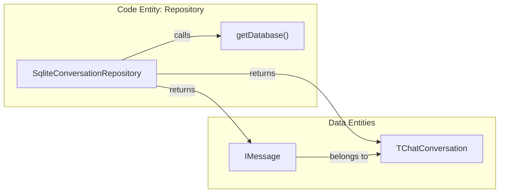
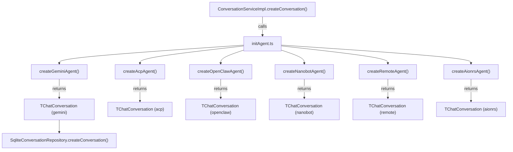
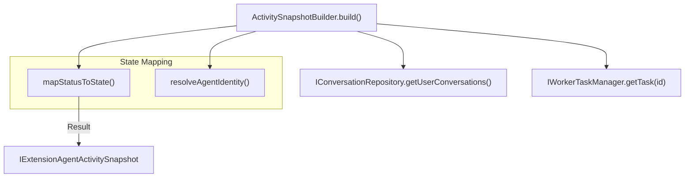

# Conversation Data Model

<details>
<summary>Relevant source files</summary>

The following files were used as context for generating this wiki page:

- [src/common/chat/chatLib.ts](src/common/chat/chatLib.ts)
- [src/common/types/acpTypes.ts](src/common/types/acpTypes.ts)
- [src/process/agent/openclaw/index.ts](src/process/agent/openclaw/index.ts)
- [src/process/agent/remote/RemoteAgentCore.ts](src/process/agent/remote/RemoteAgentCore.ts)
- [src/process/bridge/databaseBridge.ts](src/process/bridge/databaseBridge.ts)
- [src/process/bridge/extensionsBridge.ts](src/process/bridge/extensionsBridge.ts)
- [src/process/bridge/migrationUtils.ts](src/process/bridge/migrationUtils.ts)
- [src/process/bridge/services/ActivitySnapshotBuilder.ts](src/process/bridge/services/ActivitySnapshotBuilder.ts)
- [src/process/services/ConversationServiceImpl.ts](src/process/services/ConversationServiceImpl.ts)
- [src/process/services/IConversationService.ts](src/process/services/IConversationService.ts)
- [src/process/services/cron/SkillSuggestWatcher.ts](src/process/services/cron/SkillSuggestWatcher.ts)
- [src/process/task/agentTypes.ts](src/process/task/agentTypes.ts)
- [src/process/utils/initAgent.ts](src/process/utils/initAgent.ts)
- [src/renderer/pages/conversation/Messages/components/MessageAgentStatus.tsx](src/renderer/pages/conversation/Messages/components/MessageAgentStatus.tsx)
- [src/renderer/services/i18n/locales/en-US/acp.json](src/renderer/services/i18n/locales/en-US/acp.json)
- [src/renderer/services/i18n/locales/ja-JP/acp.json](src/renderer/services/i18n/locales/ja-JP/acp.json)
- [src/renderer/services/i18n/locales/ko-KR/acp.json](src/renderer/services/i18n/locales/ko-KR/acp.json)
- [src/renderer/services/i18n/locales/tr-TR/acp.json](src/renderer/services/i18n/locales/tr-TR/acp.json)
- [tests/unit/ConversationServiceImpl.test.ts](tests/unit/ConversationServiceImpl.test.ts)
- [tests/unit/SqliteConversationRepository.test.ts](tests/unit/SqliteConversationRepository.test.ts)
- [tests/unit/acpTypesSkillsDirs.test.ts](tests/unit/acpTypesSkillsDirs.test.ts)
- [tests/unit/apiRoutesUploadWorkspace.test.ts](tests/unit/apiRoutesUploadWorkspace.test.ts)
- [tests/unit/databaseBridge.test.ts](tests/unit/databaseBridge.test.ts)
- [tests/unit/extensionsBridge.test.ts](tests/unit/extensionsBridge.test.ts)
- [tests/unit/initAgent.skills.test.ts](tests/unit/initAgent.skills.test.ts)
- [tests/unit/openClawAgentDuplicate.test.ts](tests/unit/openClawAgentDuplicate.test.ts)
- [tests/unit/transformMessage.test.ts](tests/unit/transformMessage.test.ts)

</details>


This page documents the core data types for conversations and messages in AionUi, how conversations are instantiated for each agent type, and how the service layer maps a conversation ID to a live agent task. For how raw stream events become `TMessage` objects, see [Message Transformation Pipeline](#7.2). For the SQLite schema and CRUD operations that persist these types, see [Database System](#3.6).

---

## `TChatConversation` — The Central Type

`TChatConversation` is a **discriminated union** defined in [src/common/config/storage.ts:152-231]() whose `type` field selects one of seven agent variants. All variants share a common base shape (`IChatConversation`) and carry an `extra` object with agent-specific fields.

### Base Shape (`IChatConversation`)

[src/common/config/storage.ts:131-145]()

| Field | Type | Description |
|---|---|---|
| `id` | `string` | UUID, unique conversation identifier |
| `name` | `string` | Display name (usually the workspace path initially) |
| `desc` | `string?` | Optional description |
| `type` | `AgentType` | Discriminant: `'gemini'`, `'acp'`, `'codex'`, `'openclaw-gateway'`, `'nanobot'`, `'aionrs'`, `'remote'` |
| `extra` | `object` | Variant-specific configuration fields |
| `model` | `TProviderWithModel` | Provider + model selection (e.g., Gemini 2.0 Flash) |
| `status` | `AgentStatus` | Runtime lifecycle state: `'pending' \| 'running' \| 'finished'` |
| `createTime` | `number` | Unix timestamp (ms) |
| `modifyTime` | `number` | Unix timestamp (ms) |
| `source` | `ConversationSource?` | `'aionui' \| 'telegram' \| 'lark' \| 'dingtalk' \| 'cron'` |
| `channelChatId` | `string?` | Isolation key for channel-originated conversations |

Sources: [src/common/config/storage.ts:131-147](), [src/process/services/IConversationService.ts:11](), [src/process/task/agentTypes.ts:9-10]()

---

### Variant `extra` Fields

The `extra` field is a flexible object used to store configuration specific to the agent backend. This includes workspace paths, enabled skills, and protocol-specific session identifiers.

**Figure: TChatConversation discriminated union structure**

```mermaid
classDiagram
  class "IChatConversation" {
    +id: string
    +name: string
    +type: AgentType
    +model: TProviderWithModel
    +status: AgentStatus
    +extra: object
  }

  class "GeminiExtra" {
    +workspace: string
    +webSearchEngine: string
    +presetRules: string
    +enabledSkills: string[]
    +presetAssistantId: string
    +contextFileName: string
    +isHealthCheck: boolean
  }

  class "AcpExtra" {
    +workspace: string
    +backend: AcpBackend
    +agentName: string
    +cliPath: string
    +acpSessionId: string
    +enabledSkills: string[]
  }

  class "AionrsExtra" {
    +workspace: string
    +agentName: string
    +enabledSkills: string[]
    +isHealthCheck: boolean
  }

  class "RemoteExtra" {
    +workspace: string
    +gateway: string
    +sessionKey: string
    +backend: AcpBackendAll
  }

  class "OpenClawExtra" {
    +workspace: string
    +gateway: GatewayConfig
    +sessionKey: string
    +backend: AcpBackendAll
  }

  class "NanobotExtra" {
    +workspace: string
    +customWorkspace: boolean
    +enabledSkills: string[]
  }

  "IChatConversation" <|-- "GeminiExtra" : type=gemini
  "IChatConversation" <|-- "AcpExtra" : type=acp
  "IChatConversation" <|-- "AionrsExtra" : type=aionrs
  "IChatConversation" <|-- "RemoteExtra" : type=remote
  "IChatConversation" <|-- "OpenClawExtra" : type=openclaw-gateway
  "IChatConversation" <|-- "NanobotExtra" : type=nanobot
```

Sources: [src/common/config/storage.ts:154-302](), [src/process/services/IConversationService.ts:20-35](), [src/process/task/agentTypes.ts:9]()

#### Per-variant `extra` reference table

| Field | `gemini` | `acp` | `aionrs` | `openclaw-gateway` | `remote` | `nanobot` |
|---|:---:|:---:|:---:|:---:|:---:|:---:|
| `workspace` | ✔ | ✔ | ✔ | ✔ | ✔ | ✔ |
| `enabledSkills` | ✔ | ✔ | ✔ | ✔ | — | ✔ |
| `presetAssistantId` | ✔ | ✔ | — | ✔ | — | ✔ |
| `isHealthCheck` | ✔ | ✔ | ✔ | ✔ | — | ✔ |
| `backend` | — | ✔ | — | ✔ | ✔ | — |
| `cliPath` | — | ✔ | — | — | — | — |
| `agentName` | — | ✔ | ✔ | ✔ | — | — |
| `webSearchEngine` | ✔ | — | — | — | — | — |

Sources: [src/common/config/storage.ts:154-302](), [src/process/services/IConversationService.ts:20-35](), [src/process/services/ConversationServiceImpl.ts:128-165]()

---

## `IMessage` and Database Mapping

`IMessage` is the core data structure for chat history, utilizing a generic type `TMessageType` to handle various content formats (text, tool calls, permissions). In the database layer, these are handled by the `IConversationRepository`.

**Figure: Message and Conversation Repository Space**



Sources: [src/process/services/database/SqliteConversationRepository.ts:22](), [src/common/chat/chatLib.ts:84-120](), [src/process/services/database/IConversationRepository.ts:8]()

The `SqliteConversationRepository` provides the implementation for persisting these models to SQLite. Messages are retrieved via `getMessages(conversation_id, page, pageSize)` [src/process/services/database/SqliteConversationRepository.ts:63-71]().

### Lazy Migration
When fetching conversations via `getUserConversations`, the system performs a **lazy migration** from the legacy file-based storage (`ProcessChat`) to the SQLite database [src/process/bridge/databaseBridge.ts:27-58]().
1. Conversations existing only in file storage are detected.
2. `migrateConversationToDatabase` is triggered in the background [src/process/bridge/migrationUtils.ts:15-52]().
3. The results are merged to ensure consistent UI display [src/process/bridge/databaseBridge.ts:58-61]().

Sources: [src/process/bridge/databaseBridge.ts:27-61](), [src/process/bridge/migrationUtils.ts:15-52]()

---

## Conversation Factory Functions

Each agent type has a corresponding factory function in `src/process/utils/initAgent.ts`. These functions are invoked by the `ConversationServiceImpl` to create new conversation instances and initialize their workspaces.

**Figure: Conversation Creation Flow**



Sources: [src/process/services/ConversationServiceImpl.ts:124-198](), [src/process/utils/initAgent.ts:161-175](), [src/process/services/ConversationServiceImpl.ts:19]().

### `setupAssistantWorkspace` and Skills
For agents supporting native skill discovery (e.g., `gemini`, `claude`, `aionrs`), the factory calls `setupAssistantWorkspace` [src/process/utils/initAgent.ts:34-45]().
- It creates symlinks (junctions) for both **builtin skills** and **user-enabled skills** into the agent's hidden directory (e.g., `.gemini/skills`) [src/process/utils/initAgent.ts:57-110]().
- This allows CLI-based agents to automatically discover tools without manual prompt injection [src/process/utils/initAgent.ts:25-27]().

Sources: [src/process/utils/initAgent.ts:34-129](), [src/common/types/acpTypes.ts:10-14](), [tests/unit/initAgent.skills.test.ts:90-109]()

---

## Activity Monitoring & Snapshots

The system monitors the runtime state of conversations using the `ActivitySnapshotBuilder`. This service maps the static `TChatConversation` data and dynamic `IMessage` history to a live activity state.

**Figure: Activity State Resolution**



Sources: [src/process/bridge/services/ActivitySnapshotBuilder.ts:105-112](), [src/process/bridge/extensionsBridge.ts:67-93]()

### Runtime Status Normalization
The builder normalizes the `status` field from both the database and the live `WorkerTaskManager`:
- **Running/Pending**: Conversations with an active task are prioritized as `running` [src/process/bridge/services/ActivitySnapshotBuilder.ts:121-124]().
- **State Inference**: The builder analyzes message content to infer high-level states like `researching` (web search detected) or `writing` (file edits detected) [src/process/bridge/services/ActivitySnapshotBuilder.ts:32-41]().
- **Health Checks**: Conversations marked with `isHealthCheck: true` in the `extra` field are filtered out of the activity snapshots [src/process/bridge/services/ActivitySnapshotBuilder.ts:113]().

Sources: [src/process/bridge/services/ActivitySnapshotBuilder.ts:20-41](), [src/process/bridge/services/ActivitySnapshotBuilder.ts:113]()