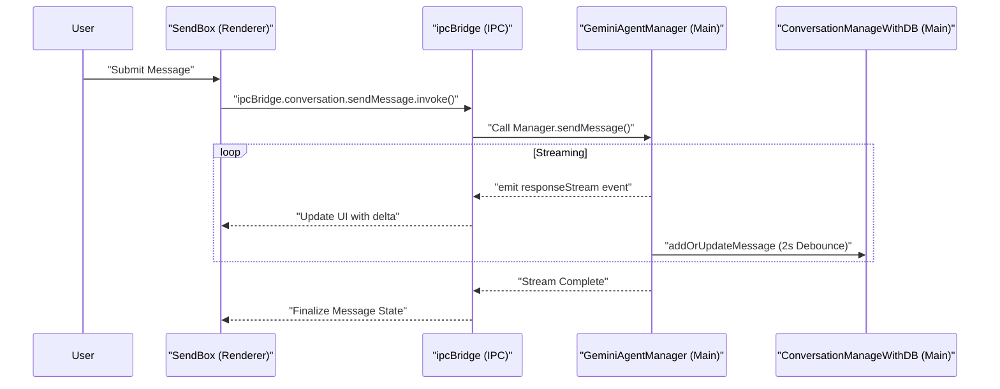

# Event-Driven Communication

<details>
<summary>Relevant source files</summary>

The following files were used as context for generating this wiki page:

- [codecov.yml](codecov.yml)
- [src/common/adapter/browser.ts](src/common/adapter/browser.ts)
- [src/common/adapter/main.ts](src/common/adapter/main.ts)
- [src/process/bridge/acpConversationBridge.ts](src/process/bridge/acpConversationBridge.ts)
- [src/process/bridge/authBridge.ts](src/process/bridge/authBridge.ts)
- [src/process/bridge/conversationBridge.ts](src/process/bridge/conversationBridge.ts)
- [src/process/bridge/geminiConversationBridge.ts](src/process/bridge/geminiConversationBridge.ts)
- [src/process/bridge/index.ts](src/process/bridge/index.ts)
- [src/process/bridge/taskBridge.ts](src/process/bridge/taskBridge.ts)
- [src/process/bridge/teamBridge.ts](src/process/bridge/teamBridge.ts)
- [src/process/extensions/ExtensionRegistry.ts](src/process/extensions/ExtensionRegistry.ts)
- [src/process/extensions/hub/HubStateManager.ts](src/process/extensions/hub/HubStateManager.ts)
- [src/process/extensions/lifecycle/statePersistence.ts](src/process/extensions/lifecycle/statePersistence.ts)
- [src/process/utils/message.ts](src/process/utils/message.ts)
- [src/renderer/index.html](src/renderer/index.html)
- [src/renderer/main.tsx](src/renderer/main.tsx)
- [src/renderer/utils/emitter.ts](src/renderer/utils/emitter.ts)
- [tests/unit/acpConversationBridge.test.ts](tests/unit/acpConversationBridge.test.ts)
- [tests/unit/adapterEmitGuard.test.ts](tests/unit/adapterEmitGuard.test.ts)
- [tests/unit/adapterPayloadGuard.test.ts](tests/unit/adapterPayloadGuard.test.ts)
- [tests/unit/baseAgentManagerStop.test.ts](tests/unit/baseAgentManagerStop.test.ts)
- [tests/unit/browserAdapterReconnect.test.ts](tests/unit/browserAdapterReconnect.test.ts)
- [tests/unit/conversationBridge.test.ts](tests/unit/conversationBridge.test.ts)
- [tests/unit/extensions/statePersistence.test.ts](tests/unit/extensions/statePersistence.test.ts)
- [tests/unit/geminiConversationBridge.test.ts](tests/unit/geminiConversationBridge.test.ts)
- [tests/unit/messageQueue.test.ts](tests/unit/messageQueue.test.ts)
- [tests/unit/taskBridge.test.ts](tests/unit/taskBridge.test.ts)
- [tests/unit/webui-favicon.test.ts](tests/unit/webui-favicon.test.ts)

</details>


AionUi employs two distinct event-driven systems for communication: a renderer-side `emitter` for component-to-component messaging, and IPC-based emitters (`ipcBridge`) for main-to-renderer streaming and notifications. This page documents both systems, their interaction patterns, and the throttling/debouncing strategies used to optimize performance.

---

## Overview

AionUi's event architecture operates on two layers:

| Layer | Implementation | Scope | Primary Use Cases |
|-------|---------------|-------|-------------------|
| **Renderer Events** | `eventemitter3` singleton | Renderer process only | File selection, workspace refresh, UI coordination |
| **IPC Events** | `ipcBridge` (via `bridge.adapter`) | Cross-process (main ↔ renderer) | Agent response streaming, status updates, system notifications |

The renderer-side `emitter` provides type-safe pub/sub for React components. The IPC emitters deliver streaming responses from AI agents and system events from the main process. Both systems use event throttling to prevent UI thrashing during high-frequency updates.

**Sources:** [src/renderer/utils/emitter.ts:1-63](), [src/common/adapter/main.ts:39-98]()

---

## Renderer-Side Event System

### Core Module: `emitter.ts`

The renderer event system is implemented in `src/renderer/utils/emitter.ts` and exports:

| Export | Type | Implementation | Usage Context |
|--------|------|----------------|---------------|
| `emitter` | `EventEmitter<EventTypes>` | Singleton instance from `eventemitter3` | Import and call `.emit()` or `.on()` |
| `addEventListener` | `(event, fn) => () => void` | Wraps `emitter.on()` and returns cleanup function | Non-React modules |
| `useAddEventListener` | React hook | `useEffect`-based subscription with auto-cleanup | React components |

**Type Safety:** All events are declared in the `EventTypes` interface, providing compile-time guarantees that producers and consumers agree on payload types.

**Sources:** [src/renderer/utils/emitter.ts:63-83]()

---

## Event Type Contract

All events and their payload types are declared in the `EventTypes` interface. TypeScript enforces that every `emitter.on(...)` / `emitter.emit(...)` call matches a declared entry.

**EventTypes — key declared events**

| Event Name | Payload | Description |
|------------|---------|-------------|
| `gemini.selected.file` | `Array<string \| FileOrFolderItem>` | Replace the Gemini send-box file list |
| `gemini.workspace.refresh` | `void` | Trigger a workspace file-tree refresh for Gemini |
| `acp.workspace.refresh` | `void` | Trigger a workspace file-tree refresh for ACP |
| `codex.workspace.refresh` | `void` | Trigger a workspace file-tree refresh for Codex |
| `chat.history.refresh` | `void` | Refresh the conversation history sidebar |
| `conversation.deleted` | `[string]` (conversationId) | A conversation was deleted; recipients should clean up |
| `preview.open` | `[{ content, contentType, metadata? }]` | Open the preview panel with specified content |
| `sendbox.fill` | `[string]` (prompt text) | Pre-fill the active send-box input field |
| `staroffice.install.request` | `[{ conversationId, text, ... }]` | Request to install StarOffice tools |

**Sources:** [src/renderer/utils/emitter.ts:19-61]()

### Event Naming Convention

Renderer events follow a three-segment pattern: `<scope>.<noun>.<verb>`.

| Segment | Values | Examples |
|---------|--------|----------|
| `<scope>` | `gemini`, `acp`, `codex`, `openclaw-gateway`, `nanobot`, `chat`, `conversation`, `preview`, `sendbox` | Agent type or feature area |
| `<noun>` | `selected`, `workspace`, `history`, etc. | Target entity |
| `<verb>` | `file`, `append`, `clear`, `refresh`, `open`, `fill`, `deleted` | Action |

**Symmetry:** Each agent type provides identical event sets (e.g., `acp.workspace.refresh`, `codex.workspace.refresh`, `aionrs.workspace.refresh`) to ensure consistent behavior across different AI backends.

**Sources:** [src/renderer/utils/emitter.ts:20-47]()

### Architecture Diagram: Renderer Event System

**Diagram: `emitter` singleton structure and consumers**

```mermaid
graph TB
    subgraph "emitterModule [src/renderer/utils/emitter.ts]"
        "EventTypes [interface]"
        "emitter [EventEmitter instance]"
        "addEventListener [function]"
        "useAddEventListener [React hook]"
        
        "EventTypes" -->|constrains| "emitter"
        "emitter" -->|wraps| "addEventListener"
        "addEventListener" -->|wrapped by| "useAddEventListener"
    end
    
    subgraph "consumers [React Components]"
        "ChatHistory [ConversationHistoryContext.tsx]"
        "SendBox [SendBox.tsx]"
        "Workspace [WorkspacePanel.tsx]"
    end
    
    "useAddEventListener" -->|subscribed by| "ChatHistory"
    "useAddEventListener" -->|subscribed by| "SendBox"
    "useAddEventListener" -->|subscribed by| "Workspace"
```

**Sources:** [src/renderer/utils/emitter.ts:1-84](), [src/renderer/main.tsx:119-122]()

---

## IPC Event System

### IPC Emitters Architecture

The IPC event system uses `bridge.adapter` to create communication channels between the Main process and Renderer windows. The `ipcBridge` acts as the central registry for these channels.

**Key IPC Event Providers:**

| Emitter / Provider | Channel | Producer | Consumer |
|---------|-----------|---------|----------|
| `conversation.create` | `ipcBridge.conversation.create` | `initConversationBridge` | Guid/Start page |
| `geminiConversation.confirmMessage` | `ipcBridge.geminiConversation.confirmMessage` | `initGeminiConversationBridge` | GeminiSendBox |
| `team.sendMessage` | `ipcBridge.team.sendMessage` | `initTeamBridge` | TeamPage |

**Sources:** [src/process/bridge/conversationBridge.ts:126-148](), [src/process/bridge/geminiConversationBridge.ts:14-26](), [src/process/bridge/teamBridge.ts:83-88]()

### Main Process Bridge Implementation

The `bridge.adapter` in the main process manages communication with all active `BrowserWindow` instances.

1.  **Serialization**: Data is serialized to JSON before being sent over IPC [src/common/adapter/main.ts:51-58]().
2.  **Payload Guard**: Messages exceeding 50MB are dropped to prevent main-process blocking [src/common/adapter/main.ts:61-76]().
3.  **Broadcasting**: Events are sent to all `adapterWindowList` members and WebSocket clients [src/common/adapter/main.ts:78-88]().

**Sources:** [src/common/adapter/main.ts:39-108]()

### Message Streaming Lifecycle

**Diagram: Complete lifecycle from user message to AI response**



**Sources:** [src/process/bridge/conversationBridge.ts:53-64](), [src/process/bridge/geminiConversationBridge.ts:11-27](), [src/common/adapter/main.ts:39-98]()

---

## Throttling and Debouncing Strategies

### Message Persistence Debouncing

To optimize performance and reduce disk I/O, AionUi uses a debouncing strategy for message updates. When an agent is streaming a response, content updates are accumulated in memory and flushed to the SQLite database via `ConversationManageWithDB` using a **2-second debounce** window. This ensures that rapid token generation does not trigger hundreds of individual database writes.

**Sources:** [3.6 Database System]()

### Extension State Persistence

The extension system uses a debounced flush mechanism for saving state to disk.

1.  **Debounce Timer**: Calls to `savePersistedStates` are debounced by 500ms [src/process/extensions/lifecycle/statePersistence.ts:94-98]().
2.  **Atomic Write**: The system writes to a `.tmp` file before renaming it to the final destination to prevent data corruption during crashes [src/process/extensions/lifecycle/statePersistence.ts:128-130]().

**Sources:** [src/process/extensions/lifecycle/statePersistence.ts:91-140]()

### IPC Payload Protection

The `MAX_IPC_PAYLOAD_SIZE` (50MB) acts as a safety valve. If a process attempts to emit an event with a payload larger than this limit, the event is dropped, and an error is logged to prevent the Electron IPC channel from hanging or crashing the application.

**Sources:** [src/common/adapter/main.ts:37-76]()

---

## Summary of Communication Patterns

| Concern | Implementation | File Reference |
|---------|---------------|----------------|
| UI Coordination | `EventEmitter3` (Renderer) | `src/renderer/utils/emitter.ts` |
| Main ↔ Renderer | `bridge.adapter` / `ipcMain.handle` | `src/common/adapter/main.ts` |
| Agent Control | `ipcBridge.conversation` | `src/process/bridge/conversationBridge.ts` |
| Persistence Sync | `chat.history.refresh` event | `src/renderer/utils/emitter.ts` |
| Extension Lifecycle | `ExtensionEventBus` | `src/process/extensions/lifecycle/ExtensionEventBus.ts` |

**Sources:** [src/renderer/utils/emitter.ts:1-84](), [src/common/adapter/main.ts:1-108](), [src/process/bridge/conversationBridge.ts:53-168]()