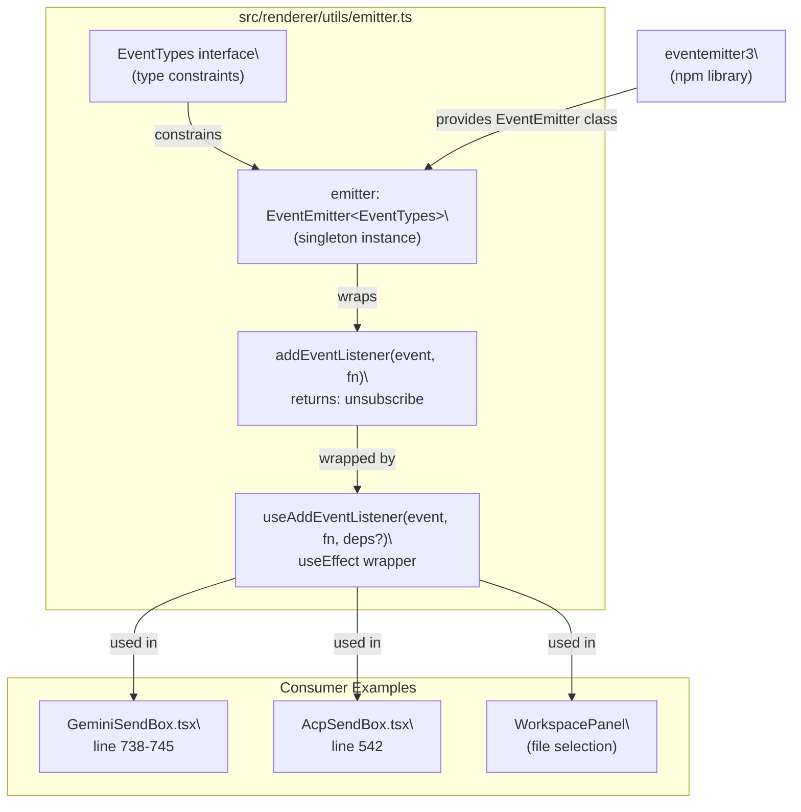

# Event-Driven Communication

<details>
<summary>Relevant source files</summary>

The following files were used as context for generating this wiki page:

- [src/common/ipcBridge.ts](src/common/ipcBridge.ts)
- [src/common/storage.ts](src/common/storage.ts)
- [src/process/task/OpenClawAgentManager.ts](src/process/task/OpenClawAgentManager.ts)
- [src/renderer/components/sendbox.tsx](src/renderer/components/sendbox.tsx)
- [src/renderer/pages/conversation/acp/AcpSendBox.tsx](src/renderer/pages/conversation/acp/AcpSendBox.tsx)
- [src/renderer/pages/conversation/codex/CodexSendBox.tsx](src/renderer/pages/conversation/codex/CodexSendBox.tsx)
- [src/renderer/pages/conversation/gemini/GeminiSendBox.tsx](src/renderer/pages/conversation/gemini/GeminiSendBox.tsx)
- [src/renderer/pages/conversation/nanobot/NanobotSendBox.tsx](src/renderer/pages/conversation/nanobot/NanobotSendBox.tsx)
- [src/renderer/pages/conversation/openclaw/OpenClawSendBox.tsx](src/renderer/pages/conversation/openclaw/OpenClawSendBox.tsx)
- [src/renderer/pages/guid/index.tsx](src/renderer/pages/guid/index.tsx)

</details>

AionUi employs two distinct event-driven systems for communication: a renderer-side `emitter` for component-to-component messaging, and IPC-based emitters (`ipcBridge`) for main-to-renderer streaming and notifications. This page documents both systems, their interaction patterns, and the throttling/debouncing strategies used to optimize performance.

---

## Overview

AionUi's event architecture operates on two layers:

| Layer               | Implementation            | Scope                           | Primary Use Cases                                              |
| ------------------- | ------------------------- | ------------------------------- | -------------------------------------------------------------- |
| **Renderer Events** | `eventemitter3` singleton | Renderer process only           | File selection, workspace refresh, UI coordination             |
| **IPC Events**      | `bridge.buildEmitter`     | Cross-process (main → renderer) | Agent response streaming, status updates, system notifications |

The renderer-side `emitter` provides type-safe pub/sub for React components. The IPC emitters deliver streaming responses from AI agents and system events from the main process. Both systems use event throttling to prevent UI thrashing during high-frequency updates.

**Sources:** [src/renderer/utils/emitter.ts:1-57](), [src/common/ipcBridge.ts:1-603]()

---

## Renderer-Side Event System

### Core Module: `emitter.ts`

The renderer event system is implemented in [src/renderer/utils/emitter.ts:1-57]() and exports:

| Export                | Type                        | Implementation                                    | Usage Context                        |
| --------------------- | --------------------------- | ------------------------------------------------- | ------------------------------------ |
| `emitter`             | `EventEmitter<EventTypes>`  | Singleton instance from `eventemitter3`           | Import and call `.emit()` or `.on()` |
| `addEventListener`    | `(event, fn) => () => void` | Wraps `emitter.on()` and returns cleanup function | Non-React modules                    |
| `useAddEventListener` | React hook                  | `useEffect`-based subscription with auto-cleanup  | React components                     |

**Type Safety:** All events are declared in the `EventTypes` interface, providing compile-time guarantees that producers and consumers agree on payload types.

**Sources:** [src/renderer/utils/emitter.ts:43-56]()

---

## Event Type Contract

All events and their payload types are declared in the `EventTypes` interface. TypeScript enforces that every `emitter.on(...)` / `emitter.emit(...)` call matches a declared entry.

**EventTypes — all declared events**

| Event Name                              | Payload                               | Description                                            |
| --------------------------------------- | ------------------------------------- | ------------------------------------------------------ |
| `gemini.selected.file`                  | `Array<string \| FileOrFolderItem>`   | Replace the Gemini send-box file list                  |
| `gemini.selected.file.append`           | `Array<string \| FileOrFolderItem>`   | Append files to Gemini send-box                        |
| `gemini.selected.file.clear`            | `void`                                | Clear all files from Gemini send-box                   |
| `gemini.workspace.refresh`              | `void`                                | Trigger a workspace file-tree refresh for Gemini       |
| `acp.selected.file`                     | `Array<string \| FileOrFolderItem>`   | Replace the ACP send-box file list                     |
| `acp.selected.file.append`              | `Array<string \| FileOrFolderItem>`   | Append files to ACP send-box                           |
| `acp.selected.file.clear`               | `void`                                | Clear all files from ACP send-box                      |
| `acp.workspace.refresh`                 | `void`                                | Trigger a workspace file-tree refresh for ACP          |
| `codex.selected.file`                   | `Array<string \| FileOrFolderItem>`   | Replace the Codex send-box file list                   |
| `codex.selected.file.append`            | `Array<string \| FileOrFolderItem>`   | Append files to Codex send-box                         |
| `codex.selected.file.clear`             | `void`                                | Clear all files from Codex send-box                    |
| `codex.workspace.refresh`               | `void`                                | Trigger a workspace file-tree refresh for Codex        |
| `openclaw-gateway.selected.file`        | `Array<string \| FileOrFolderItem>`   | Replace the OpenClaw send-box file list                |
| `openclaw-gateway.selected.file.append` | `Array<string \| FileOrFolderItem>`   | Append files to OpenClaw send-box                      |
| `openclaw-gateway.selected.file.clear`  | `void`                                | Clear all files from OpenClaw send-box                 |
| `openclaw-gateway.workspace.refresh`    | `void`                                | Trigger a workspace file-tree refresh for OpenClaw     |
| `nanobot.selected.file`                 | `Array<string \| FileOrFolderItem>`   | Replace the Nanobot send-box file list                 |
| `nanobot.selected.file.append`          | `Array<string \| FileOrFolderItem>`   | Append files to Nanobot send-box                       |
| `nanobot.selected.file.clear`           | `void`                                | Clear all files from Nanobot send-box                  |
| `nanobot.workspace.refresh`             | `void`                                | Trigger a workspace file-tree refresh for Nanobot      |
| `chat.history.refresh`                  | `void`                                | Refresh the conversation history sidebar               |
| `conversation.deleted`                  | `string` (conversationId)             | A conversation was deleted; recipients should clean up |
| `preview.open`                          | `{ content, contentType, metadata? }` | Open the preview panel with specified content          |
| `sendbox.fill`                          | `string` (prompt text)                | Pre-fill the active send-box input field               |

**Sources:** [src/renderer/utils/emitter.ts:13-41]()

### Event Naming Convention

Renderer events follow a three-segment pattern:

```
<scope>.<noun>.<verb>
```

| Segment   | Values                                                                                                | Examples                   |
| --------- | ----------------------------------------------------------------------------------------------------- | -------------------------- |
| `<scope>` | `gemini`, `acp`, `codex`, `openclaw-gateway`, `nanobot`, `chat`, `conversation`, `preview`, `sendbox` | Agent type or feature area |
| `<noun>`  | `selected`, `workspace`, `history`, etc.                                                              | Target entity              |
| `<verb>`  | `file`, `append`, `clear`, `refresh`, `open`, `fill`, `deleted`                                       | Action                     |

**Symmetry:** Each agent type (`gemini`, `acp`, `codex`, `openclaw-gateway`, `nanobot`) provides identical event sets:

- `<agent>.selected.file` — replace file list
- `<agent>.selected.file.append` — append to file list
- `<agent>.selected.file.clear` — clear file list
- `<agent>.workspace.refresh` — reload workspace tree

### API Reference

#### `addEventListener`

```typescript
addEventListener<K extends keyof EventTypes>(
  event: K,
  fn: (payload: EventTypes[K]) => void
) => () => void
```

Registers a listener on the shared `emitter`. Returns an unsubscribe function. Suitable for non-React contexts.

**Sources:** [src/renderer/utils/emitter.ts:45-50]()

#### `useAddEventListener`

```typescript
useAddEventListener<K extends keyof EventTypes>(
  event: K,
  fn: (payload: EventTypes[K]) => void,
  deps?: React.DependencyList
)
```

React hook that wraps `addEventListener` in `useEffect`. Auto-removes listener on unmount or dependency change. Default `deps = []` registers once on mount.

**Usage Pattern (from SendBox components):**

```typescript
useAddEventListener('acp.selected.file', setAtPath)
```

**Sources:** [src/renderer/utils/emitter.ts:52-56](), [src/renderer/pages/conversation/acp/AcpSendBox.tsx:542]()

### Architecture Diagram: Renderer Event System

**Diagram: `emitter` singleton structure and consumers**



**Sources:** [src/renderer/utils/emitter.ts:1-57](), [src/renderer/pages/conversation/gemini/GeminiSendBox.tsx:738-745](), [src/renderer/pages/conversation/acp/AcpSendBox.tsx:542]()

---

## IPC Event System

### IPC Emitters Architecture

The IPC event system uses `bridge.buildEmitter` from `@office-ai/platform` to create type-safe event channels from main to renderer. Each emitter is registered in [src/common/ipcBridge.ts:1-603]().

**Key IPC Emitters:**

| Emitter                               | Event Type           | Payload                                   | Producer              | Consumer                      |
| ------------------------------------- | -------------------- | ----------------------------------------- | --------------------- | ----------------------------- |
| `conversation.responseStream`         | `IResponseMessage`   | `{ type, data, msg_id, conversation_id }` | Agent managers (main) | SendBox components (renderer) |
| `geminiConversation.responseStream`   | `IResponseMessage`   | Same as above                             | GeminiAgentManager    | GeminiSendBox                 |
| `acpConversation.responseStream`      | `IResponseMessage`   | Same as above                             | AcpAgentManager       | AcpSendBox                    |
| `codexConversation.responseStream`    | `IResponseMessage`   | Same as above                             | CodexAgentManager     | CodexSendBox                  |
| `openclawConversation.responseStream` | `IResponseMessage`   | Same as above                             | OpenClawAgentManager  | OpenClawSendBox               |
| `autoUpdate.status`                   | `AutoUpdateStatus`   | `{ status, version?, error? }`            | autoUpdaterService    | Settings page                 |
| `fileStream.contentUpdate`            | File operation event | `{ filePath, content, operation }`        | FileOperationHandler  | PreviewPanel                  |
| `webui.statusChanged`                 | WebUI status         | `{ running, port?, localUrl? }`           | WebUI service         | Settings page                 |

**Sources:** [src/common/ipcBridge.ts:37](), [src/common/ipcBridge.ts:61](), [src/common/ipcBridge.ts:198-206](), [src/common/ipcBridge.ts:130](), [src/common/ipcBridge.ts:407]()

### Response Stream Message Types

The `responseStream` emitters deliver various message types during agent execution:

| Message Type    | Purpose                         | Persistence   | UI Action                             |
| --------------- | ------------------------------- | ------------- | ------------------------------------- |
| `thought`       | Show agent's reasoning progress | No            | Update ThoughtDisplay                 |
| `start`         | Stream begins                   | No            | Set `streamRunning = true`            |
| `content`       | AI response text (incremental)  | Yes (batched) | Update MessageList                    |
| `finish`        | Stream ends                     | No            | Set `streamRunning = false` (delayed) |
| `tool_group`    | Tool execution status           | Yes           | Render tool status cards              |
| `error`         | Error occurred                  | Yes           | Display error message                 |
| `agent_status`  | Connection/session state        | Yes           | Update status indicator               |
| `finished`      | Token usage metadata            | No            | Update token counter                  |
| `request_trace` | Request lifecycle logging       | No            | Console log only                      |

**Sources:** [src/renderer/pages/conversation/gemini/GeminiSendBox.tsx:164-342](), [src/renderer/pages/conversation/acp/AcpSendBox.tsx:126-252]()

### Message Streaming Lifecycle

**Diagram: Complete lifecycle from user message to AI response**

```mermaid
sequenceDiagram
    participant User
    participant SendBox as "GeminiSendBox.tsx"
    participant ipcBridge as "ipcBridge"
    participant Manager as "GeminiAgentManager\
(main process)"
    participant Agent as "GeminiAgent\
(aioncli-core)"
    participant DB as "ConversationManageWithDB"

    User->>SendBox: "Click send button"
    SendBox->>SendBox: "setActiveMsgId(msg_id)"
    SendBox->>SendBox: "setWaitingResponse(true)"
    SendBox->>ipcBridge: "sendMessage.invoke({input, msg_id})"

    ipcBridge->>Manager: "IPC call"
    Manager->>Agent: "sendMessage()"
    Manager->>DB: "addMessage(userMessage)"

    Agent-->>Manager: "event: start"
    Manager-->>ipcBridge: "responseStream.emit({type: 'start'})"
    ipcBridge-->>SendBox: "on('start') → setStreamRunning(true)"

    Agent-->>Manager: "event: thought (multiple)"
    Manager-->>ipcBridge: "responseStream.emit({type: 'thought'})"
    ipcBridge-->>SendBox: "on('thought') → throttledSetThought()"

    Agent-->>Manager: "event: content (streaming)"
    Manager-->>ipcBridge: "responseStream.emit({type: 'content'})"
    ipcBridge-->>SendBox: "on('content') → addOrUpdateMessage()"
    Manager->>DB: "addOrUpdateMessage (batched, 2s debounce)"

    Agent-->>Manager: "event: tool_group"
    Manager-->>ipcBridge: "responseStream.emit({type: 'tool_group'})"
    ipcBridge-->>SendBox: "on('tool_group') → check hasActiveTools"

    Agent-->>Manager: "event: finish"
    Manager-->>ipcBridge: "responseStream.emit({type: 'finish'})"
    ipcBridge-->>SendBox: "on('finish') → setTimeout(reset, 1000ms)"

    Note over SendBox: "Delayed reset prevents\
flicker if new content arrives"
```

**Sources:** [src/renderer/pages/conversation/gemini/GeminiSendBox.tsx:755-802](), [src/renderer/pages/conversation/gemini/GeminiSendBox.tsx:139-345]()

---

## Throttling and Debouncing Strategies

### Thought Message Throttling

To prevent excessive re-renders during rapid `thought` updates, SendBox components implement a 50ms throttle:

| Component     | Implementation                               | Location                                                            |
| ------------- | -------------------------------------------- | ------------------------------------------------------------------- |
| GeminiSendBox | `thoughtThrottleRef` + `throttledSetThought` | [src/renderer/pages/conversation/gemini/GeminiSendBox.tsx:78-119]() |
| AcpSendBox    | Same pattern                                 | [src/renderer/pages/conversation/acp/AcpSendBox.tsx:63-100]()       |
| CodexSendBox  | Same pattern                                 | [src/renderer/pages/conversation/codex/CodexSendBox.tsx:68-106]()   |

**Mechanism:**

1. Track last update timestamp in `thoughtThrottleRef.current.lastUpdate`
2. If `now - lastUpdate >= 50ms`, update immediately
3. Otherwise, queue the update in `thoughtThrottleRef.current.pending`
4. Set timer to flush pending update after remaining interval

**Sources:** [src/renderer/pages/conversation/gemini/GeminiSendBox.tsx:86-119]()

### Message Persistence Debouncing

Agent responses are debounced at the database layer to prevent write thrashing:

```
ConversationManageWithDB.addOrUpdateMessage()
  ├─ 2-second debounce window (per conversation_id)
  ├─ Batch multiple updates into single write
  └─ Immediate write on user message (no debounce)
```

**Rationale:** Streaming responses generate hundreds of incremental updates. Batching reduces SQLite writes from ~200/response to ~5/response.

**Sources:** Documented in [Database System (3.6)](#3.6), referenced in [src/renderer/pages/conversation/gemini/GeminiSendBox.tsx:258]()

### Finish Event Delayed Reset

The `finish` event triggers a **1-second delayed reset** of `streamRunning` and `aiProcessing` states to detect true task completion:

```typescript
case 'finish':
  const timeoutId = setTimeout(() => {
    setStreamRunning(false);
    setAiProcessing(false);
    setThought({ subject: '', description: '' });
  }, 1000);
```

**Reason:** Tools may complete and send `finish`, but the agent immediately continues with new content. The 1s delay prevents UI flicker. If new events arrive, the timeout is canceled.

**Sources:** [src/renderer/pages/conversation/gemini/GeminiSendBox.tsx:179-194](), [src/renderer/pages/conversation/acp/AcpSendBox.tsx:143-153]()

---

## State Management Patterns

### Running State Tracking

SendBox components track three distinct loading states:

| State Variable    | Meaning                                           | Set by Event                   | Reset by Event                    |
| ----------------- | ------------------------------------------------- | ------------------------------ | --------------------------------- |
| `waitingResponse` | User sent message, awaiting first response chunk  | `sendMessage()`                | `content` event                   |
| `streamRunning`   | Agent is streaming response                       | `start` event                  | `finish` event (delayed)          |
| `hasActiveTools`  | Tools are executing or awaiting confirmation      | `tool_group` with active tools | `tool_group` with no active tools |
| `aiProcessing`    | Overall processing indicator (ACP/Codex/OpenClaw) | `sendMessage()`                | `finish` event (delayed)          |

**Combined Running State (GeminiSendBox):**

```typescript
const running = waitingResponse || streamRunning || hasActiveTools
```

**Sources:** [src/renderer/pages/conversation/gemini/GeminiSendBox.tsx:42-132](), [src/renderer/pages/conversation/acp/AcpSendBox.tsx:35-62]()

### Auto-Recovery Pattern

If content/thought events arrive after `finish`, SendBox components **auto-recover** the running state to handle multi-turn tool calls:

```typescript
case 'thought':
  // Auto-recover if thought arrives after finish
  if (!streamRunningRef.current) {
    setStreamRunning(true);
    streamRunningRef.current = true;
  }
  throttledSetThought(message.data);
  break;
```

**Why refs?** Using `streamRunningRef.current` allows immediate access to the latest state inside `useEffect`, avoiding stale closure issues and preventing event loss during state transitions.

**Sources:** [src/renderer/pages/conversation/gemini/GeminiSendBox.tsx:166-172](), [src/renderer/pages/conversation/acp/AcpSendBox.tsx:128-134]()

### Active Message ID Filtering

GeminiSendBox tracks `activeMsgIdRef` to filter out events from aborted requests:

```typescript
// Set when sending
setActiveMsgId(msg_id)

// Filter in event handler
if (activeMsgIdRef.current && message.msg_id !== activeMsgIdRef.current) {
  if (message.type === 'thought') return // Ignore stale thought events
}
```

**Purpose:** When a user stops a request and sends a new one, old stream events may still arrive. The active message ID ensures only current-request events are processed.

**Sources:** [src/renderer/pages/conversation/gemini/GeminiSendBox.tsx:51-53](), [src/renderer/pages/conversation/gemini/GeminiSendBox.tsx:149-155]()

---

## Summary

| Concern               | Implementation                                            |
| --------------------- | --------------------------------------------------------- |
| Library               | `eventemitter3`                                           |
| Singleton             | `emitter` in `src/renderer/utils/emitter.ts`              |
| Type safety           | `EventTypes` interface (TypeScript structural typing)     |
| React integration     | `useAddEventListener` hook (auto-cleanup via `useEffect`) |
| Non-React integration | `addEventListener` (returns unsubscribe callback)         |
| Scope                 | Renderer process only; no IPC crossing                    |
| Event naming          | `<scope>.<noun>[.<verb>]` pattern                         |
