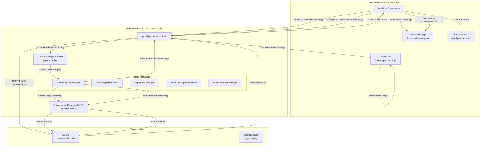
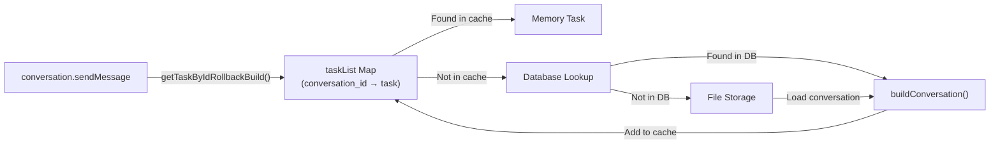
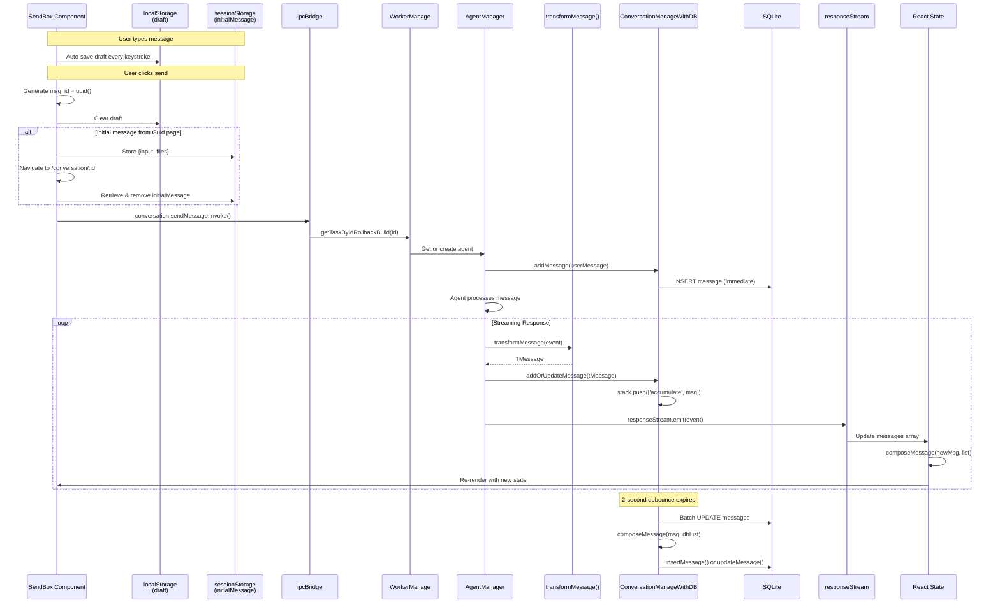
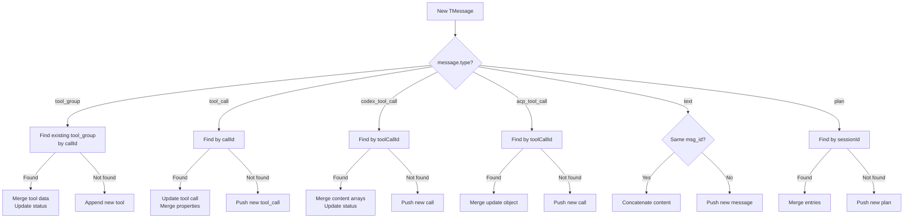
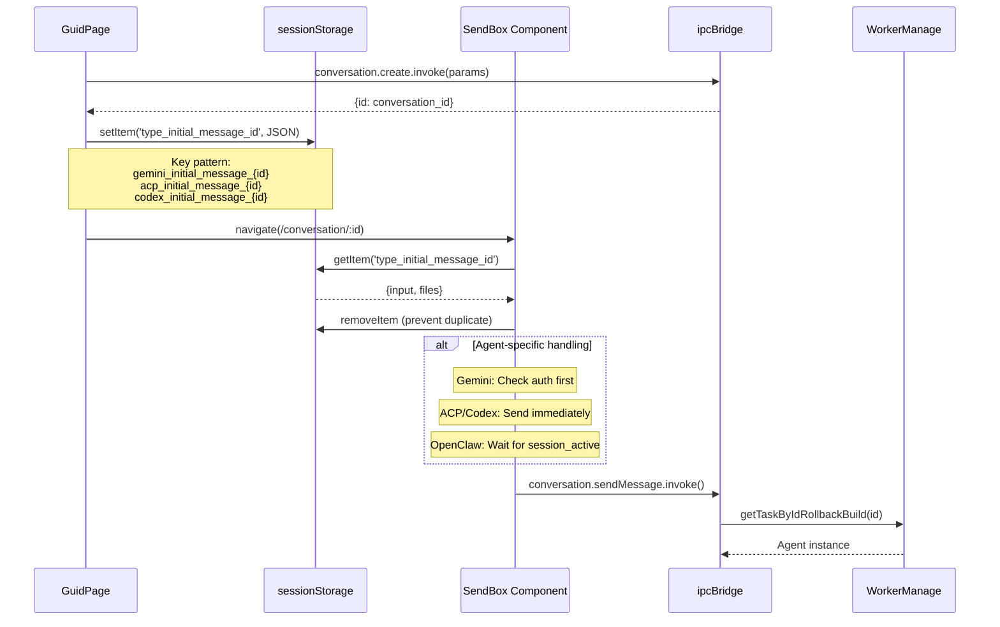
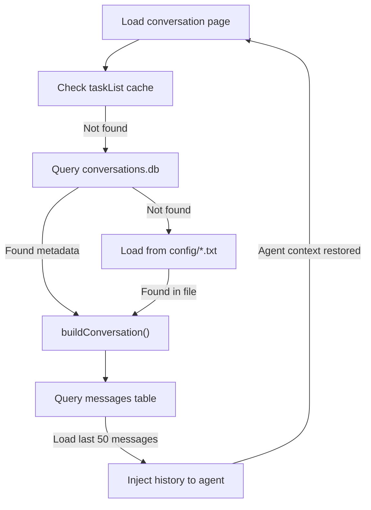
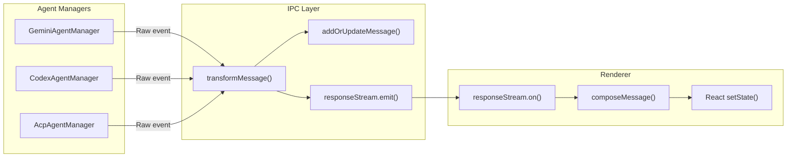
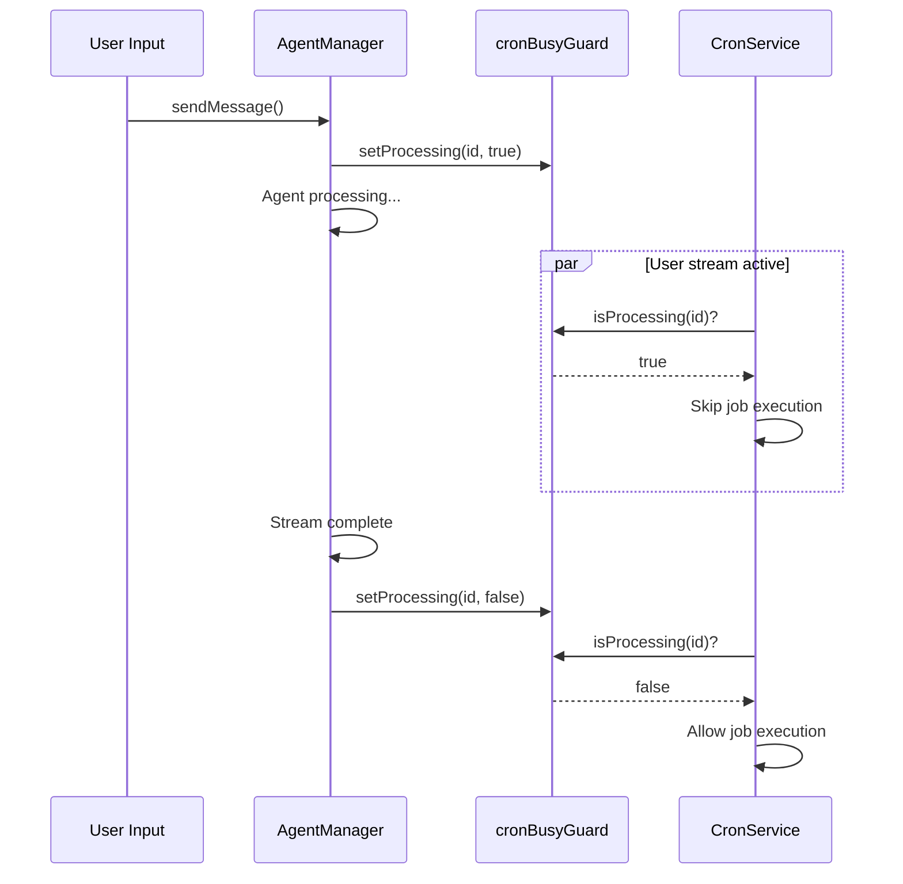
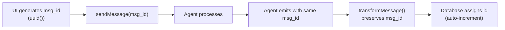
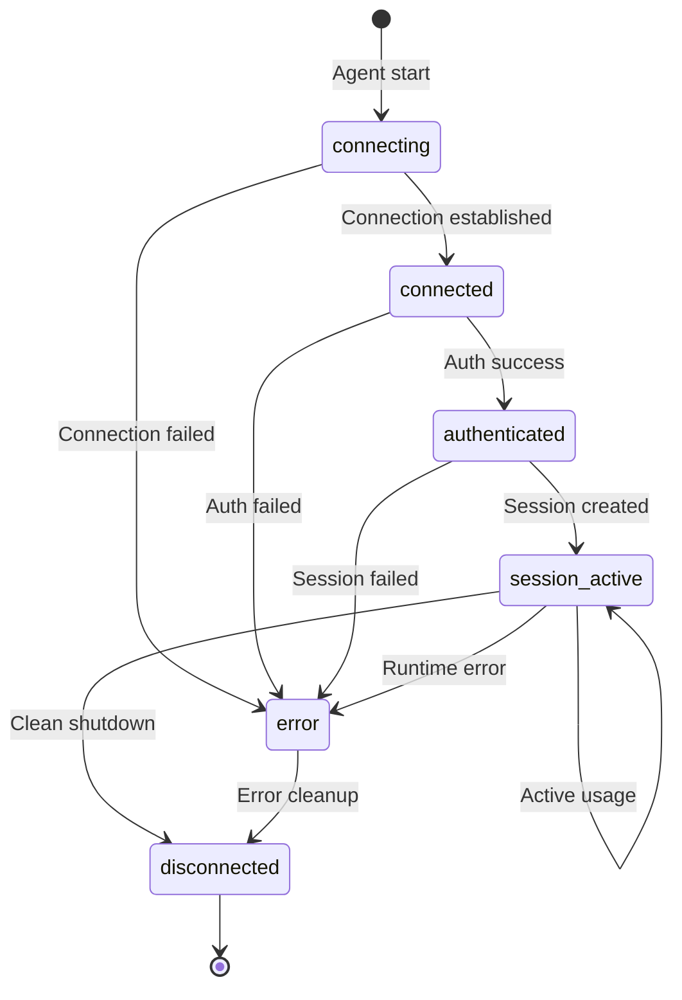

# Data Flow & State Management

<details>
<summary>Relevant source files</summary>

The following files were used as context for generating this wiki page:

- [src/common/ipcBridge.ts](src/common/ipcBridge.ts)
- [src/common/storage.ts](src/common/storage.ts)
- [src/process/task/OpenClawAgentManager.ts](src/process/task/OpenClawAgentManager.ts)
- [src/renderer/components/sendbox.tsx](src/renderer/components/sendbox.tsx)
- [src/renderer/pages/conversation/acp/AcpSendBox.tsx](src/renderer/pages/conversation/acp/AcpSendBox.tsx)
- [src/renderer/pages/conversation/codex/CodexSendBox.tsx](src/renderer/pages/conversation/codex/CodexSendBox.tsx)
- [src/renderer/pages/conversation/gemini/GeminiSendBox.tsx](src/renderer/pages/conversation/gemini/GeminiSendBox.tsx)
- [src/renderer/pages/conversation/nanobot/NanobotSendBox.tsx](src/renderer/pages/conversation/nanobot/NanobotSendBox.tsx)
- [src/renderer/pages/conversation/openclaw/OpenClawSendBox.tsx](src/renderer/pages/conversation/openclaw/OpenClawSendBox.tsx)
- [src/renderer/pages/guid/index.tsx](src/renderer/pages/guid/index.tsx)

</details>

## Purpose and Scope

This document describes how data flows through AionUi's multi-process architecture and how state is synchronized across the main process, renderer process, and persistent storage. It covers the complete lifecycle of conversations and messages, from user input to AI response to persistence, and explains the mechanisms that ensure data consistency across process boundaries.

For information about the IPC communication layer itself, see [Inter-Process Communication](#3.3). For details about storage implementations, see [Storage System](#3.4). For agent-specific message processing, see [AI Agent Systems](#4).

---

## Core Data Flow Architecture

AionUi implements a unidirectional data flow with event-driven synchronization between processes. Data moves through three primary channels: **IPC requests** (renderer → main), **IPC events** (main → renderer), and **persistent storage** (main ↔ disk).

### System-Wide Data Flow



**Sources:** [src/common/ipcBridge.ts:24-55](), [src/renderer/components/sendbox.tsx:1-456](), [src/renderer/pages/conversation/gemini/GeminiSendBox.tsx:1-100](), [src/process/message.ts:13-77]()
</thinking>

---

## State Management Layers

AionUi maintains state across four distinct layers, each serving a specific purpose in the data lifecycle:

| Layer               | Location                                      | Scope                                           | Persistence    | Purpose                                 |
| ------------------- | --------------------------------------------- | ----------------------------------------------- | -------------- | --------------------------------------- |
| **Task Cache**      | Main process `WorkerManage.taskList`          | Per-conversation agent instances                | Ephemeral      | Active agent lifecycle management       |
| **Message Queue**   | Main process `ConversationManageWithDB.stack` | Pending database operations                     | Ephemeral      | Batch database writes (2s debounce)     |
| **Database**        | SQLite `conversations.db`                     | All conversations and messages                  | Durable        | Primary persistent storage              |
| **File Storage**    | JSON files `agent.config`                     | Configuration and metadata                      | Durable        | Configuration backup                    |
| **Session Storage** | Renderer `sessionStorage`                     | Initial message handoff                         | Session-scoped | Deferred message pattern for navigation |
| **Local Storage**   | Renderer `localStorage`                       | SendBox drafts                                  | Persistent     | Draft persistence across sessions       |
| **React State**     | Renderer memory                               | UI component state (messages, running, thought) | Ephemeral      | Real-time display                       |

**Sources:** [src/process/WorkerManage.ts:16-97](), [src/process/message.ts:13-77](), [src/common/storage.ts:1-453](), [src/renderer/hooks/useSendBoxDraft.ts:1-50]()
</thinking>

### SendBox Draft Persistence

Each agent type implements draft persistence using a specialized hook that stores user input and file selections in `localStorage`. This ensures drafts survive page refreshes and tab switches.

**Draft data structure:**

| Agent Type | Storage Key Pattern                                | Stored Fields                         |
| ---------- | -------------------------------------------------- | ------------------------------------- |
| Gemini     | `sendbox_draft_gemini_{conversation_id}`           | `content`, `uploadFile[]`, `atPath[]` |
| ACP        | `sendbox_draft_acp_{conversation_id}`              | `content`, `uploadFile[]`, `atPath[]` |
| Codex      | `sendbox_draft_codex_{conversation_id}`            | `content`, `uploadFile[]`, `atPath[]` |
| OpenClaw   | `sendbox_draft_openclaw-gateway_{conversation_id}` | `content`, `uploadFile[]`, `atPath[]` |
| Nanobot    | `sendbox_draft_nanobot_{conversation_id}`          | `content`, `uploadFile[]`, `atPath[]` |

**Hook implementation pattern:**

```typescript
// Each agent uses getSendBoxDraftHook factory
const useGeminiSendBoxDraft = getSendBoxDraftHook('gemini', {
  _type: 'gemini',
  atPath: [],
  content: '',
  uploadFile: [],
})

// Component usage
const { data, mutate } = useGeminiSendBoxDraft(conversation_id)
const setContent = useCallback(
  (content: string) => {
    mutate((prev) => ({ ...prev, content }))
  },
  [mutate]
)
```

**Sources:** [src/renderer/pages/conversation/gemini/GeminiSendBox.tsx:34-39](), [src/renderer/pages/conversation/codex/CodexSendBox.tsx:35-40](), [src/renderer/pages/conversation/acp/AcpSendBox.tsx:28-33](), [src/renderer/pages/conversation/openclaw/OpenClawSendBox.tsx:40-45](), [src/renderer/pages/conversation/nanobot/NanobotSendBox.tsx:40-45]()

---

## State Management Layers

AionUi maintains state across four distinct layers, each serving a specific purpose in the data lifecycle:

| Layer               | Location                  | Scope                            | Persistence    | Purpose                                 |
| ------------------- | ------------------------- | -------------------------------- | -------------- | --------------------------------------- |
| **Task Cache**      | Main process memory       | Per-conversation agent instances | Ephemeral      | Active agent lifecycle management       |
| **Message Queue**   | Main process memory       | Pending database operations      | Ephemeral      | Batch database writes                   |
| **Database**        | SQLite disk               | All conversations and messages   | Durable        | Primary persistent storage              |
| **File Storage**    | JSON files                | Configuration and metadata       | Durable        | Configuration backup and legacy support |
| **Session Storage** | Renderer `sessionStorage` | Navigation handoff data          | Session-scoped | Deferred message pattern                |
| **React State**     | Renderer memory           | UI component state               | Ephemeral      | Real-time display                       |

### Task Cache (WorkerManage)

The task cache implements a conversation-scoped singleton pattern, ensuring only one agent instance exists per active conversation. This prevents duplicate agent processes and maintains consistent state during streaming operations.



**Three-tier fallback logic:**

1. **Memory cache**: Check `taskList` array for existing task ([src/process/WorkerManage.ts:32-34]())
2. **Database**: Query `conversations` table for conversation metadata ([src/process/WorkerManage.ts:112-119]())
3. **File storage**: Load from `aionui-chat.txt` as last resort ([src/process/WorkerManage.ts:122-128]())

**Sources:** [src/process/WorkerManage.ts:16-97](), [src/process/WorkerManage.ts:99-131]()

### Message Persistence Queue

The `ConversationManageWithDB` class batches message operations to reduce database contention. It maintains a per-conversation queue that accumulates updates and flushes them periodically or immediately for new messages.

**Queue behavior:**

- **Insert operations**: Flush immediately to ensure user messages are persisted ([src/process/message.ts:35-37]())
- **Accumulate operations**: Batch with 2-second delay for streaming updates ([src/process/message.ts:38-42]())
- **Compaction**: Use `composeMessage()` to merge tool calls and text chunks before writing ([src/process/message.ts:52-65]())

**Sources:** [src/process/message.ts:13-77](), [src/process/message.ts:83-131]()

---

## Message Lifecycle

Messages flow through a multi-stage pipeline from user input to persistent storage, with transformations and validations at each stage.

### Complete Message Flow Diagram



**Sources:** [src/renderer/components/sendbox.tsx:283-309](), [src/renderer/pages/conversation/gemini/GeminiSendBox.tsx:755-802](), [src/common/ipcBridge.ts:34](), [src/process/message.ts:18-76]()

### Message Type Transformation

The `transformMessage()` function converts agent-specific message formats into the unified `TMessage` type system. Each agent emits different event types that must be normalized for frontend consumption.

**Transformation mapping:**

| Agent Event Type   | Transformed Type   | Position | Used By              | Notes                 |
| ------------------ | ------------------ | -------- | -------------------- | --------------------- |
| `error`            | `tips`             | `center` | All agents           | Error display         |
| `content`          | `text`             | `left`   | All agents           | Assistant message     |
| `user_content`     | `text`             | `right`  | All agents           | User message echo     |
| `tool_call`        | `tool_call`        | `left`   | Gemini               | Single tool execution |
| `tool_group`       | `tool_group`       | `left`   | Gemini               | Multi-tool batch      |
| `agent_status`     | `agent_status`     | `center` | ACP, Codex, OpenClaw | Connection state      |
| `acp_permission`   | `acp_permission`   | `left`   | ACP, OpenClaw        | Permission request    |
| `codex_permission` | `codex_permission` | `left`   | Codex                | Permission request    |
| `codex_tool_call`  | `codex_tool_call`  | `left`   | Codex                | Tool streaming        |
| `acp_tool_call`    | `acp_tool_call`    | `left`   | ACP, OpenClaw        | Tool streaming        |
| `plan`             | `plan`             | `left`   | ACP, OpenClaw        | Plan updates          |
| `request_trace`    | N/A                | N/A      | Gemini, ACP          | Console logging only  |

**Skipped types** (not persisted): `thought`, `start`, `finish`, `system`, `codex_model_info`, `acp_model_info`

**Sources:** [src/common/chatLib.ts:284-400](), [src/renderer/pages/conversation/gemini/GeminiSendBox.tsx:164-341](), [src/renderer/pages/conversation/codex/CodexSendBox.tsx:182-236](), [src/renderer/pages/conversation/acp/AcpSendBox.tsx:111-255]()

---

## Message Transformation Pipeline

### Message Composition and Merging

The `composeMessage()` function implements intelligent message merging for streaming updates. It handles three distinct merging strategies:

**1. Tool Group Merging** ([src/common/chatLib.ts:425-453]()):

- Match by `callId` within existing `tool_group` messages
- Merge tool status updates without creating duplicates
- Preserve confirmation state across updates

**2. Tool Call Merging** ([src/common/chatLib.ts:457-481]()):

- Merge by `toolCallId` for individual tool calls
- Accumulate output deltas for streaming tools
- Update status transitions (pending → executing → success/error)

**3. Text Content Accumulation** ([src/common/chatLib.ts:510-514]()):

- Match by `msg_id` and type
- Concatenate content chunks for streaming text
- Preserve message identity during accumulation



**Sources:** [src/common/chatLib.ts:405-515]()

---

## Conversation State Recovery

AionUi implements robust state recovery to handle process restarts, navigation, and session restoration.

### Recovery Scenarios

**1. Navigation within Session (Deferred Message Pattern)**

When navigating to a new conversation from the Guid page, the system uses `sessionStorage` to defer message sending until the SendBox is mounted. This prevents duplicate sends and ensures the agent is fully initialized.

**Deferred message flow:**



**Agent-specific patterns:**

- **Gemini**: Checks authentication before sending ([src/renderer/pages/conversation/gemini/GeminiSendBox.tsx:645-719]())
- **ACP**: Sends immediately without status wait ([src/renderer/pages/conversation/acp/AcpSendBox.tsx:401-463]())
- **Codex**: Sends immediately ([src/renderer/pages/conversation/codex/CodexSendBox.tsx:332-398]())
- **OpenClaw**: Waits for `session_active` status ([src/renderer/pages/conversation/openclaw/OpenClawSendBox.tsx:419-475]())
- **Nanobot**: Sends immediately (stateless) ([src/renderer/pages/conversation/nanobot/NanobotSendBox.tsx:262-304]())

**Sources:** [src/renderer/pages/conversation/gemini/GeminiSendBox.tsx:645-719](), [src/renderer/pages/conversation/acp/AcpSendBox.tsx:401-463](), [src/renderer/pages/conversation/codex/CodexSendBox.tsx:332-398](), [src/renderer/pages/conversation/openclaw/OpenClawSendBox.tsx:419-475]()

**2. Process Restart Recovery**

After application restart, conversations are recovered from the database:



The `injectHistoryFromDatabase()` method ([src/process/task/GeminiAgentManager.ts:62-64]()) loads recent messages and reconstructs agent context after restart.

**Sources:** [src/process/WorkerManage.ts:99-131](), [src/process/task/GeminiAgentManager.ts:62-64]()

**3. Database-to-File Fallback**

The system maintains file-based backups to handle database corruption or migration:

```typescript
// src/process/message.ts:91-112
async function ensureConversationExists(db, conversation_id) {
  const existingConv = db.getConversation(conversation_id)
  if (existingConv.success && existingConv.data) {
    return // Already in database
  }

  // Fallback: Load from file storage
  const history = await ProcessChat.get('chat.history')
  const conversation = history.find((c) => c.id === conversation_id)

  if (conversation) {
    db.createConversation(conversation) // Migrate to DB
  }
}
```

**Sources:** [src/process/message.ts:79-112]()

---

## Event-Driven Updates

### IPC Event Streaming

The `responseStream` emitter provides real-time updates from agents to the UI. All agent managers emit to this unified stream, ensuring consistent frontend handling regardless of agent type.

**Event emission pattern:**



**Emission points in each agent:**

- **Gemini**: [src/process/task/GeminiAgentManager.ts:361-398]() - Emits on `gemini.message` event from worker
- **Codex**: [src/process/task/CodexAgentManager.ts:427-448]() - `emitAndPersistMessage()` wrapper
- **ACP**: [src/process/task/AcpAgentManager.ts:121-149]() - `onStreamEvent` callback

**Sources:** [src/common/ipcBridge.ts:35](), [src/process/task/GeminiAgentManager.ts:361-398](), [src/process/task/CodexAgentManager.ts:427-448](), [src/process/task/AcpAgentManager.ts:121-149]()

### Dual-Channel Strategy

AionUi uses a dual-channel approach for message delivery to balance **real-time responsiveness** with **data durability**:

| Channel             | Purpose              | Latency             | Reliability                            |
| ------------------- | -------------------- | ------------------- | -------------------------------------- |
| **IPC Events**      | Real-time UI updates | ~1ms                | Ephemeral (process restart loses data) |
| **Database Writes** | Persistent storage   | ~10-100ms (batched) | Durable (survives restarts)            |

**Implementation pattern:**

```typescript
// Backend: Emit and persist in parallel
const tMessage = transformMessage(rawEvent)
if (tMessage) {
  addOrUpdateMessage(conversation_id, tMessage) // → Database (async)
}
ipcBridge.responseStream.emit(rawEvent) // → Frontend (immediate)
```

This pattern ensures:

1. **Fast UI feedback**: Users see updates immediately via IPC events
2. **No data loss**: Messages are queued for database persistence
3. **Recovery resilience**: After restart, messages are loaded from database

**Unified vs Agent-Specific Streams:**

The system uses two IPC streams for backward compatibility:

- **Unified stream** (`conversation.responseStream`): Used by all agents for generic chat UI ([src/common/ipcBridge.ts:37]())
- **Agent-specific streams**: `geminiConversation.responseStream`, `codexConversation.responseStream`, etc. for agent-specific UI features

Both streams receive identical events. Agent managers emit to both streams simultaneously.

**Sources:** [src/common/ipcBridge.ts:24-55](), [src/process/task/OpenClawAgentManager.ts:88-116](), [src/process/message.ts:83-131]()

---

## Synchronization Mechanisms

### Streaming State Management

The renderer maintains multiple state flags to track agent activity and control UI elements. These flags are managed using refs to avoid re-subscription issues with event listeners.

**State flags per agent:**

| Flag                  | Type           | Purpose                                  | Reset Trigger                 |
| --------------------- | -------------- | ---------------------------------------- | ----------------------------- |
| `running`             | `boolean`      | Stream actively running                  | `finish` event (1s delayed)   |
| `aiProcessing`        | `boolean`      | Waiting for AI response                  | `content` arrival or `finish` |
| `waitingResponse`     | `boolean`      | Tool execution → AI continuation         | Tool completion               |
| `hasActiveTools`      | `boolean`      | Tools executing or awaiting confirmation | Tool status changes           |
| `thought`             | `ThoughtData`  | Current AI reasoning state               | `finish` or content arrival   |
| `hasContentInTurnRef` | `ref<boolean>` | Track if turn produced visible content   | Reset on each `finish`        |

**Ref synchronization pattern:**

```typescript
// Use refs to avoid useEffect re-subscription when state changes
const runningRef = useRef(running)
const aiProcessingRef = useRef(aiProcessing)

useEffect(() => {
  runningRef.current = running
}, [running])

// Event handler accesses latest state via ref
const handleMessage = (message) => {
  if (message.type === 'content' && !runningRef.current) {
    // Auto-recover state if content arrives after premature finish
    setRunning(true)
    runningRef.current = true
  }
}
```

**Auto-recovery mechanism:** If a `content`, `thought`, or `tool_group` event arrives after a `finish` event, the system automatically restores the `running` state. This handles out-of-order event delivery during high-latency network conditions.

**Sources:** [src/renderer/pages/conversation/gemini/GeminiSendBox.tsx:41-76](), [src/renderer/pages/conversation/acp/AcpSendBox.tsx:35-109](), [src/renderer/pages/conversation/codex/CodexSendBox.tsx:52-115]()

---

### Conversation Busy Guard

The `cronBusyGuard` prevents race conditions between user interactions and scheduled tasks. It marks conversations as "processing" to block cron job execution during active streams.

**Guard lifecycle:**



**Guard operations:**

- Set busy: Called at start of `sendMessage()` in all agent managers
- Clear busy: Called on `finish` event, error, or manual stop

**Sources:** [src/process/task/OpenClawAgentManager.ts:165-169](), [src/process/task/OpenClawAgentManager.ts:147-149]()

### Next-Tick Callbacks

The `nextTickToLocalFinish()` mechanism ensures error handling and cleanup operations execute after database operations complete. This prevents race conditions where errors are reported before messages are persisted.

**Usage pattern:**

```typescript
// src/process/task/GeminiAgentManager.ts:215-220
return new Promise((_, reject) => {
  nextTickToLocalFinish(() => {
    reject(e) // Error callback fires after DB sync
  })
})
```

**Callback execution:**

- Callbacks queued: [src/process/message.ts:139-141]()
- Callbacks executed: [src/process/message.ts:146-157]() after each `save2DataBase()` flush

**Sources:** [src/process/message.ts:137-157](), [src/process/task/GeminiAgentManager.ts:215-220]()

---

## Data Consistency Patterns

### Message ID Tracking

AionUi uses three types of IDs to track message identity across transformations:

| ID Type           | Scope    | Purpose                               | Example                         |
| ----------------- | -------- | ------------------------------------- | ------------------------------- |
| `id`              | Database | Unique row identifier, auto-generated | Auto-increment integer          |
| `msg_id`          | Agent    | Stream message correlation            | UUID from agent                 |
| `conversation_id` | Global   | Links messages to conversation        | UUID from conversation creation |

**ID flow:**



**Matching logic in `composeMessage()`:**

- Text messages: Match by `msg_id` for concatenation ([src/common/chatLib.ts:510]())
- Tool calls: Match by `callId` for updates ([src/common/chatLib.ts:460](), [src/common/chatLib.ts:473]())
- Tool groups: Match by individual tool `callId` within group ([src/common/chatLib.ts:433]())

**Sources:** [src/common/chatLib.ts:59-90](), [src/common/chatLib.ts:405-515]()

### Status Transition Management

Agent status messages follow a strict state machine to prevent invalid transitions:



**Status emission patterns:**

- **Codex**: Emits `agent_status` during connection lifecycle
- **ACP**: Emits `agent_status` through session manager events
- **OpenClaw**: Emits `agent_status` via signal events from gateway

**Frontend handling:** The `agent_status` message type automatically resets loading states when `authenticated` or `session_active` is reached, preventing stuck UI states.

**Sources:** [src/common/chatLib.ts:165-176](), [src/renderer/pages/conversation/acp/AcpSendBox.tsx:175-202](), [src/renderer/pages/conversation/codex/CodexSendBox.tsx:217-225]()

---

## Performance Optimizations

### Batch Database Operations

The `ConversationManageWithDB` queue implements two optimization strategies:

**1. Operation Coalescing**

Multiple `accumulate` operations for the same message are coalesced into a single database update:

```typescript
// Multiple streaming chunks:
addOrUpdateMessage(id, { msg_id: 'abc', content: 'Hello' })
addOrUpdateMessage(id, { msg_id: 'abc', content: 'Hello world' })
addOrUpdateMessage(id, { msg_id: 'abc', content: 'Hello world!' })

// Result: Single UPDATE query after 2-second delay
// with final content: "Hello world!"
```

**2. Insert Prioritization**

New messages (user input) are flushed immediately to ensure they're visible in the database for recovery, while streaming updates are batched ([src/process/message.ts:32-42]()).

**Sources:** [src/process/message.ts:18-76]()

### Memory Management

The task cache automatically cleans up agent instances when conversations are deleted:

```typescript
// src/process/WorkerManage.ts:133-141
const kill = (id: string) => {
  const index = taskList.findIndex((item) => item.id === id)
  if (index === -1) return
  const task = taskList[index]
  if (task) {
    task.task.kill() // Cleanup agent resources
  }
  taskList.splice(index, 1) // Remove from cache
}
```

**Cleanup triggers:**

- Explicit conversation deletion
- Application shutdown: [src/process/WorkerManage.ts:143-148]()
- Agent error handling in manager destructors

**Sources:** [src/process/WorkerManage.ts:133-148]()
