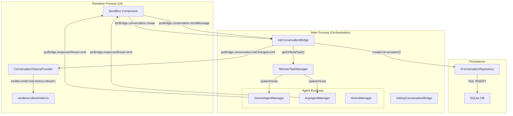
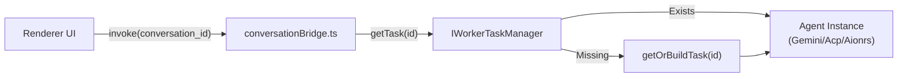

# Data Flow & State Management

Relevant source files

The following files were used as context for generating this wiki page:

- [codecov.yml](codecov.yml)
- [src/process/bridge/acpConversationBridge.ts](src/process/bridge/acpConversationBridge.ts)
- [src/process/bridge/conversationBridge.ts](src/process/bridge/conversationBridge.ts)
- [src/process/bridge/geminiConversationBridge.ts](src/process/bridge/geminiConversationBridge.ts)
- [src/process/bridge/index.ts](src/process/bridge/index.ts)
- [src/process/bridge/taskBridge.ts](src/process/bridge/taskBridge.ts)
- [src/process/bridge/teamBridge.ts](src/process/bridge/teamBridge.ts)
- [src/renderer/index.html](src/renderer/index.html)
- [src/renderer/main.tsx](src/renderer/main.tsx)
- [src/renderer/utils/emitter.ts](src/renderer/utils/emitter.ts)
- [tests/unit/acpConversationBridge.test.ts](tests/unit/acpConversationBridge.test.ts)
- [tests/unit/conversationBridge.test.ts](tests/unit/conversationBridge.test.ts)
- [tests/unit/geminiConversationBridge.test.ts](tests/unit/geminiConversationBridge.test.ts)
- [tests/unit/taskBridge.test.ts](tests/unit/taskBridge.test.ts)
- [tests/unit/webui-favicon.test.ts](tests/unit/webui-favicon.test.ts)

## Purpose and Scope

This document describes how data flows through AionUi's multi-process architecture and how state is synchronized across the main process, renderer process, and persistent storage. It covers the complete lifecycle of conversations and messages, from user input to AI response to persistence, and explains the mechanisms that ensure data consistency across process boundaries.

For information about the IPC communication layer itself, see [Inter-Process Communication](#3.3). For details about storage implementations, see [Storage System](#3.4). For agent-specific message processing, see [AI Agent Systems](#4).

---

## Core Data Flow Architecture

AionUi implements a unidirectional data flow with event-driven synchronization between processes. Data moves through three primary channels: **IPC requests** (renderer → main), **IPC events** (main → renderer), and **persistent storage** (main ↔ disk).

### System-Wide Data Flow

The following diagram bridges the "Natural Language Space" of user interaction to the "Code Entity Space" by mapping UI actions to specific IPC bridge providers and agent managers.

**Sources:** [src/process/bridge/conversationBridge.ts:126-148](), [src/process/bridge/acpConversationBridge.ts:20-75](), [src/process/bridge/index.ts:59-95](), [src/renderer/utils/emitter.ts:48-63]()

---

## State Management Layers

AionUi maintains state across several distinct layers, each serving a specific purpose in the data lifecycle:

| Layer | Location | Scope | Persistence | Purpose |
|-------|----------|-------|-------------|---------|
| **Task Cache** | Main process `IWorkerTaskManager` | Per-conversation agent instances | Ephemeral | Active agent lifecycle management [src/process/bridge/conversationBridge.ts:153-157]() |
| **Database** | SQLite `conversations.db` | All conversations and messages | Durable | Primary persistent storage [src/process/bridge/databaseBridge.ts:19-25]() |
| **Context Providers** | Renderer React Tree | UI-wide state (Auth, Theme, Tabs) | Session/Local | UI consistency and reactivity [src/renderer/main.tsx:26-30]() |
| **Local Storage** | Renderer `localStorage` | Theme and Draft persistence | Persistent | State recovery after restart [src/renderer/index.html:16-30]() |
| **Event Emitter** | Renderer `emitter.ts` | Cross-component signaling | Ephemeral | Decoupled UI updates (e.g. workspace refresh) [src/renderer/utils/emitter.ts:63-65]() |

---

## Task Cache and Worker Management

The system uses a `workerTaskManager` to maintain active agent instances. This ensures that long-running processes (like local LLMs or MCP servers) stay alive during a conversation but can be terminated when the app is closed or the task is killed.

**Sources:** [src/process/bridge/conversationBridge.ts:77-80](), [src/process/bridge/taskBridge.ts:18-33](), [src/process/bridge/geminiConversationBridge.ts:14-26]()

---

## Event-Driven Communication

AionUi uses an extensive event emitter pattern to synchronize state across the application without tight coupling.

### Key Event Emitters

1. **IPC Bridge Emitters**: Broadcast events from the main process to the renderer (e.g., `listChanged` for tray and sidebar updates).
2. **Renderer Emitter**: A central `EventEmitter3` instance for cross-component communication (e.g., signaling the SendBox to clear after a message).

**Common Events in `src/renderer/utils/emitter.ts`:**
- `chat.history.refresh`: Triggered when conversations are created or deleted [src/renderer/utils/emitter.ts:48-48]().
- `preview.open`: Opens the preview panel for specific content [src/renderer/utils/emitter.ts:52-54]().
- `workspace.refresh`: Notifies agent-specific workspace panels to reload file trees [src/renderer/utils/emitter.ts:23-47]().

**Sources:** [src/renderer/utils/emitter.ts:19-61](), [src/process/bridge/conversationBridge.ts:60-69]()

---

## Child Pages

For more detailed technical documentation, please refer to the following sub-pages:

- [Conversation Data Model](#7.1) — Detailed explanation of the `TChatConversation` union type, discrimination patterns, and agent-specific `extra` configurations.
- [Message Transformation Pipeline](#7.2) — Technical deep-dive into how raw agent events are filtered, standardized via `transformMessage`, and batched for database persistence.
- [Event-Driven Communication](#7.3) — In-depth look at the event emitter patterns, IPC broadcasting, and the throttling/debouncing strategies used for high-frequency updates.