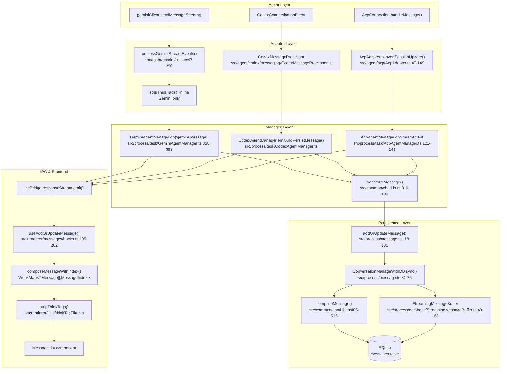
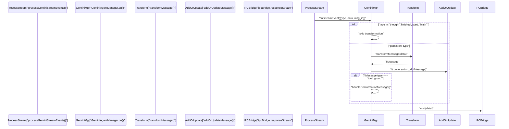
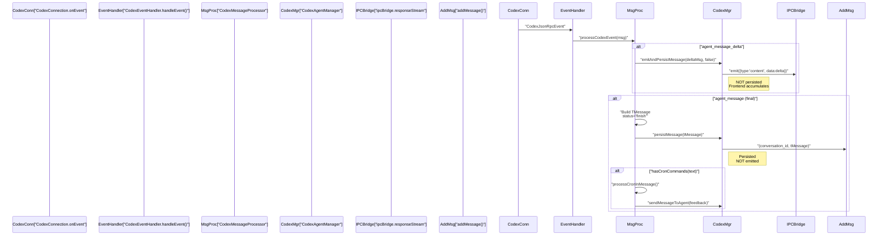
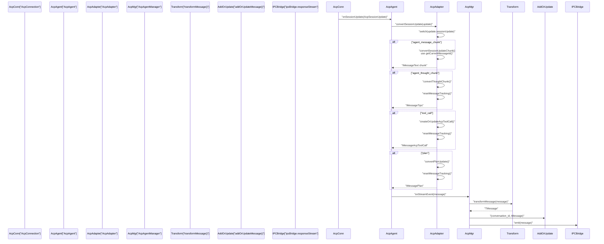
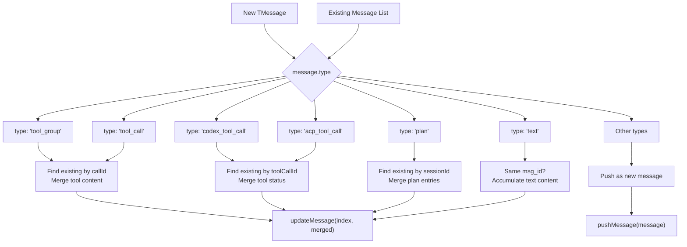
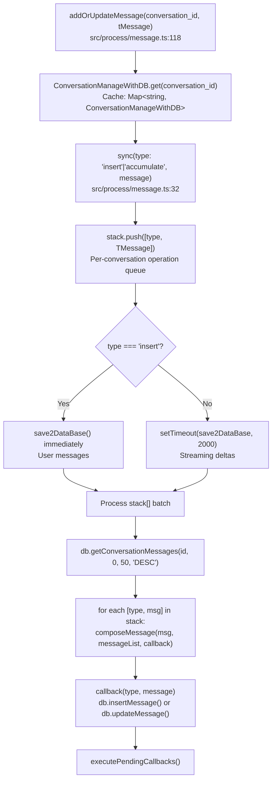
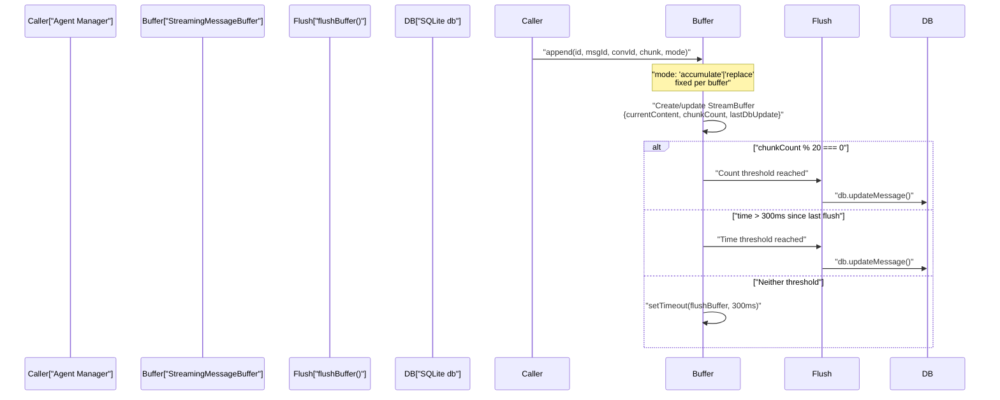
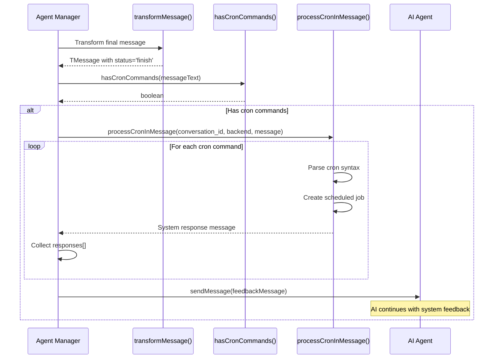

# Message Transformation Pipeline

<details>
<summary>Relevant source files</summary>

The following files were used as context for generating this wiki page:

- [src/agent/acp/AcpAdapter.ts](src/agent/acp/AcpAdapter.ts)
- [src/agent/acp/AcpConnection.ts](src/agent/acp/AcpConnection.ts)
- [src/agent/acp/index.ts](src/agent/acp/index.ts)
- [src/agent/acp/modelInfo.ts](src/agent/acp/modelInfo.ts)
- [src/agent/codex/connection/CodexConnection.ts](src/agent/codex/connection/CodexConnection.ts)
- [src/agent/codex/core/CodexAgent.ts](src/agent/codex/core/CodexAgent.ts)
- [src/agent/codex/core/ErrorService.ts](src/agent/codex/core/ErrorService.ts)
- [src/agent/codex/handlers/CodexEventHandler.ts](src/agent/codex/handlers/CodexEventHandler.ts)
- [src/agent/codex/handlers/CodexFileOperationHandler.ts](src/agent/codex/handlers/CodexFileOperationHandler.ts)
- [src/agent/codex/handlers/CodexSessionManager.ts](src/agent/codex/handlers/CodexSessionManager.ts)
- [src/agent/codex/handlers/CodexToolHandlers.ts](src/agent/codex/handlers/CodexToolHandlers.ts)
- [src/agent/codex/messaging/CodexMessageProcessor.ts](src/agent/codex/messaging/CodexMessageProcessor.ts)
- [src/common/chatLib.ts](src/common/chatLib.ts)
- [src/common/codex/types/eventData.ts](src/common/codex/types/eventData.ts)
- [src/common/codex/types/eventTypes.ts](src/common/codex/types/eventTypes.ts)
- [src/process/bridge/acpConversationBridge.ts](src/process/bridge/acpConversationBridge.ts)
- [src/process/message.ts](src/process/message.ts)
- [src/process/task/AcpAgentManager.ts](src/process/task/AcpAgentManager.ts)
- [src/process/task/CodexAgentManager.ts](src/process/task/CodexAgentManager.ts)
- [src/process/task/GeminiAgentManager.ts](src/process/task/GeminiAgentManager.ts)
- [src/renderer/components/AcpModelSelector.tsx](src/renderer/components/AcpModelSelector.tsx)
- [src/renderer/pages/guid/hooks/useGuidAgentSelection.ts](src/renderer/pages/guid/hooks/useGuidAgentSelection.ts)
- [src/renderer/pages/settings/AssistantManagement.tsx](src/renderer/pages/settings/AssistantManagement.tsx)
- [src/types/acpTypes.ts](src/types/acpTypes.ts)

</details>

## Purpose and Scope

The Message Transformation Pipeline converts agent-specific message formats (Gemini, Codex, ACP) into the unified `TMessage` format for consistent UI rendering. The pipeline has four stages:

1. **Raw Event Processing**: Agent-specific adapters (`AcpAdapter`, `CodexMessageProcessor`) normalize stream events
2. **Think-Tag Filtering**: `ThinkTagDetector` strips reasoning content from output (both main process and renderer)
3. **Standardization**: `transformMessage()` converts `IResponseMessage` to `TMessage`
4. **Persistence**: `ConversationManageWithDB` batches database writes with 2-second debouncing

For agent implementations, see [AI Agent Systems](#4). For UI rendering, see [Message Rendering System](#5.4). For data models, see [Conversation Data Model](#7.1).

---

## Transformation Architecture Overview

The pipeline has four distinct layers: stream event processing (agent side), IPC transport, frontend batching (React state), and backend persistence (SQLite).

**Message Transformation Pipeline Architecture**



Sources: [src/agent/gemini/utils.ts:67-290](), [src/agent/codex/messaging/CodexMessageProcessor.ts:17-219](), [src/agent/acp/AcpAdapter.ts:14-299](), [src/process/task/GeminiAgentManager.ts:358-399](), [src/process/task/CodexAgentManager.ts](), [src/process/task/AcpAgentManager.ts:121-149](), [src/common/chatLib.ts:310-515](), [src/process/message.ts:18-131](), [src/renderer/messages/hooks.ts:195-262]()

---

## Core Message Types

The system defines a discriminated union type `TMessage` representing all possible message types:

| Message Type              | Purpose                                | Position          | Persistence |
| ------------------------- | -------------------------------------- | ----------------- | ----------- |
| `IMessageText`            | Text content from user or agent        | `left` or `right` | Yes         |
| `IMessageTips`            | System notifications, errors, warnings | `center` or `pop` | Yes         |
| `IMessageToolCall`        | Gemini tool execution status           | `left`            | Yes         |
| `IMessageToolGroup`       | Gemini tool group with confirmations   | -                 | Yes         |
| `IMessageAgentStatus`     | Agent connection/session status        | `center`          | Yes         |
| `IMessageAcpPermission`   | ACP permission requests                | `left`            | Yes         |
| `IMessageAcpToolCall`     | ACP tool call updates                  | `left`            | Yes         |
| `IMessageCodexPermission` | Codex permission requests              | `left`            | Yes         |
| `IMessageCodexToolCall`   | Codex tool call updates                | `left`            | Yes         |
| `IMessagePlan`            | ACP plan entries                       | `left`            | Yes         |

All message types share these common fields:

- `id`: Unique identifier for deduplication
- `msg_id`: Shared identifier for message accumulation
- `conversation_id`: Parent conversation reference
- `type`: Discriminant for type narrowing
- `content`: Type-specific content payload
- `createdAt`: Timestamp (optional)
- `position`: Layout hint (optional)
- `status`: Processing state (optional)

**Sources:** [src/common/chatLib.ts:57-265]()

---

## transformMessage Function

The `transformMessage()` function is the central transformation point, converting `IResponseMessage` (agent output format) to `TMessage` (UI format):

**`transformMessage()` Type Dispatch**

```mermaid
graph TD
    Input["IResponseMessage<br/>{type: string, data: unknown, msg_id: string}"]

    Switch{"message.type"}

    Error["'error'"]
    Content["'content'"]
    UserContent["'user_content'"]
    ToolCall["'tool_call'"]
    ToolGroup["'tool_group'"]
    AgentStatus["'agent_status'"]
    AcpPerm["'acp_permission'"]
    AcpTool["'acp_tool_call'"]
    CodexPerm["'codex_permission'"]
    CodexTool["'codex_tool_call'"]
    PlanMsg["'plan'"]
    Skip["'start' | 'finish'<br/>'thought' | 'system'"]
    Default["default case"]

    IMessageTips["IMessageTips<br/>type: 'tips'<br/>content.type: 'error'<br/>position: 'center'"]
    IMessageTextL["IMessageText<br/>type: 'text'<br/>position: 'left'"]
    IMessageTextR["IMessageText<br/>type: 'text'<br/>position: 'right'"]
    IMessageToolCall["IMessageToolCall<br/>type: 'tool_call'<br/>content.callId"]
    IMessageToolGroup["IMessageToolGroup<br/>type: 'tool_group'<br/>content[].callId"]
    IMessageAgentStatus["IMessageAgentStatus<br/>type: 'agent_status'<br/>content.backend"]
    IMessageAcpPermission["IMessageAcpPermission<br/>type: 'acp_permission'"]
    IMessageAcpToolCall["IMessageAcpToolCall<br/>type: 'acp_tool_call'<br/>content.update.toolCallId"]
    IMessageCodexPermission["IMessageCodexPermission<br/>type: 'codex_permission'"]
    IMessageCodexToolCall["IMessageCodexToolCall<br/>type: 'codex_tool_call'<br/>content.toolCallId"]
    IMessagePlan["IMessagePlan<br/>type: 'plan'<br/>content.sessionId"]

    Undefined["undefined<br/>(transient UI state)"]
    ThrowError["throw Error<br/>'Unsupported message type'"]

    Input --> Switch

    Switch --> Error
    Switch --> Content
    Switch --> UserContent
    Switch --> ToolCall
    Switch --> ToolGroup
    Switch --> AgentStatus
    Switch --> AcpPerm
    Switch --> AcpTool
    Switch --> CodexPerm
    Switch --> CodexTool
    Switch --> PlanMsg
    Switch --> Skip
    Switch --> Default

    Error --> IMessageTips
    Content --> IMessageTextL
    UserContent --> IMessageTextR
    ToolCall --> IMessageToolCall
    ToolGroup --> IMessageToolGroup
    AgentStatus --> IMessageAgentStatus
    AcpPerm --> IMessageAcpPermission
    AcpTool --> IMessageAcpToolCall
    CodexPerm --> IMessageCodexPermission
    CodexTool --> IMessageCodexToolCall
    PlanMsg --> IMessagePlan
    Skip --> Undefined
    Default --> ThrowError
```



**Key transformations:**

- `error` → `IMessageTips` with `type: 'error'`, positioned `center`
- `content` → `IMessageText` with `position: 'left'` (agent message)
- `user_content` → `IMessageText` with `position: 'right'` (user message)
- Transient types (`start`, `finish`, `thought`, `system`) are skipped and not persisted

**Sources:** [src/common/chatLib.ts:284-400]()

---

## Agent-Specific Transformation Patterns

### Gemini Transformation Flow

**Stage 1: Raw Stream Processing**

`processGeminiStreamEvents()` at [src/agent/gemini/utils.ts:67-290]() processes `AsyncIterable<ServerGeminiStreamEvent>` from `geminiClient.sendMessageStream()`:

| Input Event           | Output Event        | Processing                                                                                 |
| --------------------- | ------------------- | ------------------------------------------------------------------------------------------ |
| `Thought`             | `thought`           | Reasoning display                                                                          |
| `Content`             | `content`           | **Think-tag filtering inline**: `stripThinkTags()` at [src/agent/gemini/utils.ts:98-149]() |
| `inline_data`         | `content`           | Image saved to workspace, markdown path emitted                                            |
| `ToolCallRequest`     | `tool_call_request` | Forwarded to `CoreToolScheduler`                                                           |
| `Error`               | `error`             | Parsed via `parseAndFormatApiError()`                                                      |
| `Finished`            | `finished`          | Token usage stats                                                                          |
| `InvalidStream`       | `invalid_stream`    | Triggers retry logic                                                                       |
| `UserCancelled`, etc. | _(skipped)_         | Not forwarded                                                                              |

`StreamMonitor` at [src/agent/gemini/utils.ts:69-82]() tracks heartbeat timeouts.

**Stage 2: Manager Processing**



Sources: [src/agent/gemini/utils.ts:67-290](), [src/process/task/GeminiAgentManager.ts:358-399]()

### Codex Transformation Flow

**Dual-Channel Strategy**: Codex emits deltas for streaming UI but persists only the final message to avoid database duplication.



**Key Methods:**

- `processMessageDelta()` at [src/agent/codex/messaging/CodexMessageProcessor.ts:82-93](): emits deltas with fixed `currentLoadingId`
- `processFinalMessage()` at [src/agent/codex/messaging/CodexMessageProcessor.ts:95-137](): persists complete message, processes cron commands

Sources: [src/agent/codex/messaging/CodexMessageProcessor.ts:17-219](), [src/agent/codex/handlers/CodexEventHandler.ts:29-156](), [src/process/task/CodexAgentManager.ts]()

### ACP Transformation Flow

**Adapter-Based Normalization**: `AcpAdapter` pre-processes ACP session updates before standard transformation.



**Key Methods:**

- `convertSessionUpdate()` at [src/agent/acp/AcpAdapter.ts:47-149](): dispatches on `update.sessionUpdate` type
- `getCurrentMessageId()` at [src/agent/acp/AcpAdapter.ts:38-42](): maintains consistent `msg_id` for chunk accumulation
- `resetMessageTracking()` at [src/agent/acp/AcpAdapter.ts:29-31](): creates new `msg_id` after non-text events

Sources: [src/agent/acp/AcpAdapter.ts:14-299](), [src/process/task/AcpAgentManager.ts:121-280](), [src/agent/acp/AcpConnection.ts:811-896]()

---

## Message Accumulation and Merging

The `composeMessage()` function handles intelligent message merging for streaming content:



### Merging Rules

**Tool Group Merging:**

- Iterates through existing `tool_group` messages
- Matches tools by `callId`
- Merges tool content: `{...oldTool, ...newTool}`
- Creates new tool group if no existing tools matched

**Tool Call Merging:**

- For Gemini `tool_call`: matches by `content.callId`
- For Codex `codex_tool_call`: matches by `content.toolCallId`
- For ACP `acp_tool_call`: matches by `content.update.toolCallId`
- Merges content while preserving structure

**Plan Merging:**

- Matches by `content.sessionId`
- Merges plan entries: `{...oldContent, ...newContent}`

**Text Accumulation:**

- Checks if `last.msg_id === message.msg_id` and `last.type === message.type`
- Accumulates: `message.content.content = last.content.content + message.content.content`
- Updates last message in place

Sources: [src/common/chatLib.ts:405-515]()

---

## Frontend Message Batching: `useAddOrUpdateMessage`

`useAddOrUpdateMessage` in [src/renderer/messages/hooks.ts:195-262]() is the React hook responsible for applying stream events to the frontend message list. It is the primary update path on the renderer side.

### Batching Strategy

Rather than updating React state on every incoming IPC event, the hook queues events and flushes them in microtask batches using `setTimeout`:

```
IPC event arrives
    → pushed into pendingRef.current[]
    → if no flush scheduled: rafRef.current = setTimeout(flush)

flush():
    → drains pendingRef.current
    → calls update(list => ...) once per batch
    → reschedules: rafRef.current = setTimeout(flush)
```

This collapses multiple rapid stream events (e.g., content deltas) into a single React state update, preventing excessive re-renders.

### Message Index Cache (`MessageIndex`)

To avoid O(n) list scans on every update, the hook maintains a `MessageIndex` per message list, cached in a `WeakMap`:

```
indexCache: WeakMap<TMessage[], MessageIndex>

MessageIndex {
  msgIdIndex:      Map<msg_id, listIndex>
  callIdIndex:     Map<callId, listIndex>      // for tool_call
  toolCallIdIndex: Map<toolCallId, listIndex>  // for codex_tool_call / acp_tool_call
}
```

`getOrBuildIndex(list)` [src/renderer/messages/hooks.ts:56-64]() retrieves the cached index or builds it in O(n). All subsequent lookups within the same batch are O(1).

**Message merge dispatch in `composeMessageWithIndex`:**

| `message.type`    | Lookup key                                       | Merge behaviour                                    |
| ----------------- | ------------------------------------------------ | -------------------------------------------------- |
| `tool_group`      | _(falls through to `composeMessage`)_            | Rebuilds index after merge                         |
| `tool_call`       | `callIdIndex` by `content.callId`                | Merges `{...old.content, ...new.content}`          |
| `codex_tool_call` | `toolCallIdIndex` by `content.toolCallId`        | Merges content                                     |
| `acp_tool_call`   | `toolCallIdIndex` by `content.update.toolCallId` | Merges content                                     |
| `text`            | `msgIdIndex` by `msg_id`                         | Appends `content.content` (streaming accumulation) |
| other             | `msg_id` + `type` check on last message          | Replace or push new                                |

Sources: [src/renderer/messages/hooks.ts:17-262]()

### Database Load on Conversation Switch: `useMessageLstCache`

`useMessageLstCache` [src/renderer/messages/hooks.ts:264-301]() loads persisted messages from SQLite via `ipcBridge.database.getConversationMessages` when a conversation is first opened. It merges DB messages with any in-flight streaming messages already in state, using both `id` and `msg_id` for deduplication.

---

## Persistence Pipeline

**Persistence Pipeline: `addOrUpdateMessage()` Flow**



### Persistence Strategy

**`addMessage()`**: Inserts a new message immediately without merging

- Used for user messages and final agent messages
- Calls `sync('insert', message)` → triggers immediate database write

**`addOrUpdateMessage()`**: Accumulates messages with intelligent merging

- Used for streaming deltas and tool updates
- Calls `sync('accumulate', message)` → triggers debounced write (2 seconds)
- Applies `composeMessage()` logic during database write

**`ConversationManageWithDB` Batching Mechanism:**

- One instance per `conversation_id`, stored in a module-level `Cache` Map
- Maintains a `stack: Array<['insert' | 'accumulate', TMessage]>` per conversation
- `insert` operations immediately call `save2DataBase()`; `accumulate` operations debounce with a 2-second timer
- `save2DataBase()` chains via `savePromise` to prevent concurrent writes:
  1. Reads last 50 messages from DB (DESC, then reversed)
  2. Applies all stacked operations using `composeMessage()`
  3. Calls `db.insertMessage()` or `db.updateMessage()` per change
  4. Runs `executePendingCallbacks()`

Sources: [src/process/message.ts:18-165]()

### Streaming Write Optimization

`StreamingMessageBuffer` at [src/process/database/StreamingMessageBuffer.ts:40-163]() provides additional batching for high-frequency streaming to reduce database writes.

**Flush Triggers:**

| Trigger            | Value     | Effect            |
| ------------------ | --------- | ----------------- |
| `UPDATE_INTERVAL`  | 300 ms    | Time-based flush  |
| `CHUNK_BATCH_SIZE` | 20 chunks | Count-based flush |

**Buffer Lifecycle:**



**StreamBuffer Structure:**

```typescript
{
  messageId: string,
  conversationId: string,
  currentContent: string,
  chunkCount: number,
  lastDbUpdate: number,
  mode: 'accumulate' | 'replace'
}
```

Sources: [src/process/database/StreamingMessageBuffer.ts:1-163]()

---

## Message Transformation by Agent Comparison

| Aspect                  | Gemini                                 | Codex                                    | ACP                                       |
| ----------------------- | -------------------------------------- | ---------------------------------------- | ----------------------------------------- |
| **Source Format**       | `IResponseMessage` from worker         | `CodexEventMsg` from MCP                 | `AcpSessionUpdate` from JSON-RPC          |
| **Adapter Layer**       | None (direct transform)                | `CodexMessageProcessor`                  | `AcpAdapter`                              |
| **Streaming Strategy**  | Transform + persist each event         | Emit deltas, persist final               | Transform chunks with consistent `msg_id` |
| **Delta Handling**      | No explicit deltas                     | `agent_message_delta` (not persisted)    | `agent_message_chunk` (persisted)         |
| **Final Message**       | Continuous updates                     | `agent_message` (persisted, not emitted) | N/A (accumulates from chunks)             |
| **Tool Call Format**    | `IMessageToolGroup` with confirmations | `IMessageCodexToolCall` with subtypes    | `IMessageAcpToolCall` with status         |
| **Permission System**   | Inline confirmations via `tool_group`  | Separate `codex_permission` messages     | Separate `acp_permission` messages        |
| **Message ID Strategy** | New `msg_id` per event                 | Fixed `msg_id` for delta accumulation    | `getCurrentMessageId()` for chunks        |

**Sources:** [src/process/task/GeminiAgentManager.ts:358-399](), [src/agent/codex/messaging/CodexMessageProcessor.ts:82-137](), [src/agent/acp/AcpAdapter.ts:27-149]()

---

## Special Transformation Cases

### Preview Open Event Interception

All agents check for chrome-devtools navigation tools and intercept them before transformation:

```typescript
// In GeminiAgentManager.ts:372-375
if (handlePreviewOpenEvent(data)) {
  return // Don't continue processing
}

// In CodexAgentManager.ts:431-434
if (handlePreviewOpenEvent(message)) {
  return // Don't process further
}

// In AcpAgentManager.ts:123-126
if (handlePreviewOpenEvent(message)) {
  return // Don't process further
}
```

The `handlePreviewOpenEvent()` function [src/process/utils/previewUtils.ts]() detects navigation tool calls and emits `preview_open` events directly to the frontend, bypassing normal transformation and persistence.

**Sources:** [src/process/task/GeminiAgentManager.ts:372-375](), [src/process/task/CodexAgentManager.ts:431-434](), [src/process/task/AcpAgentManager.ts:123-126]()

### Cron Command Detection

Post-transformation, agents detect cron commands in assistant messages and process them:



This enables conversational scheduling where the AI can set up cron jobs and receive confirmation feedback.

**Sources:** [src/process/task/GeminiAgentManager.ts:434-489](), [src/agent/codex/messaging/CodexMessageProcessor.ts:113-136](), [src/process/task/AcpAgentManager.ts:174-207](), [src/process/task/CronCommandDetector.ts](), [src/process/task/MessageMiddleware.ts]()

### Think-Tag Filtering

Several AI models (DeepSeek, MiniMax, QwQ, and others routed through proxy gateways) embed internal reasoning inside ``or`<thinking>...</thinking>` tags in their text output. AionUi filters these tags at two points in the pipeline.

#### Main-Process Filtering (Gemini agent)

`processGeminiStreamEvents` in [src/agent/gemini/utils.ts:98-149]() performs inline filtering on every `Content` event. If the chunk contains any `` patterns:

1. Complete ``blocks are extracted and re-emitted as`Thought` events (displayed in the "thinking" UI).
2. Complete blocks are stripped from the content string.
3. Unclosed opening tags (e.g. ``closing tags are **preserved** in the emitted content — the frontend accumulates streaming chunks, and when it encounters`</think>`in the accumulated text, it can strip all preceding thinking content via`stripThinkTags`.

For non-Gemini agents (Codex, ACP), the dedicated `ThinkTagDetector` module at [src/process/task/ThinkTagDetector.ts]() provides the same logic as reusable functions.

#### `ThinkTagDetector` (Main-Process Module)

Exported functions from [src/process/task/ThinkTagDetector.ts]():

| Function                       | Purpose                                                                                                    |
| ------------------------------ | ---------------------------------------------------------------------------------------------------------- |
| `hasThinkTags(content)`        | Returns `true` if any ``, `<thinking>`, or `</thinking>` tag is present (case-insensitive, space-tolerant) |
| `stripThinkTags(content)`      | Removes all think tag content using a 7-step regex pipeline                                                |
| `extractThinkContent(content)` | Returns array of reasoning strings from completed blocks (for debug/analytics)                             |

**`stripThinkTags` 7-step pipeline:**

1. Remove complete `` blocks
2. Remove complete `<thinking>...</thinking>` blocks
3. Remove content before the **first** orphaned `</think>` (MiniMax M2.5 pattern: model omits opening tag)
4. Remove remaining orphaned `</think>` tags (preserve surrounding content)
5. Remove remaining orphaned `<think>` opening tags
6. Collapse runs of 3+ newlines to 2
7. Trim leading/trailing whitespace

#### Renderer-Side Filtering

`src/renderer/utils/thinkTagFilter.ts` provides equivalent `stripThinkTags`, `hasThinkTags`, and `filterMessageContent` functions for the renderer process. These handle historical messages that were persisted before server-side filtering was in place.

`useAutoTitle` in [src/renderer/hooks/useAutoTitle.ts]() uses `hasThinkTags` / `stripThinkTags` before extracting the conversation title from the first AI response, preventing thinking content from becoming the conversation name.

Sources: [src/agent/gemini/utils.ts:98-149](), [src/process/task/ThinkTagDetector.ts:1-99](), [src/renderer/utils/thinkTagFilter.ts:1-81](), [src/renderer/hooks/useAutoTitle.ts:1-41]()

### Image Path Transformation

For text messages in workspace contexts, relative image paths in markdown are converted to absolute paths for correct rendering.

Sources: [src/common/chatLib.ts:517-541]()

---

## Error Handling in Transformation

### Unsupported Message Types

The `transformMessage()` function throws for unknown message types:

```typescript
default: {
  throw new Error(`Unsupported message type '${message.type}'. All non-standard message types should be pre-processed by respective AgentManagers.`);
}
```

This enforces that agent-specific message types (like Codex's `stream_error` or ACP's complex session updates) must be pre-processed by their respective managers into standard `IResponseMessage` formats before reaching `transformMessage()`.

### Transient Message Filtering

Some message types are intentionally skipped:

```typescript
// In GeminiAgentManager.ts:382-383
const skipTransformTypes = ['thought', 'finished', 'start', 'finish']
if (!skipTransformTypes.includes(data.type)) {
  const tMessage = transformMessage(data as IResponseMessage)
  // ... persist
}
```

These transient UI state messages (`thought`, `start`, `finish`) are emitted to frontend for real-time updates but never transformed or persisted.

**Sources:** [src/common/chatLib.ts:396-398](), [src/process/task/GeminiAgentManager.ts:382-391]()

---

## Performance Considerations

### Message Deduplication

The `composeMessage()` function assigns unique `id` to each message but uses `msg_id` for merging:

- `id`: Always unique (via `uuid()`)
- `msg_id`: Shared across related messages for accumulation

This enables efficient deduplication in the frontend's `MessageList` component while allowing streaming accumulation.

### Database Batching

`ConversationManageWithDB` batches operations:

1. **Immediate writes** for `insert` type (user messages)
2. **Debounced writes** for `accumulate` type (streaming deltas)
3. **Batch processing**: loads last 50 messages, applies all stacked changes, writes back

This reduces database I/O from hundreds of operations per second (during streaming) to one write every 2 seconds.

### Message Index Cache

`useAddOrUpdateMessage` uses a `WeakMap<TMessage[], MessageIndex>` so that the index is garbage-collected automatically when the list is replaced. Within a single flush batch, all lookups are O(1) after the initial O(n) build. The index is rebuilt incrementally as messages are added — only the new entry is inserted rather than scanning the whole list again [src/renderer/messages/hooks.ts:56-64]().

### Memory Management

Tool call tracking maps in `AcpAdapter` are cleaned up after completion with a 60-second delay to avoid premature eviction of in-flight updates.

Sources: [src/renderer/messages/hooks.ts:17-262](), [src/process/message.ts:18-77](), [src/agent/acp/AcpAdapter.ts:235-239]()

---

## Testing and Validation

### Type Safety

The system uses TypeScript discriminated unions for type safety:

```typescript
export type TMessage =
  | IMessageText
  | IMessageTips
  | IMessageToolCall
  | IMessageToolGroup
  | IMessageAgentStatus
  | IMessageAcpPermission
  | IMessageAcpToolCall
  | IMessageCodexPermission
  | IMessageCodexToolCall
  | IMessagePlan
```

This ensures compile-time validation that all message types are handled correctly in `transformMessage()` and `composeMessage()`.

### Message Validation

Messages are validated before persistence:

```typescript
// In message.ts:120-129
if (!message) {
  console.error('[Message] Cannot add or update undefined message')
  return
}
if (!message.id) {
  console.error('[Message] Message missing required id field:', message)
  return
}
```

**Sources:** [src/common/chatLib.ts:57-265](), [src/process/message.ts:118-131]()
