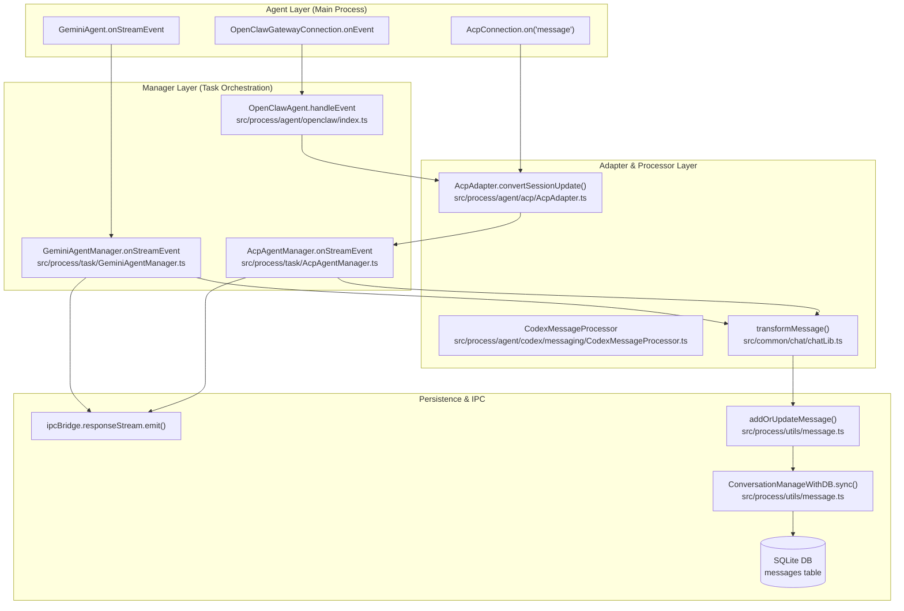
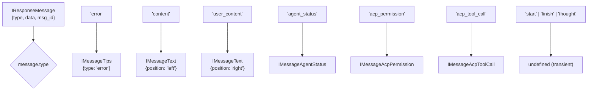

# Message Transformation Pipeline

Relevant source files

The following files were used as context for generating this wiki page:

- [src/common/chat/chatLib.ts](src/common/chat/chatLib.ts)
- [src/process/agent/openclaw/index.ts](src/process/agent/openclaw/index.ts)
- [src/process/agent/remote/RemoteAgentCore.ts](src/process/agent/remote/RemoteAgentCore.ts)
- [src/process/bridge/acpConversationBridge.ts](src/process/bridge/acpConversationBridge.ts)
- [src/process/bridge/conversationBridge.ts](src/process/bridge/conversationBridge.ts)
- [src/process/bridge/geminiConversationBridge.ts](src/process/bridge/geminiConversationBridge.ts)
- [src/process/bridge/index.ts](src/process/bridge/index.ts)
- [src/process/bridge/taskBridge.ts](src/process/bridge/taskBridge.ts)
- [src/process/bridge/teamBridge.ts](src/process/bridge/teamBridge.ts)
- [src/renderer/pages/conversation/Messages/components/MessageAgentStatus.tsx](src/renderer/pages/conversation/Messages/components/MessageAgentStatus.tsx)
- [src/renderer/services/i18n/locales/en-US/acp.json](src/renderer/services/i18n/locales/en-US/acp.json)
- [src/renderer/services/i18n/locales/ja-JP/acp.json](src/renderer/services/i18n/locales/ja-JP/acp.json)
- [src/renderer/services/i18n/locales/ko-KR/acp.json](src/renderer/services/i18n/locales/ko-KR/acp.json)
- [src/renderer/services/i18n/locales/tr-TR/acp.json](src/renderer/services/i18n/locales/tr-TR/acp.json)
- [tests/unit/acpConversationBridge.test.ts](tests/unit/acpConversationBridge.test.ts)
- [tests/unit/conversationBridge.test.ts](tests/unit/conversationBridge.test.ts)
- [tests/unit/geminiConversationBridge.test.ts](tests/unit/geminiConversationBridge.test.ts)
- [tests/unit/openClawAgentDuplicate.test.ts](tests/unit/openClawAgentDuplicate.test.ts)
- [tests/unit/taskBridge.test.ts](tests/unit/taskBridge.test.ts)
- [tests/unit/transformMessage.test.ts](tests/unit/transformMessage.test.ts)

## Purpose and Scope

The Message Transformation Pipeline converts agent-specific message formats (Gemini, Codex, ACP, OpenClaw, Aionrs) into the unified `IMessage` format for consistent UI rendering and database persistence. The pipeline handles raw JSON-RPC events, streaming text deltas, and structured tool calls.

Key responsibilities include:
1.  **Normalization**: Converting diverse agent event schemas into standardized `IResponseMessage` objects.
2.  **Transformation**: Mapping `IResponseMessage` to the UI-ready `IMessage` union types via `transformMessage`.
3.  **Filtering**: Stripping internal reasoning (think tags) from output.
4.  **Persistence**: Efficiently batching high-frequency streaming updates to SQLite via `ConversationManageWithDB`.

For agent implementations, see [AI Agent Systems](#4). For UI rendering, see [Message Rendering System](#5.4). For data models, see [Conversation Data Model](#7.1).

---

## Transformation Architecture Overview

The pipeline spans the main process (agent managers and adapters) and the renderer process (UI hooks and filters).

**Message Transformation Pipeline Architecture**

Sources: [src/process/task/GeminiAgentManager.ts:358-399](), [src/process/task/AcpAgentManager.ts:121-149](), [src/process/agent/openclaw/index.ts:94-103](), [src/common/chat/chatLib.ts:284-400](), [src/process/utils/message.ts:18-131]()

---

## Core Message Types

The system defines a discriminated union type `IMessage` representing all possible message types. These are defined in `src/common/chat/chatLib.ts`.

| Message Type | Purpose | Position | Source |
|:---|:---|:---|:---|
| `IMessageText` | Standard text content from user or agent | `left`/`right` | [src/common/chat/chatLib.ts:129-138]() |
| `IMessageTips` | System notifications, errors, or warnings | `center` | [src/common/chat/chatLib.ts:140-140]() |
| `IMessageToolCall` | Legacy Gemini-style tool execution | `left` | [src/common/chat/chatLib.ts:142-151]() |
| `IMessageToolGroup` | Grouped tool calls with confirmations (Gemini) | `left` | [src/common/chat/chatLib.ts:158-208]() |
| `IMessageAgentStatus` | Unified connection/session status for all agents | `center` | [src/common/chat/chatLib.ts:211-223]() |
| `IMessageAcpPermission` | Permission requests for ACP-based agents | `left` | [src/common/chat/chatLib.ts:225-225]() |
| `IMessageAcpToolCall` | Tool execution updates for ACP-based agents | `left` | [src/common/chat/chatLib.ts:227-227]() |
| `IMessageCodexPermission`| File/Command permissions specific to Codex | `left` | [src/common/chat/chatLib.ts:229-229]() |
| `IMessagePlan` | Agent execution plans/milestones | `left` | [src/common/chat/chatLib.ts:279-279]() |

Sources: [src/common/chat/chatLib.ts:68-282]()

---

## The `transformMessage` Function

The `transformMessage` function is the central logic for mapping `IResponseMessage` (the IPC transport format) to `IMessage` (the UI/Persistence format).

**Data Mapping Logic**

Sources: [src/common/chat/chatLib.ts:284-400](), [tests/unit/transformMessage.test.ts:18-63]()

---

## Agent-Specific Transformation Patterns

### ACP and OpenClaw Normalization
ACP-based agents (including OpenClaw and Remote agents) use the `AcpAdapter` to convert raw JSON-RPC session updates into structured message updates.

*   **Buffering**: `AcpAgentManager` buffers streaming text messages using `queueBufferedStreamTextMessage` with a 120ms flush interval to prevent database thrashing during high-speed text generation.
*   **Status Updates**: All connection states (`connecting`, `connected`, `session_active`) are mapped to `IMessageAgentStatus` via `emitStatusMessage`.

Sources: [src/process/task/AcpAgentManager.ts:81-140](), [src/process/agent/openclaw/index.ts:101-103](), [src/process/agent/remote/RemoteAgentCore.ts:67-68]()

### Codex Permission & Tool Handling
Codex messages are processed by `CodexMessageProcessor`. It handles specialized events like `patch_apply_begin` and `exec_command_output_delta`, which are transformed into `IMessageCodexToolCall`.

Sources: [src/common/chat/chatLib.ts:232-276](), [src/process/bridge/conversationBridge.ts:132-136]()

### Gemini Tool Grouping
Gemini events are transformed into `IMessageToolGroup`. This allows multiple tool calls (e.g., file reads, web searches) to be grouped into a single UI block with associated confirmation states.

Sources: [src/process/task/GeminiAgentManager.ts:358-399](), [src/process/bridge/geminiConversationBridge.ts:14-26]()

---

## Persistence and Batching

To maintain performance during streaming, the pipeline uses a debounced batching mechanism.

1.  **`addOrUpdateMessage`**: The entry point for persistence. It determines if a message should be immediately inserted or accumulated.
2.  **`ConversationManageWithDB`**:
    *   **Immediate Write**: Triggered for `insert` actions (e.g., user messages).
    *   **Debounced Write**: Triggered for `accumulate` actions (e.g., streaming agent text). It waits 2 seconds before flushing to the database.
3.  **`composeMessage`**: Logic that merges new data deltas into the existing message structure stored in the database.

Sources: [src/process/utils/message.ts:18-131](), [src/process/bridge/databaseBridge.ts:82-82]()

---

## IPC Bridge Integration

The transformation pipeline is exposed to the renderer via several specialized bridges initialized in `src/process/bridge/index.ts`.

| Bridge | Purpose | File |
|:---|:---|:---|
| `initConversationBridge` | Core CRUD for conversations and history | [src/process/bridge/conversationBridge.ts:53-57]() |
| `initAcpConversationBridge` | ACP agent health, environment, and mode | [src/process/bridge/acpConversationBridge.ts:20-20]() |
| `initGeminiConversationBridge`| Gemini-specific tool confirmations | [src/process/bridge/geminiConversationBridge.ts:13-13]() |
| `initTaskBridge` | Global task control (stop all, count) | [src/process/bridge/taskBridge.ts:18-18]() |

Sources: [src/process/bridge/index.ts:59-95]()