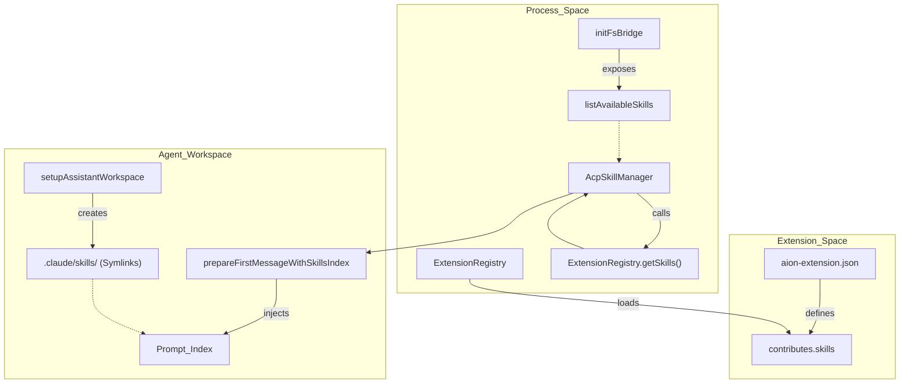
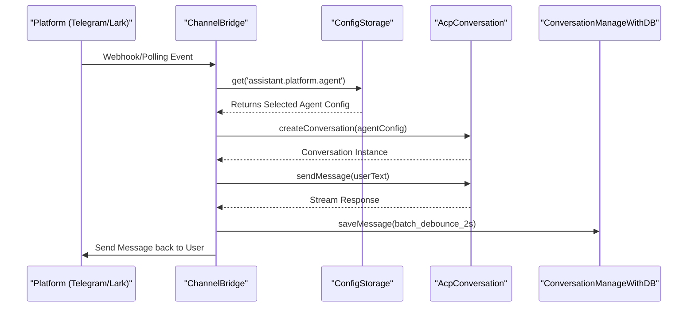

# Extension Contribution Points

Relevant source files

The following files were used as context for generating this wiki page:

- [.gitignore](.gitignore)
- [src/process/extensions/constants.ts](src/process/extensions/constants.ts)
- [src/process/extensions/hub/HubIndexManager.ts](src/process/extensions/hub/HubIndexManager.ts)
- [src/process/extensions/hub/HubInstaller.ts](src/process/extensions/hub/HubInstaller.ts)
- [src/process/resources/skills/morph-ppt/SKILL.md](src/process/resources/skills/morph-ppt/SKILL.md)
- [src/process/resources/skills/morph-ppt/reference/morph-helpers.py](src/process/resources/skills/morph-ppt/reference/morph-helpers.py)
- [src/process/resources/skills/officecli-academic-paper/SKILL.md](src/process/resources/skills/officecli-academic-paper/SKILL.md)
- [src/process/resources/skills/officecli-academic-paper/creating.md](src/process/resources/skills/officecli-academic-paper/creating.md)
- [src/process/resources/skills/officecli-data-dashboard/SKILL.md](src/process/resources/skills/officecli-data-dashboard/SKILL.md)
- [src/process/resources/skills/officecli-data-dashboard/creating.md](src/process/resources/skills/officecli-data-dashboard/creating.md)
- [src/process/resources/skills/officecli-docx/SKILL.md](src/process/resources/skills/officecli-docx/SKILL.md)
- [src/process/resources/skills/officecli-docx/creating.md](src/process/resources/skills/officecli-docx/creating.md)
- [src/process/resources/skills/officecli-docx/editing.md](src/process/resources/skills/officecli-docx/editing.md)
- [src/process/resources/skills/officecli-financial-model/SKILL.md](src/process/resources/skills/officecli-financial-model/SKILL.md)
- [src/process/resources/skills/officecli-financial-model/creating.md](src/process/resources/skills/officecli-financial-model/creating.md)
- [src/process/resources/skills/officecli-pitch-deck/SKILL.md](src/process/resources/skills/officecli-pitch-deck/SKILL.md)
- [src/process/resources/skills/officecli-pitch-deck/creating.md](src/process/resources/skills/officecli-pitch-deck/creating.md)
- [src/process/resources/skills/officecli-pptx/SKILL.md](src/process/resources/skills/officecli-pptx/SKILL.md)
- [src/process/resources/skills/officecli-pptx/creating.md](src/process/resources/skills/officecli-pptx/creating.md)
- [src/process/resources/skills/officecli-pptx/editing.md](src/process/resources/skills/officecli-pptx/editing.md)
- [src/process/resources/skills/officecli-xlsx/SKILL.md](src/process/resources/skills/officecli-xlsx/SKILL.md)
- [src/process/resources/skills/officecli-xlsx/editing.md](src/process/resources/skills/officecli-xlsx/editing.md)
- [tests/integration/acp-smoke.test.ts](tests/integration/acp-smoke.test.ts)
- [tests/unit/extensionConstants.test.ts](tests/unit/extensionConstants.test.ts)
- [tests/unit/hubIndexManager.test.ts](tests/unit/hubIndexManager.test.ts)
- [tests/unit/hubInstaller.test.ts](tests/unit/hubInstaller.test.ts)

The AionUi extension system allows third-party developers to augment the platform's capabilities through a structured manifest-driven approach. Extensions define their functionality in an `aion-extension.json` file, specifying one or more of the seven primary contribution points.

## Contribution Types Overview

Extensions can contribute to the system across several layers, from low-level protocol adapters to high-level UI components.

| Contribution Point | Description | Key Code Entity |
| :--- | :--- | :--- |
| `acpAdapters` | Custom CLI or HTTP agents following the Agent Control Protocol. | `AcpDetector`, `AcpConnection` |
| `mcpServers` | Model Context Protocol servers for tool and resource integration. | `McpRegistry`, `initMcpBridge` |
| `assistants` | Pre-configured AI personalities with specific rules and models. | `getAssistantsDir`, `fsBridge` |
| `agents` | Custom agent implementations beyond standard ACP/Gemini types. | `ExtensionRegistry` |
| `skills` | Encapsulated reusable prompt-based capabilities (`SKILL.md`). | `AcpSkillManager` |
| `themes` | Custom CSS for styling the application and Shadow DOM. | `CssThemeModal`, `MarkdownView` |
| `settingsTabs` | Custom UI panels within the settings interface. | `SettingsPageWrapper` |

Sources: [src/process/task/AcpSkillManager.ts:19-102](), [src/process/extensions/constants.ts:1-20](), [src/process/extensions/hub/HubIndexManager.ts:1-45]()

---

## 1. Skills (Reusable Capabilities)

Skills are directory-based prompt bundles containing a `SKILL.md` file with frontmatter metadata. Extensions contribute skills to allow agents to perform specialized tasks, such as generating Morph-animated PPTs or building financial models.

### Implementation and Data Flow
The `AcpSkillManager` handles the discovery and indexing of skills. It supports three distinct locations:
1.  **Built-in Skills**: Hardcoded capabilities like `officecli-pptx` or `morph-ppt` [src/process/resources/skills/morph-ppt/SKILL.md:1-4]().
2.  **Bundled Skills**: Provided by the application package.
3.  **Extension/User Skills**: Contributed via extensions or manually added by the user.

For ACP-based agents (Claude, Codex), the system does not inject the full skill content into the prompt. Instead, it injects a **Skills Index** and the file path, allowing the agent to use its own "Read" tool to load the `SKILL.md` on demand.

### Skill Discovery Logic
Title: Skill Discovery and Resolution

Sources: [src/process/task/AcpSkillManager.ts:95-133](), [src/process/task/agentUtils.ts:88-141](), [src/process/resources/skills/morph-ppt/SKILL.md:1-50]()

---

## 2. ACP Adapters (Custom Agents)

Extensions can contribute `acpAdapters` to integrate external CLI-based agents. These agents communicate via standard I/O or HTTP using the Agent Control Protocol.

*   **Registration**: The `AcpDetector` scans for configured executable paths defined in the extension manifest.
*   **Workspace Setup**: When a conversation starts, `setupAssistantWorkspace` creates a hidden directory (e.g., `.claude/skills`) and symlinks enabled skills into it to allow the CLI agent to perform native discovery.
*   **Protocol**: Communicates via JSON-RPC over stdio or HTTP, managed by `AcpConnection`.

Sources: [src/process/utils/initAgent.ts:18-42](), [tests/integration/acp-smoke.test.ts:1-50]()

---

## 3. Assistants and Presets

Extensions can bundle pre-defined assistants. These include:
*   **Rules**: System prompts defined in `.md` files.
*   **Configuration**: Specific model selections and enabled skills.

The `fsBridge` provides the underlying file operations to resolve these resources with locale fallback (e.g., looking for `assistant.en-US.md` before `assistant.zh-CN.md`).

Sources: [src/process/bridge/fsBridge.ts:88-121](), [src/process/bridge/fsBridge.ts:169-170]()

---

## 4. MCP Servers

Extensions contributing `mcpServers` allow the AI to access external tools (databases, local files, web APIs) via the Model Context Protocol.
*   **Transport**: Extensions can specify `stdio` (local process) or `sse` (remote) transports.
*   **Lifecycle**: Managed by `initMcpBridge`, which handles the connection and capability negotiation between the agent and the MCP server.
*   **Hub Integration**: The `HubInstaller` and `HubIndexManager` allow users to discover and install MCP servers from a centralized registry.

Sources: [src/process/extensions/hub/HubInstaller.ts:10-45](), [src/process/extensions/hub/HubIndexManager.ts:50-100]()

---

## 5. Themes (CSS Injection)

Themes are contributed as CSS strings or file paths. Because AionUi uses Shadow DOM for message rendering to ensure isolation, theme contribution involves:
1.  **Global Styles**: Applied to the main React tree.
2.  **Shadow DOM Styles**: Injected into the `MarkdownView` component to style AI-generated content (e.g., KaTeX math or code blocks).

Sources: [src/renderer/pages/settings/DisplaySettings/CssThemeModal.tsx:1-40]()

---

## 6. Channel Plugins

Channel contributions allow AionUi to act as a backend for chat platforms like Telegram, Lark (Feishu), or DingTalk.

### Channel Data Flow
Title: Channel Integration and Agent Dispatch

Sources: [src/renderer/components/settings/SettingsModal/contents/channels/TelegramConfigForm.tsx:118-154](), [src/renderer/components/settings/SettingsModal/contents/channels/LarkConfigForm.tsx:127-163]()

---

## 7. Settings Tabs

Extensions can add custom configuration pages. These are integrated into the `SettingsModal` using the `SettingsPageWrapper` pattern.
*   **Persistence**: Extensions typically use `ConfigStorage` to persist their specific settings.
*   **UI Components**: Extensions use the `ipcBridge` to trigger system actions like directory selection or file system refreshes from their custom tabs.
*   **Hub Management**: The `SkillsHubSettings` page serves as a reference for how extension-contributed settings tabs can manage external resources.

Sources: [src/renderer/pages/settings/SkillsHubSettings.tsx:41-86](), [src/renderer/pages/settings/components/SettingsPageWrapper.tsx:1-30]()