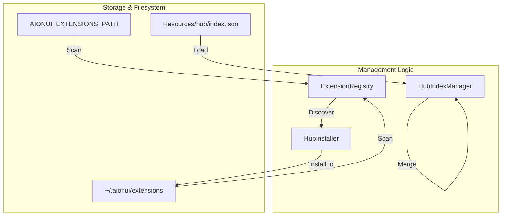
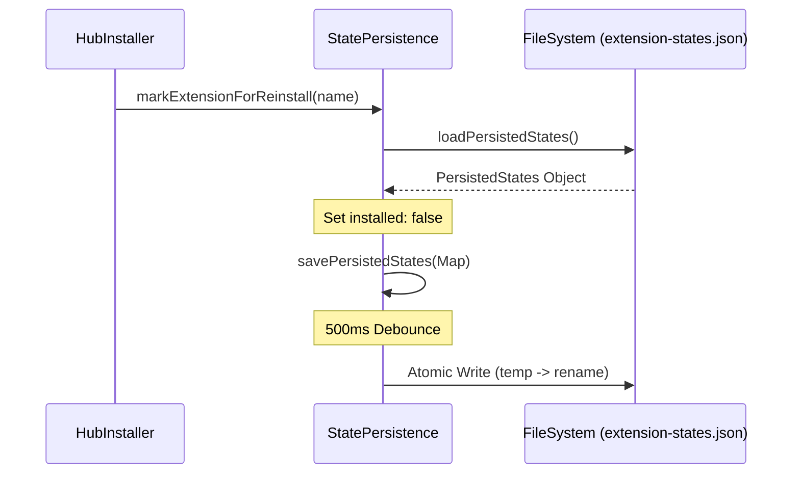

# Extension Manifest & Lifecycle

Relevant source files

The following files were used as context for generating this wiki page:

- [.gitignore](.gitignore)
- [src/common/adapter/browser.ts](src/common/adapter/browser.ts)
- [src/common/adapter/main.ts](src/common/adapter/main.ts)
- [src/process/bridge/authBridge.ts](src/process/bridge/authBridge.ts)
- [src/process/extensions/ExtensionRegistry.ts](src/process/extensions/ExtensionRegistry.ts)
- [src/process/extensions/constants.ts](src/process/extensions/constants.ts)
- [src/process/extensions/hub/HubIndexManager.ts](src/process/extensions/hub/HubIndexManager.ts)
- [src/process/extensions/hub/HubInstaller.ts](src/process/extensions/hub/HubInstaller.ts)
- [src/process/extensions/hub/HubStateManager.ts](src/process/extensions/hub/HubStateManager.ts)
- [src/process/extensions/lifecycle/statePersistence.ts](src/process/extensions/lifecycle/statePersistence.ts)
- [src/process/utils/message.ts](src/process/utils/message.ts)
- [tests/integration/acp-smoke.test.ts](tests/integration/acp-smoke.test.ts)
- [tests/unit/adapterEmitGuard.test.ts](tests/unit/adapterEmitGuard.test.ts)
- [tests/unit/adapterPayloadGuard.test.ts](tests/unit/adapterPayloadGuard.test.ts)
- [tests/unit/baseAgentManagerStop.test.ts](tests/unit/baseAgentManagerStop.test.ts)
- [tests/unit/browserAdapterReconnect.test.ts](tests/unit/browserAdapterReconnect.test.ts)
- [tests/unit/extensionConstants.test.ts](tests/unit/extensionConstants.test.ts)
- [tests/unit/extensions/statePersistence.test.ts](tests/unit/extensions/statePersistence.test.ts)
- [tests/unit/hubIndexManager.test.ts](tests/unit/hubIndexManager.test.ts)
- [tests/unit/hubInstaller.test.ts](tests/unit/hubInstaller.test.ts)
- [tests/unit/messageQueue.test.ts](tests/unit/messageQueue.test.ts)

The AionUi extension system allows third-party developers to extend application functionality by contributing agents, skills, assistants, themes, and MCP servers. Extensions are defined by a manifest file and managed through a unified registry that handles discovery, validation, and state persistence.

## Extension Manifest (`aion-extension.json`)

Every extension must contain an `aion-extension.json` file in its root directory [src/process/extensions/constants.ts:13-13](). This manifest defines the extension's identity, requirements, and functional "contribution points".

### Schema Overview

| Field | Type | Description |
| :--- | :--- | :--- |
| `name` | `string` | Unique identifier for the extension. |
| `version` | `string` | Semantic version (e.g., `1.0.0`). |
| `engines` | `object` | Compatibility requirements (e.g., `aionui: ">=1.0.0"`). |
| `permissions` | `string[]` | Requested capabilities (e.g., `storage`, `network`, `shell`). |
| `contributes` | `object` | Functional contributions (skills, agents, mcpServers, etc.). |
| `activationEvents` | `string[]` | Events triggering extension activation (e.g., `onStartup`). |

### Contribution Points
Extensions declare their functionality within the `contributes` object. Key contribution types include:
*   **acpAdapters**: Custom CLI/HTTP agents integrated via the ACP protocol [src/process/extensions/hub/HubInstaller.ts:38-38]().
*   **skills**: Custom executable tools for AI agents.
*   **mcpServers**: Model Context Protocol server definitions.
*   **themes**: Custom CSS styles injected into the UI.

**Sources:** [src/process/extensions/constants.ts:13-13](), [src/process/extensions/hub/HubInstaller.ts:37-64]()

## Extension Registry & Discovery

The `ExtensionRegistry` is a singleton responsible for managing the extension lifecycle. It scans multiple directories to discover installed extensions based on priority.

### Discovery Sources
The system scans the following paths in order of priority [src/process/extensions/constants.ts:72-81]():
1.  **Environment Path**: Directories defined in `AIONUI_EXTENSIONS_PATH` [src/process/extensions/constants.ts:11-11]().
2.  **User Data Dir**: Local user extensions at `~/.aionui/extensions` [src/process/extensions/constants.ts:17-19]().
3.  **App Data Dir**: Platform-standard application data directory [src/process/extensions/constants.ts:21-23]().

### Data Flow: Discovery and Resolution
Title: Extension Discovery and Hub Integration

**Sources:** [src/process/extensions/constants.ts:81-110](), [src/process/extensions/hub/HubIndexManager.ts:36-64](), [src/process/extensions/hub/HubInstaller.ts:106-106]()

## Lifecycle Hooks & Persistence

Extensions follow a strict lifecycle managed by the main process. State is persisted to `extension-states.json` to track enabled status and installation history [src/process/extensions/lifecycle/statePersistence.ts:14-15]().

### 1. Installation (`onInstall`)
The `onInstall` hook runs when an extension is first seen or when its version changes (upgrade) [src/process/extensions/lifecycle/statePersistence.ts:148-152](). 
*   **Verification**: After `onInstall`, the system verifies contributed capabilities. For example, `acpAdapters` are verified by checking if the required CLI is detected by `AcpDetector` [src/process/extensions/hub/HubInstaller.ts:38-63]().
*   **Reinstallation**: If an extension needs a clean setup, `markExtensionForReinstall` clears the `installed` flag in the state file [src/process/extensions/lifecycle/statePersistence.ts:170-177]().

### 2. Activation (`onActivate`)
Extensions are activated based on manifest triggers. Activation is handled in a sandboxed environment to prevent main-process blocking.

### 3. Deactivation (`onDeactivate`)
Triggered when the extension is disabled or the app shuts down. This ensures cleanup of resources like MCP server processes.

### State Persistence Model
Title: Extension State Persistence Flow

**Sources:** [src/process/extensions/lifecycle/statePersistence.ts:54-84](), [src/process/extensions/lifecycle/statePersistence.ts:94-98](), [src/process/extensions/lifecycle/statePersistence.ts:127-130]()

## Hub Integration & Installation

The `HubInstaller` handles the end-to-end process of adding extensions from the AionHub.

1.  **Index Merging**: `HubIndexManager` merges the local bundled index with the remote index fetched from GitHub or JSDelivr [src/process/extensions/hub/HubIndexManager.ts:36-57]().
2.  **Download & Extraction**: The installer resolves the zip path (bundled or remote), extracts it to a `.tmp` directory, and moves it to the target extension folder [src/process/extensions/hub/HubInstaller.ts:118-155]().
3.  **Hot Reload**: Once files are moved, `ExtensionRegistry.hotReload()` is called to re-scan and initialize the new extension [src/process/extensions/hub/HubInstaller.ts:165-165]().

### Implementation Reference

| Class/Function | File Path | Role |
| :--- | :--- | :--- |
| `ExtensionRegistry` | `src/process/extensions/ExtensionRegistry.ts` | Singleton for extension discovery and lifecycle orchestration [src/process/extensions/ExtensionRegistry.ts:15-15](). |
| `HubInstallerImpl` | `src/process/extensions/hub/HubInstaller.ts` | Logic for downloading, extracting, and verifying Hub extensions [src/process/extensions/hub/HubInstaller.ts:87-87](). |
| `loadPersistedStates` | `src/process/extensions/lifecycle/statePersistence.ts` | Reads extension enablement and version state from disk [src/process/extensions/lifecycle/statePersistence.ts:54-54](). |
| `getExtensionScanSources`| `src/process/extensions/constants.ts` | Resolves the prioritized list of directories to scan for extensions [src/process/extensions/constants.ts:81-81](). |

**Sources:** [src/process/extensions/ExtensionRegistry.ts:15-15](), [src/process/extensions/hub/HubInstaller.ts:87-87](), [src/process/extensions/lifecycle/statePersistence.ts:54-54](), [src/process/extensions/constants.ts:81-81]()