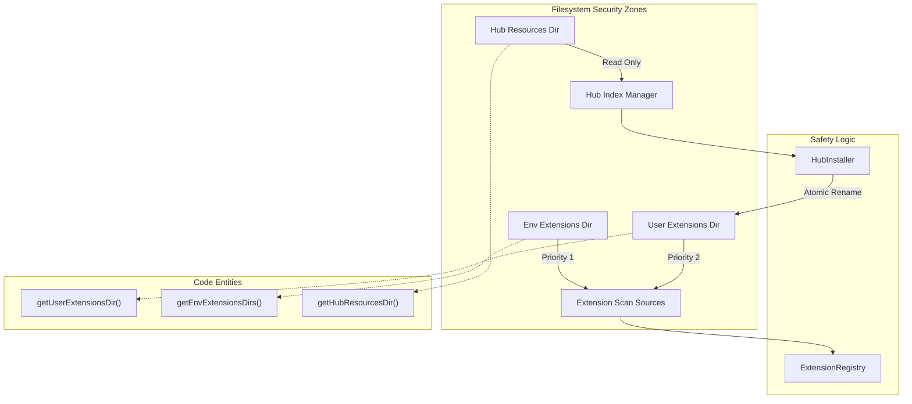

# Extension Sandbox & Permissions

Relevant source files

The following files were used as context for generating this wiki page:

- [.gitignore](.gitignore)
- [src/common/adapter/browser.ts](src/common/adapter/browser.ts)
- [src/common/adapter/main.ts](src/common/adapter/main.ts)
- [src/process/bridge/authBridge.ts](src/process/bridge/authBridge.ts)
- [src/process/extensions/ExtensionRegistry.ts](src/process/extensions/ExtensionRegistry.ts)
- [src/process/extensions/constants.ts](src/process/extensions/constants.ts)
- [src/process/extensions/hub/HubIndexManager.ts](src/process/extensions/hub/HubIndexManager.ts)
- [src/process/extensions/hub/HubInstaller.ts](src/process/extensions/hub/HubInstaller.ts)
- [src/process/extensions/hub/HubStateManager.ts](src/process/extensions/hub/HubStateManager.ts)
- [src/process/extensions/lifecycle/statePersistence.ts](src/process/extensions/lifecycle/statePersistence.ts)
- [src/process/utils/message.ts](src/process/utils/message.ts)
- [tests/integration/acp-smoke.test.ts](tests/integration/acp-smoke.test.ts)
- [tests/unit/adapterEmitGuard.test.ts](tests/unit/adapterEmitGuard.test.ts)
- [tests/unit/adapterPayloadGuard.test.ts](tests/unit/adapterPayloadGuard.test.ts)
- [tests/unit/baseAgentManagerStop.test.ts](tests/unit/baseAgentManagerStop.test.ts)
- [tests/unit/browserAdapterReconnect.test.ts](tests/unit/browserAdapterReconnect.test.ts)
- [tests/unit/extensionConstants.test.ts](tests/unit/extensionConstants.test.ts)
- [tests/unit/extensions/statePersistence.test.ts](tests/unit/extensions/statePersistence.test.ts)
- [tests/unit/hubIndexManager.test.ts](tests/unit/hubIndexManager.test.ts)
- [tests/unit/hubInstaller.test.ts](tests/unit/hubInstaller.test.ts)
- [tests/unit/messageQueue.test.ts](tests/unit/messageQueue.test.ts)

This page documents the security model and execution environment for AionUi extensions. It covers how the system enforces permissions for storage, network, and filesystem access, the isolation mechanisms for extension scripts, and the path safety enforcement used to prevent unauthorized data access.

## Permission Model & Risk Analysis

AionUi implements a manifest-based permission system defined in the `aion-extension.json` file [src/process/extensions/constants.ts:13-13](). Each extension must explicitly declare the capabilities it requires. These permissions are categorized by risk level, which the system uses to determine if a user should be prompted during installation.

### Permission Scopes

| Permission | Category | Description |
| :--- | :--- | :--- |
| `storage` | Low Risk | Access to the extension's isolated local storage and configuration. |
| `network` | Medium Risk | Ability to make outbound HTTP/HTTPS requests (e.g., for MCP servers or API integrations). |
| `shell` | High Risk | Permission to spawn child processes or execute CLI commands. |
| `filesystem` | High Risk | Read/Write access to specific directories (e.g., workspace files). |
| `events` | Low Risk | Subscription to application-level events like message streams or theme changes. |

### Extension Scan & Priority
The system scans multiple directories for extensions, enforcing a strict priority order where explicit environment paths override local user data [src/process/extensions/constants.ts:81-91]().

1.  **Environment Variable:** `AIONUI_EXTENSIONS_PATH` [src/process/extensions/constants.ts:11-11](), [src/process/extensions/constants.ts:94-96]().
2.  **User Data Dir:** `~/.aionui/extensions` [src/process/extensions/constants.ts:17-19](), [src/process/extensions/constants.ts:100-101]().
3.  **App Data Dir:** Platform-specific standard application data directory [src/process/extensions/constants.ts:21-23](), [src/process/extensions/constants.ts:103-107]().

**Sources:** [src/process/extensions/constants.ts:11-110](), [src/process/extensions/ExtensionRegistry.ts:165-165]()

## State Persistence & Lifecycle Security

Extension states (enabled/disabled) and installation history are persisted in a dedicated `extension-states.json` file [src/process/extensions/lifecycle/statePersistence.ts:14-14](). This ensures that security settings and "onInstall" hooks are respected across application restarts.

### Persistence Mechanism
- **Atomic Writes:** The system writes to a `.tmp` file before renaming to the final state file to prevent corruption [src/process/extensions/lifecycle/statePersistence.ts:128-130]().
- **Debouncing:** Rapid state changes (e.g., bulk enabling extensions) are coalesced into a single disk write via a 500ms debounce timer [src/process/extensions/lifecycle/statePersistence.ts:94-97]().
- **Version Tracking:** The `lastVersion` field in the state file allows the system to detect upgrades and re-trigger installation hooks [src/process/extensions/lifecycle/statePersistence.ts:148-164]().

**Sources:** [src/process/extensions/lifecycle/statePersistence.ts:16-178](), [tests/unit/extensions/statePersistence.test.ts:33-169]()

## Extension Sandbox Isolation

Extension scripts do not run with direct access to the main process global scope. Instead, they interact via the `ipcBridge` and specialized managers.

### Hub Installation Sandbox
The `HubInstaller` handles the secure extraction and verification of remote extensions.

1.  **Integrity Verification:** The system is designed to verify SHA-512 SRI hashes before extraction [src/process/extensions/hub/HubInstaller.ts:120-122]().
2.  **Path Sanitization:** If an archive contains a `package` directory, the installer moves contents to the target directory to prevent nested path execution [src/process/extensions/hub/HubInstaller.ts:132-138]().
3.  **Post-Install Verification:** The `verifyInstallation` function checks if the declared capabilities (like `acpAdapters`) are actually functional after the `onInstall` hook completes [src/process/extensions/hub/HubInstaller.ts:70-85]().

### Communication Security (IPC Payload Guard)
The `bridge.adapter` in the main process enforces a maximum payload size of **50MB** for IPC messages [src/common/adapter/main.ts:37-37](). If an extension or agent attempts to send data exceeding this limit, the message is dropped and a `bridge:error` is broadcast to prevent main-process blocking or memory exhaustion [src/common/adapter/main.ts:61-75]().

**Sources:** [src/process/extensions/hub/HubInstaller.ts:27-184](), [src/common/adapter/main.ts:37-88](), [tests/unit/adapterEmitGuard.test.ts:102-137]()

## Path Safety & Filesystem Enforcement

To prevent directory traversal attacks, AionUi utilizes strict path resolution for extension resources and hub assets.

### Directory Mapping

### Remote Index Security
The `HubIndexManager` fetches the extension index from trusted remote mirrors [src/process/extensions/constants.ts:42-45](). It enforces a `HUB_SUPPORTED_SCHEMA_VERSION` (currently `1`) to ensure that incompatible remote manifests cannot trigger legacy or unsupported execution paths [src/process/extensions/constants.ts:35-35](), [src/process/extensions/hub/HubIndexManager.ts:79-87]().

**Sources:** [src/process/extensions/constants.ts:35-67](), [src/process/extensions/hub/HubIndexManager.ts:79-129](), [tests/unit/hubIndexManager.test.ts:58-135]()

## Cross-Process Event Bridge

The system maintains an event bridge that spans the Main process, Renderer processes, and external WebSocket clients (for WebUI mode).

### Bridge Security Flow
"Natural Language Space" -> "Code Entity Space"

1.  **Main Event Emitted** -> `bridge.adapter.emit(name, data)` [src/common/adapter/main.ts:39-40]()
2.  **Serialization Check** -> `JSON.stringify` with `MAX_IPC_PAYLOAD_SIZE` guard [src/common/adapter/main.ts:53-61]()
3.  **Target Filtering** -> Skips `isDestroyed()` BrowserWindows [src/common/adapter/main.ts:78-85]()
4.  **WebUI Broadcast** -> `broadcastToAll(name, data)` sends events to authenticated WebSocket clients [src/common/adapter/main.ts:87-87]()
5.  **WebUI Handshake** -> `auth-expired` events force WebSocket disconnection and redirect to login if the session is invalid [src/common/adapter/browser.ts:131-159]()

**Sources:** [src/common/adapter/main.ts:39-98](), [src/common/adapter/browser.ts:23-203](), [tests/unit/adapterEmitGuard.test.ts:63-88]()