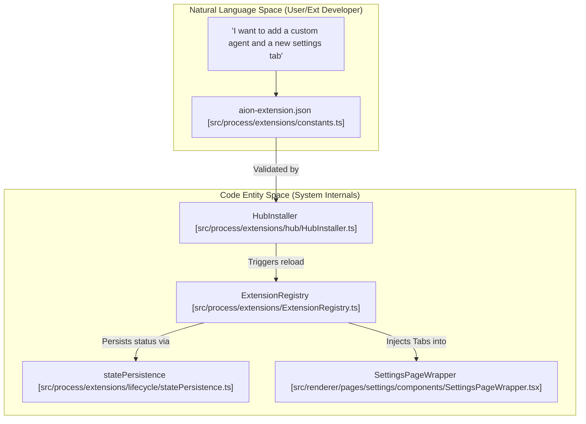
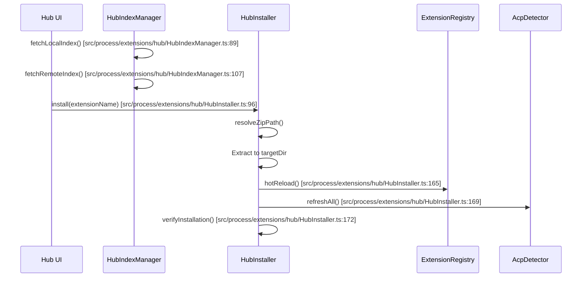

# Extension System

Relevant source files

The following files were used as context for generating this wiki page:

- [.gitignore](.gitignore)
- [src/common/adapter/browser.ts](src/common/adapter/browser.ts)
- [src/common/adapter/main.ts](src/common/adapter/main.ts)
- [src/process/bridge/authBridge.ts](src/process/bridge/authBridge.ts)
- [src/process/extensions/ExtensionRegistry.ts](src/process/extensions/ExtensionRegistry.ts)
- [src/process/extensions/constants.ts](src/process/extensions/constants.ts)
- [src/process/extensions/hub/HubIndexManager.ts](src/process/extensions/hub/HubIndexManager.ts)
- [src/process/extensions/hub/HubInstaller.ts](src/process/extensions/hub/HubInstaller.ts)
- [src/process/extensions/hub/HubStateManager.ts](src/process/extensions/hub/HubStateManager.ts)
- [src/process/extensions/lifecycle/statePersistence.ts](src/process/extensions/lifecycle/statePersistence.ts)
- [src/process/utils/message.ts](src/process/utils/message.ts)
- [tests/integration/acp-smoke.test.ts](tests/integration/acp-smoke.test.ts)
- [tests/unit/adapterEmitGuard.test.ts](tests/unit/adapterEmitGuard.test.ts)
- [tests/unit/adapterPayloadGuard.test.ts](tests/unit/adapterPayloadGuard.test.ts)
- [tests/unit/baseAgentManagerStop.test.ts](tests/unit/baseAgentManagerStop.test.ts)
- [tests/unit/browserAdapterReconnect.test.ts](tests/unit/browserAdapterReconnect.test.ts)
- [tests/unit/extensionConstants.test.ts](tests/unit/extensionConstants.test.ts)
- [tests/unit/extensions/statePersistence.test.ts](tests/unit/extensions/statePersistence.test.ts)
- [tests/unit/hubIndexManager.test.ts](tests/unit/hubIndexManager.test.ts)
- [tests/unit/hubInstaller.test.ts](tests/unit/hubInstaller.test.ts)
- [tests/unit/messageQueue.test.ts](tests/unit/messageQueue.test.ts)

The AionUi extension system allows third-party developers to augment the platform's capabilities without modifying the core codebase. By providing a structured manifest and a set of defined contribution points, extensions can integrate deeply into the AI orchestration workflow, UI, and external communication channels.

The system is managed by the `ExtensionRegistry` (singleton), which handles the discovery, loading, and lifecycle of extensions. Extensions are packaged as directories containing an `aion-extension.json` manifest and associated assets (scripts, styles, or binary servers).

### Extension Architecture Overview

The following diagram illustrates how the Extension System bridges the high-level user requirements to the internal code entities.

**Extension Integration Flow**

Sources: [src/process/extensions/constants.ts:13-13](), [src/process/extensions/ExtensionRegistry.ts:1-20](), [src/process/extensions/hub/HubInstaller.ts:87-100](), [src/process/extensions/lifecycle/statePersistence.ts:54-60](), [src/renderer/pages/settings/components/SettingsPageWrapper.tsx:1-20]()

---

## Extension Manifest & Lifecycle
Every extension must include an `aion-extension.json` file. This manifest defines the extension's identity, required permissions, and its contributions to the system [src/process/extensions/constants.ts:13-13](). The `ExtensionRegistry` scans specific directories (environment variables, local user data, and app data) to find and activate these manifests [src/process/extensions/constants.ts:81-110]().

*   **Manifest Schema**: Includes `name`, `version`, `author`, `permissions`, and the `contributes` object.
*   **Lifecycle Hooks**: Extensions can define `onActivate`, `onDeactivate`, and `onInstall` scripts. The `onInstall` hook is specifically tracked to handle upgrades and first-time setups [src/process/extensions/lifecycle/statePersistence.ts:148-164]().
*   **Persistence**: Extension states (enabled/disabled, installed version) are persisted in `extension-states.json` to ensure consistency across application restarts [src/process/extensions/lifecycle/statePersistence.ts:16-22]().

For details, see [Extension Manifest & Lifecycle](#12.1).

**Sources:** [src/process/extensions/constants.ts:13-29](), [src/process/extensions/lifecycle/statePersistence.ts:30-48](), [src/process/extensions/lifecycle/statePersistence.ts:148-164]()

---

## Extension Contribution Points
AionUi supports seven primary contribution types. These allow extensions to hook into different layers of the application, from the low-level AI protocols to the CSS styling of the interface.

| Contribution Type | Description | Code Reference |
| :--- | :--- | :--- |
| **acpAdapters** | Custom CLI or HTTP-based agents detected by the system. | `acpDetector` [src/process/extensions/hub/HubInstaller.ts:38-45]() |
| **mcpServers** | Model Context Protocol servers for tool use. | `initMcpBridge` |
| **assistants** | Pre-configured AI personalities. | `readAssistantResource` |
| **skills** | Reusable Markdown-based instructions for agents. | `AcpSkillManager` |
| **themes** | Custom CSS to modify the look and feel. | `CssThemeModal` |
| **settingsTabs** | Custom pages in the Settings menu. | `ROUTES.extensionSettings` |
| **channelPlugins** | Integrations for platforms like Telegram or Lark. | `initChannelBridge` |

For details, see [Extension Contribution Points](#12.2).

**Sources:** [src/process/extensions/hub/HubInstaller.ts:37-64](), [src/process/extensions/hub/HubIndexManager.ts:40-44]()

---

## Extension Sandbox & Permissions
To ensure system stability and user security, extensions operate under a permission-based model. The system includes a verification layer during installation to ensure that contributed capabilities (like ACP adapters) are correctly registered and available before the extension is marked as active [src/process/extensions/hub/HubInstaller.ts:70-85]().

*   **Installation Verification**: The `HubInstaller` runs post-install checks to verify that CLI tools or adapters declared in the manifest are actually functional on the host system [src/process/extensions/hub/HubInstaller.ts:171-176]().
*   **Path Safety**: Extensions are installed into isolated directories within the user's data path or environment-specified locations [src/process/extensions/constants.ts:17-29]().
*   **Integrity**: The system supports SHA-512 SRI integrity checks for remote extension packages downloaded via the Hub [src/process/extensions/hub/HubInstaller.ts:120-122]().

For details, see [Extension Sandbox & Permissions](#12.3).

**Sources:** [src/process/extensions/hub/HubInstaller.ts:27-35](), [src/process/extensions/hub/HubInstaller.ts:139-144](), [src/process/extensions/constants.ts:81-110]()

---

## Hub Integration & Discovery
The `HubIndexManager` facilitates the discovery of extensions by merging a local bundled index with a remote index (AionHub) [src/process/extensions/hub/HubIndexManager.ts:25-36](). This allows users to browse and install extensions directly from the UI.

**Extension Discovery and Installation**

Sources: [src/process/extensions/hub/HubIndexManager.ts:36-64](), [src/process/extensions/hub/HubInstaller.ts:96-177]()