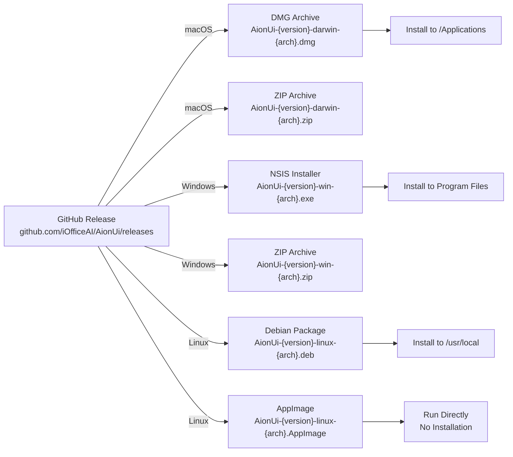
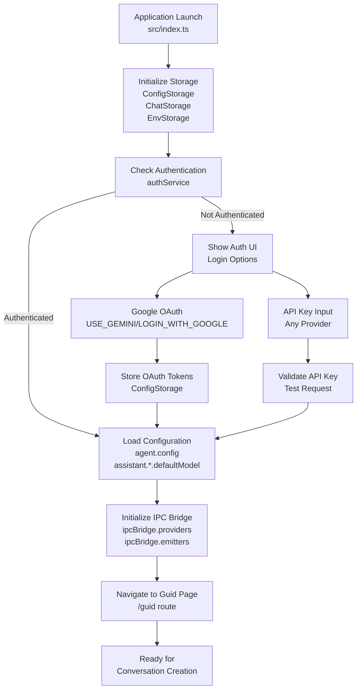
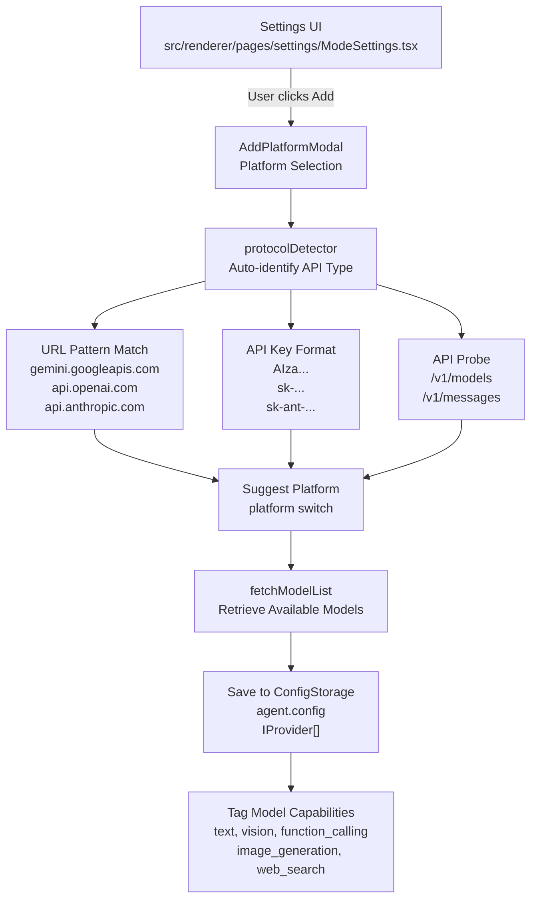
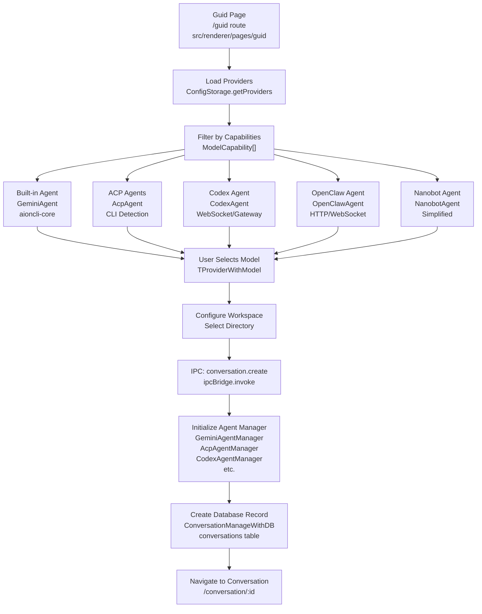
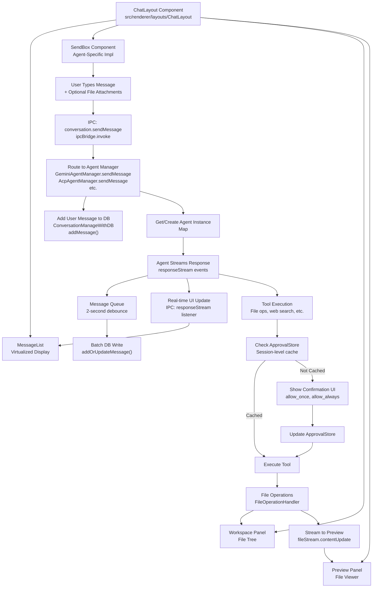

# Getting Started

<details>
<summary>Relevant source files</summary>

The following files were used as context for generating this wiki page:

- [.github/workflows/build-and-release.yml](.github/workflows/build-and-release.yml)
- [electron-builder.yml](electron-builder.yml)
- [package.json](package.json)
- [readme.md](readme.md)
- [readme_ch.md](readme_ch.md)
- [readme_es.md](readme_es.md)
- [readme_jp.md](readme_jp.md)
- [readme_ko.md](readme_ko.md)
- [readme_pt.md](readme_pt.md)
- [readme_tr.md](readme_tr.md)
- [readme_tw.md](readme_tw.md)
- [resources/wechat_group4.png](resources/wechat_group4.png)
- [resources/windows-installer-arm64.nsh](resources/windows-installer-arm64.nsh)
- [resources/windows-installer-x64.nsh](resources/windows-installer-x64.nsh)
- [scripts/build-with-builder.js](scripts/build-with-builder.js)

</details>

This guide walks you through installing AionUi, completing the initial setup, and creating your first AI-powered conversation. By the end, you'll understand how to select agents, configure models, and start working with AI on your local machine.

**Scope**: This page covers installation, first-time configuration, and basic conversation creation. For advanced topics like WebUI remote access, see [WebUI Server Architecture](#3.5); for MCP tool integration, see [MCP Integration](#4.6); for detailed model configuration, see [Model Configuration & API Management](#4.7).

---

## System Requirements

Before installing AionUi, verify your system meets these minimum requirements:

| Component            | Requirement                                                                 |
| -------------------- | --------------------------------------------------------------------------- |
| **Operating System** | macOS 10.15+, Windows 10+, or Linux (Ubuntu 18.04+, Debian 10+, Fedora 32+) |
| **Memory**           | 4GB RAM minimum (8GB recommended)                                           |
| **Storage**          | 500MB available disk space                                                  |
| **Runtime**          | Node.js 22+ (for development builds)                                        |

**Sources**: [readme.md:483-489](), [package.json:7-8]()

---

## Installation

### Downloading AionUi

AionUi provides platform-specific installers through GitHub Releases. The build system produces the following artifacts:



**Installation by Platform**:

#### macOS

```bash
# Option 1: Homebrew (recommended)
brew install aionui

# Option 2: Download DMG
# 1. Download .dmg from releases
# 2. Open DMG file
# 3. Drag AionUi.app to Applications folder
```

The DMG is code-signed and notarized using Apple's developer certificate. The notarization process is configured in [.github/workflows/\_build-reusable.yml]() with timeout tolerance for CI environments.

#### Windows

```bash
# Option 1: NSIS Installer (recommended)
# 1. Download .exe from releases
# 2. Run installer
# 3. Follow installation wizard

# Option 2: ZIP Archive (portable)
# 1. Download .zip
# 2. Extract to desired location
# 3. Run AionUi.exe
```

The NSIS installer includes architecture detection to prevent mismatched installations. The detection script is located at [resources/windows-installer-x64.nsh]() for x64 and [resources/windows-installer-arm64.nsh]() for ARM64.

#### Linux

```bash
# Debian/Ubuntu (DEB package)
sudo dpkg -i AionUi-*.deb
sudo apt-get install -f  # Install dependencies

# AppImage (any distribution)
chmod +x AionUi-*.AppImage
./AionUi-*.AppImage
```

**Sources**: [readme.md:490-502](), [electron-builder.yml:104-175](), [.github/workflows/build-and-release.yml:19-33]()

---

## First Launch & Authentication

### Application Startup Flow

When you launch AionUi for the first time, the application initializes several subsystems before presenting the UI:



**Authentication Methods**:

AionUi supports three authentication approaches:

| Method               | Use Case                         | Configuration Storage                     |
| -------------------- | -------------------------------- | ----------------------------------------- |
| **Google OAuth**     | Free Gemini access via Google AI | OAuth tokens in `ConfigStorage`           |
| **Google Vertex AI** | Enterprise Gemini via GCP        | Service account credentials               |
| **API Key**          | Any supported platform           | Provider-specific keys in `ConfigStorage` |

The authentication state is managed by `authService` and persisted in the configuration storage system built by `buildStorage()` factory function.

**Sources**: [src/index.ts]() (main process initialization), [Architecture Diagram 1]() (Application Core section), [Architecture Diagram 3]() (Configuration Storage Layer)

---

## Model Provider Configuration

### Adding Your First Model Provider

Before creating a conversation, you need to configure at least one model provider. The configuration system supports 20+ platforms through a unified `IProvider` interface:



**Provider Configuration Steps**:

1. **Open Settings**: Navigate to Settings → Mode Settings
2. **Add Platform**: Click "Add Platform" button
3. **Platform Detection**:
   - Enter API endpoint URL or select from presets
   - Paste API key
   - System auto-detects protocol (OpenAI-compatible, Anthropic, Gemini, etc.)
4. **Fetch Models**: System queries provider's model list endpoint
5. **Configure Capabilities**: Each model is tagged with capabilities:
   - `text`: Basic chat
   - `vision`: Image input support
   - `function_calling`: Tool execution
   - `image_generation`: Image creation (e.g., Imagen via Gemini)
   - `web_search`: Integrated search
   - `reasoning`: Advanced reasoning (e.g., o1 models)

**Example Provider Configurations**:

| Platform      | Base URL                                    | Key Format    | Capabilities Auto-Detected |
| ------------- | ------------------------------------------- | ------------- | -------------------------- |
| **Gemini**    | `https://generativelanguage.googleapis.com` | `AIzaSy...`   | Yes, from model metadata   |
| **OpenAI**    | `https://api.openai.com`                    | `sk-proj-...` | Yes, from `/v1/models`     |
| **Anthropic** | `https://api.anthropic.com`                 | `sk-ant-...`  | Yes, from `/v1/messages`   |
| **Ollama**    | `http://localhost:11434`                    | None (local)  | Yes, from `/api/tags`      |
| **NewAPI**    | Custom gateway URL                          | Gateway key   | Yes, proxied from upstream |

The provider configuration is persisted in `ConfigStorage` under the `agent.config` key and hot-reloaded by active agents without requiring restart.

**Sources**: [Architecture Diagram 3]() (Model Provider Categories, Protocol Detection System), [readme.md:106-138]()

---

## Creating Your First Conversation

### Agent Selection Flow

Conversations in AionUi start from the Guid page (`/guid` route), which acts as the agent/model selection interface:



**Conversation Creation Process**:

1. **Launch Guid Page**: Application opens to `/guid` route after authentication
2. **View Available Agents**:
   - **Built-in Agent**: Zero-configuration Gemini-powered agent with full capabilities
   - **ACP Agents**: Auto-detected CLI tools (Claude Code, Qwen Code, etc.)
   - **Codex Agent**: If Codex CLI or gateway is configured
   - **OpenClaw Agent**: Gateway-based agent for remote OpenClaw servers
   - **Nanobot Agent**: Simplified agent for basic tasks

3. **Select Model**: Choose a model from configured providers, filtered by required capabilities

4. **Configure Workspace** (optional): Select a local directory for agent file operations

5. **Create Conversation**: Click create button, which triggers:

   ```typescript
   // IPC call from renderer to main process
   ipcBridge.invoke('conversation.create', {
     type: 'gemini' | 'acp' | 'codex' | 'openclaw-gateway' | 'nanobot',
     extra: {
       platform: 'gemini',
       model: 'gemini-2.0-flash-exp',
       workspacePath: '/Users/username/projects',
     },
   })
   ```

6. **Initialize Agent**: Main process creates the appropriate agent manager and initializes the agent instance

7. **Database Record**: Conversation metadata is written to SQLite `conversations` table:
   ```sql
   INSERT INTO conversations (id, type, extra, created_at)
   VALUES (uuid, 'gemini', json_extra, timestamp)
   ```

**Conversation Types**:

AionUi uses a discriminated union type `TChatConversation` to represent different conversation types:

| Type               | Agent Manager          | Connection Handler   | Protocol                          |
| ------------------ | ---------------------- | -------------------- | --------------------------------- |
| `gemini`           | `GeminiAgentManager`   | `GeminiClient`       | HTTP REST (Google AI / Vertex AI) |
| `acp`              | `AcpAgentManager`      | `AcpConnection`      | JSON-RPC over stdio               |
| `codex`            | `CodexAgentManager`    | `CodexConnection`    | WebSocket                         |
| `openclaw-gateway` | `OpenClawAgentManager` | `OpenClawConnection` | HTTP/WebSocket                    |
| `nanobot`          | `NanobotAgentManager`  | N/A (built-in)       | Direct                            |

Each type includes a `type` discriminator field and an `extra` field containing type-specific configuration (model, platform, workspace, etc.).

**Sources**: [Architecture Diagram 2]() (Agent Managers section), [Architecture Diagram 3]() (Runtime Agent Selection), [Architecture Diagram 5]() (conversation.create flow), [readme.md:74-103]()

---

## Basic Conversation Workflow

### Sending Your First Message

Once a conversation is created, the application navigates to `/conversation/:id`, which renders the `ChatLayout` component with message input and display:



**Message Flow Sequence**:

1. **User Input**: Type message in `SendBox`, optionally attach files via drag-and-drop or file selector

2. **IPC Invocation**:

   ```typescript
   await ipcBridge.invoke('conversation.sendMessage', {
     conversationId: 'uuid',
     message: 'Write a Python script to analyze CSV data',
     files: [{ path: '/path/to/data.csv', uploadFile: File }],
   })
   ```

3. **Agent Routing**: Main process routes message to appropriate agent manager based on conversation type

4. **Immediate DB Write**: User message is immediately persisted to `messages` table for durability

5. **Agent Processing**: Agent processes message and begins streaming response events:

   ```typescript
   // Event types emitted by agents
   { type: 'text', text: 'Let me analyze that...' }
   { type: 'tool_call', name: 'read_file', args: {path: 'data.csv'} }
   { type: 'tool_result', result: 'file contents...' }
   ```

6. **UI Updates**: Renderer receives `responseStream` events via IPC and updates `MessageList` in real-time

7. **Tool Execution**: When agent requests tool use:
   - **Permission Check**: Consult `ApprovalStore` for cached decision
   - **User Confirmation**: If not cached, show confirmation modal with options:
     - `allow_once`: Allow this single tool call
     - `allow_always`: Allow all tool calls in this session
     - `allow_always_tool`: Allow this specific tool for all future calls
     - `allow_always_server`: Allow all tools from this MCP server
   - **Execute**: Perform file operation, web search, or MCP tool call
   - **Update UI**: File changes stream to `PreviewPanel`, workspace refreshes

8. **Batched Persistence**: Agent response chunks are batched with 2-second debounce before writing to database to prevent thrashing during streaming

**Key Component References**:

- **SendBox**: [src/renderer/components/SendBox]() - Message input with file attachments
- **MessageList**: [src/renderer/components/MessageList]() - Virtualized message display
- **PreviewPanel**: [src/renderer/components/PreviewPanel]() - File preview with syntax highlighting
- **ipcBridge**: [src/preload/ipcBridge.ts]() - IPC communication layer
- **ApprovalStore**: Main process - Permission caching for tool execution

**Sources**: [Architecture Diagram 2]() (complete diagram), [Architecture Diagram 5]() (Message Persistence Flow, File Operation Flow), [readme.md:204-393]()

---

## Understanding Agent Modes

AionUi operates in three distinct modes, selectable at startup via command-line flags:

| Mode        | Launch Command          | Use Case                  | Main Window                         |
| ----------- | ----------------------- | ------------------------- | ----------------------------------- |
| **Desktop** | `npm start` or app icon | Standard desktop usage    | BrowserWindow with system tray      |
| **WebUI**   | `npm run webui`         | Remote access via browser | Express server on configurable port |
| **CLI**     | `npm run resetpass`     | Password reset utility    | Headless (exits after operation)    |

**Desktop Mode** (default): Full Electron application with native window management, system tray integration, and deep linking support via `aionui://` protocol.

**WebUI Mode**: Runs Express server for browser-based access from remote devices. Supports:

- LAN access: `http://localhost:3000`
- Remote access: Via port forwarding or reverse proxy
- QR code login for mobile devices
- Authentication via JWT tokens

**CLI Mode**: Utility mode for administrative tasks like password reset. Useful for troubleshooting authentication issues.

**Sources**: [Architecture Diagram 1]() (Operational Modes), [package.json:11-17]() (run scripts), [readme.md:182-202]()

---

## Next Steps

Now that you have AionUi installed and your first conversation created, you can:

- **Configure Additional Model Providers**: Add more platforms in Settings → Mode Settings. See [Model Configuration & API Management](#4.7)
- **Set Up MCP Tools**: Enable external tools via Model Context Protocol. See [MCP Integration](#4.6)
- **Enable WebUI**: Configure remote access for mobile devices. See [WebUI Server Architecture](#3.5)
- **Explore Assistants**: Use built-in professional assistants (PPTX Generator, UI/UX Pro Max, etc.). See [Assistant Presets & Skills](#4.8)
- **Schedule Automated Tasks**: Set up cron-based task execution. See [Cron & Scheduled Tasks](#4.9)

For development setup and contribution guidelines, see [Development Environment](#11.6).
