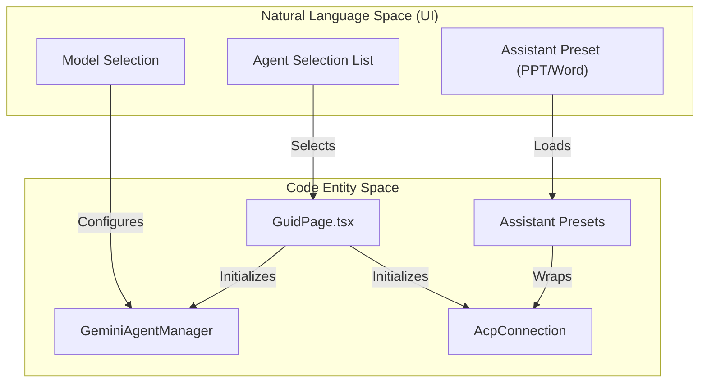
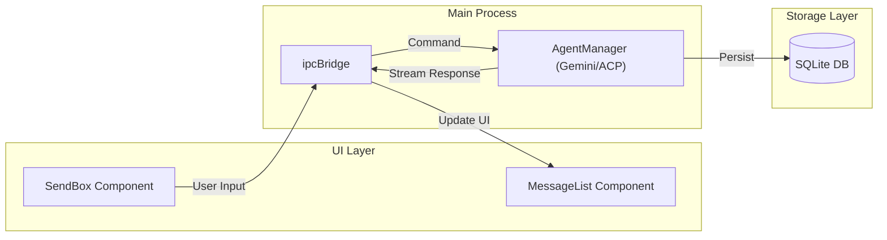

# Getting Started

<details>
<summary>Relevant source files</summary>

The following files were used as context for generating this wiki page:

- [readme.md](readme.md)
- [readme_ch.md](readme_ch.md)
- [resources/Image_Generation.gif](resources/Image_Generation.gif)
- [src/renderer/pages/guid/index.tsx](src/renderer/pages/guid/index.tsx)

</details>


This guide walks you through installing AionUi, completing the initial setup, and creating your first AI-powered conversation. By the end, you'll understand how to select agents, configure models, and start working with AI on your local machine.

**Scope**: This page covers installation, first-time configuration, and basic conversation creation. For advanced topics like WebUI remote access, see [WebUI Server Architecture](#3.5); for MCP tool integration, see [MCP Integration](#4.6); for detailed model configuration, see [Model Configuration & API Management](#4.7).

---

## System Requirements

Before installing AionUi, verify your system meets these minimum requirements:

| Component | Requirement |
|-----------|-------------|
| **Operating System** | macOS 10.15+, Windows 10+, or Linux (Ubuntu 18.04+, Debian 10+, Fedora 32+) |
| **Memory** | 4GB RAM minimum (8GB recommended) |
| **Storage** | 500MB available disk space |
| **Runtime** | Node.js 22+ (for development builds) |

**Sources**: [readme.md:10](), [readme.md:483-489]()

---

## Installation

### Downloading AionUi

AionUi provides platform-specific installers through GitHub Releases. The build system produces the following artifacts:

**Platform-Specific Artifacts**:
- **macOS**: `.dmg` (notarized) and `.zip` (universal or arch-specific).
- **Windows**: `.exe` (NSIS installer) and `.zip` (portable).
- **Linux**: `.deb` (Debian/Ubuntu) and `.AppImage`.

**Sources**: [readme.md:27-30](), [readme.md:490-502]()

### Development Setup
For developers building from source, AionUi uses `bun` for package management and development tasks.

```powershell
# 1. Install dependencies
bun install

# 2. Start development server
bun run dev
```

The application uses `electron-vite` for compilation and `electron-builder` for packaging. During development, the `main` process and `renderer` process are compiled separately but orchestrated by the dev server.

**Sources**: [readme.md:504-515](), [readme.md:530-535]()

---

## First Launch & Authentication

### Application Startup Flow

When you launch AionUi, the application initializes several subsystems. The `GuidPage` serves as the entry point for new users, facilitating agent selection and initial configuration [src/renderer/pages/guid/index.tsx:7]().

**Authentication Methods**:

AionUi supports multiple authentication approaches to provide "Zero Setup" capabilities:
- **Google OAuth**: Integrated Gemini access for a "Login with Google" experience [readme.md:79]().
- **API Key**: Manual entry for providers like OpenAI, Anthropic, or DeepSeek. AionUi supports 20+ AI platforms [readme.md:186]().
- **Local/Self-Hosted**: Support for Ollama, LM Studio, or local gateways [readme.md:183-185]().

**Sources**: [src/renderer/pages/guid/index.tsx:7](), [readme.md:74-81](), [readme.md:174-187]()

---

## Model Provider Configuration

AionUi acts as a unified interface for various AI backends.

### Protocol Auto-Detection
The system simplifies setup by auto-detecting protocols. Users can paste an API key or a endpoint URL, and AionUi identifies the provider:
- **Gemini**: Native integration with Google's generative language API [readme.md:180]().
- **OpenAI-Compatible**: Support for any provider following the OpenAI chat completion schema [readme.md:181]().
- **Anthropic**: Support for Claude models via API keys [readme.md:182]().

**Sources**: [readme.md:174-187](), [readme.md:74-81]()

---

## Creating Your First Conversation

### Agent Selection Flow

Conversations start from the **Guid Page** (`src/renderer/pages/guid/GuidPage.tsx`). This interface allows users to choose between built-in agents and external CLI agents [src/renderer/pages/guid/index.tsx:7]().

**Code Entity Space to Natural Language Space**
The following diagram maps UI selection concepts to their underlying code implementations and agent types:



**Sources**: [src/renderer/pages/guid/index.tsx:7](), [readme.md:65](), [readme.md:142-145]()

### Agent Types
AionUi categorizes agents into several backends:
1. **Built-in Agent**: The zero-configuration engine based on Gemini [readme.md:74-81]().
2. **Multi-Agent (ACP)**: Supports external CLI tools like `Claude Code`, `Codex`, and `Qwen Code` [readme.md:142-145]().
3. **Office Assistants**: Specialized agents for `PPT`, `Word`, and `Excel` powered by `OfficeCLI` [readme.md:87-91]().

**Conversation Initialization Flow**:
1. **Discovery**: AionUi auto-detects installed CLI agents on the system [readme.md:167]().
2. **Selection**: User chooses an agent and model via the `GuidPage` UI.
3. **Execution**: The system spawns the agent process (for CLI) or initializes the internal worker (for Gemini).

**Sources**: [readme.md:157-171](), [readme.md:87-91](), [src/renderer/pages/guid/index.tsx:7]()

---

## Basic Conversation Workflow

### Message Transformation and Persistence

When a message is sent, it follows a structured path from the UI to the AI backend and into local storage.



**Persistence Implementation**:
AionUi uses a local SQLite database to store conversation history. It features a batching mechanism to handle streaming data efficiently, ensuring that rapid updates from the AI don't overwhelm the disk I/O.

**Sources**: [readme.md:57-66](), [readme.md:23]()

### Understanding Agent Modes
Agents can run in different operational modes depending on user needs:
- **Cowork Mode**: The AI works alongside the user, requesting approval for file operations or web searches [readme.md:57-62]().
- **Autonomous (24/7)**: Using Cron-based scheduling for unattended tasks [readme.md:64]().
- **Team Mode**: Coordinating multiple agents to solve complex problems.

**Sources**: [readme.md:57-66](), [readme.md:23]()