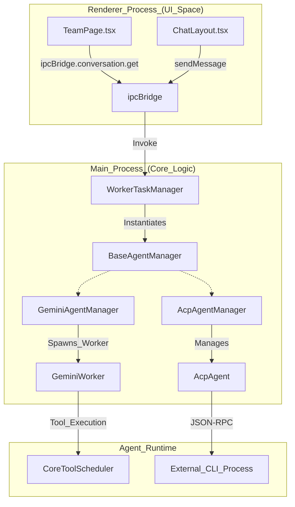
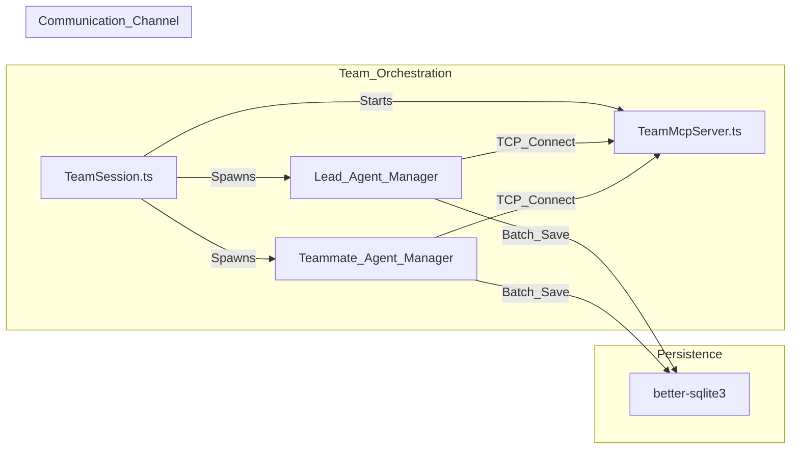

# Glossary

Relevant source files

The following files were used as context for generating this wiki page:

- [.github/workflows/build-and-release.yml](.github/workflows/build-and-release.yml)
- [bun.lock](bun.lock)
- [electron-builder.yml](electron-builder.yml)
- [package.json](package.json)
- [readme.md](readme.md)
- [readme_ch.md](readme_ch.md)
- [resources/Image_Generation.gif](resources/Image_Generation.gif)
- [scripts/README.md](scripts/README.md)
- [scripts/afterPack.js](scripts/afterPack.js)
- [scripts/afterSign.js](scripts/afterSign.js)
- [scripts/build-with-builder.js](scripts/build-with-builder.js)
- [scripts/rebuildNativeModules.js](scripts/rebuildNativeModules.js)
- [src/index.ts](src/index.ts)
- [src/process/agent/acp/mcpSessionConfig.ts](src/process/agent/acp/mcpSessionConfig.ts)
- [src/process/resources/skills/morph-ppt/SKILL.md](src/process/resources/skills/morph-ppt/SKILL.md)
- [src/process/resources/skills/morph-ppt/reference/morph-helpers.py](src/process/resources/skills/morph-ppt/reference/morph-helpers.py)
- [src/process/resources/skills/officecli-academic-paper/SKILL.md](src/process/resources/skills/officecli-academic-paper/SKILL.md)
- [src/process/resources/skills/officecli-academic-paper/creating.md](src/process/resources/skills/officecli-academic-paper/creating.md)
- [src/process/resources/skills/officecli-data-dashboard/SKILL.md](src/process/resources/skills/officecli-data-dashboard/SKILL.md)
- [src/process/resources/skills/officecli-data-dashboard/creating.md](src/process/resources/skills/officecli-data-dashboard/creating.md)
- [src/process/resources/skills/officecli-docx/SKILL.md](src/process/resources/skills/officecli-docx/SKILL.md)
- [src/process/resources/skills/officecli-docx/creating.md](src/process/resources/skills/officecli-docx/creating.md)
- [src/process/resources/skills/officecli-docx/editing.md](src/process/resources/skills/officecli-docx/editing.md)
- [src/process/resources/skills/officecli-financial-model/SKILL.md](src/process/resources/skills/officecli-financial-model/SKILL.md)
- [src/process/resources/skills/officecli-financial-model/creating.md](src/process/resources/skills/officecli-financial-model/creating.md)
- [src/process/resources/skills/officecli-pitch-deck/SKILL.md](src/process/resources/skills/officecli-pitch-deck/SKILL.md)
- [src/process/resources/skills/officecli-pitch-deck/creating.md](src/process/resources/skills/officecli-pitch-deck/creating.md)
- [src/process/resources/skills/officecli-pptx/SKILL.md](src/process/resources/skills/officecli-pptx/SKILL.md)
- [src/process/resources/skills/officecli-pptx/creating.md](src/process/resources/skills/officecli-pptx/creating.md)
- [src/process/resources/skills/officecli-pptx/editing.md](src/process/resources/skills/officecli-pptx/editing.md)
- [src/process/resources/skills/officecli-xlsx/SKILL.md](src/process/resources/skills/officecli-xlsx/SKILL.md)
- [src/process/resources/skills/officecli-xlsx/editing.md](src/process/resources/skills/officecli-xlsx/editing.md)
- [src/process/task/AcpAgentManager.ts](src/process/task/AcpAgentManager.ts)
- [src/process/task/GeminiAgentManager.ts](src/process/task/GeminiAgentManager.ts)
- [src/process/team/TeamMcpServer.ts](src/process/team/TeamMcpServer.ts)
- [src/process/team/TeamSession.ts](src/process/team/TeamSession.ts)
- [src/process/team/TeamSessionService.ts](src/process/team/TeamSessionService.ts)
- [src/process/team/adapters/PlatformAdapter.ts](src/process/team/adapters/PlatformAdapter.ts)
- [src/process/team/adapters/buildRolePrompt.ts](src/process/team/adapters/buildRolePrompt.ts)
- [src/process/team/adapters/xmlFallbackAdapter.ts](src/process/team/adapters/xmlFallbackAdapter.ts)
- [src/process/team/prompts/leadPrompt.ts](src/process/team/prompts/leadPrompt.ts)
- [src/process/team/prompts/teammatePrompt.ts](src/process/team/prompts/teammatePrompt.ts)
- [src/renderer/pages/team/TeamPage.tsx](src/renderer/pages/team/TeamPage.tsx)
- [src/renderer/pages/team/components/TeamConfirmOverlay.tsx](src/renderer/pages/team/components/TeamConfirmOverlay.tsx)
- [src/renderer/pages/team/components/TeamTabs.tsx](src/renderer/pages/team/components/TeamTabs.tsx)
- [src/renderer/pages/team/components/agentSelectUtils.tsx](src/renderer/pages/team/components/agentSelectUtils.tsx)
- [src/renderer/pages/team/hooks/useTeamList.ts](src/renderer/pages/team/hooks/useTeamList.ts)
- [tests/unit/team-agentSelectUtils.test.ts](tests/unit/team-agentSelectUtils.test.ts)

This page defines codebase-specific terms, abbreviations, and domain concepts used within the AionUi project. It serves as a technical reference for onboarding engineers to understand the mapping between natural language concepts and their implementation in the code.

## Core Concepts & Jargon

### ACP (Agent Communication Protocol)
A JSON-RPC based protocol used by AionUi to communicate with external CLI-based agents (e.g., Claude Code, Qwen Code, Codex). It abstracts the execution, session management, and tool-calling capabilities of these agents.

*   **Implementation**: Handled by the `AcpAgent` class which manages the lifecycle of the agent process and handles RPC message exchange [src/process/task/AcpAgentManager.ts:1-1]().
*   **Management**: Orchestrated by `AcpAgentManager`, which handles conversation-level logic, including message persistence, streaming buffer management, and skill injection [src/process/task/AcpAgentManager.ts:79-113]().

### Team Mode (Multi-Agent Collaboration)
A feature allowing multiple agents to work together in a single workspace. It involves a "Lead Agent" coordinating with "Teammate" agents.

*   **TeamSession**: Manages the lifecycle of a multi-agent session, including a shared `TeamMcpServer` for coordination [src/process/team/TeamSession.ts:1-10]().
*   **Coordination**: Uses a TCP-based MCP server to facilitate communication and tool sharing between the lead and teammates [src/process/team/TeamMcpServer.ts:1-15]().
*   **UI Implementation**: The `TeamPage` component renders a multi-pane interface where users can interact with all agents in the team simultaneously [src/renderer/pages/team/TeamPage.tsx:56-90]().

### IPC Bridge
The communication layer between the Electron **Main Process** and the **Renderer Process**. It utilizes a provider/emitter pattern to ensure type-safe cross-process calls.

*   **Registration**: Bridges are initialized in the main process to handle requests from the UI [src/index.ts:22-23]().
*   **Definition**: The structure is defined in `src/common/adapter/ipcBridge.ts`.

### Skills & Assistants
Modular capabilities and pre-configured personas that enhance agent behavior.
*   **Skills**: Executable capabilities (e.g., `officecli-pptx`, `web-search`) defined in the `skills/` directory [src/process/task/GeminiAgentManager.ts:58-61]().
*   **Assistants**: Pre-defined configurations for specific tasks (e.g., PPT Assistant, Word Assistant) located in the `assistant/` directory [electron-builder.yml:100-101]().

---

## System Mapping: Natural Language to Code Entities

The following diagrams bridge high-level system concepts to specific classes and files within the AionUi codebase.

### Agent Orchestration Flow
This diagram shows how a user request flows from the UI through the various Manager entities to the actual Agent implementations.

**Sources**: [src/process/task/AcpAgentManager.ts:79-113](), [src/process/task/GeminiAgentManager.ts:47-66](), [src/renderer/pages/team/TeamPage.tsx:65-67](), [src/process/team/TeamSessionService.ts:31-35]()

### Team Mode Data Flow
How the TeamSession coordinates multiple agents through a shared MCP server.

**Sources**: [src/process/team/TeamSession.ts:20-40](), [src/process/team/TeamMcpServer.ts:10-30](), [src/process/task/AcpAgentManager.ts:152-159]()

---

## Technical Glossary Table

| Term | Definition | Code Pointer |
| :--- | :--- | :--- |
| **Yolo Mode** | An "always allow" mode where the agent executes tool calls (file writes, shell commands) without requiring manual user approval. | `yoloMode` in [src/process/task/AcpAgentManager.ts:57-58]() |
| **Workspace** | A local directory on the user's machine that the agent is allowed to read from and write to. | `workspace` in [src/process/task/GeminiAgentManager.ts:49-49]() |
| **MCP** | Model Context Protocol. A standard for connecting AI models to external tools and data sources. | [src/process/task/GeminiAgentManager.ts:37-45]() |
| **Aionrs** | A bundled Rust-based agent engine providing high-performance local capabilities. | [src/renderer/pages/team/TeamPage.tsx:39-53]() |
| **OfficeCli** | A specialized CLI tool used by AionUi to manipulate Office documents (PPTX, DOCX, XLSX) programmatically. | [src/process/team/TeamSessionService.ts:87-90]() |
| **Bootstrap** | The initialization sequence for an agent manager, involving config loading and connection establishment. | `bootstrap` in [src/process/task/GeminiAgentManager.ts:74-74]() |
| **Thinking Tag** | XML-like tags (``) used by models like DeepSeek to separate internal reasoning from the final response. | [src/process/task/AcpAgentManager.ts:39-39]() |

**Sources**: [src/process/task/AcpAgentManager.ts:57-58](), [src/process/task/GeminiAgentManager.ts:49-49](), [src/process/task/GeminiAgentManager.ts:37-45](), [src/renderer/pages/team/TeamPage.tsx:39-53](), [src/process/task/AcpAgentManager.ts:39-39]()

---

## Build & Environment Conventions

AionUi uses a complex build pipeline to handle cross-platform packaging and native modules.

1.  **Incremental Builds**: Uses MD5 hashing of source files to skip Vite compilation if the source hasn't changed [scripts/build-with-builder.js:46-87]().
2.  **DMG Retry Logic**: Specifically for macOS, handles transient `hdiutil` failures by retrying the DMG creation step up to 3 times [scripts/build-with-builder.js:20-27]().
3.  **ASAR Unpacking**: Native modules like `better-sqlite3` and `node-pty` must be unpacked from the ASAR archive to function correctly [electron-builder.yml:193-196]().
4.  **Process Isolation**: 
    *   **Main Process**: Node.js operations, process management [src/index.ts:17-25]().
    *   **Renderer Process**: React UI, isolated from direct Node.js access [package.json:63-63]().

**Sources**: [scripts/build-with-builder.js:20-27](), [scripts/build-with-builder.js:46-87](), [electron-builder.yml:193-196](), [src/index.ts:17-25]()