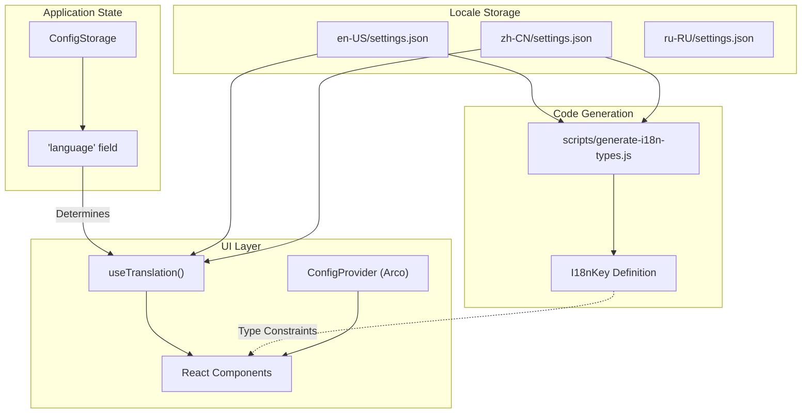
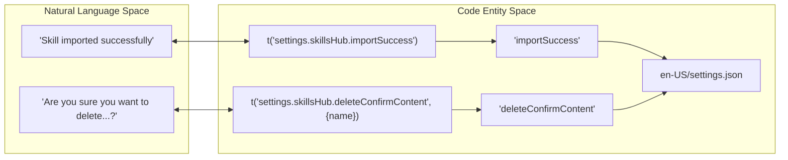

# Internationalization

Relevant source files

The following files were used as context for generating this wiki page:

- [src/common/config/storage.ts](src/common/config/storage.ts)
- [src/renderer/components/settings/SettingsModal/contents/SystemModalContent/index.tsx](src/renderer/components/settings/SettingsModal/contents/SystemModalContent/index.tsx)
- [src/renderer/pages/guid/index.tsx](src/renderer/pages/guid/index.tsx)
- [src/renderer/pages/settings/AgentSettings/RemoteAgentManagement.tsx](src/renderer/pages/settings/AgentSettings/RemoteAgentManagement.tsx)
- [src/renderer/services/i18n/i18n-keys.d.ts](src/renderer/services/i18n/i18n-keys.d.ts)
- [src/renderer/services/i18n/locales/en-US/settings.json](src/renderer/services/i18n/locales/en-US/settings.json)
- [src/renderer/services/i18n/locales/ja-JP/settings.json](src/renderer/services/i18n/locales/ja-JP/settings.json)
- [src/renderer/services/i18n/locales/ko-KR/settings.json](src/renderer/services/i18n/locales/ko-KR/settings.json)
- [src/renderer/services/i18n/locales/ru-RU/settings.json](src/renderer/services/i18n/locales/ru-RU/settings.json)
- [src/renderer/services/i18n/locales/tr-TR/settings.json](src/renderer/services/i18n/locales/tr-TR/settings.json)
- [src/renderer/services/i18n/locales/zh-CN/settings.json](src/renderer/services/i18n/locales/zh-CN/settings.json)
- [src/renderer/services/i18n/locales/zh-TW/settings.json](src/renderer/services/i18n/locales/zh-TW/settings.json)
- [tests/unit/RemoteAgentManagement.dom.test.tsx](tests/unit/RemoteAgentManagement.dom.test.tsx)

## Purpose and Overview

The internationalization (i18n) system in AionUi provides multi-language support across the entire user interface, enabling users to interact with the application in their preferred language. The system uses `react-i18next` for React component integration and stores translations in structured JSON files located in `src/renderer/services/i18n/locales/`. 

The system integrates with the **Arco Design** component library's `ConfigProvider` to ensure that standard UI components (date pickers, buttons, etc.) reflect the selected locale. It also features an auto-generated TypeScript definition for translation keys to ensure type safety during development.

**Sources:** [src/renderer/services/i18n/i18n-keys.d.ts:1-7](), [src/renderer/components/settings/SettingsModal/contents/SystemModalContent/index.tsx:10-17]()

---

## Supported Languages

AionUi supports **7 languages** with comprehensive UI translations. The mapping between i18n JSON files and the application state is managed via `ConfigStorage`.

| Language | Locale Code | Translation File Path |
|----------|-------------|-----------------------|
| English (US) | `en-US` | [src/renderer/services/i18n/locales/en-US/settings.json]() |
| Simplified Chinese | `zh-CN` | [src/renderer/services/i18n/locales/zh-CN/settings.json]() |
| Traditional Chinese | `zh-TW` | [src/renderer/services/i18n/locales/zh-TW/settings.json]() |
| Japanese | `ja-JP` | [src/renderer/services/i18n/locales/ja-JP/settings.json]() |
| Korean | `ko-KR` | [src/renderer/services/i18n/locales/ko-KR/settings.json]() |
| Turkish | `tr-TR` | [src/renderer/services/i18n/locales/tr-TR/settings.json]() |
| Russian | `ru-RU` | [src/renderer/services/i18n/locales/ru-RU/settings.json]() |

**Sources:** [src/common/config/storage.ts:72-72](), [src/renderer/services/i18n/locales/en-US/settings.json:155-155]()

---

## System Architecture

### Data Flow and Type Safety

The i18n system bridges the gap between static JSON resources and the React UI layer. A build script generates `I18nKey` types to prevent runtime errors from missing keys.

**Diagram: Internationalization Data Flow**

**Sources:** [src/renderer/services/i18n/i18n-keys.d.ts:3-7](), [src/common/config/storage.ts:20-25](), [src/renderer/components/settings/SettingsModal/contents/SystemModalContent/index.tsx:31-33]()

---

## Translation Key Structure

Translation keys are organized hierarchically. The `I18nKey` type defines the available paths for the `t()` function.

### Key Namespaces

| Namespace | Functional Area | Example Keys |
|-----------|-----------------|--------------|
| `acp` | Agent Control Protocol status and auth | `acp.status.connected`, `acp.auth.failed` |
| `agent` | Health checks and setup logic | `agent.health.checking`, `agent.setup.configError` |
| `codex` | Codex agent permissions and network | `codex.permissions.allow_always`, `codex.network.timeout` |
| `common` | Universal UI labels | `common.save`, `common.cancel`, `common.delete` |
| `settings`| Configuration panels | `settings.language`, `settings.skillsHub.title` |

**Sources:** [src/renderer/services/i18n/i18n-keys.d.ts:8-156](), [src/renderer/services/i18n/locales/en-US/settings.json:2-10]()

---

## Language Management

### Storage and Application

The user's language preference is persisted in `ConfigStorage` under the `language` key.

1.  **Storage:** Defined in the `IConfigStorageRefer` interface [src/common/config/storage.ts:72-72]().
2.  **Selection:** Managed via the `LanguageSwitcher` component [src/renderer/components/settings/SettingsModal/contents/SystemModalContent/index.tsx:10-10]().
3.  **Application:** The `SystemModalContent` component interacts with `ConfigStorage` to retrieve and update system-level preferences [src/renderer/components/settings/SettingsModal/contents/SystemModalContent/index.tsx:31-54]().

### Interpolation and Dynamic Content

The system supports variable interpolation using `{{variable}}` syntax within JSON files, allowing for dynamic messages like item counts or names.

*   **Example:** `"importAllSuccess": "{{count}} skills imported"` [src/renderer/services/i18n/locales/en-US/settings.json:10-10]().
*   **Example:** `"deleteConfirmContent": "Are you sure you want to delete \"{{name}}\"?"` [src/renderer/services/i18n/locales/en-US/settings.json:25-25]().

**Sources:** [src/renderer/services/i18n/locales/en-US/settings.json:10-31](), [src/renderer/services/i18n/locales/ja-JP/settings.json:10-28]()

---

## Technical Implementation Details

### Component Integration

React components use the `useTranslation` hook to access the `t` function. For example, in `RemoteAgentManagement.tsx`, the hook is used to localize modal titles and success messages.

**Diagram: Natural Language to Code Entity Mapping**

**Sources:** [src/renderer/pages/settings/AgentSettings/RemoteAgentManagement.tsx:28-28](), [src/renderer/services/i18n/locales/en-US/settings.json:18-25]()

### Remote Agent Handshake Localization

During remote agent setup, the system provides localized feedback for the pairing process, including handshaking status, timeout warnings, and success confirmations.

*   **Status Mapping:** `pairingState` ('idle', 'handshaking', 'pending', 'timeout') [src/renderer/pages/settings/AgentSettings/RemoteAgentManagement.tsx:37-37]().
*   **Localized Feedback:** Uses `t('settings.remoteAgent.created')` and `t('settings.remoteAgent.testSuccess')` [src/renderer/pages/settings/AgentSettings/RemoteAgentManagement.tsx:118-151]().

**Sources:** [src/renderer/pages/settings/AgentSettings/RemoteAgentManagement.tsx:96-129](), [src/renderer/pages/settings/AgentSettings/RemoteAgentManagement.tsx:131-160]()