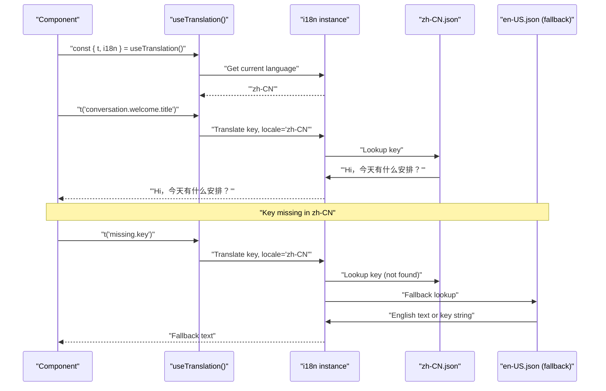
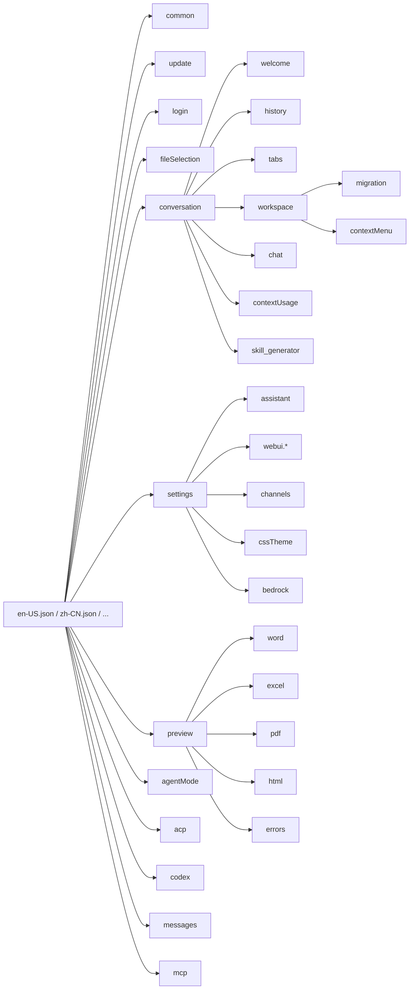
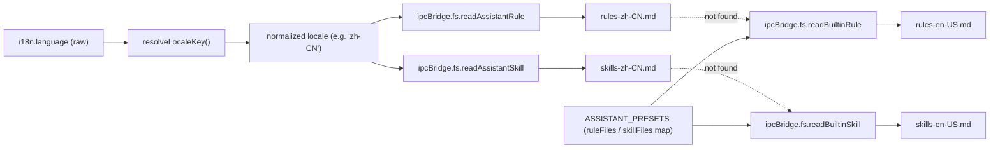
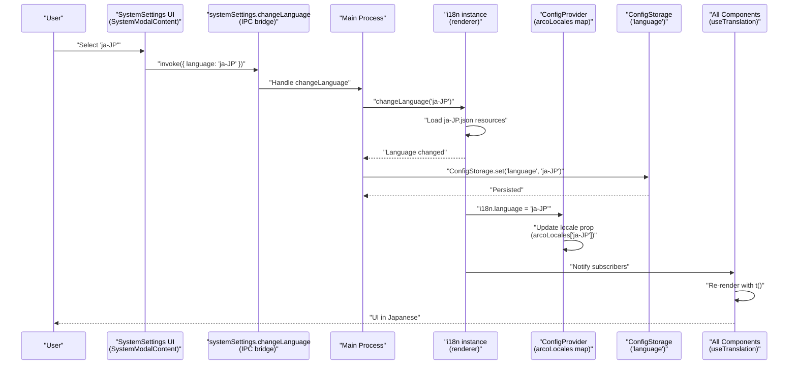

# Internationalization

<details>
<summary>Relevant source files</summary>

The following files were used as context for generating this wiki page:

- [src/common/ipcBridge.ts](src/common/ipcBridge.ts)
- [src/common/storage.ts](src/common/storage.ts)
- [src/renderer/index.ts](src/renderer/index.ts)
- [src/renderer/pages/guid/index.tsx](src/renderer/pages/guid/index.tsx)
- [src/renderer/pages/settings/About.tsx](src/renderer/pages/settings/About.tsx)
- [src/renderer/pages/settings/GeminiSettings.tsx](src/renderer/pages/settings/GeminiSettings.tsx)
- [src/renderer/pages/settings/ModeSettings.tsx](src/renderer/pages/settings/ModeSettings.tsx)
- [src/renderer/pages/settings/SystemSettings.tsx](src/renderer/pages/settings/SystemSettings.tsx)

</details>

## Purpose and Overview

The internationalization (i18n) system in AionUi provides multi-language support across the entire user interface, enabling users to interact with the application in their preferred language. The system uses `react-i18next` for React component integration and stores translations in structured JSON files. All UI text, including menus, dialogs, error messages, and tooltips, can be translated without code changes.

For information about custom CSS and theming (which is separate from language localization), see [Styling & Theming](#5.8).

**Sources:** [src/renderer/pages/guid/index.tsx:1-50](), [src/renderer/i18n/locales/en-US.json:1-100](), [src/renderer/i18n/locales/zh-CN.json:1-100]()

---

## Supported Languages

AionUi currently supports **6 languages** with complete UI translations:

| Language            | Locale Code | i18n JSON File                         | Arco ConfigProvider Locale |
| ------------------- | ----------- | -------------------------------------- | -------------------------- |
| English (US)        | `en-US`     | `src/renderer/i18n/locales/en-US.json` | `enUS`                     |
| Simplified Chinese  | `zh-CN`     | `src/renderer/i18n/locales/zh-CN.json` | `zhCN`                     |
| Traditional Chinese | `zh-TW`     | `src/renderer/i18n/locales/zh-TW.json` | `zhTW`                     |
| Japanese            | `ja-JP`     | `src/renderer/i18n/locales/ja-JP.json` | `jaJP`                     |
| Korean              | `ko-KR`     | `src/renderer/i18n/locales/ko-KR.json` | `koKRComplete` (patched)   |
| Turkish             | `tr-TR`     | `src/renderer/i18n/locales/tr-TR.json` | _(not mapped)_             |

Each locale file contains identical key structures with translated values, ensuring consistent functionality across all languages. The Arco Design component library uses a separate locale object (imported from `@arco-design/web-react/es/locale/*`) which is mapped via the `ConfigProvider` wrapper.

**Sources:** [src/renderer/i18n/locales/en-US.json:1-10](), [src/renderer/i18n/locales/zh-CN.json:1-10](), [src/renderer/index.ts:23-62]()

---

## System Architecture

### i18n Integration Flow

**Diagram: i18n system architecture from ConfigStorage through ConfigProvider to component rendering**

```mermaid
graph TB
    subgraph "Storage Layer"
        CS["ConfigStorage.buildStorage<br/>'agent.config'"]
        LSKey["IConfigStorageRefer.language<br/>(string: 'en-US', 'zh-CN', etc.)"]
    end

    subgraph "Locale Resources"
        JSON_enUS["src/renderer/i18n/locales/<br/>en-US.json"]
        JSON_zhCN["src/renderer/i18n/locales/<br/>zh-CN.json"]
        JSON_zhTW["src/renderer/i18n/locales/<br/>zh-TW.json"]
        JSON_jaJP["src/renderer/i18n/locales/<br/>ja-JP.json"]
        JSON_koKR["src/renderer/i18n/locales/<br/>ko-KR.json"]
        JSON_trTR["src/renderer/i18n/locales/<br/>tr-TR.json"]
    end

    subgraph "Arco Design Locales"
        Arco_enUS["@arco-design/web-react/es/locale/<br/>en-US"]
        Arco_zhCN["@arco-design/web-react/es/locale/<br/>zh-CN"]
        Arco_zhTW["@arco-design/web-react/es/locale/<br/>zh-TW"]
        Arco_jaJP["@arco-design/web-react/es/locale/<br/>ja-JP"]
        Arco_koKR["@arco-design/web-react/es/locale/<br/>ko-KR (patched)"]
    end

    subgraph "React Root (src/renderer/index.ts)"
        I18nInstance["i18n instance<br/>(react-i18next)"]
        ConfigProviderWrapper["ConfigProvider<br/>(locale prop)"]
        ArcoLocalesMap["arcoLocales<br/>Record<string, ArcoLocale>"]
        AppProviders["AppProviders wrapper<br/>(AuthProvider, ThemeProvider, etc.)"]
    end

    subgraph "Component Layer"
        UseTranslation["useTranslation() hook"]
        TFunction["t('key') function"]
        I18nObject["i18n.language<br/>i18n.changeLanguage()"]
        GuidPage["GuidPage"]
        SettingsModal["SettingsModal"]
        OtherComponents["Other UI components"]
    end

    CS --> LSKey
    LSKey -->|initialize language| I18nInstance
    JSON_enUS --> I18nInstance
    JSON_zhCN --> I18nInstance
    JSON_zhTW --> I18nInstance
    JSON_jaJP --> I18nInstance
    JSON_koKR --> I18nInstance
    JSON_trTR --> I18nInstance

    Arco_enUS --> ArcoLocalesMap
    Arco_zhCN --> ArcoLocalesMap
    Arco_zhTW --> ArcoLocalesMap
    Arco_jaJP --> ArcoLocalesMap
    Arco_koKR --> ArcoLocalesMap

    I18nInstance -->|i18n.language| ArcoLocalesMap
    ArcoLocalesMap -->|arcoLocales[language]| ConfigProviderWrapper
    ConfigProviderWrapper --> AppProviders
    AppProviders --> UseTranslation

    UseTranslation --> TFunction
    UseTranslation --> I18nObject
    TFunction --> GuidPage
    TFunction --> SettingsModal
    TFunction --> OtherComponents
    I18nObject --> SettingsModal
```

**Sources:** [src/common/storage.ts:13-22](), [src/common/storage.ts:60](), [src/renderer/index.ts:18-73]()

### Translation Resolution Process

**Diagram: Key lookup and fallback flow for `t()` calls**



Sources: [src/renderer/i18n/locales/zh-CN.json:220-237](), [src/renderer/i18n/locales/en-US.json:222-240]()

---

## Translation Key Structure

Translation keys are organized hierarchically by functional area. The top-level categories include:

### Key Organization Hierarchy

**Diagram: Top-level and nested namespaces in each locale JSON file**



Sources: [src/renderer/i18n/locales/en-US.json:1-900](), [src/renderer/i18n/locales/zh-CN.json:1-900]()

### Key Categories and Usage

| Namespace      | Purpose                             | Example Keys                                        | Component Usage                               |
| -------------- | ----------------------------------- | --------------------------------------------------- | --------------------------------------------- |
| `common`       | Universal UI elements               | `send`, `cancel`, `save`, `delete`                  | All components                                |
| `conversation` | Chat and messaging                  | `welcome.title`, `history.today`, `workspace.title` | `GuidPage`, `MessageList`, `ChatConversation` |
| `settings`     | Configuration UI                    | `language`, `theme`, `assistants`, `mcp`            | `SettingsModal`                               |
| `preview`      | File preview panel                  | `downloadFile`, `closePreview`, `word.title`        | Preview components                            |
| `update`       | Software updates                    | `checking`, `availableTitle`, `downloadButton`      | `UpdateModal`                                 |
| `agentMode`    | Agent operation modes               | `plan`, `yolo`, `autoEdit`, `bypass`                | Agent mode selectors                          |
| `messages`     | In-conversation status/confirmation | `confirmation.yesAllowOnce`, `permissionRequest`    | `ConversationChatConfirm`                     |
| `acp`          | ACP agent status and auth           | `status.connecting`, `auth.failed`                  | ACP send boxes                                |
| `codex`        | Codex agent messages                | `network.cloudflare_blocked`, `permissions.*`       | Codex components                              |
| `login`        | WebUI login page                    | `username`, `password`, `errors.*`                  | WebUI login page                              |

Sources: [src/renderer/i18n/locales/en-US.json:1-400](), [src/renderer/i18n/locales/zh-CN.json:1-400](), [src/renderer/i18n/locales/ja-JP.json:1-167]()

---

## Component Integration

### Using Translations in React Components

Components access translations through the `useTranslation` hook provided by `react-i18next`:

```typescript
// Basic usage pattern
const { t, i18n } = useTranslation()

// Simple translation
const sendLabel = t('common.send') // Returns "Send" or "发送"

// Translation with interpolation
const greeting = t('conversation.chat.sendMessageTo', {
  model: 'gemini-2.5-pro',
})
// Returns "Send message to gemini-2.5-pro"

// Translation with default value
const label = t('custom.key', { defaultValue: 'Fallback Text' })

// Access current language
const currentLang = i18n.language // Returns "en-US", "zh-CN", etc.
```

Sources: [src/renderer/i18n/locales/en-US.json:362-376]()

### Translation Usage Examples

#### Example 1: Static Text Translation

The `conversation.welcome.placeholder` key is used to set the main input field placeholder on the home screen.

```
// en-US.json
"placeholder": "Send a message, upload files, open a folder, or create a scheduled task..."

// zh-CN.json
"placeholder": "发消息、上传文件、打开文件夹或创建定时任务..."
```

Sources: [src/renderer/i18n/locales/en-US.json:229](), [src/renderer/i18n/locales/zh-CN.json:227]()

#### Example 2: Dynamic Translation with Variables (Interpolation)

Keys such as `conversation.chat.sendMessageTo` embed `{{model}}` placeholders:

```
// en-US.json
"sendMessageTo": "Send message to {{model}}"

// Usage in component
t('conversation.chat.sendMessageTo', { model: 'gemini-2.5-pro' })
// → "Send message to gemini-2.5-pro"
```

Sources: [src/renderer/i18n/locales/en-US.json:363](), [src/renderer/i18n/locales/zh-CN.json:360]()

#### Example 3: Accessing Language Object for Locale-Specific Content

`GuidPage` uses `i18n.language` together with `resolveLocaleKey()` to determine which locale-specific assistant rules and skills files to load:

```typescript
const { t, i18n } = useTranslation()
const localeKey = resolveLocaleKey(i18n.language)

// Pass normalized locale to IPC bridge calls
const rules = await ipcBridge.fs.readAssistantRule.invoke({
  assistantId: customAgentId,
  locale: localeKey, // e.g. "zh-CN"
})
```

Sources: [src/common/ipcBridge.ts:134-135]()

---

## Locale Resolution and Normalization

### `resolveLocaleKey()` Function

The `resolveLocaleKey()` utility normalizes raw language codes (from `i18n.language` or OS detection) to the canonical locale identifiers used by the locale files:

| Input       | Output    |
| ----------- | --------- |
| `'en'`      | `'en-US'` |
| `'zh'`      | `'zh-CN'` |
| `'zh-Hans'` | `'zh-CN'` |
| `'zh-Hant'` | `'zh-TW'` |
| `'ja'`      | `'ja-JP'` |
| `'ko'`      | `'ko-KR'` |
| `'tr'`      | `'tr-TR'` |

This ensures partial locale codes and alternative BCP-47 tags map to the filenames in `src/renderer/i18n/locales/`.

Sources: [src/renderer/pages/guid/index.tsx:1-8]()

### Locale Mapping for Assistant Content

When loading localized assistant rules and skills, the system uses normalized locale keys to resolve locale-specific files, with English (`en-US`) as the fallback.

**Diagram: Assistant rule/skill file resolution via `resolveLocaleKey()` and `ipcBridge.fs`**



Sources: [src/common/ipcBridge.ts:131-140]()

---

## Language Switching Mechanism

### User-Initiated Language Change

Users change the application language through the Settings modal (`settings.language` key). The process:

1. User selects a language from the dropdown in the Settings UI (e.g., `SystemModalContent`).
2. `systemSettings.changeLanguage` IPC provider is invoked with the new language code.
3. Main process calls `i18n.changeLanguage(newLanguage)` in the renderer process.
4. `ConfigStorage.set('language', newLanguage)` persists the selection under the `language` key of `IConfigStorageRefer`.
5. `ConfigProvider` updates its `locale` prop based on the new `i18n.language` value via the `arcoLocales` mapping.
6. All mounted components using `useTranslation()` re-render automatically — no page reload needed.

**Diagram: Language change flow with IPC bridge and ConfigProvider update**



**Sources:** [src/common/ipcBridge.ts:376](), [src/common/storage.ts:60](), [src/renderer/index.ts:56-72]()

### Persistence Configuration

The selected language is stored in `ConfigStorage` (key `'language'`) via the `IConfigStorageRefer` interface defined in [src/common/storage.ts:24-106](). On startup the renderer reads this value and passes it to the `i18n` instance as the initial language before any component renders.

```typescript
// src/common/storage.ts — IConfigStorageRefer (excerpt)
export interface IConfigStorageRefer {
  language: string // e.g. "en-US", "zh-CN", "ja-JP"
  theme: string
  // ...
}
```

Sources: [src/common/storage.ts:60-62]()

---

## Localized Content for Assistants

### Assistant Rules and Skills Localization

Built-in assistants support locale-specific rules and skills files. At conversation creation time, `GuidPage` calls `ipcBridge.fs.readAssistantRule` and `ipcBridge.fs.readAssistantSkill` with the current normalized locale to load the appropriate Markdown content. If a locale-specific file is not found, the system falls back to `en-US`, then to `ASSISTANT_PRESETS` built-in resources.

File paths follow the pattern:

```
<assistantsDir>/<assistantId>/rules-<locale>.md
<assistantsDir>/<assistantId>/skills-<locale>.md
```

Sources: [src/common/ipcBridge.ts:134-140]()

### Loading Localized Rules

The process uses three-tier resolution:

1. Call `ipcBridge.fs.readAssistantRule` with `{ assistantId, locale: localeKey }`.
2. If empty and the ID starts with `'builtin-'`, look up `ASSISTANT_PRESETS` for a `ruleFiles[localeKey]` entry.
3. If still not found, fall back to `ruleFiles['en-US']` via `ipcBridge.fs.readBuiltinRule`.

The same three-tier strategy applies to skills via `ipcBridge.fs.readAssistantSkill` / `ipcBridge.fs.readBuiltinSkill`.

Sources: [src/common/ipcBridge.ts:131-140]()

### File Naming Convention

| File Type                                | Pattern                         | Example                              |
| ---------------------------------------- | ------------------------------- | ------------------------------------ |
| User-saved rules                         | `rules-<locale>.md`             | `rules-zh-CN.md`, `rules-en-US.md`   |
| User-saved skills                        | `skills-<locale>.md`            | `skills-ja-JP.md`, `skills-en-US.md` |
| Built-in rules (via `readBuiltinRule`)   | `<presetId>-rules-<locale>.md`  | `cowork-rules-zh-CN.md`              |
| Built-in skills (via `readBuiltinSkill`) | `<presetId>-skills-<locale>.md` | `cowork-skills-en-US.md`             |

Sources: [src/common/ipcBridge.ts:131-140]()

---

## Adding New Languages

To add support for a new language:

### Step 1: Create Locale File

Create a new JSON file in `src/renderer/i18n/locales/` (e.g., `de-DE.json` for German). Copy the full key structure from `src/renderer/i18n/locales/en-US.json` and replace all values with translations.

```
src/renderer/i18n/locales/
├── en-US.json
├── zh-CN.json
├── ja-JP.json
└── de-DE.json   ← new file
```

### Step 2: Register in i18n Configuration

Import the new file and add it to the `i18n.init` resources object (in the renderer i18n setup file). Set `fallbackLng: 'en-US'` to handle any missing keys.

### Step 3: Update Language Selector

Add the new option to the language dropdown in the Settings modal. The value must match the locale code (e.g., `'de-DE'`).

### Step 4: Update `resolveLocaleKey()`

Add a mapping entry for the new locale and any short-form aliases (e.g., `'de'` → `'de-DE'`).

### Step 5: Add Localized Assistant Content (Optional)

For built-in assistants, place Markdown files following the naming pattern:

```
<assistantsDir>/builtin-<presetId>/rules-de-DE.md
<assistantsDir>/builtin-<presetId>/skills-de-DE.md
```

Also add `'de-DE'` entries to the `ruleFiles` and `skillFiles` maps inside `ASSISTANT_PRESETS`.

Sources: [src/renderer/i18n/locales/en-US.json:1-50](), [src/common/ipcBridge.ts:131-140]()

---

## Translation Key Reference

### Common Keys (High Frequency)

| Key              | en-US            | zh-CN       | ja-JP               |
| ---------------- | ---------------- | ----------- | ------------------- |
| `common.send`    | "Send"           | "发送"      | "送信"              |
| `common.cancel`  | "Cancel"         | "取消"      | "キャンセル"        |
| `common.save`    | "Save"           | "保存"      | "保存"              |
| `common.delete`  | "Delete"         | "删除"      | "削除"              |
| `common.loading` | "Please wait..." | "请稍候..." | "お待ちください..." |
| `common.error`   | "Error"          | "错误"      | "エラー"            |
| `common.success` | "Success"        | "成功"      | "成功"              |

Sources: [src/renderer/i18n/locales/en-US.json:14-66](), [src/renderer/i18n/locales/zh-CN.json:14-64](), [src/renderer/i18n/locales/ja-JP.json:168-217]()

### Conversation Keys

| Key                                | en-US                             | zh-CN                  |
| ---------------------------------- | --------------------------------- | ---------------------- |
| `conversation.welcome.title`       | "Hi, what's your plan for today?" | "Hi，今天有什么安排？" |
| `conversation.welcome.placeholder` | "Send a message, upload files..." | "发消息、上传文件..."  |
| `conversation.history.today`       | "Today"                           | "今天"                 |
| `conversation.workspace.title`     | "Workspace"                       | "工作空间"             |
| `conversation.chat.sendMessageTo`  | "Send message to {{model}}"       | "发送消息到 {{model}}" |

Sources: [src/renderer/i18n/locales/en-US.json:226-364](), [src/renderer/i18n/locales/zh-CN.json:223-361]()

### Settings Keys

| Key                     | en-US             | zh-CN        |
| ----------------------- | ----------------- | ------------ |
| `settings.language`     | "Language"        | "语言"       |
| `settings.theme`        | "Theme"           | "主题"       |
| `settings.assistants`   | "Assistants"      | "助手"       |
| `settings.mcp`          | "MCP Integration" | "MCP 集成"   |
| `settings.webui`        | "Remote"          | "远程连接"   |
| `settings.webui.enable` | "Enable WebUI"    | "启用 WebUI" |
| `settings.channels`     | "Channels"        | "频道"       |

Sources: [src/renderer/i18n/locales/en-US.json:403-820](), [src/renderer/i18n/locales/zh-CN.json:400-860]()

---

## Best Practices

### Translation Key Naming

1. **Use dot notation** for hierarchical organization: `conversation.welcome.title`
2. **Group by feature area**, not by UI location: `settings.language` rather than `sidebar.settings.language`
3. **Use descriptive names**: `deleteConfirm` rather than `msg1`
4. **Maintain consistency** across locale files (identical key structure)

### Interpolation

For dynamic text with variables, use `{{variable}}` placeholders in the JSON value:

```
// en-US.json
"switchedToAgent": "Switched to {{agent}}"
"batchDeleteConfirm": "Delete {{count}} selected topics?"

// Usage
t('conversation.chat.switchedToAgent', { agent: 'Claude' })
// → "Switched to Claude"

t('conversation.history.batchDeleteConfirm', { count: 5 })
// → "Delete 5 selected topics?"
```

Sources: [src/renderer/i18n/locales/en-US.json:372-375](), [src/renderer/i18n/locales/en-US.json:271]()

### Pluralization

For keys that require pluralization (count-based variations), use i18next's plural syntax:

```typescript
// In locale file
{
  "files": "{{count}} file",
  "files_plural": "{{count}} files"
}

// Usage
t('files', { count: 1 })  // "1 file"
t('files', { count: 5 })  // "5 files"
```

### Fallback Strategy

Always provide a `defaultValue` for uncommon or dynamically constructed keys to ensure graceful degradation if the key is not present in the current locale:

```typescript
t('custom.experimental.feature', { defaultValue: 'Experimental Feature' })
```

The resolution order is: current locale JSON → `en-US.json` fallback → `defaultValue` → the key string itself.

---

## Technical Implementation Details

### Storage Integration

The language preference is persisted in `ConfigStorage` under the key `language`:

```typescript
// Reading language setting
const currentLanguage = await ConfigStorage.get('language') // Returns "en-US", "zh-CN", etc.

// Saving language setting
await ConfigStorage.set('language', 'ja-JP')
```

**Sources:** [src/common/storage.ts:13-22](), [src/common/storage.ts:60]()

### Arco Design ConfigProvider Integration

The renderer root wraps the application in an Arco Design `ConfigProvider` to localize UI components (date pickers, forms, etc.). The `Config` component dynamically maps `i18n.language` to the corresponding Arco locale object:

```typescript
// src/renderer/index.ts (excerpt)
const arcoLocales: Record<string, typeof enUS> = {
  'zh-CN': zhCN,
  'zh-TW': zhTW,
  'ja-JP': jaJP,
  'ko-KR': koKRComplete,
  'en-US': enUS,
};

const Config: React.FC<PropsWithChildren> = ({ children }) => {
  const { i18n: { language } } = useTranslation();
  const arcoLocale = arcoLocales[language] ?? enUS;

  return <ConfigProvider theme={{ primaryColor: '#4E5969' }} locale={arcoLocale}>
    {children}
  </ConfigProvider>;
};
```

**Korean Locale Patching:** The Korean locale from Arco Design is incomplete and causes runtime errors. A patched version (`koKRComplete`) is created by merging `koKR` with missing properties from `enUS` (e.g., `Calendar.monthFormat`, `Form`, `ColorPicker`). This patched locale is used in the `arcoLocales` map.

**Sources:** [rc/renderer/index.ts:36-62](), [src/renderer/index.ts:66-73]()

### IPC Bridge for Language Switching

Language changes triggered from the renderer invoke the `systemSettings.changeLanguage` IPC provider:

```typescript
// src/common/ipcBridge.ts (excerpt)
export const systemSettings = {
  changeLanguage: bridge.buildProvider<void, { language: string }>(
    'system-settings:change-language'
  ),
  // ...
}
```

The main process handler updates the renderer's i18n instance and persists the change to `ConfigStorage`.

**Sources:** [src/common/ipcBridge.ts:372-377]()

### Component Lifecycle

When a component mounts and calls `useTranslation()`, the hook:

1. Subscribes to i18n language change events on the `i18n` instance.
2. Returns the `t()` function bound to the current language.
3. Re-renders the component automatically when language changes (via `ConfigProvider` re-render and i18n event listeners).
4. Unsubscribes on component unmount.

This means language switches take effect immediately across all rendered components without a page reload.

---

## Summary

The AionUi internationalization system provides:

- **8+ language support** with complete UI coverage
- **Hierarchical translation keys** organized by feature area
- **Dynamic language switching** without page reload
- **Localized assistant content** (rules and skills per locale)
- **Persistent language preferences** via ConfigStorage
- **Fallback mechanisms** (locale → en-US → key itself)
- **React integration** via `react-i18next` and `useTranslation()` hook
- **Interpolation support** for dynamic text with variables

The system is designed for easy extensibility, allowing new languages to be added by creating a single JSON file and registering it in the i18n configuration.

**Sources:** [src/renderer/pages/guid/index.tsx:50-206](), [src/renderer/i18n/locales/en-US.json:1-900](), [src/renderer/i18n/locales/zh-CN.json:1-900](), [src/common/storage.ts:24-106]()
